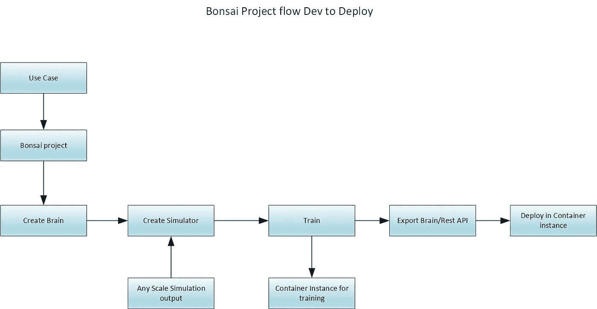
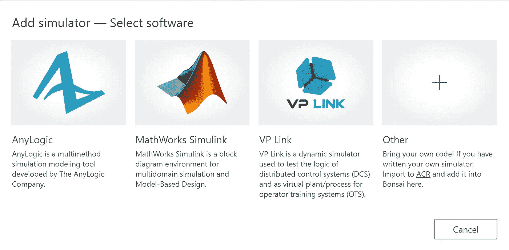
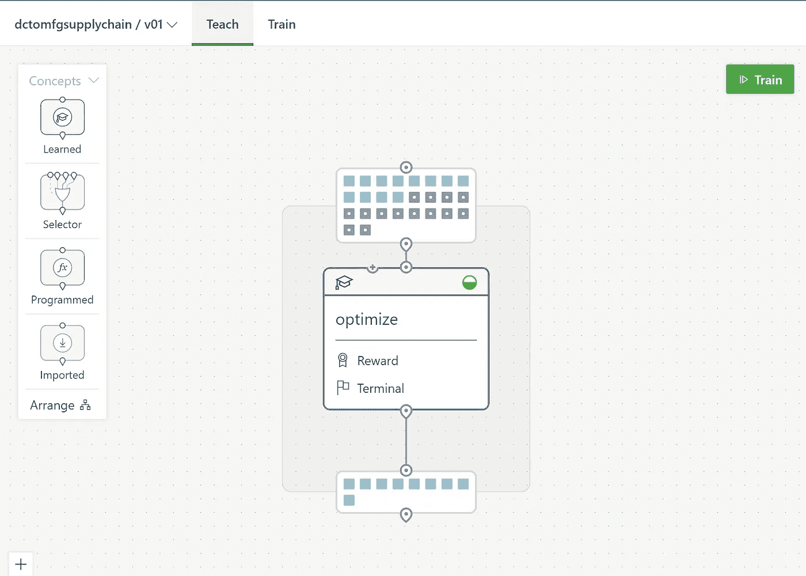
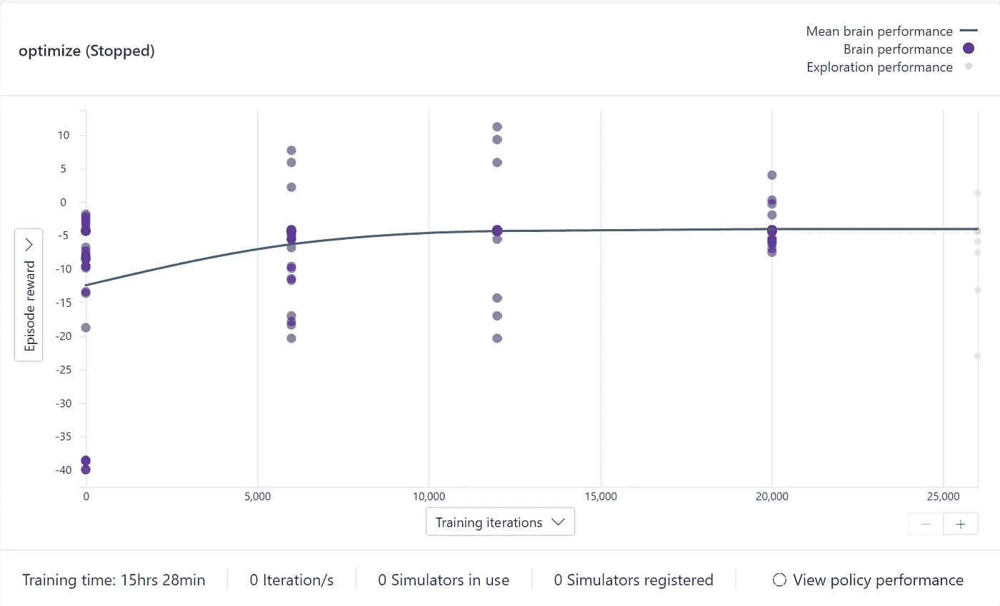
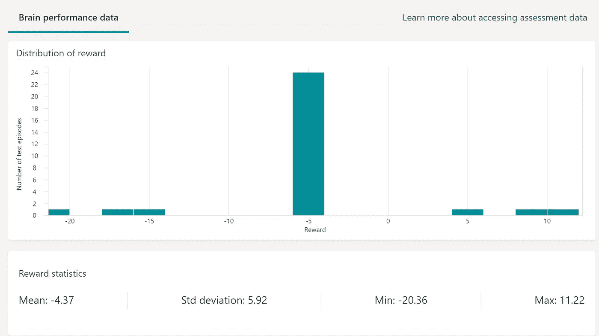
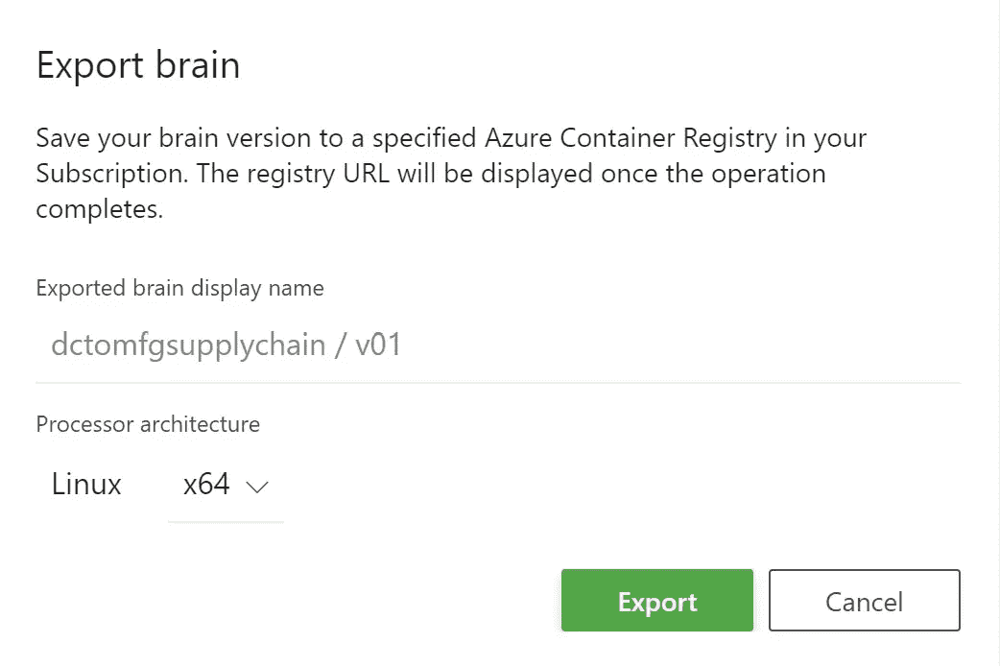

# Azure Bonsai 强化学习流程

> 原文：<https://medium.com/mlearning-ai/azure-bonsai-reinforcement-learning-process-5492f95ed092?source=collection_archive---------5----------------------->

# 展示如何使用 Bonsai 训练模型和部署的步骤

# 用例

*   如何最好地将订单从配送中心发送到哪个制造工厂
*   配送中心接受客户的订单
*   这里的目标是看谁能在 2 或 3 天内根据可用数量完成
*   这是现有的样品

# 先决条件

*   Azure 帐户
*   Azure 存储帐户
*   蔚蓝盆景服务资源
*   实现 URL—[https://github . com/Microsoft/bonsai-any logic/tree/master/samples/product-delivery](https://github.com/microsoft/bonsai-anylogic/tree/master/samples/product-delivery)
*   上面的 URL 是我们将在本教程中解释的一个 RL 问题示例。

# 步伐

# 工艺流程



*   上面显示了 RL 的整个流程
*   这是基于新项目增强的主观变化
*   另请注意，模拟是必要的，并且依赖于其他第三方软件，如 anylogic、Mathworks Simulink、VP link



# 培训和部署

*   首先创建一个 Bonsai 工作区资源
*   创建一个盆景项目
*   从这个链接创建一个大脑。复制并粘贴
*   [https://github . com/Microsoft/bonsai-any logic/blob/master/samples/product-delivery/PD _ inkling . ink](https://github.com/microsoft/bonsai-anylogic/blob/master/samples/product-delivery/pd_inkling.ink)
*   上面的代码是 bonsai 的提示代码
*   一旦你做好准备，现在还不是训练的时候
*   接下来我们需要上传模拟
*   在这个例子中，因为我没有任何模拟工具，所以我使用下面这个回购的 zip 文件
*   [https://github . com/Microsoft/bonsai-any logic/blob/master/samples/product-delivery/exported . zip](https://github.com/microsoft/bonsai-anylogic/blob/master/samples/product-delivery/exported.zip)
*   等待上传完成
*   然后将代码复制到包导入中

```
package "exportedname"
```

*   现在转到 brain，切换工作区来显示代码
*   然后搜索 simAction 并粘贴上面的 package 命令
*   现在我们准备好训练了



*   训练需要一些时间，看看迭代
*   在某一点上，迭代将是如下所示的直线



*   现在停止训练
*   检查迭代评估



*   点击导出大脑
*   这将在容器注册表中创建一个图像



*   现在检查左侧导航菜单上的导出大脑部分
*   部署大脑的方法很少
*   从容器注册表中提取映像并部署在容器实例或 AKS 或本地计算机中
*   如果你有物联网边缘，配置大脑在物联网边缘运行
*   容器部署为 REST 端点，因此输入和输出是必要的
*   投入

```
requestBody = {
  "state": {
    "acceptingness": 2,
    "num_vehicles": 1.5,
    "production_rates": 0.75,
    "vehicle_utilizations": 0.1,
    "inventory_levels": 1,
    "queue_sizes": 2,
    "rolling_turnaround_hours": 40,
    "accepting_rolling_turnaround_hours": 20,
    "rolling_cost_per_products": 40,
    "accepting_rolling_cost_per_products": 20,
    "time_hours": 4
  }
}
}
```

*   输出

```
{
    # Whether each MC should accept orders
    # Orders that would normally go to an MC are redirect to the nearest open MC
    acceptingness: number<0, 1, >[3], # Number of vehicles to allocate to each MC
    num_vehicles: number<1 .. 3 step 1>[3], # Hourly production rate at each MC
    production_rates: number<50 .. 80>[3]
}
```

*原载于*[*https://github.com*](https://github.com/balakreshnan/Samples2022/blob/main/RL/bonsaiprocess.md)*。*

[](/mlearning-ai/mlearning-ai-submission-suggestions-b51e2b130bfb) [## Mlearning.ai 提交建议

### 如何成为 Mlearning.ai 上的作家

medium.com](/mlearning-ai/mlearning-ai-submission-suggestions-b51e2b130bfb)