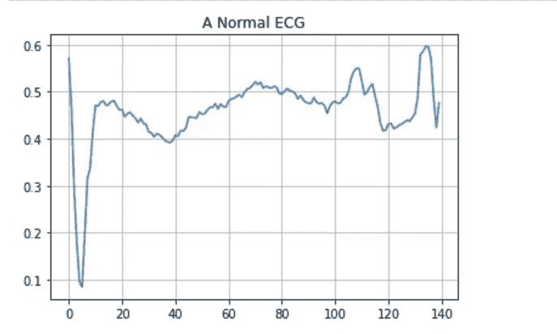
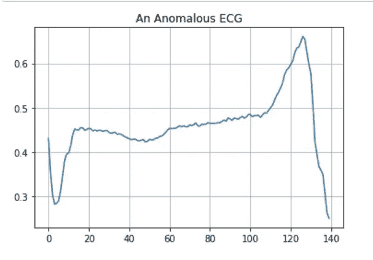
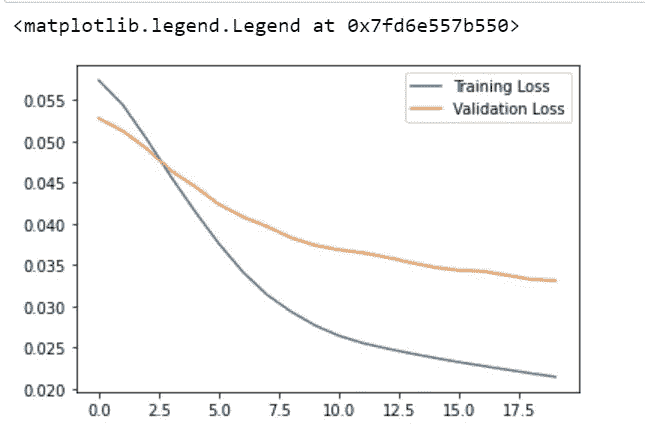
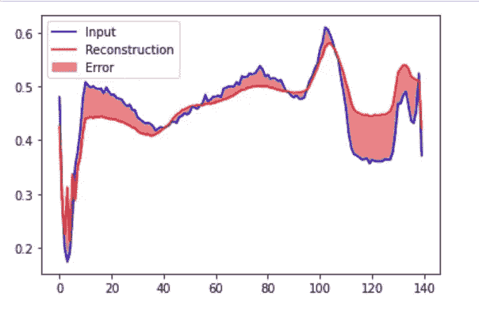
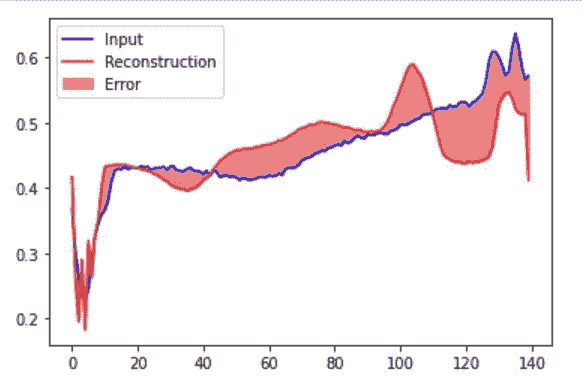
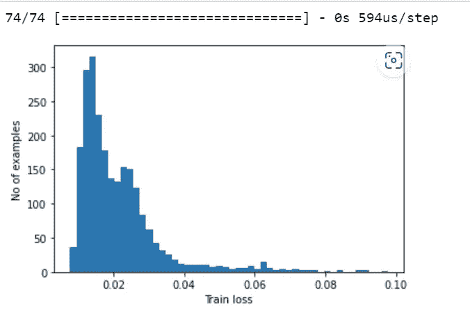
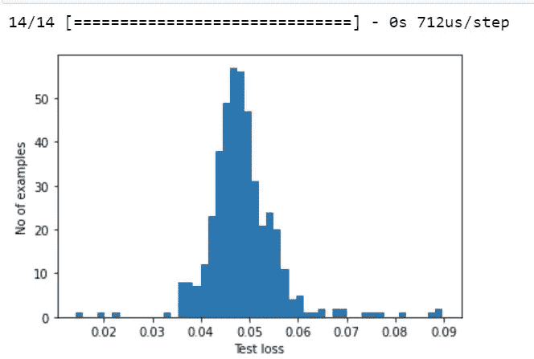

# Azure 机器学习自动编码器异常检测示例

> 原文：<https://medium.com/mlearning-ai/azure-machine-learning-auto-encoder-anomaly-detection-sample-4f8f71170517?source=collection_archive---------1----------------------->

# 使用自动编码器的异常检测

# 先决条件

*   Azure 帐户
*   Azure 机器学习服务

```
Note: This sample is from Tensorflow to show how it works in Azure Machine Learning.
I have not installed any libraries in the Azure Machine Learning environment.
I am using python 3.8 Tensorflow and Pytorch as kernel
```

*   下面是来自
*   [https://www.tensorflow.org/tutorials/generative/autoencoder](https://www.tensorflow.org/tutorials/generative/autoencoder)
*   也使用开源数据集

# 密码

*   首先下载数据集

```
# Download the dataset
dataframe = pd.read_csv('http://storage.googleapis.com/download.tensorflow.org/data/ecg.csv', header=None)
raw_data = dataframe.values
dataframe.head()
```

*   将数据分为训练和测试

```
# The last element contains the labels
labels = raw_data[:, -1]# The other data points are the electrocadriogram data
data = raw_data[:, 0:-1]train_data, test_data, train_labels, test_labels = train_test_split(
    data, labels, test_size=0.2, random_state=21
)
```

*   数据集之上的过程

```
min_val = tf.reduce_min(train_data)
max_val = tf.reduce_max(train_data)train_data = (train_data - min_val) / (max_val - min_val)
test_data = (test_data - min_val) / (max_val - min_val)train_data = tf.cast(train_data, tf.float32)
test_data = tf.cast(test_data, tf.float32)
```

*   设置标签

```
train_labels = train_labels.astype(bool)
test_labels = test_labels.astype(bool)normal_train_data = train_data[train_labels]
normal_test_data = test_data[test_labels]anomalous_train_data = train_data[~train_labels]
anomalous_test_data = test_data[~test_labels]
```

*   绘制数据

```
plt.grid()
plt.plot(np.arange(140), normal_train_data[0])
plt.title("A Normal ECG")
plt.show()
```



```
plt.grid()
plt.plot(np.arange(140), anomalous_train_data[0])
plt.title("An Anomalous ECG")
plt.show()
```



*   创建模型

```
class AnomalyDetector(Model):
  def __init__(self):
    super(AnomalyDetector, self).__init__()
    self.encoder = tf.keras.Sequential([
      layers.Dense(32, activation="relu"),
      layers.Dense(16, activation="relu"),
      layers.Dense(8, activation="relu")]) self.decoder = tf.keras.Sequential([
      layers.Dense(16, activation="relu"),
      layers.Dense(32, activation="relu"),
      layers.Dense(140, activation="sigmoid")]) def call(self, x):
    encoded = self.encoder(x)
    decoded = self.decoder(encoded)
    return decodedautoencoder = AnomalyDetector()
```

*   设置优化器

```
autoencoder.compile(optimizer='adam', loss='mae')
```

*   训练模型

```
history = autoencoder.fit(normal_train_data, normal_train_data, 
          epochs=20, 
          batch_size=512,
          validation_data=(test_data, test_data),
          shuffle=True)
```

*   绘制损失指标

```
plt.plot(history.history["loss"], label="Training Loss")
plt.plot(history.history["val_loss"], label="Validation Loss")
plt.legend()
```



*   现在错误是

```
encoded_data = autoencoder.encoder(normal_test_data).numpy()
decoded_data = autoencoder.decoder(encoded_data).numpy()plt.plot(normal_test_data[0], 'b')
plt.plot(decoded_data[0], 'r')
plt.fill_between(np.arange(140), decoded_data[0], normal_test_data[0], color='lightcoral')
plt.legend(labels=["Input", "Reconstruction", "Error"])
plt.show()
```



```
encoded_data = autoencoder.encoder(anomalous_test_data).numpy()
decoded_data = autoencoder.decoder(encoded_data).numpy()plt.plot(anomalous_test_data[0], 'b')
plt.plot(decoded_data[0], 'r')
plt.fill_between(np.arange(140), decoded_data[0], anomalous_test_data[0], color='lightcoral')
plt.legend(labels=["Input", "Reconstruction", "Error"])
plt.show()
```



*   现在预测

re constructions = auto encoder . predict(normal_train_data)train _ loss = TF . keras . loss . Mae(re constructions，normal _ train _ data)

```
plt.hist(train_loss[None,:], bins=50)
plt.xlabel("Train loss")
plt.ylabel("No of examples")
plt.show()
```



*   阈值计算

```
threshold = np.mean(train_loss) + np.std(train_loss)
print("Threshold: ", threshold)reconstructions = autoencoder.predict(anomalous_test_data)
test_loss = tf.keras.losses.mae(reconstructions, anomalous_test_data)plt.hist(test_loss[None, :], bins=50)
plt.xlabel("Test loss")
plt.ylabel("No of examples")
plt.show()
```



*   预测功能

```
def predict(model, data, threshold):
  reconstructions = model(data)
  loss = tf.keras.losses.mae(reconstructions, data)
  return tf.math.less(loss, threshold)def print_stats(predictions, labels):
  print("Accuracy = {}".format(accuracy_score(labels, predictions)))
  print("Precision = {}".format(precision_score(labels, predictions)))
  print("Recall = {}".format(recall_score(labels, predictions)))
```

*   预测并打印统计数据

```
preds = predict(autoencoder, test_data, threshold)
print_stats(preds, test_labels)
```


原文章在【github.com samples 2022/auto encoder sample 1 . MD 在主 balakreshnan/samples 2022

[](/mlearning-ai/mlearning-ai-submission-suggestions-b51e2b130bfb) [## Mlearning.ai 提交建议

### 如何成为 Mlearning.ai 上的作家

medium.com](/mlearning-ai/mlearning-ai-submission-suggestions-b51e2b130bfb)