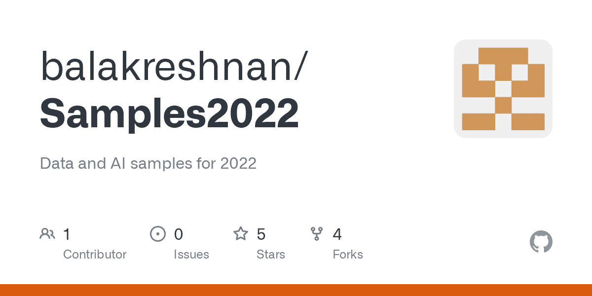

# 使用 Mlflow 的 Azure 机器学习自动化 ML

> 原文：<https://medium.com/mlearning-ai/azure-machine-learning-automated-ml-with-mlflow-c04538ee440f?source=collection_archive---------6----------------------->



# 将 MLFlow 与 Azure 机器学习和自动化 ML 结合使用

# 先决条件

*   Azure 订阅
*   Azure 机器学习工作区
*   Azure 存储帐户
*   创建数据文件夹
*   将数据文件上传到数据文件夹

# 图书馆

*   安装 Azure.ai.ml

```
pip install azure.ai.ml
```

*   安装 mlflow

```
pip install mlflow
```

# 密码

*   安装库

```
from azure.identity import DefaultAzureCredential
from azure.identity import AzureCliCredential
from azure.ai.ml import automl, Input, MLClient
```

```
from azure.ai.ml.constants import AssetTypes
from azure.ai.ml.automl import (
    classification,
    ClassificationPrimaryMetrics,
    ClassificationModels,
)
```

*   向 Azure 机器学习工作区进行身份验证

```
from azure.identity import DefaultAzureCredential
from azure.ai.ml import MLClient
```

```
credential = DefaultAzureCredential()
ml_client = None
try:
    ml_client = MLClient.from_config(credential)
except Exception as ex:
    print(ex)
    # Enter details of your AzureML workspace
    subscription_id = "xxxxxxxxxxxxxxx"
    resource_group = "rgname"
    workspace = "wkspacename"
    ml_client = MLClient(credential, subscription_id, resource_group, workspace)
```

*   显示工作空间

```
workspace = ml_client.workspaces.get(name=ml_client.workspace_name)
```

```
subscription_id = ml_client.connections._subscription_id
resource_group = workspace.resource_group
workspace_name = ml_client.workspace_nameoutput = {}
output["Workspace"] = workspace_name
output["Subscription ID"] = subscription_id
output["Resource Group"] = resource_group
output["Location"] = workspace.location
output
```

*   创建数据集

```
my_training_data_input = Input(
    type=AssetTypes.MLTABLE, path="./data/"
)
my_training_data_test = Input(
    type=AssetTypes.MLTABLE, path="./data/"
)
my_training_data_validate = Input(
    type=AssetTypes.MLTABLE, path="./data/"
)
```

*   设置实验名称

```
# General job parameters
compute_name = "cpu-cluster"
max_trials = 5
exp_name = "automlv2-Titanic-experiment"
```

*   配置实验

```
classification_job = automl.classification(
    compute=compute_name,
    experiment_name=exp_name,
    training_data=my_training_data_input,
    target_column_name="Survived",
    primary_metric="accuracy",
    n_cross_validations=5,
    enable_model_explainability=True,
    tags={"my_custom_tag": "Titanic Training"},
)
```

```
# Limits are all optional
classification_job.set_limits(
    timeout_minutes=600,
    trial_timeout_minutes=20,
    max_trials=max_trials,
    # max_concurrent_trials = 4,
    # max_cores_per_trial: -1,
    enable_early_termination=True,
)# Training properties are optional
classification_job.set_training(
    blocked_training_algorithms=[ClassificationModels.LOGISTIC_REGRESSION],
    enable_onnx_compatible_models=True,
)
```

*   进行实验

```
# Submit the AutoML job
returned_job = ml_client.jobs.create_or_update(
    classification_job
)  # submit the job to the backend
```

```
print(f"Created job: {returned_job}")
```

*   流日志

```
ml_client.jobs.stream(returned_job.name)
```

*   导入 mlflow

```
import mlflow
```

```
# Obtain the tracking URL from MLClient
MLFLOW_TRACKING_URI = ml_client.workspaces.get(
    name=ml_client.workspace_name
).mlflow_tracking_uriprint(MLFLOW_TRACKING_URI)
```

*   设置跟踪 URI

```
# Set the MLFLOW TRACKING URI
```

```
mlflow.set_tracking_uri(MLFLOW_TRACKING_URI)print("\nCurrent tracking uri: {}".format(mlflow.get_tracking_uri()))
```

*   调用 MLflow

```
from mlflow.tracking.client import MlflowClient
```

```
# Initialize MLFlow client
mlflow_client = MlflowClient()
```

*   获取运行 id

```
job_name = returned_job.name
```

```
# Example if providing an specific Job name/ID
# job_name = "xxxxxx"# Get the parent run
mlflow_parent_run = mlflow_client.get_run(job_name)print("Parent Run: ")
print(mlflow_parent_run)
```

*   让孩子跑起来

```
best_child_run_id = mlflow_parent_run.data.tags["automl_best_child_run_id"]
print("Found best child run id: ", best_child_run_id)
```

```
best_run = mlflow_client.get_run(best_child_run_id)print("Best child run: ")
print(best_run)
```

*   韵律学

```
best_run.data.metrics
```

*   目录

```
import os
```

```
# Create local folder
local_dir = "./artifact_downloads"
if not os.path.exists(local_dir):
    os.mkdir(local_dir)# Download run's artifacts/outputs
local_path = mlflow_client.download_artifacts(
    best_run.info.run_id, "outputs", local_dir
)
print("Artifacts downloaded in: {}".format(local_path))
print("Artifacts: {}".format(os.listdir(local_path)))
```

*   列出目录

```
os.listdir("./artifact_downloads/outputs/mlflow-model")
```

*   部署端点

```
# import required libraries
# import required libraries
from azure.ai.ml import MLClient
from azure.ai.ml.entities import (
    ManagedOnlineEndpoint,
    ManagedOnlineDeployment,
    Model,
    Environment,
    CodeConfiguration,
    ProbeSettings,
)
from azure.ai.ml.constants import ModelType
```

*   创建端点

```
import datetime
```

```
online_endpoint_name = "titanic-" + datetime.datetime.now().strftime("%m%d%H%M%f")# create an online endpoint
endpoint = ManagedOnlineEndpoint(
    name=online_endpoint_name,
    description="this is a sample online endpoint for mlflow model",
    auth_mode="key",
    tags={"foo": "bar"},
)
ml_client.begin_create_or_update(endpoint)
```

*   注册模型

```
model_name = "titanic-model"
model = Model(
    path=f"azureml://jobs/{best_run.info.run_id}/outputs/artifacts/outputs/model.pkl",
    name=model_name,
    description="my sample mlflow model",
)
```

```
# for downloaded file
# model = Model(path="artifact_downloads/outputs/model.pkl", name=model_name)registered_model = ml_client.models.create_or_update(model)
registered_model.id
```

*   环境

```
env = Environment(
    name="automl-tabular-env",
    description="environment for automl inference",
    image="mcr.microsoft.com/azureml/openmpi3.1.2-ubuntu18.04:20210727.v1",
    conda_file="artifact_downloads/outputs/conda_env_v_1_0_0.yml",
)
```

*   康达构型

```
code_configuration = CodeConfiguration(
    code="artifact_downloads/outputs/", scoring_script="scoring_file_v_2_0_0.py"
)
```

*   受管理端点配置

```
deployment = ManagedOnlineDeployment(
    name="titanic-deploy",
    endpoint_name=online_endpoint_name,
    model=registered_model.id,
    environment=env,
    code_configuration=code_configuration,
    instance_type="Standard_DS2_V2",
    instance_count=1,
)
```

*   部署端点

```
ml_client.online_deployments.begin_create_or_update(deployment)
```

*   检验推论

```
# test the blue deployment with some sample data
ml_client.online_endpoints.invoke(
    endpoint_name=online_endpoint_name,
    deployment_name="titanic-deploy",
    request_file="sample-titanic-data.json",
)
```

*   示例 json 文件

```
{
  "Inputs": {
    "data": [
      {
        "PassengerId": 10,
        "Pclass": 1,
        "Name": "Name goes here",
        "Sex": "Male",
        "Age": 35.0,
        "SibSp": 2,
        "Parch": 1,
        "Ticket": "F123",
        "Fare": 10.0,
        "Cabin": "S",
        "Embarked": "E"
      }
    ]
  },
  "GlobalParameters": {
    "method": "predict"
  }
}
```

*   删除端点

```
ml_client.online_endpoints.begin_delete(name=online_endpoint_name)
```

*最初发表于*[*【https://github.com】*](https://github.com/balakreshnan/Samples2022/blob/main/AzureMLV2/titanicautoml.md)*。*

[](/mlearning-ai/mlearning-ai-submission-suggestions-b51e2b130bfb) [## Mlearning.ai 提交建议

### 如何成为 Mlearning.ai 上的作家

medium.com](/mlearning-ai/mlearning-ai-submission-suggestions-b51e2b130bfb)