# Azure 机器学习数据标记和对象检测模型(AutoML)模型

> 原文：<https://medium.com/mlearning-ai/azure-machine-learning-data-labeling-and-object-detection-model-automl-model-19ae1dc9555a?source=collection_archive---------4----------------------->

# 使用数据标记的开源数据集进行对象检测的端到端示例

# 先决条件

*   Azure 帐户
*   Azure 存储
*   Azure 机器学习帐户
*   可可数据集下载—[https://cocodataset.org/#download](https://cocodataset.org/#download)
*   下载 2017 映像集并解压缩
*   上传到 Azure 存储
*   本文不讨论基础设施的设置

# 过程

*   定义用例
*   收集图像
*   标签图像
*   系统模型化
*   以上是构建或实现基于端到端视觉的对象检测模型所涉及的高级过程

# 步伐

*   登录 Azure 机器学习工作区
*   首先为数据标注工具创建一个数据集
*   创建新的数据存储和数据集作为文件数据集，并指向存储图像的目录

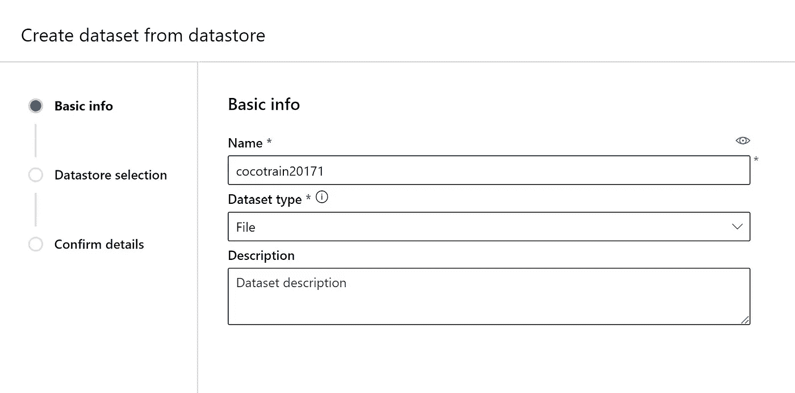

*   图像文件存储在 cocotrain2017 文件夹下的默认存储中
*   接下来选择默认的存储和文件夹

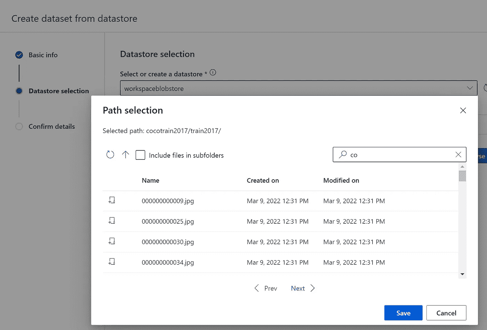

*   选择包含图像的 train2017 文件夹
*   跳过数据验证


*   单击下一步，然后单击创建

# 数据标记

*   现在让我们收集标签，用于基于用例的培训
*   转到 AML 工作区，然后转到数据标签工具
*   单击创建添加项目

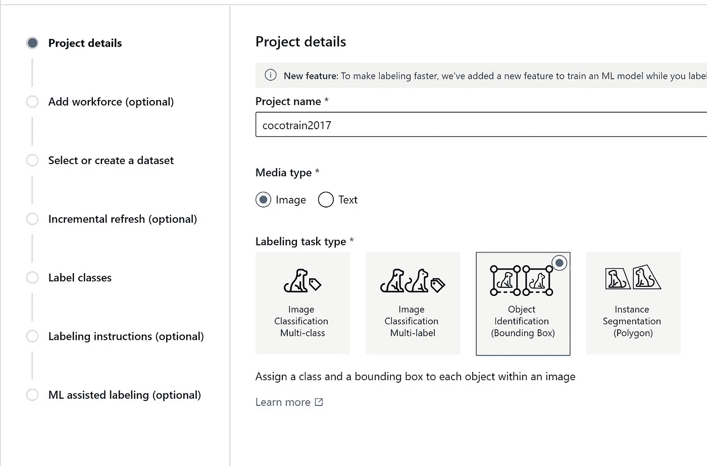

*   现在下一个屏幕

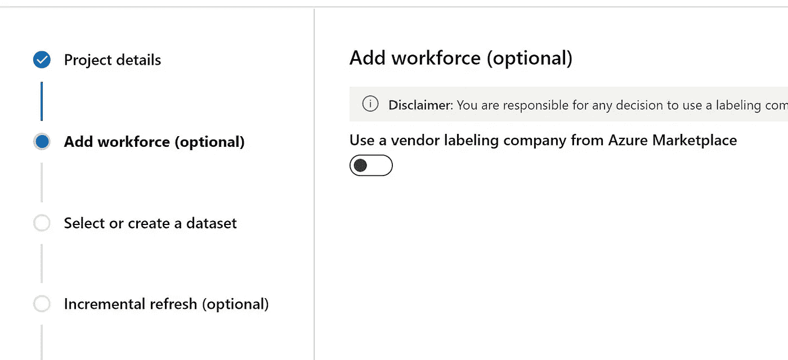

*   禁用供应商，在我们的案例中，我们将使用内部人员来标记
*   如果您需要标签方面的帮助，请从列表中选择一个合作伙伴
*   然后单击下一步
*   选择 cocotrain2017 作为数据集，用于创建边界框

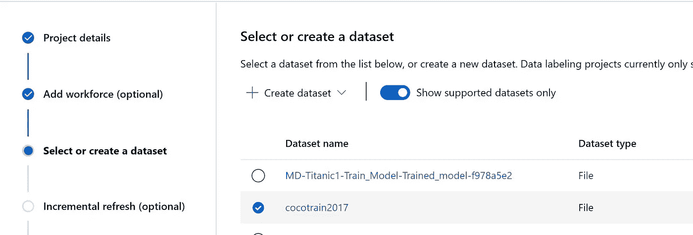

*   然后单击下一步
*   启用增量刷新，该功能允许我们在收集更多图像时向数据集添加更多图像

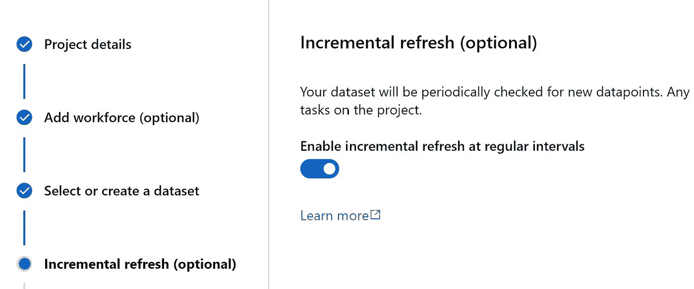

*   在本例中，我们为这个总目录创建了 3 个标签
*   人
*   食物
*   动物
*   然后单击下一步

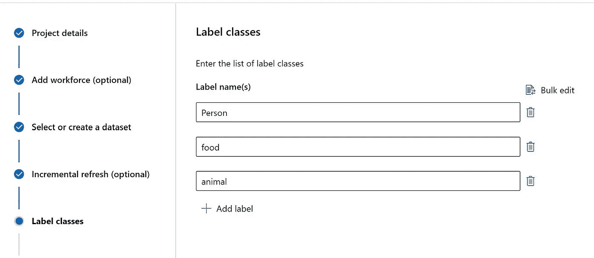

*   接下来提供如何贴标签的说明
*   提供 URL，如果有一个标签使用它来绘制边界框
*   如果有任何问题，请提供一个上报途径

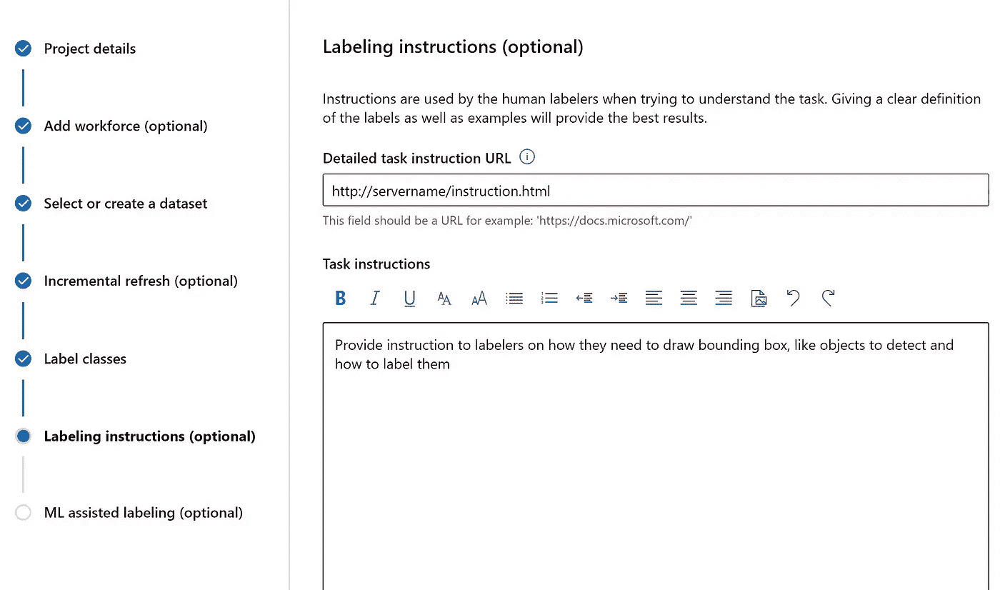

*   单击下一步
*   接下来启用 ML 辅助标记
*   这有助于提高贴标项目的效率
*   首先，人类贴标机会给图像贴标签
*   一旦第一组被标记，机器学习模型从标签中学习
*   然后 ML 模型标记图像
*   贴标签的人可以检查图像并决定它是否有效
*   然后提交标签进行进一步处理

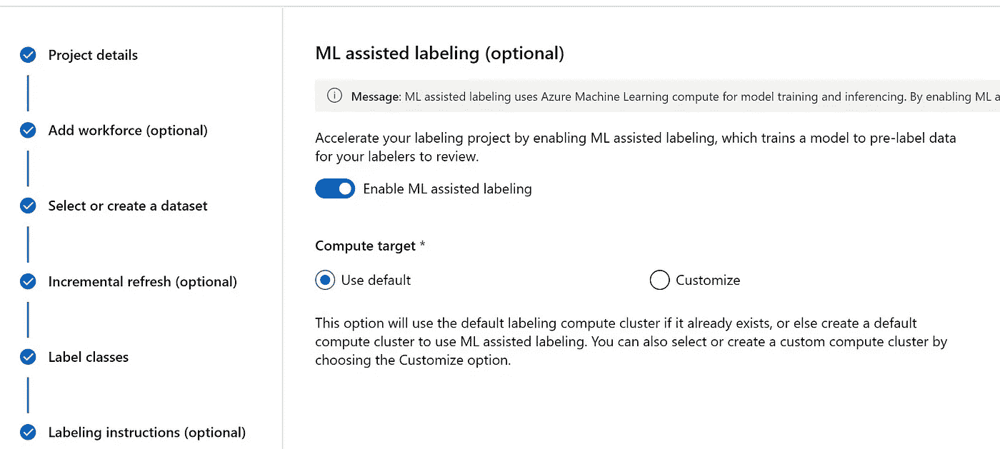

*   然后单击创建项目
*   项目构建完成后，转到项目
*   当您打开项目时，您应该会看到主项目仪表板
*   将 AML 数据标签项目的链接交给您的贴标机
*   允许有权限来确保标记者只能看到他们被分配到项目
*   当贴标机登录时，他们应该能够点击项目和数据标签

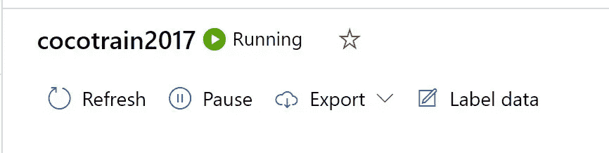

*   然后单击开始标注
*   如果您想阅读标签说明，请随时点击该说明
*   每个贴标机现在可以标记图像
*   一旦它们达到初始设定，通常每个贴标机大约 75 或 100 个
*   ML 模型在幕后起作用，并将为图像生成标签

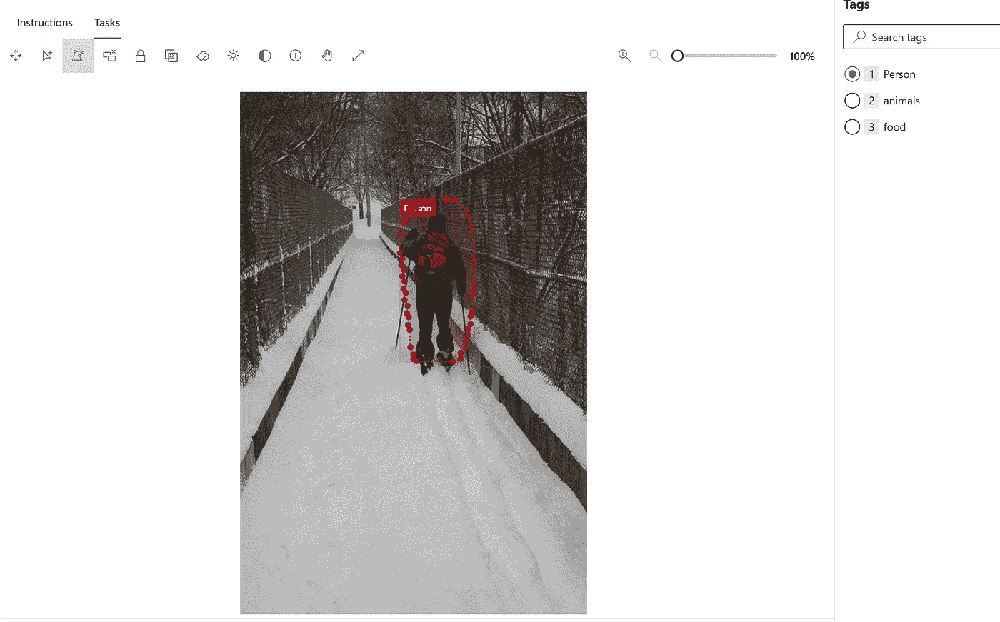

*   在初始集合被标记后，ML 模型从标签中学习
*   ML 标记的图像随后被发送给人工贴标机进行检查
*   图像被标记为任务预标记，这表示 ML 模型已经标记了图像

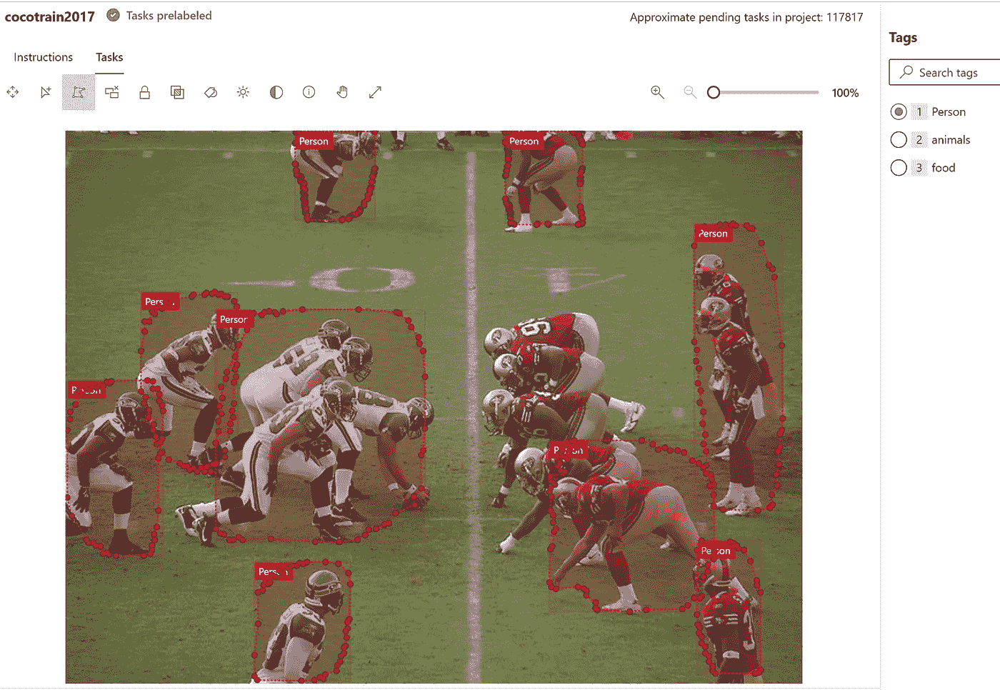

*   如果你对创建的边界框感到满意，那么点击提交
*   否则调整边界框，然后提交
*   还要验证它是否被分配了正确的标签
*   继续做这个练习，直到整个图像集都被标记
*   现在让我们看看仪表板，以查看贴标机的性能和贴标项目的状态

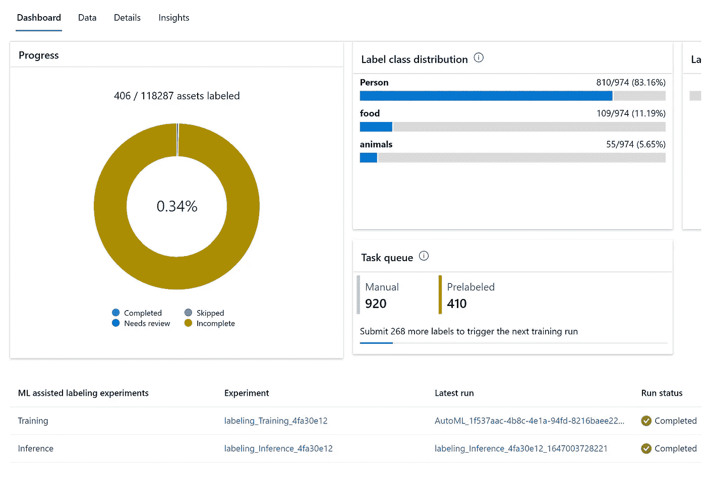

*   在上面的仪表板中，您可以看到所有的图像，分配了多少标签，还有多少需要标记
*   还有贴标机的性能，显示有多少图像每个贴标机已标记
*   在底部，您可以看到 ML 模型训练同时运行训练和推理
*   点击详细信息查看跑步详情


*   要查看数据，单击数据，然后查看

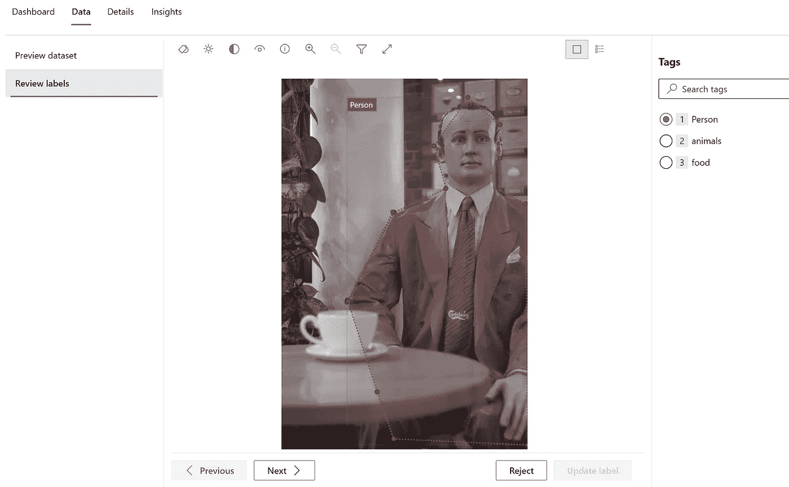

*   完成项目后，您可以单击导出
*   单击提交以创建 Azure ML 数据集

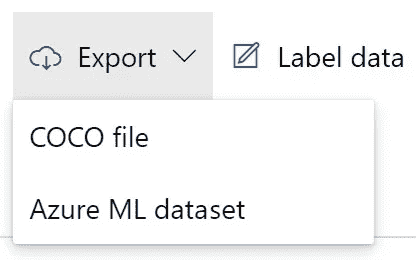

# 用于构建模型的 AutoVisionML 代码

*   创建计算实例
*   创建新的 jupter 笔记本
*   转到 Datasets，您应该会看到新导出的数据集
*   选择的数据集通常以项目名称开头

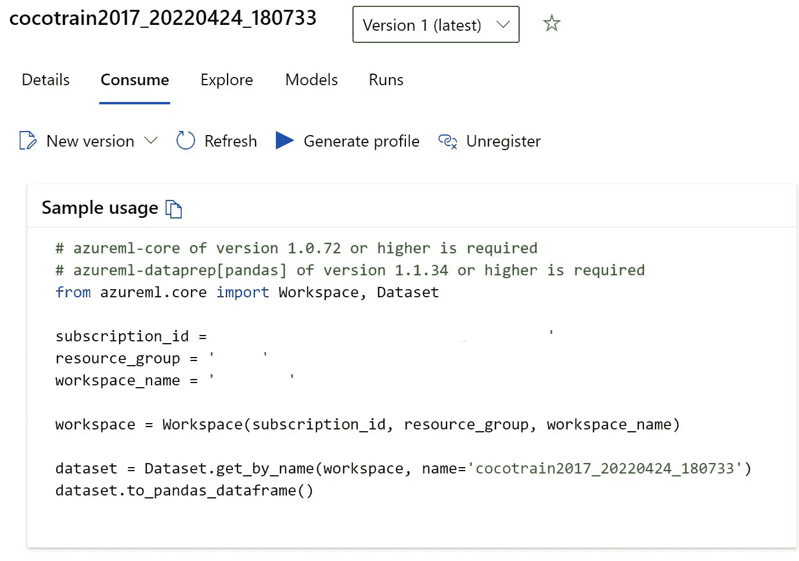

*   转到消费部分并复制数据集信息
*   上面的代码为实验加载数据集
*   现在创建一个新的 jupyter 笔记本或笔记本
*   导入包含

```
import os
import shutilfrom azureml.core.workspace import Workspace
from azureml.core import Experiment
from azureml.core import Environmentfrom azureml.core.compute import ComputeTarget, AmlCompute
from azureml.core.compute_target import ComputeTargetException
```

*   加载数据集进行训练
*   这是来自数据标注项目的数据集

```
# azureml-core of version 1.0.72 or higher is required
# azureml-dataprep[pandas] of version 1.1.34 or higher is required
from azureml.core import Workspace, Datasetsubscription_id = 'xxxxx-xxxxxx-xxxxxxxxxxxxxxxx'
resource_group = 'xxxxxx'
workspace_name = 'xxxxxxxx'workspace = Workspace(subscription_id, resource_group, workspace_name)dataset = Dataset.get_by_name(workspace, name='cocotrain2017_20220424_180733')
dataset.to_pandas_dataframe()
```

*   确保数据集的名称与我们在上一节中导出的名称相匹配
*   接下来加载工作区

```
from azureml.core.workspace import Workspacews = Workspace.from_config()
print('Workspace name: ' + ws.name, 
      'Azure region: ' + ws.location, 
      'Subscription id: ' + ws.subscription_id, 
      'Resource group: ' + ws.resource_group, sep='\n')
```

*   加载自动图像库

```
from azureml.train.automl import AutoMLImageConfig
from azureml.automl.core.shared.constants import ImageTask
```

*   下一步将是创建一个 GPU 计算机

```
from azureml.core.compute import ComputeTarget, AmlCompute
from azureml.core.compute_target import ComputeTargetException# choose a name for your cluster
cluster_name = "gpu-cluster"try:
    compute_target = ComputeTarget(workspace=ws, name=cluster_name)
    print('Found existing compute target.')
except ComputeTargetException:
    print('Creating a new compute target...')
    compute_config = AmlCompute.provisioning_configuration(vm_size='STANDARD_NC6s_V3', 
                                                           max_nodes=4) # create the cluster
    compute_target = ComputeTarget.create(ws, cluster_name, compute_config)compute_target.wait_for_completion(show_output=True)# use get_status() to get a detailed status for the current cluster. 
print(compute_target.get_status().serialize())
```

*   接下来，我们将使用 yolov5 运行一个模型

```
from azureml.train.automl import AutoMLImageConfig
from azureml.train.hyperdrive import GridParameterSampling, choice
from azureml.automl.core.shared.constants import ImageTaskarguments = ["--early_stopping", 1, "--evaluation_frequency", 2]automl_image_config_yolov5 = AutoMLImageConfig(task=ImageTask.IMAGE_OBJECT_DETECTION,
                                               compute_target=compute_target,
                                               training_data=dataset,
                                               validation_data=dataset,
                                               hyperparameter_sampling=GridParameterSampling({'model_name': choice('yolov5')}),
                                               #primary_metric='mean_average_precision',
                                               iterations=1)
```

*   现在创建一个实验并运行

```
ws = Workspace.from_config()
experiment = Experiment(ws, "coco128-automl-image-object-detection")
automl_image_run = experiment.submit(automl_image_config_yolov5)
automl_image_run.wait_for_completion(wait_post_processing=True)
```

*   等待模型运行
*   获得最佳模型

```
best_child_run = automl_image_run.get_best_child()
model_name = best_child_run.properties['model_name']
model = best_child_run.register_model(model_name = model_name, model_path='outputs/model.pt')
```

*   显示要验证的模型

```
model
```

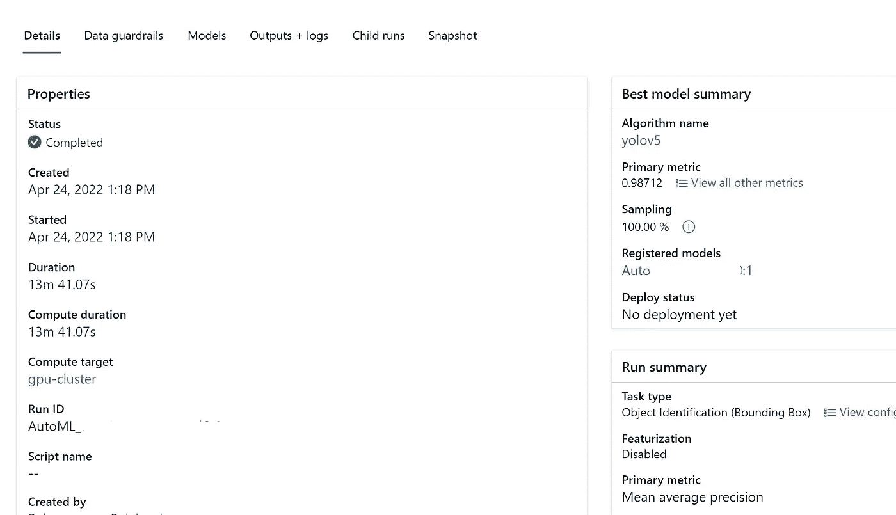

*   现在让我们用不同的超参数运行更多的模型

```
from azureml.automl.core.shared.constants import ImageTask
from azureml.train.automl import AutoMLImageConfig
from azureml.train.hyperdrive import BanditPolicy, RandomParameterSampling
from azureml.train.hyperdrive import choice, uniformparameter_space = {
    "model": choice(
        {
            "model_name": choice("yolov5"),
            "learning_rate": uniform(0.0001, 0.01),
            "model_size": choice("small", "medium"),  # model-specific
            #'img_size': choice(640, 704, 768), # model-specific; might need GPU with large memory
        },
        {
            "model_name": choice("fasterrcnn_resnet50_fpn"),
            "learning_rate": uniform(0.0001, 0.001),
            "optimizer": choice("sgd", "adam", "adamw"),
            "min_size": choice(600, 800),  # model-specific
            #'warmup_cosine_lr_warmup_epochs': choice(0, 3),
        },
    ),
}tuning_settings = {
    "iterations": 2,
    "max_concurrent_iterations": 2,
    "hyperparameter_sampling": RandomParameterSampling(parameter_space),
    "early_termination_policy": BanditPolicy(
        evaluation_interval=2, slack_factor=0.2, delay_evaluation=6
    ),
}automl_image_config = AutoMLImageConfig(
    task=ImageTask.IMAGE_OBJECT_DETECTION,
    compute_target=compute_target,
    training_data=dataset,
    validation_data=dataset,
    **tuning_settings,
)
```

*   运行模型

```
automl_image_run = experiment.submit(automl_image_config)
automl_image_run.wait_for_completion(wait_post_processing=True)
```

*   显示了模型运行

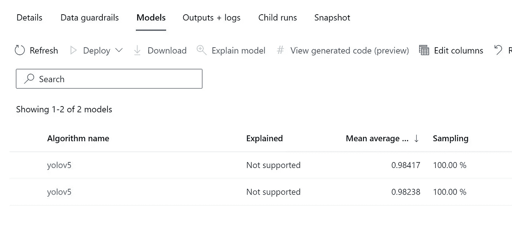

*   让我们看看指标

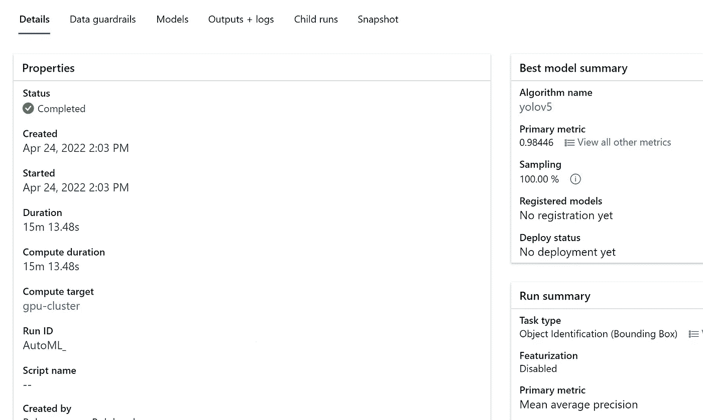

*   让我们看看两个运行图表的指标
*   选择 2 个管路

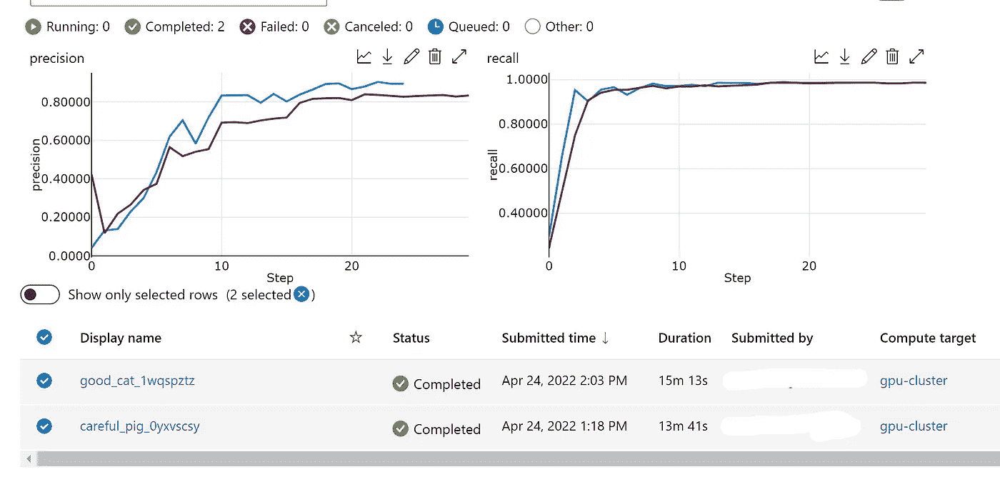

*   浏览并查看可用于日志、模型输出等的其他菜单项
*   现在，您可以看到创建标签数据集然后运行模型是多么简单和无缝
*   本文不包括推理，但是您可以使用该模型进行预测

# 推理

*   创建支持 AKS GPU 的集群

```
from azureml.core.compute import ComputeTarget, AksCompute
from azureml.exceptions import ComputeTargetException# Choose a name for your cluster
aks_name = "cluster-aks-gpu"# Check to see if the cluster already exists
try:
    aks_target = ComputeTarget(workspace=ws, name=aks_name)
    print('Found existing compute target')
except ComputeTargetException:
    print('Creating a new compute target...')
    # Provision AKS cluster with GPU machine
    prov_config = AksCompute.provisioning_configuration(vm_size="STANDARD_NC6", 
                                                        location="eastus2")
    # Create the cluster
    aks_target = ComputeTarget.create(workspace=ws, 
                                      name=aks_name, 
                                      provisioning_configuration=prov_config)
    aks_target.wait_for_completion(show_output=True)
```

*   获取模型文件

```
from azureml.core.model import InferenceConfigbest_child_run.download_file('outputs/scoring_file_v_1_0_0.py', output_file_path='score.py')
environment = best_child_run.get_environment()
inference_config = InferenceConfig(entry_script='score.py', environment=environment)
```

*   部署模型

```
# Deploy the model from the best run as an AKS web service
from azureml.core.webservice import AksWebservice
from azureml.core.webservice import Webservice
from azureml.core.model import Model
from azureml.core.environment import Environmentaks_config = AksWebservice.deploy_configuration(autoscale_enabled=True,                                                    
                                                cpu_cores=1,
                                                memory_gb=50,
                                                enable_app_insights=True)aks_service = Model.deploy(ws,
                           models=[model],
                           inference_config=inference_config,
                           deployment_config=aks_config,
                           deployment_target=aks_target,
                           name='automl-image-test',
                           overwrite=True)
aks_service.wait_for_deployment(show_output=True)
print(aks_service.state)
```

*   代码示例来自—[https://docs . Microsoft . com/en-us/azure/machine-learning/how-to-auto-train-image-models](https://docs.microsoft.com/en-us/azure/machine-learning/how-to-auto-train-image-models)

# 完成的

*最初发表于*[T5【https://github.com】](https://github.com/balakreshnan/Samples2022/blob/main/AzureML/cocoobjdet.md)*。*

[](/mlearning-ai/mlearning-ai-submission-suggestions-b51e2b130bfb) [## Mlearning.ai 提交建议

### 如何成为 Mlearning.ai 上的作家

medium.com](/mlearning-ai/mlearning-ai-submission-suggestions-b51e2b130bfb)