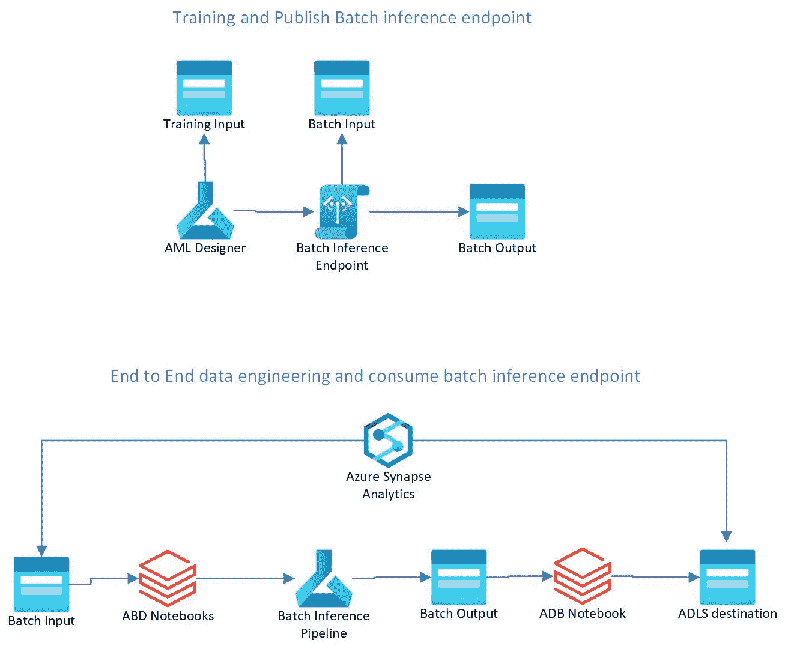
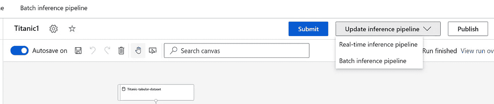
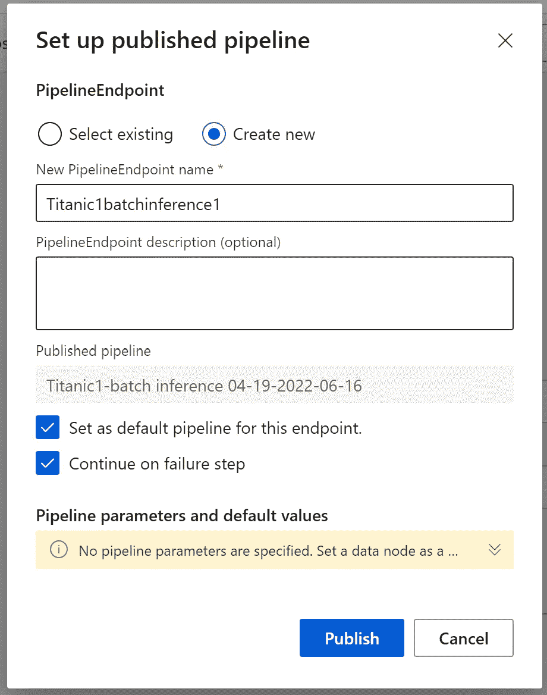
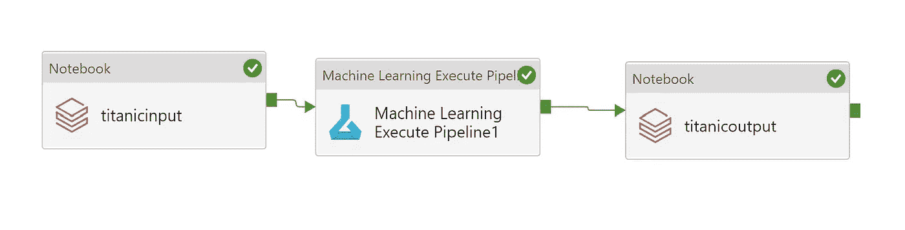
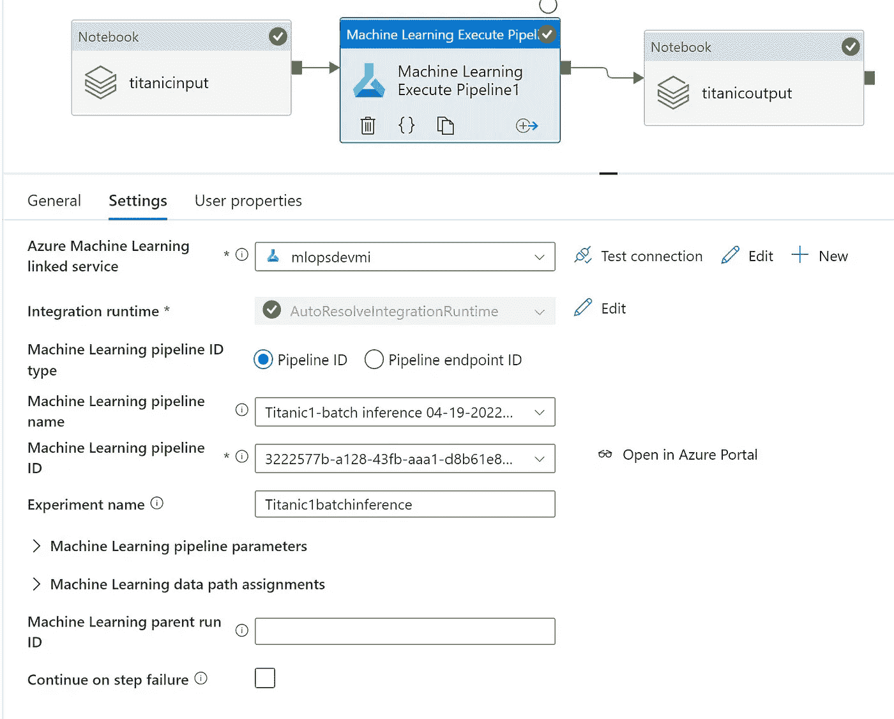
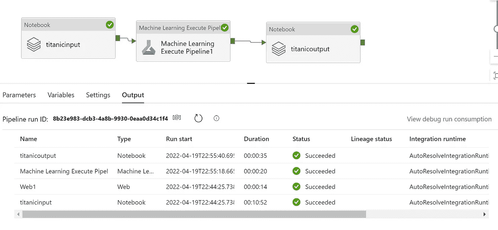

# 使用 Azure Synapse 和 Azure data bricks 进行 Azure 机器学习设计人员培训和自动化批量推理

> 原文：<https://medium.com/mlearning-ai/azure-machine-learning-designer-training-and-automate-batch-inference-using-azure-synapse-and-azure-5425e92ec31d?source=collection_archive---------9----------------------->

# 使用 synapse、azure 数据块和 AML 批量推理管道进行端到端批量推理

# 先决条件

*   Azure 帐户
*   Azure 机器学习帐户
*   Azure 存储帐户
*   Azure databricks 帐户
*   Azure synapse 工作区帐户

# 体系结构

*   使用 AML 设计器创建批处理推理管道
*   自动化批量推理

# 设计师培训

*   在 designer 中创建实验
*   选择计算机群集
*   使用开源数据集

*   单击 Sumbit 并训练模型
*   选择创建批处理推理管道
*   使用带有空文件的新数据集创建到 ADLS gen2 的数据存储。
*   然后添加导出数据
*   将输出保存为 parquet 并给出一个文件名

*   提交后，等待运行完成
*   然后单击发布

*   等待批推理端点发布

# 端到端自动批量推理

*   现在转到 azure synapse analytics
*   现在创建一个管道
*   拖动 Azure 数据块并连接到 ADB 工作区
*   选择笔记本-这将创建输入批处理数据集并作为拼花文件存储在 batchinput 容器中
*   然后拖动 Azure ML 并选择发布管道

*   然后拖动另一个 Azure 数据块，并选择笔记本以使用批量输出并存储回增量表中

# 输出

*   完成批处理推理管道运行

原文—[samples 2022/designer deploy . MD at main balakreshnan/samples 2022(github.com)](https://github.com/balakreshnan/Samples2022/blob/main/AzureML/designerdeploy.md)

 [## Mlearning.ai 提交建议

### 如何成为 Mlearning.ai 上的作家

medium.com](/mlearning-ai/mlearning-ai-submission-suggestions-b51e2b130bfb)