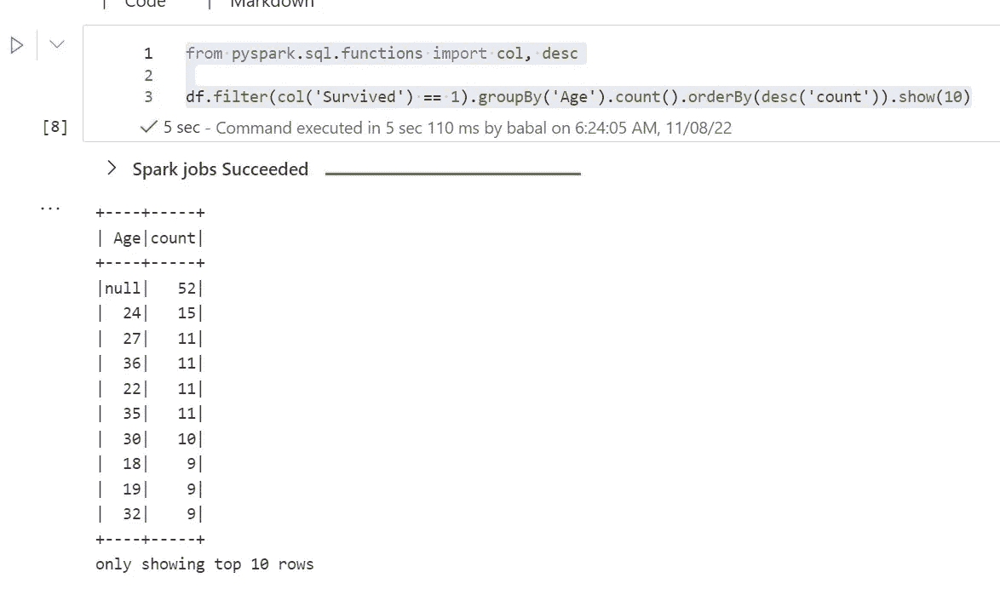
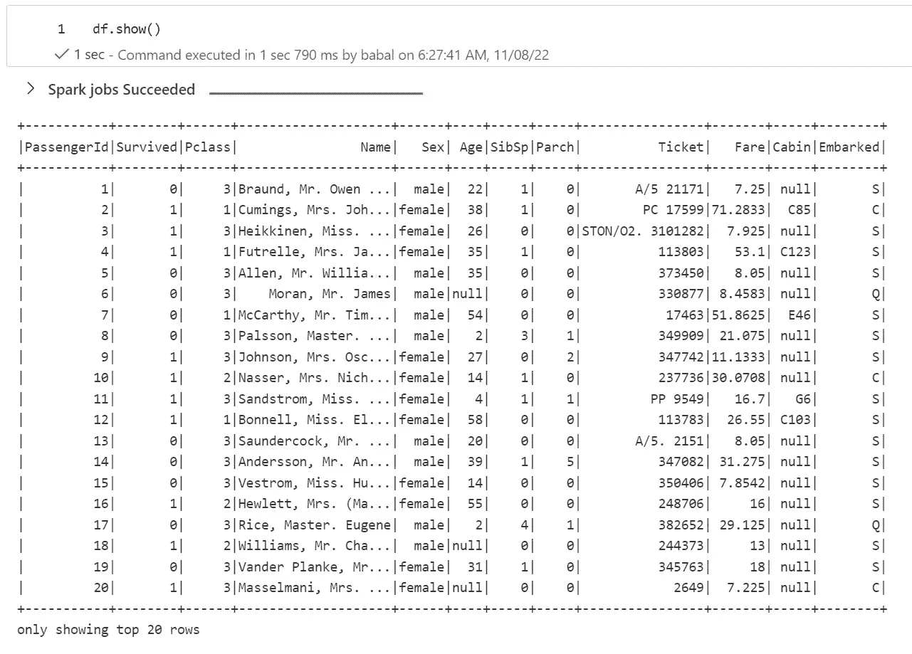
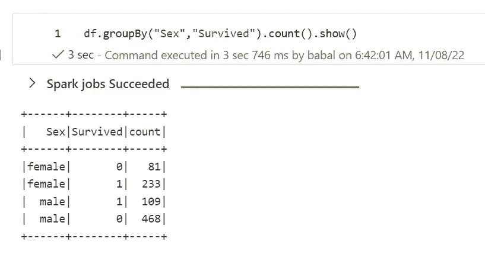
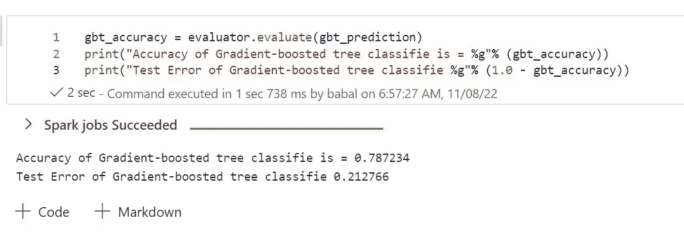

# Azure 机器学习管理的 spark —预览

> 原文：<https://medium.com/mlearning-ai/azure-machine-learning-managed-spark-preview-fe54a98ec0cd?source=collection_archive---------5----------------------->

# 使用 Azure 机器学习服务的托管 Spark 简介

# 先决条件

*   Azure 帐户
*   Azure 机器学习服务
*   泰坦尼克号数据集

# 管理火花步骤

*   首先转到笔记本
*   创建新笔记本
*   在计算选择旁边，单击新建并选择 AzureML spark 计算


*   现在回到笔记本电脑，你应该看到计算创建。通常需要 3-5 分钟


*   如果您想更改会话，请单击笔记本左侧底部的“配置会话”


*   默认情况下，当我创建它是火花 3.2
*   现在让我们从外部文件加载一些数据
*   下面是开源的可用数据集

```
df = spark.read.option("header", "true").csv("wasbs://demo@dprepdata.blob.core.windows.net/Titanic.csv")
```

*   让我们做一些数据处理

```
from pyspark.sql.functions import col, descdf.filter(col('Survived') == 1).groupBy('Age').count().orderBy(desc('count')).show(10)
```



*   现在让我们从 Azure 机器学习数据集加载

```
import azureml.core
print(azureml.core.VERSION)from azureml.core import Workspace, Dataset
ws = Workspace.get(name='workspacename', subscription_id='xxxxxxx', resource_group='rgname')
ds = Dataset.get_by_name(ws, "titanic")
df = ds.to_spark_dataframe()
```



# 机器学习

*   现在让我们建立一个简单的机器学习模型

```
from pyspark.sql import SparkSession
from pyspark.ml import Pipeline
from pyspark.sql.functions import mean,col,split, col, regexp_extract, when, lit
from pyspark.ml.feature import StringIndexer
from pyspark.ml.feature import VectorAssembler
from pyspark.ml.evaluation import MulticlassClassificationEvaluator
from pyspark.ml.feature import QuantileDiscretizer
```

*   让我们看看数据帧的统计数据

```
df.describe().show()
```

*   显示模式

```
df.printSchema()
```

*   让我们做一些数据工程

```
df.select("Survived","Pclass","Embarked").show()
```

*   分组依据和计数

```
df.groupBy("Sex","Survived").count().show()
```



*   现在填入 NA 值

```
df = df.na.fill({"Embarked" : 'S'})
df = df.drop("Cabin")
```

*   创建新的列值

```
df = df.withColumn("Family_Size",col('SibSp')+col('Parch'))
```

*   索引值

```
indexers = [StringIndexer(inputCol=column, outputCol=column+"_index").fit(df) for column in ["Sex","Embarked"]]
pipeline = Pipeline(stages=indexers)
df = pipeline.fit(df).transform(df)
```

*   删除不必要的列

```
df = df.drop("PassengerId","Name","Ticket","Cabin","Embarked","Sex")
```

*   填充空值

```
df = df.na.fill({"Age" : 10})
```

*   将列更改为双精度字符串

```
#Using withColumn() examples
df = df.withColumn("Age",df.Age.cast('double'))
df = df.withColumn("SibSp",df.SibSp.cast('double'))
df = df.withColumn("Parch",df.Parch.cast('double'))
df = df.withColumn("Fare",df.Fare.cast('double'))
df = df.withColumn("Pclass",df.Pclass.cast('double'))
df = df.withColumn("Survived",df.Survived.cast('double'))
```

*   特色化

```
feature = VectorAssembler(inputCols=df.columns[1:],outputCol="features")
feature_vector= feature.transform(df)
```

*   分割训练和测试数据

```
(trainingData, testData) = feature_vector.randomSplit([0.8, 0.2],seed = 11)
```

*   逻辑回归

```
from pyspark.ml.classification import LogisticRegression
lr = LogisticRegression(labelCol="Survived", featuresCol="features")
#Training algo
lrModel = lr.fit(trainingData)
lr_prediction = lrModel.transform(testData)
lr_prediction.select("prediction", "Survived", "features").show()
evaluator = MulticlassClassificationEvaluator(labelCol="Survived", predictionCol="prediction", metricName="accuracy")
```

*   公制计算

```
lr_accuracy = evaluator.evaluate(lr_prediction)
print("Accuracy of LogisticRegression is = %g"% (lr_accuracy))
print("Test Error of LogisticRegression = %g " % (1.0 - lr_accuracy))
```

*   现在决策树

```
from pyspark.ml.classification import DecisionTreeClassifier
dt = DecisionTreeClassifier(labelCol="Survived", featuresCol="features")
dt_model = dt.fit(trainingData)
dt_prediction = dt_model.transform(testData)
dt_prediction.select("prediction", "Survived", "features").show()dt_accuracy = evaluator.evaluate(dt_prediction)
print("Accuracy of DecisionTreeClassifier is = %g"% (dt_accuracy))
print("Test Error of DecisionTreeClassifier = %g " % (1.0 - dt_accuracy))
```

*   梯度增强树的另一种模型

```
from pyspark.ml.classification import GBTClassifier
gbt = GBTClassifier(labelCol="Survived", featuresCol="features",maxIter=10)
gbt_model = gbt.fit(trainingData)
gbt_prediction = gbt_model.transform(testData)
gbt_prediction.select("prediction", "Survived", "features").show()
```

*   公制计算

```
gbt_accuracy = evaluator.evaluate(gbt_prediction)
print("Accuracy of Gradient-boosted tree classifie is = %g"% (gbt_accuracy))
print("Test Error of Gradient-boosted tree classifie %g"% (1.0 - gbt_accuracy))
```



原文—[samples 2022/managed spark 1 . MD at main balakreshnan/samples 2022(github.com)](https://github.com/balakreshnan/Samples2022/blob/main/AzureMLV2/managedspark1.md)

[](/mlearning-ai/mlearning-ai-submission-suggestions-b51e2b130bfb) [## Mlearning.ai 提交建议

### 如何成为 Mlearning.ai 上的作家

medium.com](/mlearning-ai/mlearning-ai-submission-suggestions-b51e2b130bfb)