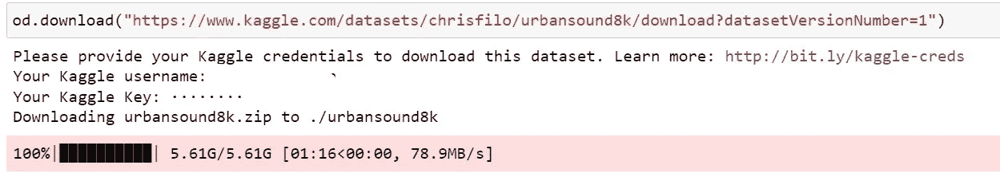
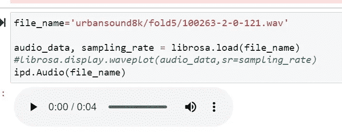
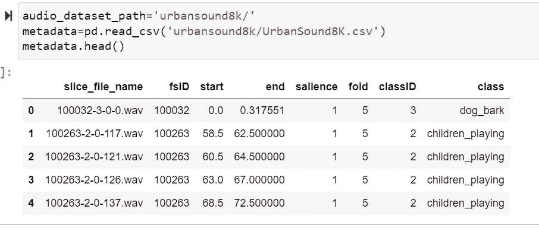
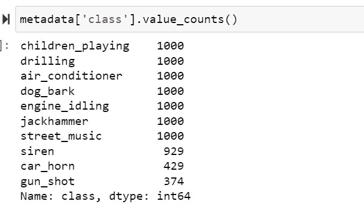
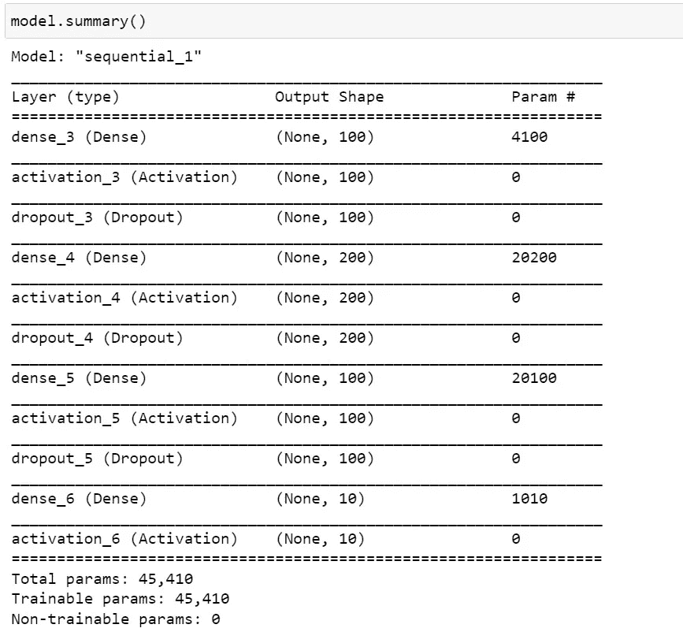
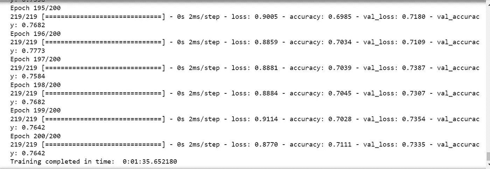
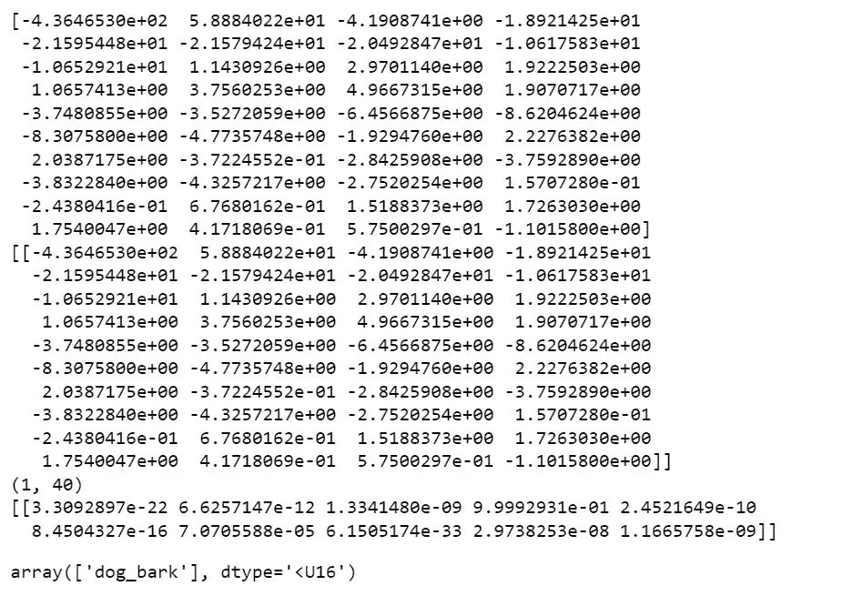

# Azure 机器学习处理音频深度学习模型-自定义

> 原文：<https://medium.com/mlearning-ai/azure-machine-learning-processing-audio-deep-learning-model-custom-dd8094469ccb?source=collection_archive---------6----------------------->

# 用音频标记的数据集构建深度学习模型

# 先决条件

*   Azure 帐户
*   Azure 存储
*   Azure 机器学习
*   Kaggle 数据集来自—[https://www.kaggle.com/datasets/chrisfilo/urbansound8k](https://www.kaggle.com/datasets/chrisfilo/urbansound8k)
*   我测试的代码来自—[https://www . section . io/engineering-education/machine-learning-for-audio-class ification/](https://www.section.io/engineering-education/machine-learning-for-audio-classification/)
*   这里的想法是展示我们可以像使用 Azure 机器学习一样处理开源
*   上面的 kaggle 已经标记了数据集
*   如果没有数据集，我们使用 Audacity 之类的工具来获取音频和标签，并将标签导出为文本文件

# 密码

*   用 python 3.8 和 Azure ML 创建笔记本
*   这已经安装了 tensorflow
*   安装库

```
pip install librosa
```

*   打印 AML 版本

```
import azureml.core
print(azureml.core.VERSION)
```

*   当我写这段代码时，版本是 1.43.0
*   打印 tensorflow 版本

```
import tensorflow as tf
print(tf.__version__)
```

*   是 2.2.0
*   进口

```
import pandas as pd
import os
import librosa
import librosa.display
import numpy as np
import IPython.display as ipd
import matplotlib.pyplot as plt
%matplotlib inline
import opendatasets as od
```

*   下载 kaggle
*   获取用户名和令牌

```
od.download("https://www.kaggle.com/datasets/chrisfilo/urbansound8k/download?datasetVersionNumber=1")
```



*   阅读音频文件

```
file_name='urbansound8k/fold5/100263-2-0-121.wav'audio_data, sampling_rate = librosa.load(file_name)
#librosa.display.waveplot(audio_data,sr=sampling_rate)
ipd.Audio(file_name)
```



*   显示音频内容

```
audio_dataaudio_dataset_path='urbansound8k/'
metadata=pd.read_csv('urbansound8k/UrbanSound8K.csv')
metadata.head()
```



```
metadata['class'].value_counts()
```



*   特征抽出

```
mfccs = librosa.feature.mfcc(y=audio_data, sr=sampling_rate, n_mfcc=40)
mfccs
```

*   现在创建一个函数来提取更多的特征以用于深度学习

```
def features_extractor(file):
    audio, sample_rate = librosa.load(file_name, res_type='kaiser_fast') 
    mfccs_features = librosa.feature.mfcc(y=audio, sr=sample_rate, n_mfcc=40)
    mfccs_scaled_features = np.mean(mfccs_features.T,axis=0)

    return mfccs_scaled_features
```

*   现在，在班级中加入一些功能

```
from tqdm import tqdm
extracted_features=[]
for index_num,row in tqdm(metadata.iterrows()):
    file_name = os.path.join(os.path.abspath(audio_dataset_path),'fold'+str(row["fold"])+'/',str(row["slice_file_name"]))
    final_class_labels=row["class"]
    data=features_extractor(file_name)
    extracted_features.append([data,final_class_labels])
```

*   显示特征

```
extracted_features_df=pd.DataFrame(extracted_features,columns=['feature','class'])
extracted_features_df.head(10)
```


*   转换成列表供我们在深度学习算法中使用

```
X=np.array(extracted_features_df['feature'].tolist())
y=np.array(extracted_features_df['class'].tolist())
```

*   编码分类特征

```
from tensorflow.keras.utils import to_categorical
from sklearn.preprocessing import LabelEncoder
labelencoder=LabelEncoder()
y=to_categorical(labelencoder.fit_transform(y))
```

*   用于培训和测试的拆分

```
from sklearn.model_selection import train_test_split
X_train,X_test,y_train,y_test=train_test_split(X,y,test_size=0.2,random_state=0)
```

*   现在开始为神经网络创建网络

```
from tensorflow.keras.models import Sequential
from tensorflow.keras.layers import Dense,Dropout,Activation,Flatten
from tensorflow.keras.optimizers import Adam
from sklearn import metricsnum_labels=y.shape[1]model=Sequential()
###first layer
model.add(Dense(100,input_shape=(40,)))
model.add(Activation('relu'))
model.add(Dropout(0.5))
###second layer
model.add(Dense(200))
model.add(Activation('relu'))
model.add(Dropout(0.5))
###third layer
model.add(Dense(100))
model.add(Activation('relu'))
model.add(Dropout(0.5))###final layer
model.add(Dense(num_labels))
model.add(Activation('softmax'))model.compile(loss='categorical_crossentropy',metrics=['accuracy'],optimizer='adam')
model.summary()
```



*   使用 fit 运行模型训练

```
from tensorflow.keras.callbacks import ModelCheckpoint
from datetime import datetime num_epochs = 200
num_batch_size = 32checkpointer = ModelCheckpoint(filepath='saved_models/audio_classification.hdf5', 
                               verbose=1, save_best_only=True)
start = datetime.now()#model.fit(X_train, y_train, batch_size=num_batch_size, epochs=num_epochs, validation_data=(X_test, y_test), callbacks=[checkpointer], verbose=1)
model.fit(X_train, y_train, batch_size=num_batch_size, epochs=num_epochs, validation_data=(X_test, y_test), verbose=1) duration = datetime.now() - start
print("Training completed in time: ", duration)
```



*   现在计算指标

```
test_accuracy=model.evaluate(X_test,y_test,verbose=0)
print(test_accuracy[1])
```

*   取一个测试样本
*   预测并查看输出

```
filename="urbansound8k/fold8/103076-3-0-0.wav"
audio, sample_rate = librosa.load(filename, res_type='kaiser_fast') 
mfccs_features = librosa.feature.mfcc(y=audio, sr=sample_rate, n_mfcc=40)
mfccs_scaled_features = np.mean(mfccs_features.T,axis=0)print(mfccs_scaled_features)
mfccs_scaled_features=mfccs_scaled_features.reshape(1,-1)
print(mfccs_scaled_features)
print(mfccs_scaled_features.shape)
predicted_label=model.predict(mfccs_scaled_features)
print(predicted_label)
classes_x=np.argmax(predicted_label,axis=1)
prediction_class = labelencoder.inverse_transform(classes_x)
prediction_class
```



# 【https://github.com】最初发表于[](https://github.com/balakreshnan/Samples2022/blob/main/AzureML/audioml.md)**。**

*[](/mlearning-ai/mlearning-ai-submission-suggestions-b51e2b130bfb) [## Mlearning.ai 提交建议

### 如何成为 Mlearning.ai 上的作家

medium.com](/mlearning-ai/mlearning-ai-submission-suggestions-b51e2b130bfb)*