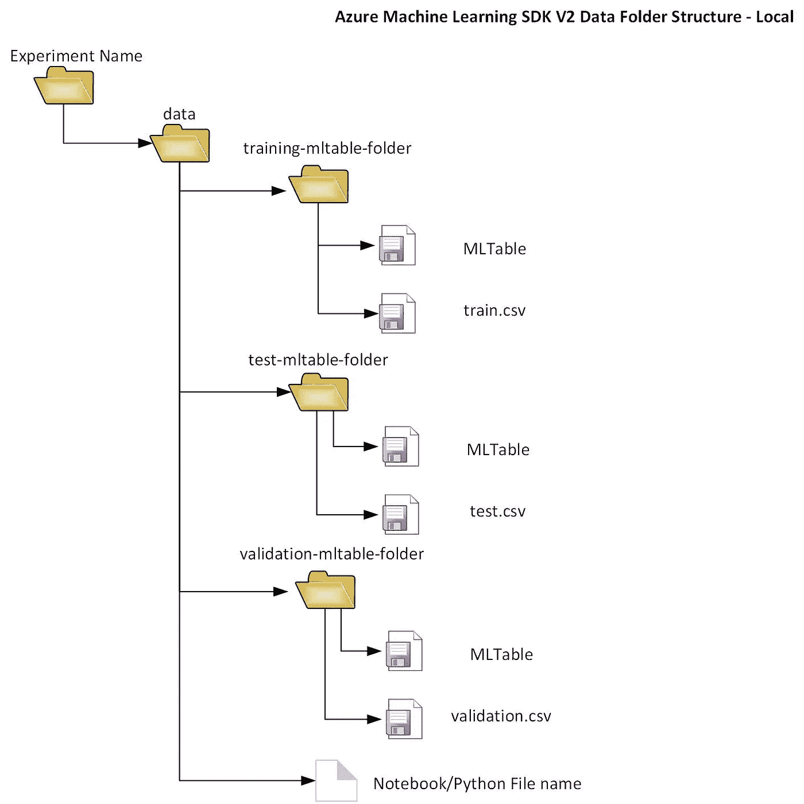
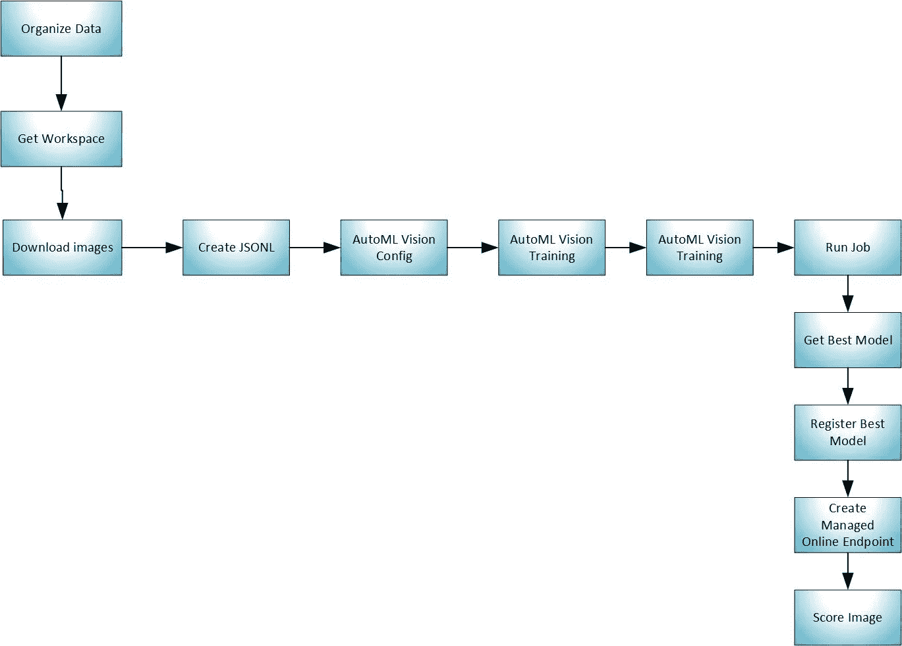
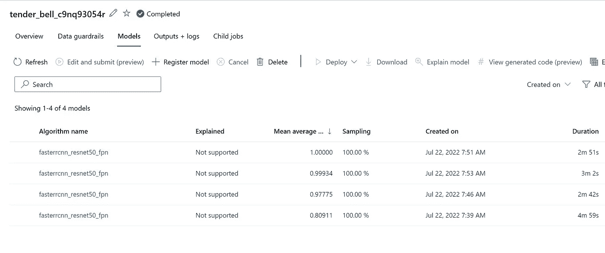

# Azure 机器学习 SDK V2 — AutoML 视觉

> 原文：<https://medium.com/mlearning-ai/azure-machine-learning-sdk-v2-automl-vision-29e70e551f4f?source=collection_archive---------5----------------------->

# azure Machine learning SDK V2 AutoML 视觉实验，使用 mlflow 进行对象检测

# 先决条件

*   Azure 帐户
*   Azure 机器学习资源
*   默认 AML 存储
*   创建培训、测试和验证文件夹
*   以上文件夹的 ml 表配置
*   安装预览功能
*   请记住，预览的打印版本只能使用 _version。版本
*   下面显示了组织数据的文件夹结构
*   这里有数据—[https://github . com/Azure/Azure ml-examples/tree/SDK-preview/SDK/jobs/automl-standalone-jobs/automl-image-object-detection-task-冰箱-items](https://github.com/Azure/azureml-examples/tree/sdk-preview/sdk/jobs/automl-standalone-jobs/automl-image-object-detection-task-fridge-items)



*   对于基于文件夹的 MlTable，这里有一个示例训练代码
*   整个代码流



```
paths:
  - file: ./train_annotations.jsonl
transformations:
  - read_json_lines:
        encoding: utf8
        invalid_lines: error
        include_path_column: false
  - convert_column_types:
      - columns: image_url
        column_type: stream_info
```

*   对于文本数据，它可能是。csv 文件
*   文件:是提供实际培训文件名的地方
*   在这里，我们将创建一个数据文件夹，然后放置所有数据文件夹
*   确保安装了 AML SDK v2

```
import azure.ai.ml
print(azure.ai.ml._version.VERSION)
```

*   如果没有安装，请安装 mlflow

```
pip install azureml-mlflowpip install mlflow
```

# 密码

# 连接现有工作空间的代码

```
# Import required libraries
from azure.identity import DefaultAzureCredential
from azure.ai.ml import MLClientfrom azure.ai.ml.constants import AssetTypes
from azure.ai.ml import Input
from azure.ai.ml.automl import ImageObjectDetectionSearchSpace
from azure.ai.ml.sweep import (
    Choice,
    Uniform,
    BanditPolicy,
)from azure.ai.ml import automl
```

*   现在让我们加载现有的工作空间

```
from azure.identity import DefaultAzureCredential
from azure.ai.ml import MLClientcredential = DefaultAzureCredential()
ml_client = None
try:
    ml_client = MLClient.from_config(credential)
except Exception as ex:
    print(ex)
    # Enter details of your AzureML workspace
    subscription_id = "subid"
    resource_group = "rgname"
    workspace = "workspacename"
    ml_client = MLClient(credential, subscription_id, resource_group, workspace)
```

*   让我们下载图像数据

```
import os
import urllib
from zipfile import ZipFile# download data
download_url = "https://cvbp-secondary.z19.web.core.windows.net/datasets/object_detection/odFridgeObjects.zip"
data_file = "./data/odFridgeObjects.zip"
urllib.request.urlretrieve(download_url, filename=data_file)# extract files
with ZipFile(data_file, "r") as zip:
    print("extracting files...")
    zip.extractall(path="./data")
    print("done")
# delete zip file
os.remove(data_file)
```

*   显示样本图像

```
from IPython.display import Imagesample_image = "./data/odFridgeObjects/images/31.jpg"
Image(filename=sample_image)
```

*   将图像上传到适当的文件夹

```
# Uploading image files by creating a 'data asset URI FOLDER':from azure.ai.ml.entities import Data
from azure.ai.ml.constants import AssetTypesmy_data = Data(
    path="./data/odFridgeObjects",
    type=AssetTypes.URI_FOLDER,
    description="Fridge-items images Object detection",
    name="fridge-items-images-object-detection",
)uri_folder_data_asset = ml_client.data.create_or_update(my_data)print(uri_folder_data_asset)
print("")
print("Path to folder in Blob Storage:")
print(uri_folder_data_asset.path)
```

*   现在让我们为训练创建 jsonl 文件

```
import json
import os
import xml.etree.ElementTree as ETsrc_images = "./data/odFridgeObjects/"# We'll copy each JSONL file within its related MLTable folder
training_mltable_path = "./data/training-mltable-folder/"
validation_mltable_path = "./data/validation-mltable-folder/"train_validation_ratio = 5# Path to the training and validation files
train_annotations_file = os.path.join(training_mltable_path, "train_annotations.jsonl")
validation_annotations_file = os.path.join(
    validation_mltable_path, "validation_annotations.jsonl"
)# Baseline of json line dictionary
json_line_sample = {
    "image_url": uri_folder_data_asset.path,
    "image_details": {"format": None, "width": None, "height": None},
    "label": [],
}# Path to the annotations
annotations_folder = os.path.join(src_images, "annotations")# Read each annotation and convert it to jsonl line
with open(train_annotations_file, "w") as train_f:
    with open(validation_annotations_file, "w") as validation_f:
        for i, filename in enumerate(os.listdir(annotations_folder)):
            if filename.endswith(".xml"):
                print("Parsing " + os.path.join(src_images, filename)) root = ET.parse(os.path.join(annotations_folder, filename)).getroot() width = int(root.find("size/width").text)
                height = int(root.find("size/height").text) labels = []
                for object in root.findall("object"):
                    name = object.find("name").text
                    xmin = object.find("bndbox/xmin").text
                    ymin = object.find("bndbox/ymin").text
                    xmax = object.find("bndbox/xmax").text
                    ymax = object.find("bndbox/ymax").text
                    isCrowd = int(object.find("difficult").text)
                    labels.append(
                        {
                            "label": name,
                            "topX": float(xmin) / width,
                            "topY": float(ymin) / height,
                            "bottomX": float(xmax) / width,
                            "bottomY": float(ymax) / height,
                            "isCrowd": isCrowd,
                        }
                    )
                # build the jsonl file
                image_filename = root.find("filename").text
                _, file_extension = os.path.splitext(image_filename)
                json_line = dict(json_line_sample)
                json_line["image_url"] = (
                    json_line["image_url"] + "images/" + image_filename
                )
                json_line["image_details"]["format"] = file_extension[1:]
                json_line["image_details"]["width"] = width
                json_line["image_details"]["height"] = height
                json_line["label"] = labels if i % train_validation_ratio == 0:
                    # validation annotation
                    validation_f.write(json.dumps(json_line) + "\n")
                else:
                    # train annotation
                    train_f.write(json.dumps(json_line) + "\n")
            else:
                print("Skipping unknown file: {}".format(filename))
```

*   配置培训和验证文件夹

```
# Training MLTable defined locally, with local data to be uploaded
my_training_data_input = Input(type=AssetTypes.MLTABLE, path=training_mltable_path)# Validation MLTable defined locally, with local data to be uploaded
my_validation_data_input = Input(type=AssetTypes.MLTABLE, path=validation_mltable_path)# WITH REMOTE PATH: If available already in the cloud/workspace-blob-store
# my_training_data_input = Input(type=AssetTypes.MLTABLE, path="azureml://datastores/workspaceblobstore/paths/vision-classification/train")
# my_validation_data_input = Input(type=AssetTypes.MLTABLE, path="azureml://datastores/workspaceblobstore/paths/vision-classification/valid")
```

*   现在设置实验名称

```
# general job parameters
compute_name = "gpu-cluster"
exp_name = "automlv2-image-object-detection-experiment"
```

*   创建自动配置

```
# Create the AutoML job with the related factory-function.image_object_detection_job = automl.image_object_detection(
    compute=compute_name,
    experiment_name=exp_name,
    training_data=my_training_data_input,
    validation_data=my_validation_data_input,
    target_column_name="label",
    primary_metric="mean_average_precision",
    tags={"my_custom_tag": "My custom value"},
)
```

*   设定限制

```
# Set limits
image_object_detection_job.set_limits(timeout_minutes=60)
```

*   现在参数

```
# Pass the fixed settings or parameters
image_object_detection_job.set_image_model(early_stopping=True, evaluation_frequency=1)
```

*   配置参数扫描设置

```
# Configure sweep settings
image_object_detection_job.set_sweep(
    max_trials=10,
    max_concurrent_trials=2,
    sampling_algorithm="random",
    early_termination=BanditPolicy(
        evaluation_interval=2, slack_factor=0.2, delay_evaluation=6
    ),
)
```

*   现在定义搜索空间

```
# Define search space
image_object_detection_job.extend_search_space(
    [
        ImageObjectDetectionSearchSpace(
            model_name=Choice(["yolov5"]),
            learning_rate=Uniform(0.0001, 0.01),
            model_size=Choice(["small", "medium"]),  # model-specific
            # image_size=Choice(640, 704, 768),  # model-specific; might need GPU with large memory
        ),
        ImageObjectDetectionSearchSpace(
            model_name=Choice(["fasterrcnn_resnet50_fpn"]),
            learning_rate=Uniform(0.0001, 0.001),
            optimizer=Choice(["sgd", "adam", "adamw"]),
            min_size=Choice([600, 800]),  # model-specific
            # warmup_cosine_lr_warmup_epochs=Choice([0, 3]),
        ),
    ]
)
```

*   现在是创建实验并提交的时候了

```
# Submit the AutoML job
returned_job = ml_client.jobs.create_or_update(
    image_object_detection_job
)  # submit the job to the backendprint(f"Created job: {returned_job}")
```

*   进行实验

```
ml_client.jobs.stream(returned_job.name)
```

*   等待作业完成



*   现在让我们使用 mlflow 来跟踪作业

```
import mlflow# Obtain the tracking URL from MLClient
MLFLOW_TRACKING_URI = ml_client.workspaces.get(
    name=ml_client.workspace_name
).mlflow_tracking_uriprint(MLFLOW_TRACKING_URI)
```

*   设置跟踪 URI

```
# Set the MLFLOW TRACKING URImlflow.set_tracking_uri(MLFLOW_TRACKING_URI)print("\nCurrent tracking uri: {}".format(mlflow.get_tracking_uri()))
```

*   启用 mlflow 客户端

```
from mlflow.tracking.client import MlflowClient# Initialize MLFlow client
mlflow_client = MlflowClient()
```

*   获取作业详细信息

```
job_name = returned_job.name# Example if providing an specific Job name/ID
# job_name = "salmon_camel_5sdf05xvb3"# Get the parent run
mlflow_parent_run = mlflow_client.get_run(job_name)print("Parent Run: ")
print(mlflow_parent_run)
```

*   打印工作标签

```
# Print parent run tags. 'automl_best_child_run_id' tag should be there.
print(mlflow_parent_run.data.tags)
```

*   现在让孩子跑得最好

```
# Get the best model's child runbest_child_run_id = mlflow_parent_run.data.tags["automl_best_child_run_id"]
print("Found best child run id: ", best_child_run_id)best_run = mlflow_client.get_run(best_child_run_id)print("Best child run: ")
print(best_run)
```

*   打印指标

```
import pandas as pdpd.DataFrame(best_run.data.metrics, index=[0]).T
```

*   现在让我们下载工件，模型文件来注册

```
# Create local folder
local_dir = "./artifact_downloads"
if not os.path.exists(local_dir):
    os.mkdir(local_dir)# Download run's artifacts/outputs
local_path = mlflow_client.download_artifacts(
    best_run.info.run_id, "outputs", local_dir
)
print("Artifacts downloaded in: {}".format(local_path))
print("Artifacts: {}".format(os.listdir(local_path)))
```

*   现在设置模型文件夹

```
import os# Show the contents of the MLFlow model folder
os.listdir("./artifact_downloads/outputs/mlflow-model")
```

*   必需的库

```
# import required libraries
from azure.ai.ml.entities import (
    ManagedOnlineEndpoint,
    ManagedOnlineDeployment,
    Model,
    Environment,
    CodeConfiguration,
)
```

*   现在让我们创建一个受管理的在线端点

```
# Creating a unique endpoint name with current datetime to avoid conflicts
import datetimeonline_endpoint_name = "od-fridge-items-" + datetime.datetime.now().strftime(
    "%m%d%H%M%f"
)# create an online endpoint
endpoint = ManagedOnlineEndpoint(
    name=online_endpoint_name,
    description="this is a sample online endpoint for deploying model",
    auth_mode="key",
    tags={"foo": "bar"},
)ml_client.begin_create_or_update(endpoint)
```

*   注册模型

```
model_name = "od-fridge-items-model"
model = Model(
    path=f"azureml://jobs/{best_run.info.run_id}/outputs/artifacts/outputs/model.pt",
    name=model_name,
    description="my sample object detection model",
)# for downloaded file
# model = Model(path="artifact_downloads/outputs/model.pt", name=model_name)registered_model = ml_client.models.create_or_update(model)registered_model.id
```

*   设置环境

```
env = Environment(
    name="automl-images-env",
    description="environment for automl images inference",
    image="mcr.microsoft.com/azureml/openmpi4.1.0-cuda11.1-cudnn8-ubuntu18.04",
    conda_file="artifact_downloads/outputs/conda_env_v_1_0_0.yml",
)
```

*   评分文件

```
code_configuration = CodeConfiguration(
    code="artifact_downloads/outputs/", scoring_script="scoring_file_v_1_0_0.py"
)
```

*   部署配置

```
deployment = ManagedOnlineDeployment(
    name="od-fridge-items-deploy",
    endpoint_name=online_endpoint_name,
    model=registered_model.id,
    environment=env,
    code_configuration=code_configuration,
    instance_type="Standard_DS3_V2",
    instance_count=1,
)
```

*   部署受管理端点

```
ml_client.online_deployments.begin_create_or_update(deployment)
```

*   等待端点创建


*   现在更新流量到 100%

```
# od fridge items deployment to take 100% traffic
endpoint.traffic = {"od-fridge-items-deploy": 100}
ml_client.begin_create_or_update(endpoint)
```

*   现在让新的 REST APi 来评分

```
# Get the details for online endpoint
endpoint = ml_client.online_endpoints.get(name=online_endpoint_name)# existing traffic details
print(endpoint.traffic)# Get the scoring URI
print(endpoint.scoring_uri)
```

*   现在加载一个验证图像并用上面的 REST API 评分

```
import requests# URL for the endpoint
scoring_uri = endpoint.scoring_uri# If the endpoint is authenticated, set the key or token
key = ml_client.online_endpoints.list_keys(name=online_endpoint_name).primary_keysample_image = "./data/odFridgeObjects/images/1.jpg"# Load image data
data = open(sample_image, "rb").read()# Set the content type
headers = {"Content-Type": "application/octet-stream"}# If authentication is enabled, set the authorization header
headers["Authorization"] = f"Bearer {key}"# Make the request and display the response
resp = requests.post(scoring_uri, data, headers=headers)
print(resp.text)
```

*   最后删除端点

```
ml_client.online_endpoints.begin_delete(name=online_endpoint_name)
```

*   等待端点删除

*最初发表于*[T5【https://github.com】](https://github.com/balakreshnan/Samples2022/blob/main/AzureMLV2/visionsdkv2.md)*。*

[](/mlearning-ai/mlearning-ai-submission-suggestions-b51e2b130bfb) [## Mlearning.ai 提交建议

### 如何成为 Mlearning.ai 上的作家

medium.com](/mlearning-ai/mlearning-ai-submission-suggestions-b51e2b130bfb)