# 使用 AutoML-Titanic 数据集的 Azure 机器学习 SDK v2

> 原文：<https://medium.com/mlearning-ai/azure-machine-learning-sdk-v2-using-automl-titanic-dataset-2cbff7fc37f?source=collection_archive---------6----------------------->

# 使用 Azure Machine Learning SDK v2 训练模型、注册和部署模型

# 先决条件

*   Azure 帐户
*   Azure 机器学习工作区
*   Azure 存储帐户
*   获取 titanic.csv
*   创建文件夹
*   创建数据文件夹
*   培训文件夹
*   测试文件夹
*   验证文件夹
*   将文件上传到以上文件夹

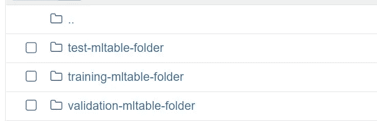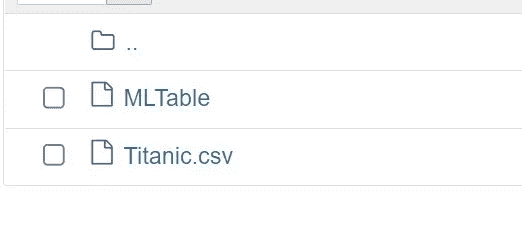

# 密码

*   导入库

```
# Import required libraries
from azure.identity import DefaultAzureCredential
from azure.identity import AzureCliCredential
from azure.ai.ml import automl, Input, MLClientfrom azure.ai.ml.constants import AssetTypes
from azure.ai.ml.automl import (
    classification,
    ClassificationPrimaryMetrics,
    ClassificationModels,
)
```

*   加载工作空间

```
from azure.identity import DefaultAzureCredential
from azure.ai.ml import MLClientcredential = DefaultAzureCredential()
ml_client = None
try:
    ml_client = MLClient.from_config(credential)
except Exception as ex:
    print(ex)
    # Enter details of your AzureML workspace
    subscription_id = "xxxxx-xxxxxx-xxxxxx"
    resource_group = "rgname"
    workspace = "workspacename"
    ml_client = MLClient(credential, subscription_id, resource_group, workspace)
```

*   显示工作区

```
workspace = ml_client.workspaces.get(name=ml_client.workspace_name)subscription_id = ml_client.connections._subscription_id
resource_group = workspace.resource_group
workspace_name = ml_client.workspace_nameoutput = {}
output["Workspace"] = workspace_name
output["Subscription ID"] = subscription_id
output["Resource Group"] = resource_group
output["Location"] = workspace.location
output
```

*   配置培训数据

```
# Create MLTables for training datasetmy_training_data_input = Input(
    type=AssetTypes.MLTABLE, path="./data/training-mltable-folder"
)
```

*   配置实验名称

```
# General job parameters
compute_name = "cpu-cluster"
max_trials = 5
exp_name = "automlv2-Titanic-classifier-experiment"
```

*   自动配置

```
# Create the AutoML classification job with the related factory-function.classification_job = automl.classification(
    compute=compute_name,
    experiment_name=exp_name,
    training_data=my_training_data_input,
    target_column_name="Survived",
    primary_metric="accuracy",
    n_cross_validations=5,
    enable_model_explainability=True,
    tags={"my_custom_tag": "My Titanic Automl Exp"},
)# Limits are all optional
classification_job.set_limits(
    timeout_minutes=600,
    trial_timeout_minutes=20,
    max_trials=max_trials,
    # max_concurrent_trials = 4,
    # max_cores_per_trial: -1,
    enable_early_termination=True,
)# Training properties are optional
classification_job.set_training(
    blocked_training_algorithms=[ClassificationModels.LOGISTIC_REGRESSION],
    enable_onnx_compatible_models=True,
)
```

*   创造一份工作

```
# Submit the AutoML job
returned_job = ml_client.jobs.create_or_update(
    classification_job
)  # submit the job to the backendprint(f"Created job: {returned_job}")
```

*   获取详细信息

```
ml_client.jobs.stream(returned_job.name)
```

*   获取端点 url

```
# Get a URL for the status of the job
returned_job.services["Studio"].endpoint
print(returned_job.name)
```

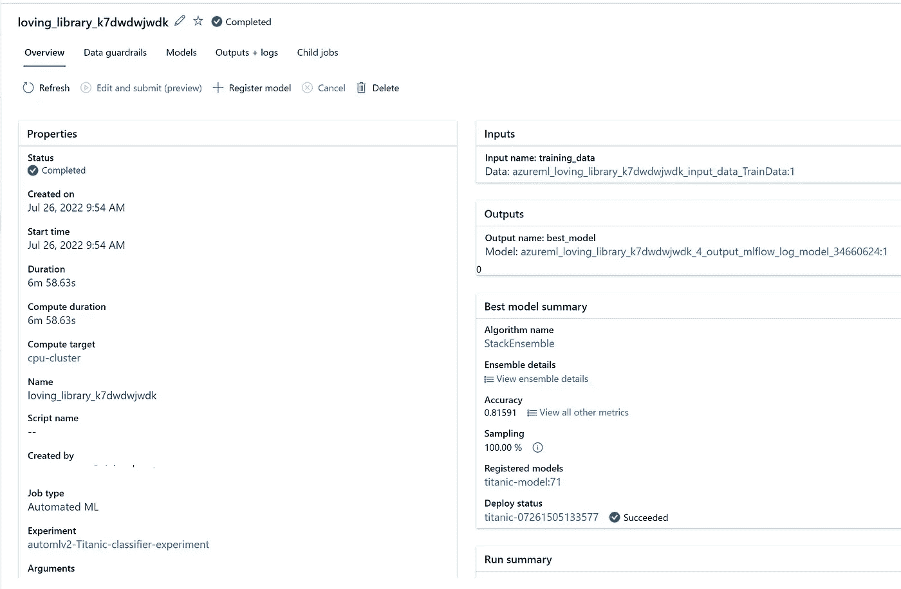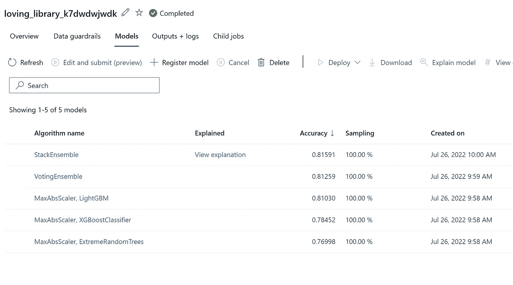

*   显示最佳模型

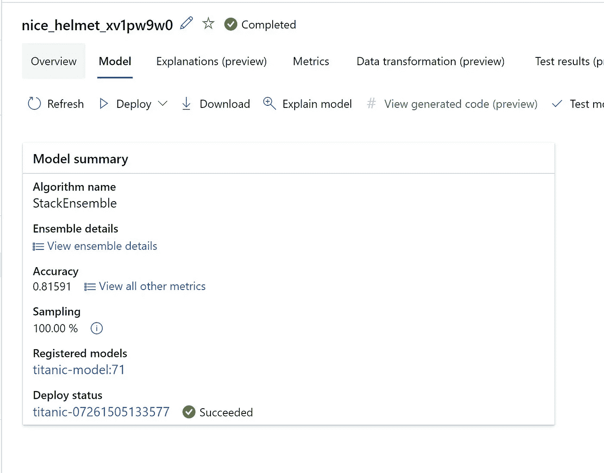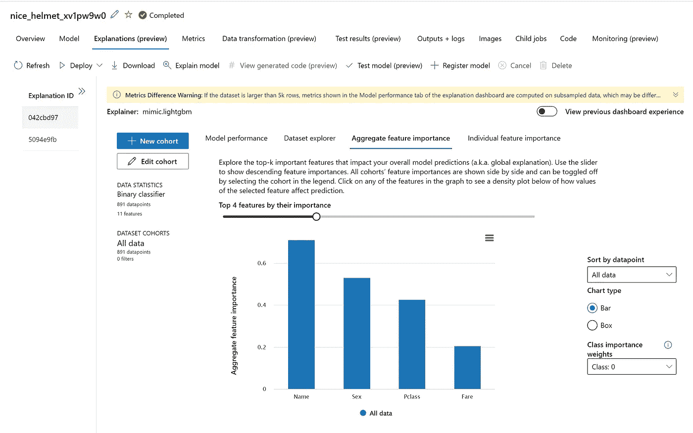

*   调用 MLFLow 以获取详细信息

```
import mlflow# Obtain the tracking URL from MLClient
MLFLOW_TRACKING_URI = ml_client.workspaces.get(
    name=ml_client.workspace_name
).mlflow_tracking_uriprint(MLFLOW_TRACKING_URI)# Set the MLFLOW TRACKING URImlflow.set_tracking_uri(MLFLOW_TRACKING_URI)print("\nCurrent tracking uri: {}".format(mlflow.get_tracking_uri()))
```

*   启用 MLFLow

```
from mlflow.tracking.client import MlflowClient# Initialize MLFlow client
mlflow_client = MlflowClient()job_name = returned_job.name# Example if providing an specific Job name/ID
# job_name = "b4e95546-0aa1-448e-9ad6-002e3207b4fc"# Get the parent run
mlflow_parent_run = mlflow_client.get_run(job_name)print("Parent Run: ")
print(mlflow_parent_run)
```

*   获取标签

```
# Print parent run tags. 'automl_best_child_run_id' tag should be there.
print(mlflow_parent_run.data.tags)
```

*   获得最佳运行

```
# Get the best model's child runbest_child_run_id = mlflow_parent_run.data.tags["automl_best_child_run_id"]
print("Found best child run id: ", best_child_run_id)best_run = mlflow_client.get_run(best_child_run_id)print("Best child run: ")
print(best_run)
```

*   显示指标

```
best_run.data.metrics
```

*   创建文件夹以下载机器学习

```
import os# Create local folder
local_dir = "./artifact_downloads"
if not os.path.exists(local_dir):
    os.mkdir(local_dir)# Download run's artifacts/outputs
local_path = mlflow_client.download_artifacts(
    best_run.info.run_id, "outputs", local_dir
)
print("Artifacts downloaded in: {}".format(local_path))
print("Artifacts: {}".format(os.listdir(local_path)))# Show the contents of the MLFlow model folder
os.listdir("./artifact_downloads/outputs/mlflow-model")
```

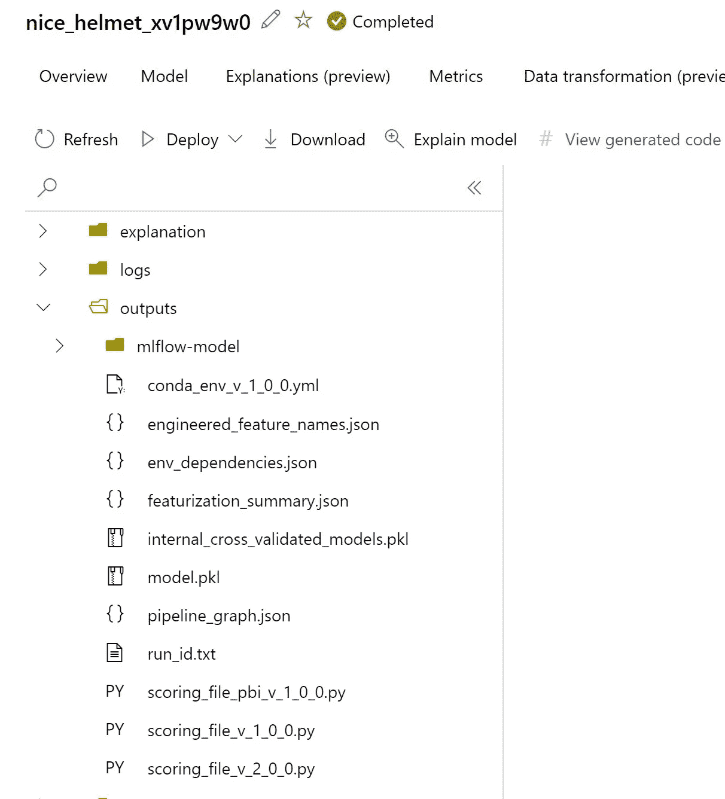

*   现在创建在线托管

```
# import required libraries
# import required libraries
from azure.ai.ml import MLClient
from azure.ai.ml.entities import (
    ManagedOnlineEndpoint,
    ManagedOnlineDeployment,
    Model,
    Environment,
    CodeConfiguration,
    ProbeSettings,
)
from azure.ai.ml.constants import ModelTypemodel_name = "titanic-model-v2"
model = Model(
    path=f"azureml://jobs/{best_run.info.run_id}/outputs/artifacts/outputs/model.pkl",
    name=model_name,
    description="my sample titanic mlflow model",
)# for downloaded file
# model = Model(path="artifact_downloads/outputs/model.pkl", name=model_name)registered_model = ml_client.models.create_or_update(model)registered_model.id# Creating a unique endpoint name with current datetime to avoid conflicts
import datetimeonline_endpoint_name = "titanic-" + datetime.datetime.now().strftime("%m%d%H%M%f")# create an online endpoint
endpoint = ManagedOnlineEndpoint(
    name=online_endpoint_name,
    description="this is a sample online endpoint for titanic mlflow model",
    auth_mode="key",
    tags={"foo": "bar"},
)ml_client.begin_create_or_update(endpoint)
```

*   设置环境

```
env = Environment(
    name="automl-titanic-tabular-env",
    description="environment for automl inference",
    image="mcr.microsoft.com/azureml/openmpi3.1.2-ubuntu18.04:20210727.v1",
    conda_file="artifact_downloads/outputs/conda_env_v_1_0_0.yml",
)
```

*   将评分脚本用于受管理端点 api

```
code_configuration = CodeConfiguration(
    code="artifact_downloads/outputs/", scoring_script="scoring_file_v_2_0_0.py"
)
```

*   设置部署

```
deployment = ManagedOnlineDeployment(
    name="titanic-deploy",
    endpoint_name=online_endpoint_name,
    model=registered_model.id,
    environment=env,
    code_configuration=code_configuration,
    instance_type="Standard_DS2_V2",
    instance_count=1,
)
```

*   更新上述端点的部署

```
ml_client.online_deployments.begin_create_or_update(deployment)
```

*   设置流量

```
# bankmarketing deployment to take 100% traffic
endpoint.traffic = {"titanic-deploy": 100}
ml_client.begin_create_or_update(endpoint)
```

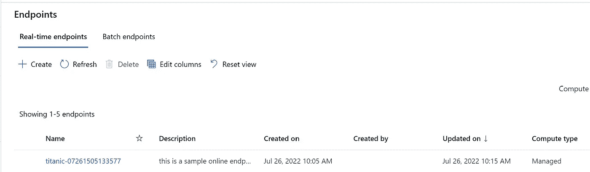

*   端点的详细信息

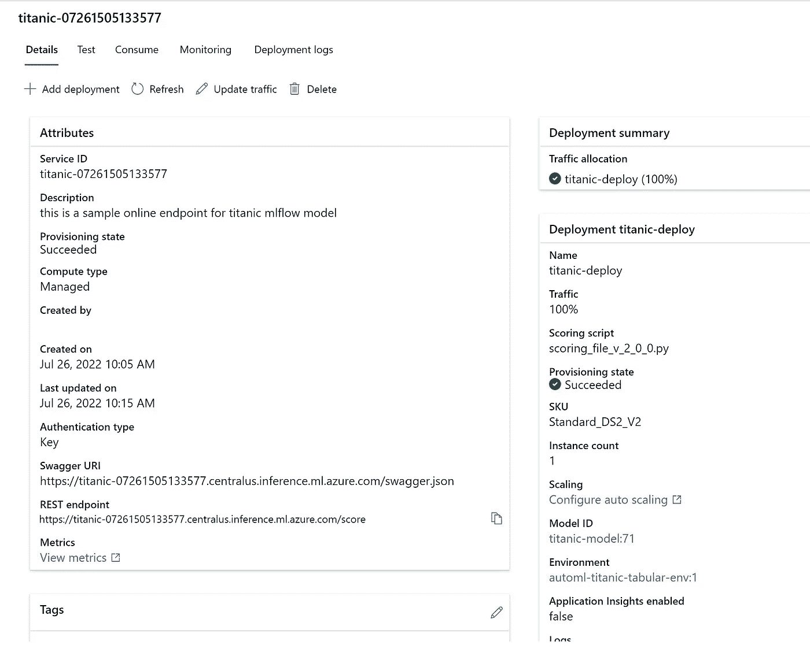

*   测试端点
*   配置示例数据

```
{"data": [
    [ 1, "3", "Braund Mr. Owen Harris", "male", "22", "1", "0", "A/5 21171", 7.25, "C76", "S"],
    [ 2, "1", "Cumings Mrs. John Bradley", "female", "38", "1", "0", "PC 17599", 71.2833, "C85", "C"]
]}
```

*   呼叫端点

```
import urllib.request
import json
import os
import ssldef allowSelfSignedHttps(allowed):
    # bypass the server certificate verification on client side
    if allowed and not os.environ.get('PYTHONHTTPSVERIFY', '') and getattr(ssl, '_create_unverified_context', None):
        ssl._create_default_https_context = ssl._create_unverified_contextallowSelfSignedHttps(True) # this line is needed if you use self-signed certificate in your scoring service.# Request data goes here
# The example below assumes JSON formatting which may be updated
# depending on the format your endpoint expects.
# More information can be found here:
# https://docs.microsoft.com/azure/machine-learning/how-to-deploy-advanced-entry-script
data =  {
  "Inputs": {
    "data": [
      {
        "PassengerId": 1,
        "Pclass": "3",
        "Name": "Braund Mr Owen Harris",
        "Sex": "male",
        "Age": 22,
        "SibSp": "1",
        "Parch": "0",
        "Ticket": "A/5 21171",
        "Fare": 22.5,
        "Cabin": "C76",
        "Embarked": "S"
      }
    ]
  },
  "GlobalParameters": {
    "method": "predict"
  }
}body = str.encode(json.dumps(data))url = 'https://xxxxxxxxxxxxxxxxxxxxxx.centralus.inference.ml.azure.com/score'
api_key = 'xxxxxxxxxxxxxxxxxxxxxxxxxxxxxxx' # Replace this with the API key for the web service# The azureml-model-deployment header will force the request to go to a specific deployment.
# Remove this header to have the request observe the endpoint traffic rules
headers = {'Content-Type':'application/json', 'Authorization':('Bearer '+ api_key), 'azureml-model-deployment': 'titanic-deploy' }req = urllib.request.Request(url, body, headers)try:
    response = urllib.request.urlopen(req) result = response.read()
    print(result)
except urllib.error.HTTPError as error:
    print("The request failed with status code: " + str(error.code)) # Print the headers - they include the requert ID and the timestamp, which are useful for debugging the failure
    print(error.info())
    print(error.read().decode("utf8", 'ignore'))
```

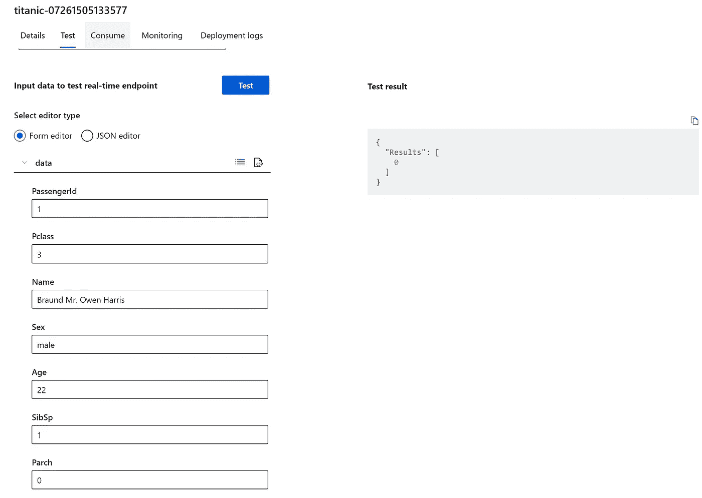

*   预测 _proba

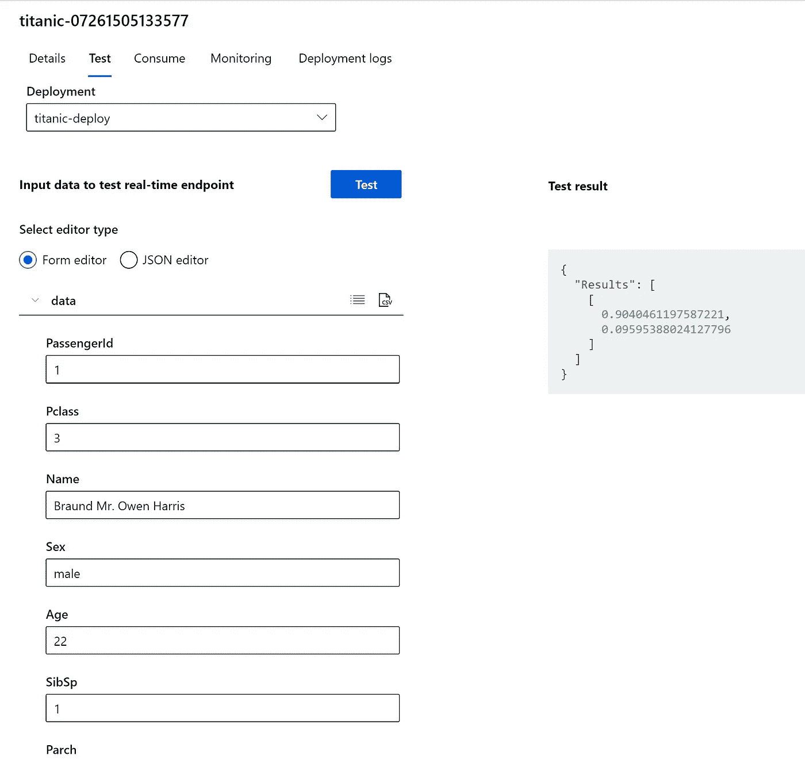

*   获取端点详细信息

```
# Get the details for online endpoint
endpoint = ml_client.online_endpoints.get(name=online_endpoint_name)# existing traffic details
print(endpoint.traffic)# Get the scoring URI
print(endpoint.scoring_uri)
```

*   现在删除端点

```
ml_client.online_endpoints.begin_delete(name=online_endpoint_name)
```

*最初发表于*[*【https://github.com】*](https://github.com/balakreshnan/Samples2022/blob/main/AzureMLV2/titanicsdkv2.md)*。*

[](/mlearning-ai/mlearning-ai-submission-suggestions-b51e2b130bfb) [## Mlearning.ai 提交建议

### 如何成为 Mlearning.ai 上的作家

medium.com](/mlearning-ai/mlearning-ai-submission-suggestions-b51e2b130bfb)