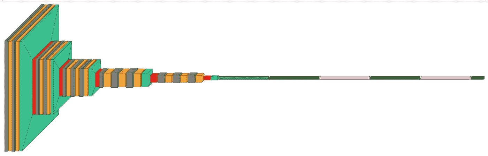

# Azure 机器学习神经网络的可视化表示

> 原文：<https://medium.com/mlearning-ai/azure-machine-learning-visual-representation-of-neural-network-7c3416560841?source=collection_archive---------5----------------------->

# Azure 机器学习中的可视化 Keras

# 先决条件

*   Azure 帐户
*   Azure 机器学习服务
*   开源 visualkeras 库

# 密码

*   使用 python 3.8 和 Tensorflow 和 Pytorch 创建新笔记本
*   安装 visualkeras 库

```
pip install visualkeras
```

*   接下来导入库

```
from tensorflow.python.keras.models import Sequential
from tensorflow.python.keras.layers import Dense, Flatten, Conv2D, Dropout, MaxPooling2D, InputLayer, ZeroPadding2D
from collections import defaultdict
import visualkeras
from PIL import ImageFont
```

*   现在让我们建立 VGG16 神经网络模型
*   这是为了测试多层视觉表现

```
# create VGG16
image_size = 224
model = Sequential()
model.add(InputLayer(input_shape=(image_size, image_size, 3)))model.add(ZeroPadding2D((1, 1)))
model.add(Conv2D(64, activation='relu', kernel_size=(3, 3)))
model.add(ZeroPadding2D((1, 1)))
model.add(Conv2D(64, activation='relu', kernel_size=(3, 3)))
model.add(visualkeras.SpacingDummyLayer())model.add(MaxPooling2D((2, 2), strides=(2, 2)))
model.add(ZeroPadding2D((1, 1)))
model.add(Conv2D(128, activation='relu', kernel_size=(3, 3)))
model.add(ZeroPadding2D((1, 1)))
model.add(Conv2D(128, activation='relu', kernel_size=(3, 3)))
model.add(visualkeras.SpacingDummyLayer())model.add(MaxPooling2D((2, 2), strides=(2, 2)))
model.add(ZeroPadding2D((1, 1)))
model.add(Conv2D(256, activation='relu', kernel_size=(3, 3)))
model.add(ZeroPadding2D((1, 1)))
model.add(Conv2D(256, activation='relu', kernel_size=(3, 3)))
model.add(ZeroPadding2D((1, 1)))
model.add(Conv2D(256, activation='relu', kernel_size=(3, 3)))
model.add(visualkeras.SpacingDummyLayer())model.add(MaxPooling2D((2, 2), strides=(2, 2)))
model.add(ZeroPadding2D((1, 1)))
model.add(Conv2D(512, activation='relu', kernel_size=(3, 3)))
model.add(ZeroPadding2D((1, 1)))
model.add(Conv2D(512, activation='relu', kernel_size=(3, 3)))
model.add(ZeroPadding2D((1, 1)))
model.add(Conv2D(512, activation='relu', kernel_size=(3, 3)))
model.add(visualkeras.SpacingDummyLayer())model.add(MaxPooling2D((2, 2), strides=(2, 2)))
model.add(ZeroPadding2D((1, 1)))
model.add(Conv2D(512, activation='relu', kernel_size=(3, 3)))
model.add(ZeroPadding2D((1, 1)))
model.add(Conv2D(512, activation='relu', kernel_size=(3, 3)))
model.add(ZeroPadding2D((1, 1)))
model.add(Conv2D(512, activation='relu', kernel_size=(3, 3)))
model.add(MaxPooling2D())
model.add(visualkeras.SpacingDummyLayer())model.add(Flatten())model.add(Dense(4096, activation='relu'))
model.add(Dropout(0.5))
model.add(Dense(4096, activation='relu'))
model.add(Dropout(0.5))
model.add(Dense(1000, activation='softmax'))
```

*   现在让我们显示模型的可视化表示

```
from tensorflow.python.keras.layers import Dense, Conv2D, Flatten, Dropout, MaxPooling2D, ZeroPadding2D
from collections import defaultdictcolor_map = defaultdict(dict)
color_map[Conv2D]['fill'] = 'orange'
color_map[ZeroPadding2D]['fill'] = 'gray'
color_map[Dropout]['fill'] = 'pink'
color_map[MaxPooling2D]['fill'] = 'red'
color_map[Dense]['fill'] = 'green'
color_map[Flatten]['fill'] = 'teal'visualkeras.layered_view(model, color_map=color_map)
```

*   输出



原文—[samples 2022/amlvisualnn . MD at main balakreshnan/samples 2022(github.com)](https://github.com/balakreshnan/Samples2022/blob/main/AzureMLV2/amlvisualnn.md)

[](/mlearning-ai/mlearning-ai-submission-suggestions-b51e2b130bfb) [## Mlearning.ai 提交建议

### 如何成为 Mlearning.ai 上的作家

medium.com](/mlearning-ai/mlearning-ai-submission-suggestions-b51e2b130bfb)