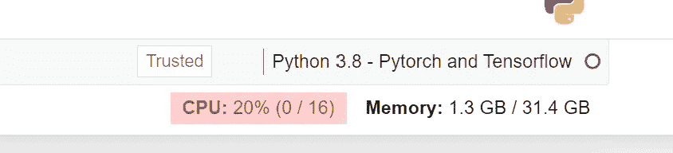
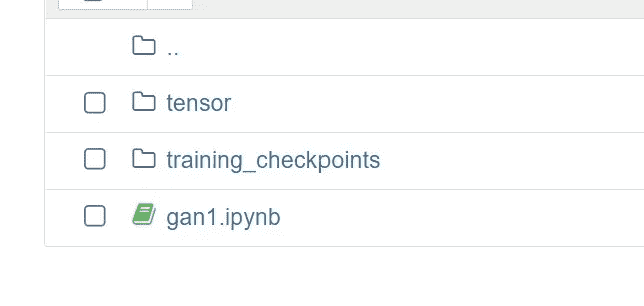
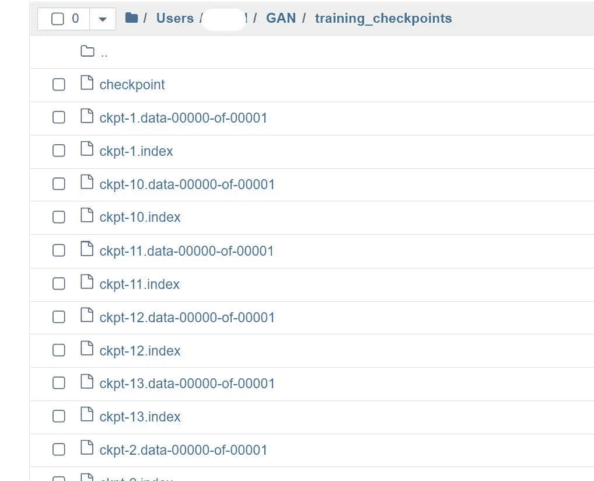
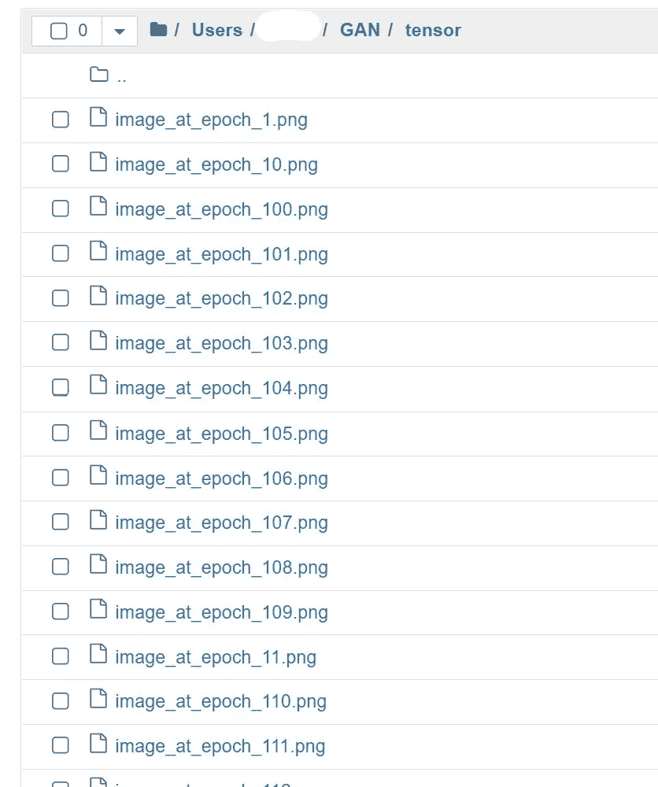

# Azure 机器学习实现一般敌对网络示例

> 原文：<https://medium.com/mlearning-ai/azure-ml-implement-gan-sample-4896ec5bbb6?source=collection_archive---------5----------------------->

# 使用 Tensorflow 在 Azure ML 中实现 GAN

# 先决条件

*   Azure 帐户
*   Azure ML 工作区
*   Azure 存储
*   我从—[https://livecodestream . dev/post/generating-images-with-deep-learning/](https://livecodestream.dev/post/generating-images-with-deep-learning/)获取了样本
*   尽管上面的网站展示了如何测试 colab，我还是能够在 AML 中运行而不用安装任何东西。
*   这只是为了展示如何在 Azure ML 中实现 GAN。仅演示

# 密码

*   用 python 3.8 创建一个笔记本，以 pytorch 和 tensorflow 为内核



*   导入必要的库

```
import os
import time
import numpy as np
import tensorflow as tf
from tensorflow.keras import layers
import argparse
from IPython import display
import matplotlib.pyplot as plt
# %matplotlib inline
from tensorflow import keras
```

*   设置环境或变量

```
parser = argparse.ArgumentParser()
parser.add_argument("--n_epochs", type=int, default=200, help="number of epochs of training")
parser.add_argument("--batch_size", type=int, default=128, help="size of the batches")
parser.add_argument("--lr", type=float, default=2e-4, help="adam: learning rate")
parser.add_argument("--b1", type=float, default=0.5, help="adam: decay of first order momentum of gradient")
parser.add_argument("--b2", type=float, default=0.999, help="adam: decay of first order momentum of gradient")
parser.add_argument("--latent_dim", type=int, default=100, help="dimension of the latent space (generator's input)")
parser.add_argument("--image_dim", type=int, default=784, help="image size")
parser.add_argument("--channels", type=int, default=1, help="image channels")
args = parser.parse_args("")
```

*   下载样本数据

```
(x_train, y_train), (x_test, y_test) = tf.keras.datasets.fashion_mnist.load_data()
x_train = x_train.reshape(x_train.shape[0], 28, 28, 1).astype('float32')
x_train = (x_train - 127.5) / 127.5 # Normalize the images to [-1, 1]
# Batch and shuffle the data
train_dataset = tf.data.Dataset.from_tensor_slices(x_train).\
shuffle(60000).batch(args.batch_size)
```

*   现在创建发电机

```
def generator(image_dim):
  inputs = keras.Input(shape=(100,), name='input_layer')
  x = layers.Dense(128, kernel_initializer=tf.keras.initializers.he_uniform, name='dense_1')(inputs)
  #print(x.dtype)
  x = layers.LeakyReLU(0.2, name='leaky_relu_1')(x)
  x = layers.Dense(256, kernel_initializer=tf.keras.initializers.he_uniform, name='dense_2')(x) 
  x = layers.BatchNormalization(momentum=0.1,  epsilon=0.8, name='bn_1')(x)
  x = layers.LeakyReLU(0.2, name='leaky_relu_2')(x)
  x = layers.Dense(512, kernel_initializer=tf.keras.initializers.he_uniform, name='dense_3')(x) 
  x = layers.BatchNormalization(momentum=0.1,  epsilon=0.8, name='bn_2')(x)
  x = layers.LeakyReLU(0.2, name='leaky_relu_3')(x)
  x = layers.Dense(1024, kernel_initializer=tf.keras.initializers.he_uniform,  name='dense_4')(x) 
  x = layers.BatchNormalization(momentum=0.1,  epsilon=0.8, name='bn_3')(x)
  x = layers.LeakyReLU(0.2, name='leaky_relu_4')(x)
  x = layers.Dense(image_dim, kernel_initializer=tf.keras.initializers.he_uniform, activation='tanh',  name='dense_5')(x) 
  outputs = tf.reshape(x, [-1, 28, 28, 1], name='Reshape_Layer')
  model = tf.keras.Model(inputs, outputs, name="Generator")
  return model
```

*   调用生成器

```
generator = generator(args.image_dim)
```

*   显示摘要

```
generator.summary()
```

*   现在创建鉴别器

```
def discriminator():
  inputs = keras.Input(shape=(28,28,1), name='input_layer')
  input = tf.reshape(inputs, [-1, 784], name='reshape_layer')
  x = layers.Dense(512, kernel_initializer=tf.keras.initializers.he_uniform, name='dense_1')(input)
  x = layers.LeakyReLU(0.2, name='leaky_relu_1')(x)
  x = layers.Dense(256, kernel_initializer=tf.keras.initializers.he_uniform, name='dense_2')(x) 
  x = layers.LeakyReLU(0.2, name='leaky_relu_2')(x)
  outputs = layers.Dense(1, kernel_initializer=tf.keras.initializers.he_uniform, activation='sigmoid', name='dense_3') (x) 
  model = tf.keras.Model(inputs, outputs, name="Discriminator")
  return model
```

*   调用鉴别器

```
discriminator = discriminator()
```

*   显示摘要

```
discriminator.summary()
```

*   现在让我们配置损失函数

```
binary_cross_entropy = tf.keras.losses.BinaryCrossentropy()
```

*   发电机损耗

```
def generator_loss(fake_output):
  gen_loss = binary_cross_entropy(tf.ones_like(fake_output), fake_output)
  #print(gen_loss)
  return gen_loss
```

*   鉴频器损耗

```
def discriminator_loss(real_output, fake_output):
  real_loss = binary_cross_entropy(tf.ones_like(real_output), real_output)
  fake_loss = binary_cross_entropy(tf.zeros_like(fake_output), fake_output)
  total_loss = real_loss + fake_loss
  #print(total_loss)
  return total_loss
```

*   集合优化器

```
generator_optimizer = tf.keras.optimizers.Adam(learning_rate = args.lr, beta_1 = args.b1, beta_2 = args.b2 )
discriminator_optimizer = tf.keras.optimizers.Adam(learning_rate = args.lr, beta_1 = args.b1, beta_2 = args.b2 )
```

*   配置培训功能

```
@tf.function
def train_step(images):
  noise = tf.random.normal([args.batch_size, args.latent_dim])

  with tf.GradientTape() as gen_tape, tf.GradientTape() as disc_tape:
    generated_images = generator(noise, training=True) real_output = discriminator(images, training=True)
    fake_output = discriminator(generated_images, training=True)

    gen_loss = generator_loss(fake_output)
    disc_loss = discriminator_loss(real_output, fake_output)

  gradients_of_gen = gen_tape.gradient(gen_loss, generator.trainable_variables) # computing the gradients

  gradients_of_disc = disc_tape.gradient(disc_loss, discriminator.trainable_variables) # computing the gradients

  generator_optimizer.apply_gradients(zip(gradients_of_gen, generator.trainable_variables)) # updating generator parameter 

  discriminator_optimizer.apply_gradients(zip(gradients_of_disc,discriminator.trainable_variables))
```

*   播种

```
# We will reuse this seed overtime to visualize progress
num_examples_to_generate = 25
seed = tf.random.normal([num_examples_to_generate, args.latent_dim])
```

*   创建目录

```
!mkdir tensor
```

*   设置检查点

```
import os
checkpoint_dir = './training_checkpoints'
checkpoint_prefix = os.path.join(checkpoint_dir, "ckpt")
checkpoint = tf.train.Checkpoint(generator_optimizer=generator_optimizer,
                                 discriminator_optimizer=discriminator_optimizer,
                                 generator=generator,
                                 discriminator=discriminator)
```

*   火车模型

```
def train(dataset, epochs):
  for epoch in range(epochs):
    start = time.time()
    i = 0
    D_loss_list, G_loss_list = [], []
    for image_batch in dataset:
      i += 1
      train_step(image_batch) display.clear_output(wait=True)
    generate_and_save_images(generator,
                              epoch + 1,
                              seed) # Save the model every 15 epochs
    if (epoch + 1) % 15 == 0:
      checkpoint.save(file_prefix = checkpoint_prefix) print ('Time for epoch {} is {} sec'.format(epoch + 1, time.time()-start)) # Generate after the final epoch
  display.clear_output(wait=True)
  generate_and_save_images(generator,
                          epochs,
                          seed)def generate_and_save_images(model, epoch, test_input):
  # Notice `training` is set to False.
  # This is so all layers run in inference mode (batchnorm).
    predictions = model(test_input, training=False)
    #print(predictions.shape)
    fig = plt.figure(figsize=(4,4)) for i in range(predictions.shape[0]):
        plt.subplot(5, 5, i+1)  
        pred = (predictions[i, :, :, 0] + 1) * 127.5  
        pred = np.array(pred)    
        plt.imshow(pred.astype(np.uint8), cmap='gray')
        plt.axis('off') plt.savefig('tensor/image_at_epoch_{:d}.png'.format(epoch))
    plt.show()
```

*   训练模型创建图像

```
train(train_dataset, args.n_epochs)
```

*   一旦运行，这些文件夹将出现



*   检查点目录



*   张量目录中的图像生成器



原始文章位于—【github.com samples 2022/gan sample . MD at main balakreshnan/samples 2022

[](/mlearning-ai/mlearning-ai-submission-suggestions-b51e2b130bfb) [## Mlearning.ai 提交建议

### 如何成为 Mlearning.ai 上的作家

medium.com](/mlearning-ai/mlearning-ai-submission-suggestions-b51e2b130bfb)