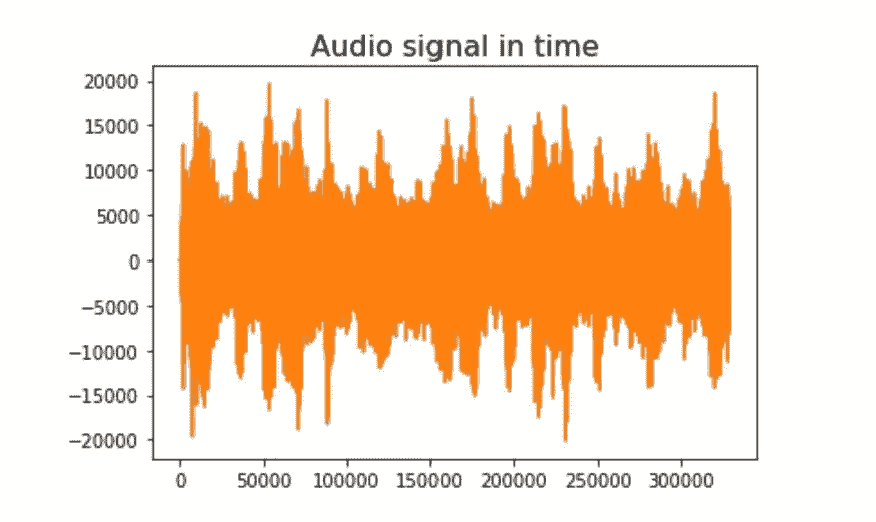
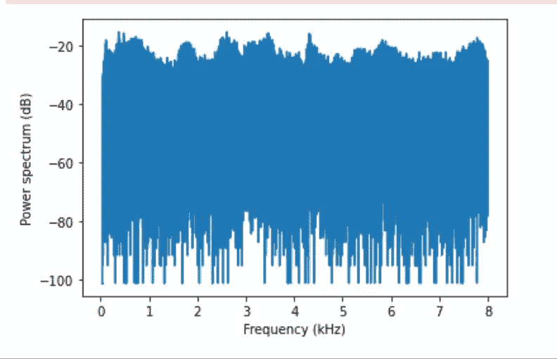
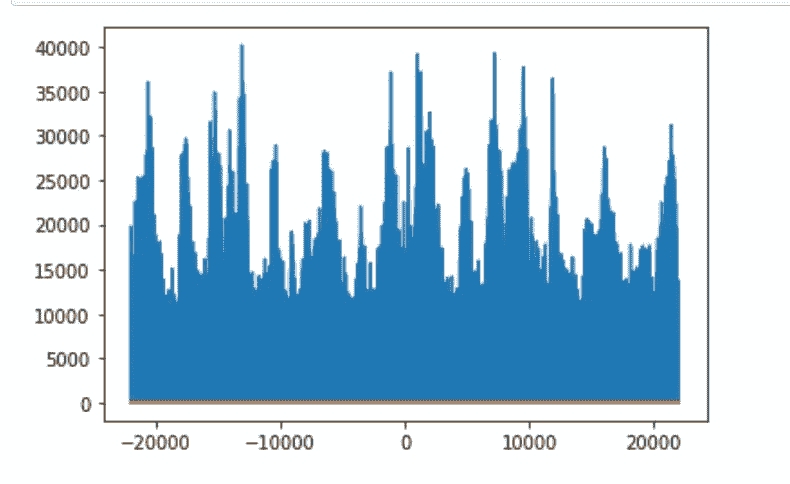
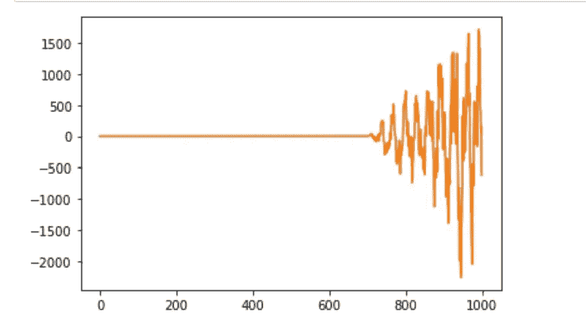
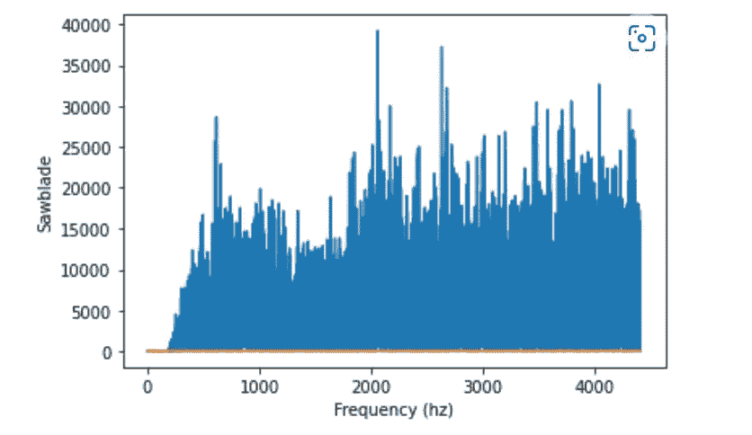

# Azure ML 处理音频频谱分析

> 原文：<https://medium.com/mlearning-ai/azure-ml-processing-audio-spectrum-analysis-209fa927455f?source=collection_archive---------6----------------------->

# 使用 Azure ML 处理音频频谱分析

# 先决条件

*   Azure 帐户
*   Azure 机器学习工作区
*   Azure 存储
*   样本音频文件
*   使用的音频文件是我从互联网上得到的样本
*   这些图只是样本

# 密码

*   读取音频文件

```
from scipy.io import wavfile # scipy library to read wav files
import numpy as npAudioName = "input.wav" # Audio File
fs, Audiodata = wavfile.read(AudioName)
```

*   绘制输出

```
# Plot the audio signal in time
import matplotlib.pyplot as plt
plt.plot(Audiodata)
plt.title('Audio signal in time',size=16)
```



*   现在光谱分析

```
# spectrum
from scipy.fftpack import fft # fourier transform
n = len(Audiodata) 
AudioFreq = fft(Audiodata)
AudioFreq = AudioFreq[0:int(np.ceil((n+1)/2.0))] #Half of the spectrum
MagFreq = np.abs(AudioFreq) # Magnitude
MagFreq = MagFreq / float(n)
# power spectrum
MagFreq = MagFreq**2
if n % 2 > 0: # ffte odd 
    MagFreq[1:len(MagFreq)] = MagFreq[1:len(MagFreq)] * 2
else:# fft even
    MagFreq[1:len(MagFreq) -1] = MagFreq[1:len(MagFreq) - 1] * 2
```

*   绘制输出

```
plt.figure()
freqAxis = np.arange(0,int(np.ceil((n+1)/2.0)), 1.0) * (fs / n);
plt.plot(freqAxis/1000.0, 10*np.log10(MagFreq)) #Power spectrum
plt.xlabel('Frequency (kHz)'); plt.ylabel('Power spectrum (dB)');
```



*   现在分析频率

```
from scipy.fft import fft, fftfreqyf = fft(Audiodata)
xf = fftfreq(n, 1 / SAMPLE_RATE)plt.plot(xf, np.abs(yf))
plt.show()
```



*   逆频率

```
from scipy.fft import irfftnew_sig = irfft(yf)plt.plot(new_sig[:1000])
plt.show()
```



*   现在是频率过滤和频谱分析

```
mag_spectrum = np.abs(AudioFreq)
plt.figure(figsize=(18,5))
frequency = np.linspace(0, SAMPLE_RATE, len(mag_spectrum))
num_frequency_bins = int(len(frequency) * 0.1)
plt.plot(frequency[:num_frequency_bins], mag_spectrum[:num_frequency_bins])
plt.xlabel("Frequency (hz)")
plt.ylabel("Sawblade")
plt.show()
```



*最初发表于*[*【https://github.com】*](https://github.com/balakreshnan/Samples2022/blob/main/AzureML/audiofft.md)*。*

[](/mlearning-ai/mlearning-ai-submission-suggestions-b51e2b130bfb) [## Mlearning.ai 提交建议

### 如何成为 Mlearning.ai 上的作家

medium.com](/mlearning-ai/mlearning-ai-submission-suggestions-b51e2b130bfb)