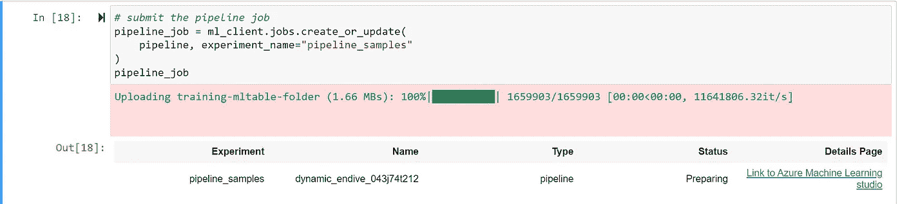
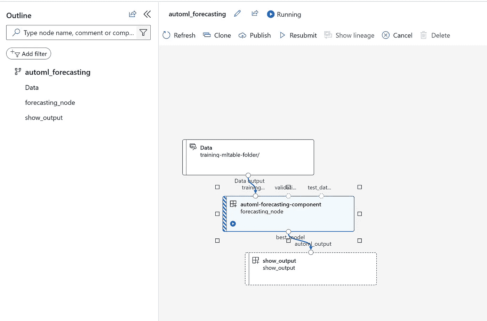
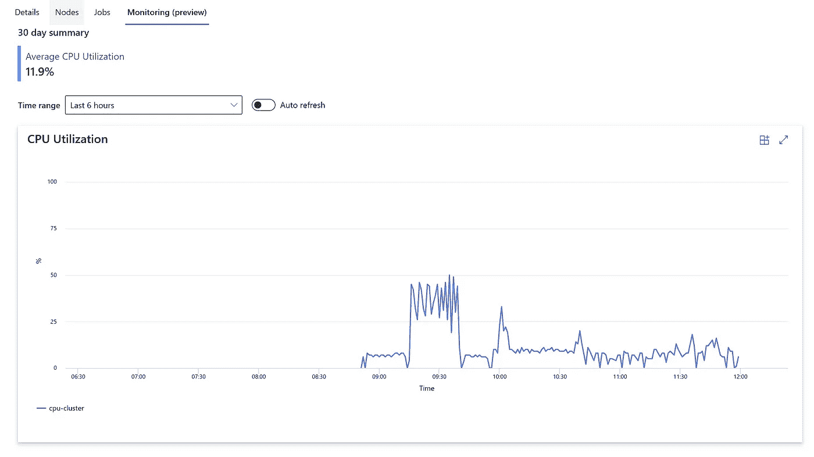
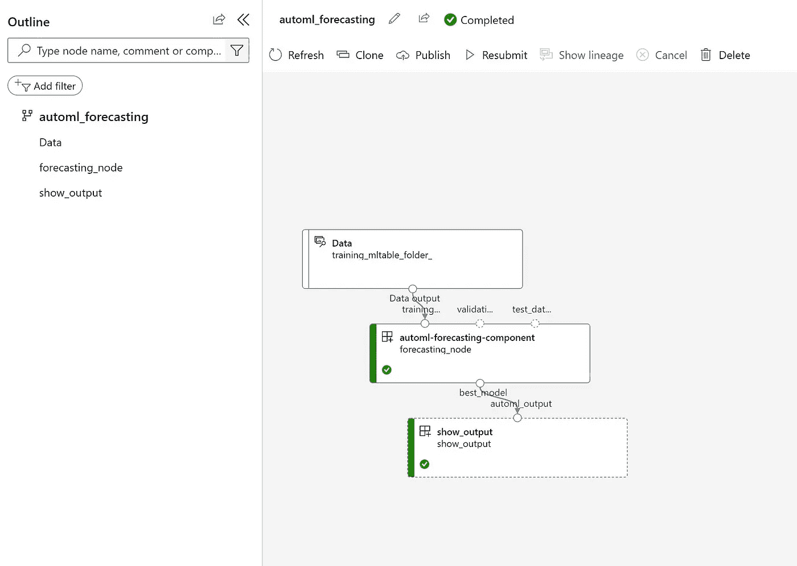

# 用于预测时间序列的 Azure ML SDK V2 示例

> 原文：<https://medium.com/mlearning-ai/azure-ml-sdk-v2-sample-for-forecasting-a-time-series-610508b14f5e?source=collection_archive---------2----------------------->

# Azure ML SDK V2 简介

# 先决条件

*   Azure 帐户
*   Azure 机器学习资源
*   默认 AML 存储
*   创建培训、测试和验证文件夹
*   以上文件夹的 ml 表配置
*   安装预览功能
*   请记住，预览的打印版本只能使用 _version。版本

```
import azure.ai.ml
print(azure.ai.ml._version.VERSION)
```

# 密码

# 连接现有工作空间的代码

```
# import required libraries
from azure.ai.ml import MLClient
from azure.ai.ml.entities import Workspace
from azure.identity import DefaultAzureCredential
```

*   现在指定工作区名称和订阅 id

```
# Enter details of your AML workspace
subscription_id = "xxxxxxxxxxxxxxxxxxxxxxxxx"
resource_group = "rgname"
workspace = "workspacename"
```

*   现在给工作区打电话

```
# get a handle to the workspace
ml_client = MLClient(
    DefaultAzureCredential(), subscription_id, resource_group, workspace
)
```

# 现在让我们创建一个训练实验

*   导入必要的库

```
# Import required libraries
from azure.ai.ml import MLClient
```

*   获取默认身份验证

```
from azure.identity import DefaultAzureCredential, InteractiveBrowserCredentialtry:
    credential = DefaultAzureCredential()
    # Check if given credential can get token successfully.
    credential.get_token("https://management.azure.com/.default")
except Exception as ex:
    # Fall back to InteractiveBrowserCredential in case DefaultAzureCredential not work
    # This will open a browser page for
    credential = InteractiveBrowserCredential()
```

*   现在加载工作区

```
try:
    ml_client = MLClient.from_config(credential=credential)
except Exception as ex:
    # NOTE: Update following workspace information if not correctly configure before
    client_config = {
        "subscription_id": "xxxxxxxxxxxxxxxxxxxxxxxxxxx",
        "resource_group": "rgname",
        "workspace_name": "workspacename",
    } if client_config["subscription_id"].startswith("<"):
        print(
            "please update your <SUBSCRIPTION_ID> <RESOURCE_GROUP> <AML_WORKSPACE_NAME> in notebook cell"
        )
        raise ex
    else:  # write and reload from config file
        import json, os config_path = "../.azureml/config.json"
        os.makedirs(os.path.dirname(config_path), exist_ok=True)
        with open(config_path, "w") as fo:
            fo.write(json.dumps(client_config))
        ml_client = MLClient.from_config(credential=credential, path=config_path)
print(ml_client)
```

*   现在创建计算目标

```
from azure.ai.ml.entities import AmlCompute# specify aml compute name.
cpu_compute_target = "cpu-cluster"try:
    ml_client.compute.get(cpu_compute_target)
except Exception:
    print("Creating a new cpu compute target...")
    compute = AmlCompute(
        name=cpu_compute_target, size="STANDARD_D2_V2", min_instances=0, max_instances=4
    )
    ml_client.compute.begin_create_or_update(compute)
```

*   让我们包括其他库

```
# import required libraries
from azure.identity import DefaultAzureCredential, InteractiveBrowserCredentialfrom azure.ai.ml import MLClient, Input, command, Output
from azure.ai.ml.dsl import pipeline
from azure.ai.ml.automl import forecasting
from azure.ai.ml.entities._job.automl.tabular.forecasting_settings import ForecastingSettings# add environment variable to enable private preview feature
import os
os.environ["AZURE_ML_CLI_PRIVATE_FEATURES_ENABLED"] = "true"try:
    credential = DefaultAzureCredential()
    # Check if given credential can get token successfully.
    credential.get_token("https://management.azure.com/.default")
except Exception as ex:
    # Fall back to InteractiveBrowserCredential in case DefaultAzureCredential not work
    credential = InteractiveBrowserCredential()
```

*   获取集群名称

```
# Get a handle to workspace
ml_client = MLClient.from_config(credential=credential)# Retrieve an already attached Azure Machine Learning Compute.
cluster_name = "cpu-cluster"
print(ml_client.compute.get(cluster_name))
```

*   现在设置管道

```
# Define pipeline
@pipeline(
    description="AutoML Forecasting Pipeline",
    )
def automl_forecasting(
    forecasting_train_data,
):
    # define forecasting settings
    forecasting_settings = ForecastingSettings(time_column_name="timeStamp", forecast_horizon=12, frequency="H", target_lags=[ 12 ], target_rolling_window_size=4)

    # define the automl forecasting task with automl function
    forecasting_node = forecasting(
        training_data=forecasting_train_data,
        target_column_name="demand",
        primary_metric="normalized_root_mean_squared_error",
        n_cross_validations=2,
        forecasting_settings=forecasting_settings,
        # currently need to specify outputs "mlflow_model" explictly to reference it in following nodes 
        outputs={"best_model": Output(type="mlflow_model")},
    )

    forecasting_node.set_limits(timeout_minutes=180) command_func = command(
        inputs=dict(
            automl_output=Input(type="mlflow_model")
        ),
        command="ls ${{inputs.automl_output}}",
        environment="AzureML-sklearn-0.24-ubuntu18.04-py37-cpu:1"
    )
    show_output = command_func(automl_output=forecasting_node.outputs.best_model) data_folder = "./data"
pipeline = automl_forecasting(
    forecasting_train_data=Input(path=f"{data_folder}/training-mltable-folder/", type="mltable"),
)# set pipeline level compute
pipeline.settings.default_compute="cpu-cluster"
```

*   现在运行管道

```
# submit the pipeline job
pipeline_job = ml_client.jobs.create_or_update(
    pipeline, experiment_name="pipeline_samples"
)
pipeline_job
```



*   现在获取 URL 来观察管道作业的执行

```
# Wait until the job completes
ml_client.jobs.stream(pipeline_job.name)
```



*   等待它完成
*   监控作业状态



*   最终管道输出



## *最初发表于*[*【https://github.com】*](https://github.com/balakreshnan/Samples2022/blob/main/AzureMLV2/forecastv2.md)*。*

[](/mlearning-ai/mlearning-ai-submission-suggestions-b51e2b130bfb) [## Mlearning.ai 提交建议

### 如何成为 Mlearning.ai 上的作家

medium.com](/mlearning-ai/mlearning-ai-submission-suggestions-b51e2b130bfb)