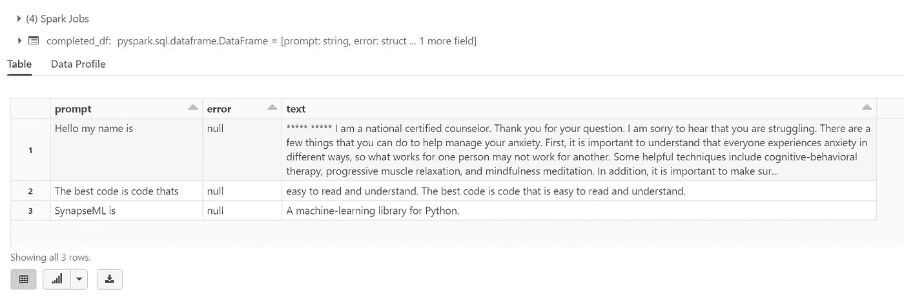
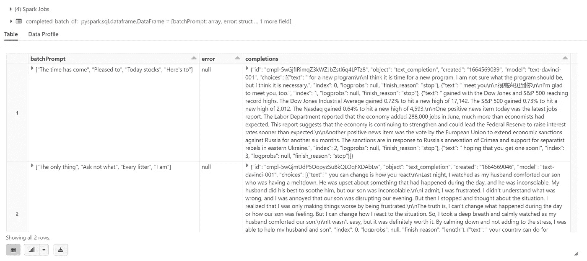
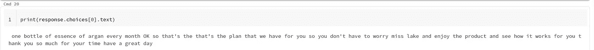

# 带有 Azure 数据块的 Azure 开放人工智能完成 API

> 原文：<https://medium.com/mlearning-ai/azure-open-ai-completions-api-with-azure-databricks-b94d71c063c9?source=collection_archive---------4----------------------->

# 使用 data bricks process open ai Completions API 处理大规模文档

# 先决条件

*   Azure 帐户
*   Azure 存储帐户
*   Azure 数据块
*   创建计算
*   从[https://Microsoft . github . io/SynapseML/docs/getting _ started/installation/# data bricks](https://microsoft.github.io/SynapseML/docs/getting_started/installation/#databricks)安装库
*   库位置—[https://mmls park . blob . core . windows . net/dbcs/synapsemlexamplesv 0 . 10 . 1 . DBC](https://mmlspark.blob.core.windows.net/dbcs/SynapseMLExamplesv0.10.1.dbc)

# 密码

```
import os
from pyspark.sql import SparkSession
from synapse.ml.core.platform import running_on_synapse, find_secret# Bootstrap Spark Session
spark = SparkSession.builder.getOrCreate()
if running_on_synapse():
    from notebookutils.visualization import display# Fill in the following lines with your service information
service_name = "openaiservicenamecreated"
deployment_name = "synapseml-openai"
key = "xxxxxxxxxxxxxxxxxxxxxx"
```

*   创建一个示例数据框架

```
df = spark.createDataFrame(
    [
        ("Hello my name is",),
        ("The best code is code thats",),
        ("SynapseML is ",),
    ]
).toDF("prompt")
```

*   开放人工智能完成

```
from synapse.ml.cognitive import OpenAICompletioncompletion = (
    OpenAICompletion()
    .setSubscriptionKey(key)
    .setDeploymentName(deployment_name)
    .setUrl("https://{}.openai.azure.com/".format(service_name))
    .setMaxTokens(200)
    .setPromptCol("prompt")
    .setErrorCol("error")
    .setOutputCol("completions")
)
```

*   运行数据框架

```
from pyspark.sql.functions import colcompleted_df = completion.transform(df).cache()
display(
    completed_df.select(
        col("prompt"),
        col("error"),
        col("completions.choices.text").getItem(0).alias("text"),
    )
)
```



*   现在批量处理

```
batch_df = spark.createDataFrame(
    [
        (["The time has come", "Pleased to", "Today stocks", "Here's to"],),
        (["The only thing", "Ask not what", "Every litter", "I am"],),
    ]
).toDF("batchPrompt")batch_completion = (
    OpenAICompletion()
    .setSubscriptionKey(key)
    .setDeploymentName(deployment_name)
    .setUrl("https://{}.openai.azure.com/".format(service_name))
    .setMaxTokens(200)
    .setBatchPromptCol("batchPrompt")
    .setErrorCol("error")
    .setOutputCol("completions")
)completed_batch_df = batch_completion.transform(batch_df).cache()
display(completed_batch_df)
```



*   安装 python openai

```
!pip install openai
```

*   创建开放的 ai api rest

```
import os
import openai
openai.api_type = "azure"
openai.api_base = "https://bbopenai.openai.azure.com/"
openai.api_version = "2022-06-01-preview"
openai.api_key = "xxxxxxxx"response = openai.Completion.create(
  engine="synapseml-openai",
  prompt="you have reached the essence of hargon this is donna i'll be assisting you with your inquiries today please be informed that this call is being recorded and monitored for quality assurance purposes how may i help you well i bought i i got this from essence of oregon oil umm for shipping handling and handling costs of five ninety nine sample of it and if i want to cancel the order i had to do it within fifteen days and so that is what i want wanted to do i didn't want to i didn't want to get you know like a monthly for what is it eighty three dollars a month OK i can't afford that OK i'm more than happy for me i'm happy to assist you for me to be able to pull up your subscription here could you kindly provide me your first and your last name from caroline C A R O L Y N lake L A K E O L Y and then yes lake yes OK let's just go ahead and pull up here subscription here or your account OK and could you gonna verify your email address please it's lake three nine two one at hotmail dot com how about your shipping address three ten warren avenue number two gillette wyoming eight two seven one six and is your shipping address same as your billing address correct how about your phone number three oh seven six eight oh two oh six eight OK thank you very much for that information miss lake if you don't mind me asking may i know the reason why you want to cancel the subscription well i just i thought i was just getting a a sample order of it you know i was curious have you seen how it worked and everything yes i mean have you already used not all of it but not all of it but i have that i have been using it yes OK i do understand that miss lake this is what i can do for you for you to be able you know to maximize or enjoy the benefits of the organ outgoing to extend your pre trial for another fifteen days with no charge so at least you do have fifteen days to enjoy you know the amazing product and then give us a call back before the end of that fifteen day additional extension period to give us the feedback because what i heard from you is that you haven't used the product that much so you're not you know here did not yet get what the benefits of it so that's the reason why i'm extending your uh period are your pre trial for you to be able to enjoy and discover the benefits of essence of argan OK OK umm what date would that be OK let me check here so you're already extended your pre tier it will end on august twenty fourth so you need to give us a call back before august twenty fourth to give us a feedback if you i mean what happened to the product if it didn't something it gives you the benefits that you need but let's say you love the product like the product you don't need to give us a call back then OK it will be automatically uh you will be receiving another;dr",
  temperature=0.7,
  max_tokens=60,
  top_p=1,
  frequency_penalty=0,
  presence_penalty=0,
  stop=None
)
```

*   显示响应

```
print(response.choices[0].text)
```



# 【https://github.com】最初发表于[](https://github.com/balakreshnan/Samples2022/blob/main/AzureAI/openaiadb.md)**。**

*[](/mlearning-ai/mlearning-ai-submission-suggestions-b51e2b130bfb) [## Mlearning.ai 提交建议

### 如何成为 Mlearning.ai 上的作家

medium.com](/mlearning-ai/mlearning-ai-submission-suggestions-b51e2b130bfb)*