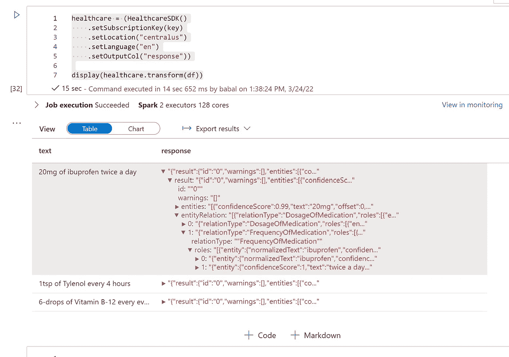

# Azure Synapse Analytics 使用 Synapse ML 批量处理医疗保健文本分析

> 原文：<https://medium.com/mlearning-ai/azure-synapse-analytics-using-synapse-ml-batch-processing-health-care-text-analytics-2f2444e4d586?source=collection_archive---------4----------------------->

# 使用 SynapseML 的 Azure Healthcare 文本分析 api

# 先决条件

*   document—[https://Microsoft . github . io/SynapseML/docs/next/features/cognitive _ services/cognitive services % 20-% 20 overview/# text-analytics-for-health-sample](https://microsoft.github.io/SynapseML/docs/next/features/cognitive_services/CognitiveServices%20-%20Overview/#text-analytics-for-health-sample)
*   创建 Azure 认知服务帐户
*   创建 Azure 存储帐户
*   创建 Azure synapse 分析工作区
*   创建 spark 计算集群
*   使用 pyspark

# 步伐

*   安装 synapseml

```
%%configure -f
{
"name": "synapseml",
"conf": {
"spark.jars.packages": "com.microsoft.azure:synapseml_2.12:0.9.5-13-d1b51517-SNAPSHOT",
"spark.jars.repositories": "https://mmlspark.azureedge.net/maven",
"spark.jars.excludes": "org.scala-lang:scala-reflect,org.apache.spark:spark-tags_2.12,org.scalactic:scalactic_2.12,org.scalatest:scalatest_2.12",
"spark.yarn.user.classpath.first": "true"
}
}
```

*   导入认知服务

```
from synapse.ml.cognitive import *
```

*   现在带来认知服务的 keyvault 秘密和 sql 密码

```
key = TokenLibrary.getSecret("vaultname", "secretname", "valutlinked")
password = TokenLibrary.getSecret("vaultname", "secretname", "valutlinked")
```

*   配置 JDBC

```
jdbcHostname = "sqlserver.database.windows.net"
jdbcDatabase = "dbname"
jdbcPort = 1433
jdbcUrl = "jdbc:sqlserver://{0}:{1};database={2}".format(jdbcHostname, jdbcPort, jdbcDatabase)
connectionProperties = {
"user" : "sqladmin",
"password" : password,
"driver" : "com.microsoft.sqlserver.jdbc.SQLServerDriver"
}
```

*   读取 azure sql 数据

```
Spdf = spark.read.jdbc(url=jdbcUrl, table="dbo.precribdata", properties=connectionProperties).limit(100)
display(Spdf)
```

*   现在连接到医疗保健 api

```
healthcare = (HealthcareSDK()
    .setSubscriptionKey(key)
    .setLocation("centralus")
    .setLanguage("en")
    .setOutputCol("response"))display(healthcare.transform(df))
```



*最初发表于*[T5【https://github.com】](https://github.com/balakreshnan/Samples2022/blob/main/SynapseIntegrate/synapsemlhealth.md)*。*

[](/mlearning-ai/mlearning-ai-submission-suggestions-b51e2b130bfb) [## Mlearning.ai 提交建议

### 如何成为 Mlearning.ai 上的作家

medium.com](/mlearning-ai/mlearning-ai-submission-suggestions-b51e2b130bfb)