# 反向传播和神经网络

> 原文：<https://medium.com/mlearning-ai/backpropagation-neural-nets-e4d5f65608fa?source=collection_archive---------2----------------------->

## 视觉方法

# 动机

有时候，对某个概念形成直觉的最好方式是把它从它的*黑箱*中拿出来。反向传播是机器学习中的一个核心概念，但它很少出现在所有库和标准化函数之后。让我们看看引擎盖下，解开神经网络的代数和微积分之谜。

# 神经元

Diagram of a neuron and the 2 objects that define it — weights (**w**) and bias term (b)

简单来说，一个神经元接收一组输入，对这些输入执行某种计算:输入的一个*线性组合*，一个加权和，包装成一个激活函数。

> **激活功能**
> 
> 虽然这不是本文的重点，但激活函数只是一个转换，它将神经元累积部分的结果的不定范围(- **∞** ， **∞** )转换为具有特定形状的期望域，例如(0，1)或(-1，1)。

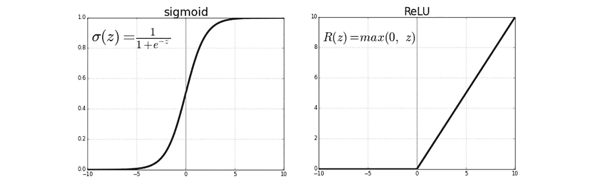

Sigmoid and ReLU activation functions. Sigmoid squashes the range (-**∞**,**∞**) to (0,1) while ReLU cancels negative outputs.

## 神经元中的计算

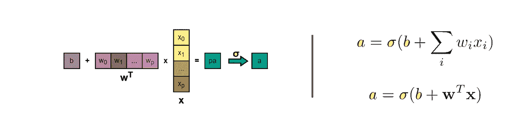

The computations in a neuron.

神经元的输出( *a* )被计算为应用于预激活( *pa* )的激活函数——加权( ***w*** )输入( ***x*** )和自由项，即偏差( *b* )的总和。激活函数与架构一起选择，因此只有权重( ***w*** )和偏置( *b* )项可以被*微调*以改变神经元的行为。一点一点地调整这些变量就构成了网络的训练。

接下来是神经元的完整图表(明确显示了偏置和激活)。在本文的其余部分，为简单起见，神经元将仅用它的激活来表示。

# 该层

我们现在考虑一层多个神经元。输入由相同的 *p* 神经元给出，但是现在它们中的每一个都连接到下一层中的 *q* 神经元中的每一个(密集*连接)。*

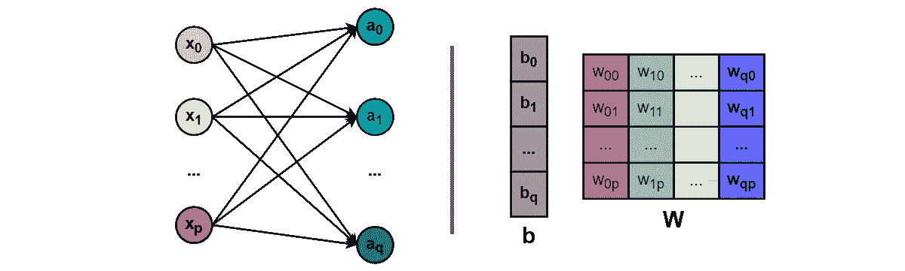

Diagram of a layer and the 2 objects that define it — weights (**W**) and biases (**b**)

自然地，所有的 *b* 、 *w* 和 *a* 都获得了一个额外的维度(我们用粗体表示数组，用大写字母表示矩阵)。权重现在形成一个矩阵，包含所有的成对组合。

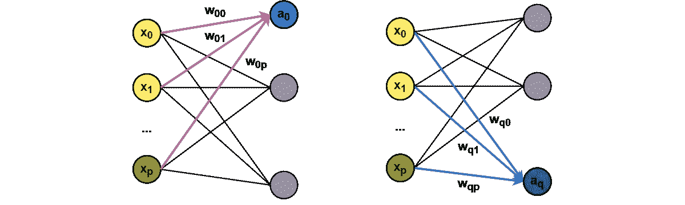

## 层中的计算

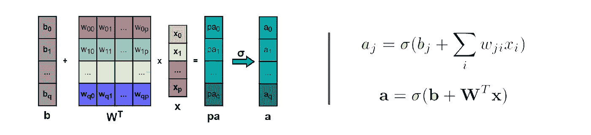

The computations in a layer.

层的输出( ***a*** )是一个维度为 *q* (层中神经元的数量)的数组。权重矩阵( ***W*** )有 *p* 行(输入数)和 *q* 列。

# 网络

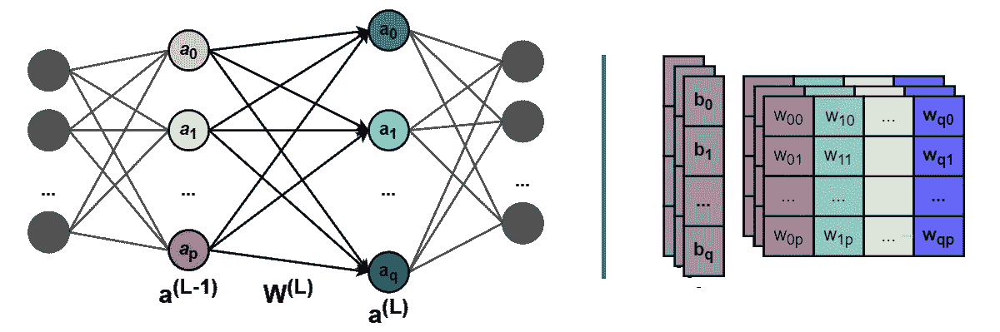

Diagram of a part of a network defined by a collection of matrixes — weights (**W**) and biases (**b**)

进一步展开讨论，网络只是多个层的集合，其输入是前一层的输出(因此，我们不再使用 ***x*** 来表示)。此外， *(L)* 表示层的索引*。*

## 输入/输出

Inputs & Outputs of a neural network.

将神经网络包装回它的黑盒中，我们可以参考它的输入和输出。因此，*推理*是针对输入 ***x*** 获得相应输出***【y ****的过程，而*训练*是逐渐调整网络内部参数(权重和偏差)的过程，使得输出*尽可能接近地匹配已知的基本事实 ***y.****

> *基本事实是我们所知道的网络的期望输出。它可以是一个数字(例如预测价格)或形成概率分布的多个数字(例如分类任务——每个值将是对象属于某一类的可能性)或者甚至是二维矩阵、图像。输出可以是任何东西，只要我们有办法知道它离期望的结果有多远。这项措施将是我们的损失，我们将训练我们的网络，以尽量减少它。*

# *反向传播*

*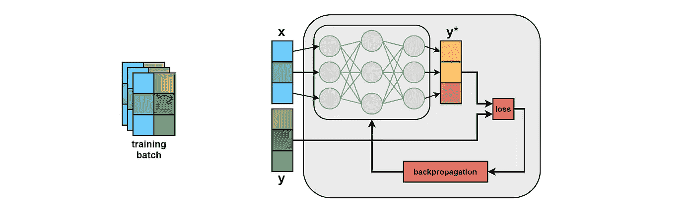*

*在大多数情况下，训练数据集成对出现( ***x，y*** )。*损失—* 预测值*与实际值***y****—**之差是我们想要优化的指标，即我们希望它最小。为了使它变得最小，我们计算对权重和偏差的必要调整。这是导数告诉我们的:*这里的一点点推动会对那里的结果产生多大的影响？我们想知道在所有权重和偏差的值中所有微小的推动的效果。****

# **偏导数**

**导数测量变化率。*速度是位置的变化率，加速度是速度的变化率*。当函数有多个决定其值的参数时，偏导数就起作用了。在这种情况下，我们想知道在所有其他参数保持不变的情况下，一个参数的变化会在多大程度上改变函数的结果。**

****

**Visualizing nudges in the values of the parameters (**x1, x2**) of a function. The 2 directions are perpendicular, symbolizing that one parameter does not affect the other. We imagine the slope in the **x1** direction to be steeper, thus a nudge in that direction produces a greater effect than a nudge in the **x2** direction.**

## **最优化中的偏导数**

**任何优化任务的最终目标都是找到极值点:最大值或最小值。这很少是无关紧要的，因为函数值在整个定义域中都是未知的，只在我们选择评估的点上是未知的。因此，优化策略(如梯度下降)用于在最优方向上迭代选择点。**

**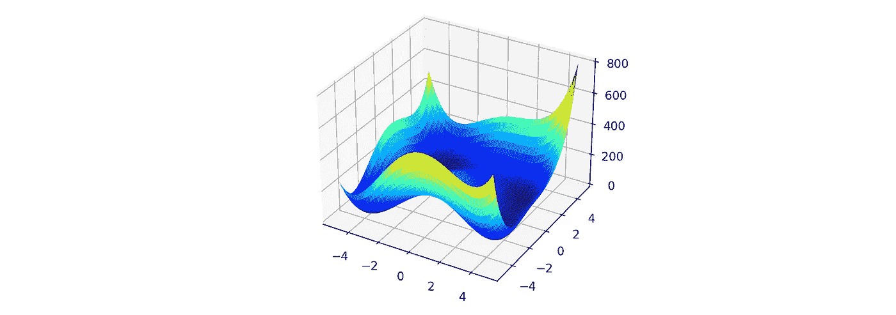**

**Surface Plot of [Himmelblau’s function](https://en.wikipedia.org/wiki/Himmelblau%27s_function)**

**导数是一个数学指南针:正的导数表示函数值在那个方向增加，负的导数表示值在减少。因此，寻找最小值需要遵循负导数的方向。**

# **概述:**

*   **权重和偏差是决定网络输出的可调参数**
*   **我们将结果输出与来自训练数据集的期望的基本事实进行比较**
*   **损失是当前值和目标值之间的差值，我们希望它最小**
*   **我们借助偏导数来计算权重和偏差的微小调整如何影响损失的价值**
*   **我们应用那些最小化损失的微小调整，逐渐使我们的神经网络适应数据**

# **计算变化**

**我们知道问题的核心:反向传播中执行的实际计算。**

## **向前传球的逻辑顺序**

**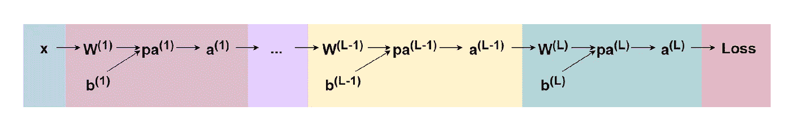**

**正向传递意味着输入 ***x*** 沿着整个网络传递。我们认为最后一次激活**T5**是网络的输出。因此，我们考虑一个基本的损失函数:**

****

**A basic loss function. **y*** is the output of the net, equal to the activation **a** of the last layer **(L)**. **y** is the ground-truth label.**

## **链式法则**

**我们想知道损耗相对于最后一层激活是如何变化的:**

****

**How the loss changes with regards to the activation **a** of the last layer **(L)**.**

**这很简单(因为 ***y*** 被认为是常数)，但是我们仍然没有太多的信息。我们需要更深入一点。回想一下，对于层 ***(L)*** 我们有:**

****

**Activation **a** of a layer **(L)** as a function of the activation of the previous layer **(L-1)**. **pa** stands for pre-activation. Weights matrix **W** is transposed but for simplicity, we will ignore this as it doesn’t affect the derivatives.**

**因此，应用*链式法则*得到损耗相对于最后一层的预激活 ***pa*** 的变化，我们得到:**

****

**How the loss changes with regards to the pre-activation **pa** of the last layer **(L)**.**

> **这就是为什么我们需要选择容易区分的激活函数，用于层的激活相对于其预激活的偏导数。**

**但是我们知道预激活实际上是由权重和偏差决定的，所以我们扩展了链式法则:**

**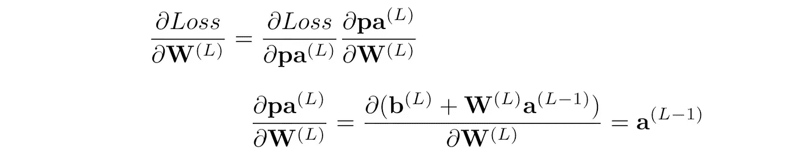**

**How the loss changes with regards to the weights **W** of the last layer **(L)**. The transpose operation of the weights has been ignored for simplicity, as it doesn’t affect the derivatives.**

**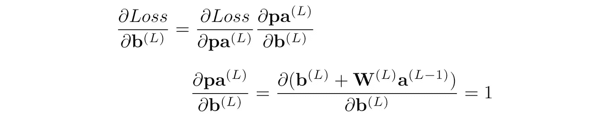**

**How the loss changes with regards to the weights **b** of the last layer **(L)**. The transpose operation of the weights has been ignored for simplicity, as it doesn’t affect the derivatives.**

## **进一步反向传播**

**现在，我们要做的就是对每一层都应用相同的原则，从上一层开始往回走:**

****

**How the loss changes with regards to the activation **a** of the layer **(L-1)****

**计算损耗相对于所有其他层的权重和偏差如何变化也是类似的。**

# **更新权重和偏差**

**知道了权重和偏差如何影响损失值，现在优化器的工作就是决定参数更新的实际值。**

> **一个基本的优化器，梯度下降，更新当前值与当前梯度成比例。它的目标是通过以下递减值找到最小值，并以与当前斜率成比例的步长前进:越陡，步长越大。但是优化器的工作并不是无足轻重的——有时，要到达山的底部，仍然需要向上爬一点。**

****

**Visualization of a Gradient Descent algorithm for a function with 2 parameters.**

**从本质上说，偏导数就像是我们用来定位自己的*罗盘*，而优化器就像是 T2 的方向盘(和油门踏板)，推动我们前进，希望能达到最优。但是这仍然是另一篇文章的主题。**

# **结论**

**我希望这能给神经网络背后的计算带来一些启发和直觉。我鼓励任何人分享他或她正在研究的概念的类似的个人解释。没有“完美”的解释，但我相信最重要的是让好奇心运转起来。**

# **来源**

** [## 神经网络和深度学习

### 在上一章中，我们看到了神经网络如何使用梯度下降算法学习它们的权重和偏差…

neuralnetworksanddeeplearning.com](http://neuralnetworksanddeeplearning.com/chap2.html) 

[https://towards data science . com/part-2-gradient-descent-and-back propagation-BF 90932 c 066 a](https://towardsdatascience.com/part-2-gradient-descent-and-backpropagation-bf90932c066a)**