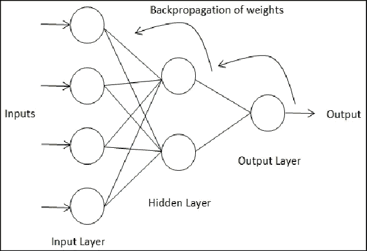
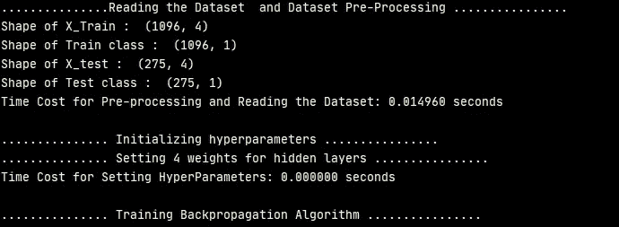
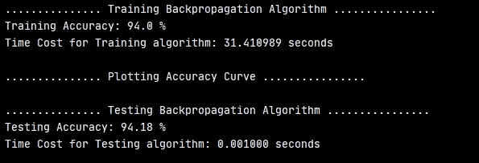
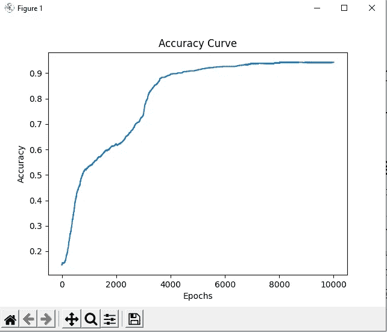
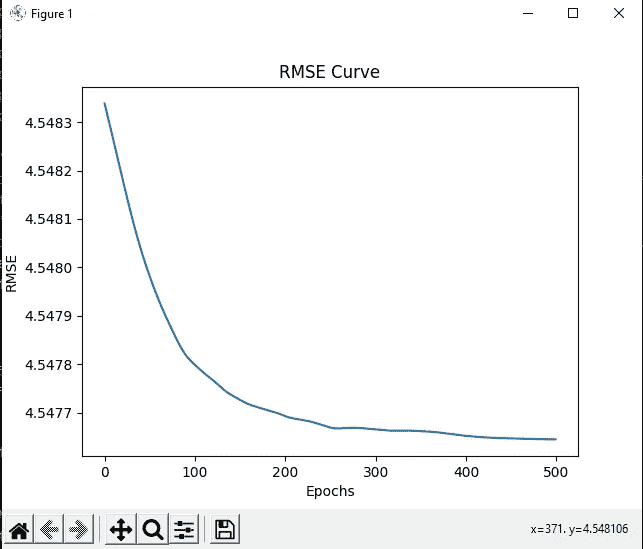

# 反向传播神经网络——用 python 从头开始分类和回归

> 原文：<https://medium.com/mlearning-ai/backpropagation-neural-networks-classification-and-regression-785868525fab?source=collection_archive---------0----------------------->

在 Github 上获取代码:

1.  [https://github . com/durveshshah/Machine-Learning/blob/main/back propagation _ classification . py](https://github.com/durveshshah/Machine-Learning/blob/main/backpropagation_classification.py)
2.  [https://github . com/durveshshah/Machine-Learning/blob/main/back propagation _ regression . py](https://github.com/durveshshah/Machine-Learning/blob/main/backpropagation_regression.py)

在 Github 上关注我:【https://github.com/durveshshah 

# 设计反向传播神经网络

反向传播只是更新权重。简单地说，当我们反向传播时，我们基本上是在求激活函数的导数。当我向你展示一个模型时，你会进步的。
在规划任何神经网络时，隐含层和神经元都不是以任何方式固定的。为了规划一个理想的模型，我们希望进行大量的试验和错误，以使我们的模型远离过度拟合和欠拟合。有些想法是构建反向传播模型的基础。

1.  输入(功能)
2.  激活功能
3.  隐藏层和神经元的数量
4.  输出
5.  激活函数的求导

## 激活功能

通常 Sigmoid 在分类场景中用作激活函数。但是，这也取决于我们对隐藏层的选择和神经元的数量。如果我们的模型很适合两到三个隐藏层，那么 sigmoid 将是最佳选择，因为 sigmoid 的范围在 0 和 1 之间。如果我们的模型有更多的隐藏层和神经元，那么我会建议使用其他激活函数，如双曲正切函数，范围从-1 到 1。

我们需要注意激活函数，因为错误的激活函数会导致我们的模型不正确的准确性，从而导致不正确的预测。

Backpropagation of neural network. Source: [1]

## 反向传播神经网络的工作

**步骤:-**

1.  正如我们在上图中看到的，输入只是要素。换句话说，我们可以说这是数据集的列。
2.  这些特征作为输入通过具有激活功能的隐藏层传递。这个激活函数训练模型，并传递到输出层。
3.  然后，输出层获取激活函数的导数，并反向传播到输入。
4.  然后，它将训练好的权重除以实际输出大小。
5.  最后，它通过减去先前的权重来更新权重。例如，层 4 =层 4 -eta * alpha * weights4
6.  重复上述步骤，直到模型训练成功。

# 用例—分类:

我将预测钞票的真实性，不管钞票是真的还是假的。

UCI 数据集:[https://archive . ics . UCI . edu/ml/datasets/钞票+认证](https://archive.ics.uci.edu/ml/datasets/banknote+authentication)

一个分类问题需要被归入两个或多个类别之一[2]。

**数据集中的要素数量:**

1.  图像的变化
2.  图像的倾斜
3.  图像的峰度
4.  图像的熵

**输出:**

5.班级

Accuracy Graph

# 用例—回归:

UCI 数据集链接:[https://archive . ics . UCI . edu/ml/datasets/combined+cycle+power+plant](https://archive.ics.uci.edu/ml/datasets/combined+cycle+power+plant)

该数据集包含来自联合循环电厂的 9568 行，该电厂的项目跨度为 6 年(2006 年至 2011 年)。该数据集将根据要素数量预测电能输出。

回归问题是对一个量的预测。在这种情况下，会消耗多少电能输出[2]。

**数据集中的要素数量:**

1.  温度(摄氏度)
2.  环境压力
3.  相对湿度
4.  排气真空(V)。

**输出:**

5.每小时净电能输出(PE)

哇哦。最后，我们用不同的分类和回归数据集完成了我们的模型。

# 参考

[1]管理员。"神经网络如何在反向传播过程中更新权重和偏差？" *I2tutorials* ，2019 年 10 月 18 日，[www . I2 tutorials . com/how-do-neural-networks-update-weights-and-bias-during-back-propagation。](http://www.i2tutorials.com/how-do-neural-networks-update-weights-and-biases-during-back-propagation.)

[2]杰森·布朗利。"机器学习中分类和回归的区别."*机器学习掌握*，2019 年 5 月 22 日，machinelingmastery . com/class ification-vs-regression-in-Machine-Learning/#:% 7E:text = class ification % 20 is % 20 the % 20 task % 20 of，of % 20 predicting % 20a % 20 continuous % 20 quantity。

 [## Mlearning.ai 提交建议

### 如何成为 Mlearning.ai 上的作家

medium.com](/mlearning-ai/mlearning-ai-submission-suggestions-b51e2b130bfb) 

[成为 ML 写手](/mlearning-ai/mlearning-ai-submission-suggestions-b51e2b130bfb)