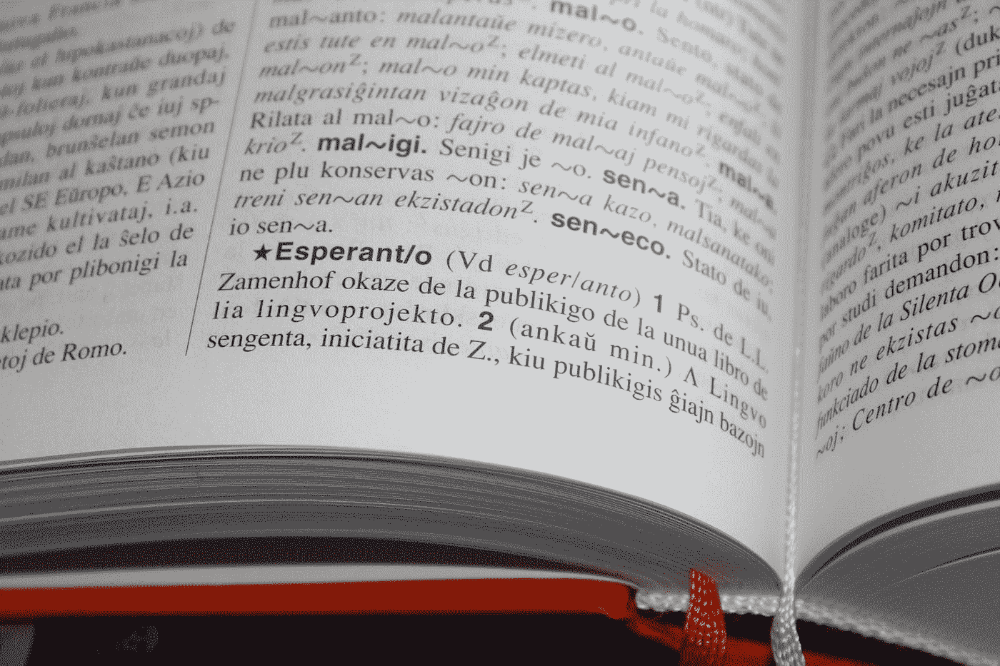
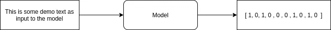

# 自然语言处理中的词袋模型

> 原文：<https://medium.com/mlearning-ai/bag-of-words-models-in-nlp-565e631dbd7f?source=collection_archive---------2----------------------->

在这个由两部分组成的系列文章中，我们将看到如何在自然语言处理中开发一个简单的单词袋模型。



Photo by [Stefan](https://unsplash.com/@stergro?utm_source=medium&utm_medium=referral) on [Unsplash](https://unsplash.com?utm_source=medium&utm_medium=referral)

我们将首先了解什么是单词袋模型，我们如何使用 Scikit-Learn 和 keras 开发一个简单的模型。

# 什么是单词袋模型？

广义地说，词袋模型是机器学习算法可用的文本表示。众所周知，大多数机器学习算法不能直接处理非数字数据，这就是为什么我们使用各种编码方法，如 One-Hot-Encoding，将这些文本数据转换为数字矩阵，供算法使用。

词袋(BoW)旨在从文本中提取特征，这些特征可以进一步用于建模。

让我们看看这是如何工作的



How a bag-of-words model works.

将输入数据转换为数字特征值向量的过程称为特征提取。单词袋也是一种文本数据的特征提取技术。

需要注意的一点是，BoW 模型并不关心单词在句子中的内部顺序，因此得名。这方面的一个例子是，

```
sent1 = "Hello, how are you?"
sent2 = "How are you?, Hello"
```

【sent1 和 sent2 的输出向量将是相同的向量。

**弓**由两样东西组成:

```
1\. A vocabulary of known words - We need to create a list of all of the known words that the model will consider while the process of feature extraction. This can be thought of the process when we try to understand a sentence by understanding the referring to the words in a dictionary.2\. A count of the known words which are present - This keeps a count of the words in the input sentence, which are also present in the vocabulary created above.
```

让我们看看如何创建一个简单的单词包。

1.  首先，让我们创建一个已知单词的词汇表:

```
We shall use the famous poem, **No man is an island by John Donne.**Below is the snippet of the first four lines from the poem1\. No man is an island, (5 words)
2\. Entire of itself, (3 words)
3\. Every man is a piece of the continent, (8 words)
4\. A part of the main. (5 words)We shall consider each line to be a separate document. 
As it can be seen, we have 4 documents in our example according to the assumption we made above. Now we shall create a vocabulary of all the known words from these documents.The vocabluary is (ignoring the punctuation and case):no, man, is, an, island, entire, of, itself, every, a, piece, the, continent, part, mainWe can see that our vocabulary contains 15 words. We can see that this vocabulary is created from a collection of 21 words. 
```

2.创建词汇表后，我们将为不同的文档创建向量。这个过程被称为单词评分。

最简单的方法是二分计分法。

```
As we know that our vocabulary consists of 15 words, so we can create vectors of length 15, and mark 1 for the words present, and 0 for the words absent in a particular document.So for Document #1, the scoring would look like this:No: 1, man: 1, is: 1, an: 1, island: 1, entire: 0, of: 0, itself: 0, every: 0, a: 0, piece: 0, the: 0, continent: 0, part: 0, main: 0Converting this to a vector, it would look like this
[1,1,1,1,1,0,0,0,0,0,0,0,0,0,0]
```

给单词打分有不同的方式，比如我们上面看到的二进制打分。你可以在这里阅读不同的得分方式。

在这篇博客中，我们看到了什么是单词袋模型，以及我们如何创建一个基本模型。

在下一部分，我们将使用 **scikit-learn** 和 **keras** 创建弓模型。

**你可以在这里阅读系列** [**的下一部分。**](https://priyansh-kedia.medium.com/create-simple-bag-of-words-models-78b19578246)

**参考文献**:

[](https://machinelearningmastery.com/gentle-introduction-bag-words-model/) [## 单词袋模型的温和介绍-机器学习掌握

### 词袋模型是在用机器学习算法对文本建模时表示文本数据的一种方式。的…

machinelearningmastery.com](https://machinelearningmastery.com/gentle-introduction-bag-words-model/)