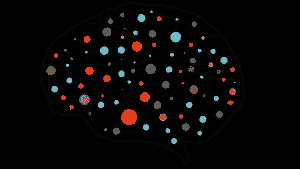

# 基线——每个模型都需要的东西

> 原文：<https://medium.com/mlearning-ai/baseline-thing-that-every-model-requires-85a9af843215?source=collection_archive---------4----------------------->

## 基线模型|机器学习基线模型

# 什么是基线？

在运动员跑马拉松之前，他们要准备几个月。训练通常由几个阶段组成，但了解他们是否有任何改进的唯一方法是记录早期比赛的时间。没有训练，一个中等水平的人也许能跑得过一只乌龟，但即使经过训练，他们也极不可能跑得过一只狗。
这是因为我们能得到的改善有一个潜在的极限。

**基线是一种使用启发式、简单汇总统计、随机性或机器学习来为数据集创建预测的方法。您可以使用这些预测来衡量基线的性能(例如，准确性)，然后这个指标将成为您与任何其他机器学习算法进行比较的标准。**
[来源](https://datascience.stackexchange.com/questions/30912/what-does-baseline-mean-in-the-context-of-machine-learning#:~:text=A%20baseline%20is%20a%20method,other%20machine%20learning%20algorithm%20against.)

基线可以帮助我们确定所构建的模型是否交付了超出基线的改进。在实践、学术和理论中，基线应该是你做的第一个模型。

以下是一些基线:

1.  [MNIST 逻辑回归基线](https://www.kaggle.com/code/tunguz/mnist-logistic-regression-baseline)
2.  [基线方法——线性回归](https://www.kaggle.com/code/ramswaroopbhakar14/baseline-appraoch-linear-regression)
3.  [简单探索+基线— GA 客户收入](https://www.kaggle.com/code/sudalairajkumar/simple-exploration-baseline-ga-customer-revenue)

 [## Mlearning.ai 提交建议

### 如何成为 Mlearning.ai 上的作家

medium.com](/mlearning-ai/mlearning-ai-submission-suggestions-b51e2b130bfb)