# 机器学习的基本概念

> 原文：<https://medium.com/mlearning-ai/basic-concepts-in-machine-learning-a20de41137cc?source=collection_archive---------4----------------------->

这是我总结 Sergey Levine 教授从 CS182 开始的演讲的系列文章的第一篇，所有的荣誉都归于他。所有图片均取自他的讲座。这些是第二条[、](/mlearning-ai/convolutional-networks-recurrent-neural-networks-and-transfomers-ee6a63ddb57f)[第三条](/mlearning-ai/detailed-basics-of-deep-learning-part-three-b930c40cf7f8)和[第四条。](https://samuelebolotta.medium.com/7a88e847f62e)

[机器学习中的基本概念](https://www.youtube.com/watch?v=aUNnGCxvAg0&list=PL_iWQOsE6TfVmKkQHucjPAoRtIJYt8a5A&index=4)

机器学习算法试图模仿两个数据集之间的模式，以便它们可以使用一个数据集来预测另一个数据集。具体来说，有监督的机器学习对于将你知道的东西作为输入并快速将其转化为你想要知道的东西是有用的。另一方面，无监督学习也将一个数据集转换成另一个数据集，但它转换成的数据集是先前不知道或不理解的。与监督学习不同，没有你试图让模型复制的“正确答案”。你只需要告诉一个无监督的算法:“在这些数据中找到模式，并告诉我它们。”

## 参数化

参数化是关于学习的存储方式，通常，通过扩展，是学习的方法。参数模型的特征在于具有固定数量的参数，而非参数模型的参数数量是无限的(由数据确定；这有助于通常以某种方式计数的方法，从而根据数据中被计数的项数增加参数的数量)。恰好，深度学习是一类参数模型。

1 受监督的参数学习机是具有固定数量的旋钮(这是参数部分)的机器，其中通过旋转旋钮来进行学习。请注意，每个旋钮代表预测对不同类型输入数据的敏感度。那就是你“学”的时候在改变的东西。输入数据进来，根据旋钮的角度进行处理，并转换成预测。试错法的概念不是正式的定义，但它是参数模型的一个常见属性(有例外)。当有任意(但固定)数量的旋钮要转动时，需要某种程度的搜索来找到最佳配置。在监督学习中，需要了解一个重要的区别:要素是输入集中的一列数据。例如，如果您试图预测某人将选择的宠物类型，您的输入特征可能包括年龄、家庭地区、家庭收入等。另一方面，一个标签是最终的选择，如狗、鱼、鬣蜥、岩石等。一旦你训练了你的模型，你将会给它包含那些特征的新输入集合；它将返回那个人的预测“标签”(宠物类型)。

2 无监督参数学习使用旋钮对数据进行分组，当它发现新的东西要计数时，会添加新的旋钮。但是在这种情况下，每个组通常有几个旋钮，每个旋钮将输入数据的相似性映射到特定的组(有例外和细微差别—这是一个高级描述)。

**统计分类**

在统计分类中，两种主要方法被称为**生成**方法和**判别**方法。这些通过不同的方法计算分类器，在统计建模的程度上不同。术语不一致，但可以区分两种主要类型:

*   给定一个可观察变量 *X* 和一个目标变量 *Y* ，一个**生成模型**就是联合概率分布的统计模型。
*   **判别模型**是目标 *Y* 的条件概率模型，象征性地给出一个观察值 *x*

类似地，基于生成模型的分类器是**生成分类器**，而基于鉴别模型的分类器是**鉴别分类器**，尽管该术语也指不基于模型的分类器。

尽管这种形式上的生成性与区分性的定义被广泛使用并且非常有用，但当你考虑到它实际上是一个你甚至可以在其中平滑插值的**光谱**时，它有点像一个错误的二分法，并且许多流行的模型并不完全属于这种二分法。此外，它假设有监督的学习设置，对于分类无监督或半监督的方法不太有用。

一个更一般(但更非正式)的定义来补充它可能是:

*   判别模型学习类之间的边界
*   生成模型了解数据的分布

不管精确的定义如何，该术语是构成性的，因为生成模型可用于“生成”随机实例，而鉴别模型或鉴别分类器可用于“鉴别”目标变量 *Y* 的值，给定观测值 *x* 。

关于监督模型、非监督模型、生成模型和判别模型之间的关系，有几点值得一提:

1.  并非所有的生成模型都是使用无监督学习来学习的。许多生成模型——从像朴素贝叶斯这样的基本模型到像 GAN 或这种生成上卷积网络这样的复杂模型——都是以监督或半监督的方式学习的。
2.  不是每个无监督学习算法都是生成模型。无监督学习算法涵盖了**生成-鉴别光谱**，例如，k-最近邻(kNN)介于生成和鉴别(正式生成，非正式鉴别)之间。
3.  许多聚类算法是生成模型，例如潜在狄利克雷分配(LDA)。
4.  并非所有的判别模型都是使用监督学习来学习的。存在在无监督数据集上训练的判别模型，例如单目深度和光流模型。
5.  每个监督学习算法都是一个判别模型。有一些带有生成模型的监督学习算法的例子(例如，朴素贝叶斯)。

## 一些概率论

让我们更精确地定义监督学习。我们假设在训练过程中，我们得到了一个数据集:

Training set consisting of tuples; the **y’s** are the true labels corresponding to the **x’s.**

例如，如果我们想解决一个图像分类问题，我们会收集一些狗、猫和长颈鹿的图片，然后我们会让人类浏览这些图片中的每一张，并给它们贴上真正的标签。我们将把它作为训练数据来学习如何对新图片进行分类。因此，监督学习的目标是学习这个函数:

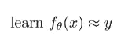

We want to learn theta (θ, the parameters) so that this function closely approximates the true label **y.**

然而，要实例化一个监督学习方法，我们必须回答几个问题。一个重要的出发点是**预测概率通常比预测离散标签更有意义。**

1.  如果我们被允许有概率，我们就能更好地表达我们认为真实发生的事情；我们也许能够捕捉到这样一个事实，即 4 很可能是 4，但它也很有可能是 9。这种不确定性可能对决策有用。
2.  如果我们被允许有概率，问题会变得更简单:直觉上我们不能改变一个离散的标签一点点，它是一种要么全部要么什么都没有。然而，找到最佳θ的问题变得更容易，因为我们可以稍微改变这些概率，看看它们是否朝着更接近我们想要的方向变化。

因此，给定一个训练集，而不是学习一个将 x 映射到 y 的函数，现在我们将学习一个将 x 映射到 y 上的分布的函数:

现在，我们将接受我们的输入，例如一只狗的图片，并输出其对应标签 y 的分布。

**复习条件概率**

随机变量被定义为一个函数，它为每个实验结果赋值。我们有:

*   输入 x
*   输出 y

我们可以把 x 和 y 的联合概率写成 p(x，y)。**联合概率**是一种统计方法，计算两个事件在同一时间点同时发生的可能性。换句话说，联合概率是事件 Y 与事件 X 同时发生的概率。

联合概率不应与条件概率相混淆，条件概率是指在另一个动作或事件发生的情况下，一个事件发生*的概率。*

事实上，联合概率 p(x，y)可以使用概率的链式法则来分解:

概率的**链规则**，不要与微积分的链规则混淆，允许仅使用条件概率计算一组随机变量的联合分布的任何成员。

事实上，你也可以改写上面的等式，将两边除以 p(x ),得到条件概率的定义:

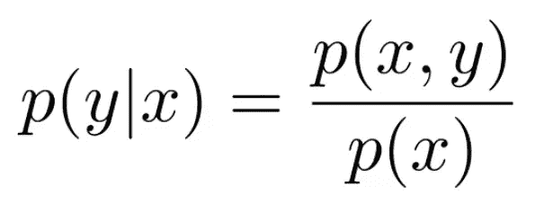

所以如果你知道 p(x)和 p(x，y ),你可以恢复你的条件概率。

**监督学习**

我们将重点学习 p(y|x)。为了做到这一点，我们将使用“机器学习方法”，这是一个三步程序。这种分解学习问题的方式与 Marr 的分析水平密切相关:

我现在将列出机器学习方法的三个步骤及其相应的 Marr 水平。

**1 定义你的损失函数:**你将如何衡量一个特定的模型有多好？这个问题关系到金字塔的计算层面。

2 定义你的模型类:你将如何表示你的程序？这个问题关系到金字塔的中间:算法层。换句话说，我们要进行优化的结构是什么？

**3 选择一个优化器:**你将如何在模型类中搜索以找到最小化损失函数的模型？这个问题关系到金字塔的实现层次。

我们做出这些区分的原因是，当我们有这些不同层次的分析时，它可以帮助我们划分我们的思维，帮助我们建立抽象概念，这样我们就可以孤立地解决问题。

我们将从金字塔的中间开始，思考我们对问题的表述。

## 1 我们如何表示 p(y|x)？

例如，假设我们有这样的输入:

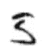

而我们的目标是把它映射到概率上，它是一个 0 到 9 之间的整数。

**有效的概率分布由总和为 1 的正数组成。**

让我们看一个简单的例子:

上图我们说*y 是狗的概率(以 x 为条件)构造为“x”转置“θ狗”；y 是猫的概率(以 x 为条件)构造为“x”转置“θcat”；参数由“θ dog”和“θ cat”串联定义。*

然而，这个程序没有输出一个有效的概率分布:一般来说，p(y = dog) + p(y = cat)的和不会是 1，除非非常非常仔细地选择θs。因此，我们违反了约束。

让我们来解决这个问题:不是让“x”转置“θ dog”等于 p(dog)，我们要定义它等于某个函数 f dog(x)；因此，我们在程序中有一些中间函数:

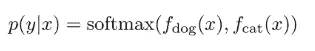

Take outputs from f dog and f cat, run them through a softmax

softmax 将接受 f dog 和 f cat，它将强制这些数字都为正数，并且总和为 1。理论上，它可以是任何双射(一对一和到上)函数，因为您想要一个使用您给定的输入的函数。

从定义域到值域的函数 f 是双射的，当(1)值域中没有一个元素是定义域中一个以上元素的像(2)值域中的所有元素都被使用。

但是除了这个条件之外，为什么我们可以使用很多不同的函数来使这些数字为正并且总和为 1 呢？

在机器学习中选择你的函数并不意味着产生正确的答案；通过选择正确的参数，你可以得到正确的答案。这个函数只需要足够通用，这样就可以选择代表正确答案的θ。

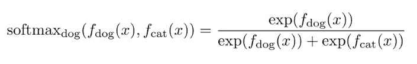

It takes all of its inputs. it exponentiates them and then it divides by their sum; in this example, we see the dog output.

一般来说，你可能有 n 个标签(不仅仅是一只狗), p (y|x)可能是一个有 n 个元素的向量，每个可能的标签有一个元素:

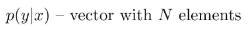

有一个函数 f θ(x ),它是一个向量值函数，有 n 个输出，可能不是正的，也可能不是 1:

所以 softmax 会处理好这个问题:

它唯一的工作是使数字为正数，并使它们的总和为 1。

## 2 我们如何选择参数θ？

到目前为止，我们已经有了一个将输入映射到输出的计算机程序的图像；我们已经决定，我们的输出应该是概率，我们将使用 softmax 来产生这些概率。

为了开始考虑定义我们的损失函数，让我们从一个更基本的问题开始:我们的数据集是如何生成的？如果我们的数据集由图片和它们相应的标签组成，那么产生这些图片的实际过程可能相当复杂，涉及光子和人们对拍摄什么的决定等等。

当试图对其建模时，我们可以提出一个非常粗略的模型:我们将把它表示为一个随机过程；在照片上存在一些 p(x)分布，并且当人们拍照时从 p(x)随机取样。

并且标签“狗”是从标签上的一些分布中取样的，这不是完全随机的并且取决于照片:

通过概率的链式法则，我们可以合成这两个样本，并从它们的联合分布 p(x，y)生成样本(x，y):

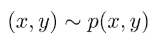

我们的数据集是从这个分布中采样的，由许多元组(x，y)组成，这些元组是根据分布 p (x，y)生成的。

说得更正式一点，看到特定训练集的概率是多少？我们需要假设不同的数据点是如何相互关联的。我们要做的假设是，我们正在处理独立且同分布的数据。

*   独立意味着每个(x，y)元组独立于每个其他(x，y)元组，这意味着如果你为 x1 观察一只猫，这不会改变你为 x2 看到一只猫或一只狗的可能性
*   同分布意味着每个(xi，易)来自同一个分布。

如果我们有这个假设，我们知道我们可以写出概率 p(D)把一个特定的训练集看作是 p(xi，易)的所有 I 的乘积。

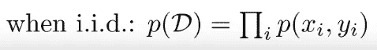

为什么？因为“独立”意味着联合 p(D)是作为边数 p()和 p(yi)的乘积而形成的。

换句话说，如果你掷硬币两次，第二次掷硬币时看到正面的概率不取决于第一次掷硬币时看到正面的概率。所以如果你想知道连续两次正面朝上的概率，你只需要用第一次正面朝上的概率乘以第二次正面朝上的概率。因为它是同分布的，这就相当于把正面的概率取平方。

我们有一个与数据集相关的概率。由于我们正在学习 p(y|x ),我们可以使用概率链规则分解上面的公式:

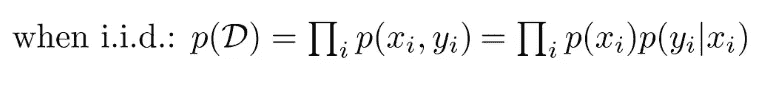

现在，我们有了一个与数据集相关的概率，它被表示为 p(xi)乘以 p(易|xi)的所有数据点的乘积。我们正在学习的是(y|x)的 pθ。需要注意的是，这是学习过的函数，它取决于我们的参数:这是真实 p(y|x)的模型。当然，这并不是标签与图像联系起来的真实过程，而是这个过程的一个模型。我们将努力让这个模型尽可能精确。

**一个好的模型应该使数据看起来是可能的:一个θ比另一个θ更好，如果相应的 p θ(y|x)使整个数据集看起来更可能，并增加 p(D)** :

然而，这里的问题是，我们将这个概率 p(D)表示为一堆介于 0 和 1 之间的其他概率的乘积:如果你将数百万个介于 0 和 1 之间的数相乘，你将得到一个非常非常接近于 0 的数。本质上，这一目标在数字上具有挑战性。

我们可以取 p(D)的对数。当你对一个乘积取对数时，你会得到对数的和:

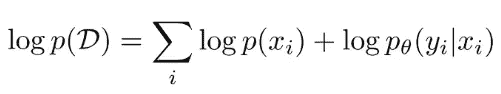

但是由于 p(xi)不依赖于θ，我们可以只把它当作一个常数:

**我们可以等价地说，我们的目标是 p θ(yi|xi)的对数的所有数据点加上一些不依赖于θ的其他东西的和。**

我们可以将学习θ的问题公式化为寻找使 log p(D)最大化的θ的尝试:

This is called maximum likelihood estimation (MLE), because this log probability is the likelihood and we are choosing θ to maximize the likelihood

很多时候，我们会把它写成最小化(这只是一个惯例):

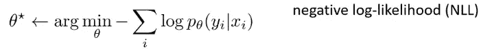

This is also called the cross-entropy

我们还是想把 log p(D)最大化，等于说我们想把负的 log 概率最小化。这是我们的损失函数，它量化了θ有多差。

还有其他方法可以量化θ有多差。例如，你可能会有 0-1 的损失:它只是说，如果你得到了错误的答案，你会损失 1，如果你得到了正确的答案，你会损失 0:

如果你在做一个连续回归问题，你可能会有一个均方误差损失:

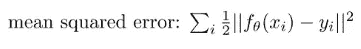

如果您要预测一个连续的数值，您可能希望尽可能地接近该数值。

## 3 我们如何选择优化器？

现在，我们必须弄清楚如何找到使损失函数最小的θ设置。想象优化算法时，有助于思考的一件事是所谓的损失景观。你可以把损失景观想象成损失函数的一个情节。L(θ)表示损失函数。

假设θ是 2D:你可以想象一个横轴为θ1 和θ2 的图。纵轴代表函数 L(θ)。只要看一眼，你就知道最佳θ在哪里:就在那个碗的底部。

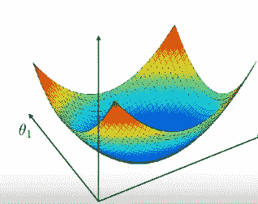

我们希望找到损失函数减小的方向，并在该方向上移动θ。算法的一个非常概括的草图是:

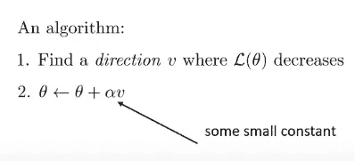

找到方向 v，使 L(θ)减小，然后选择新的θ，即旧的θ加上某个速率α乘以 v，α是某个小常数，也称为学习速率。然后，我们重复这个过程足够的次数，我们将有希望在最低限度内稳定下来。

有趣的是，最陡下降的方向实际上并不总是最佳选择，但所有这些方法的共同点是，它们都将朝着 L(θ)至少局部减小的方向移动。

从数学上来说，我们将一个方向表示为一个有 n 个条目的向量，这些条目指向 L(θ)将减小的方向。在 1D 更容易想象:

如果我位于某一点，函数在该点的斜率告诉我它朝哪个方向减少。如果斜率为负，函数向右递减；如果斜率为正，则函数向左递减:

仅仅从斜率来看，我们就可以知道该走哪条路来减少函数，同样的直觉也适用于更高维度。一般来说，对于每个维度，我们应该沿着与该维度的斜率相反的方向前进。

什么是斜坡？斜率只是导数。我们所做的就是把每一维的方向设为函数 L 对θ的偏导数的负值。

在 2D，V1 当时是:

V2 是:

这些不是θ减小的唯一方向:事实上，有整个半个向量空间编码了θ减小的方向。所以，这些偏导数给你最陡下降的方向，但是如果你向左或向右一点，θ还是会下降。当然，如果反方向走，θ会增大。只要你和 v 有正的点积，你就会往 L(θ)减小的方向走。这是说，它不是一个独特的学位结构:它是最陡的，并不一定意味着它是最好的。

一个非常有用的概念叫做梯度，它的符号是∇.∇是一个矢量；向量的每一维都是我们的函数相对于θ的对应维的偏导数。

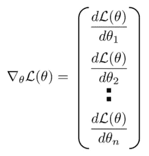

The gradient is formed by taking partial derivatives and stacking them up in a vector

下面是梯度下降算法的示意图:

1.  计算梯度步长
2.  将θ设置为:

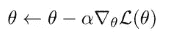

因此，我们选择了我们的优化器。

## [经验风险最小化](https://www.youtube.com/watch?v=PBYWWM9We-0&list=PL_iWQOsE6TfVmKkQHucjPAoRtIJYt8a5A&index=8)

有些人在进行监督学习时，说他们是在最小化经验风险。

让我们回想一下零一损失，对于正确的分类，损失值为 0，对于不正确的分类，损失值为 1

你可以把风险想象成你出错的概率。回想一下我们的生成过程:有人拍了一张照片。这是从图片分布中随机抽取的图片。它具有从标签的真实分布中取样的标签。给定这张图片，我们得到正确或错误的概率是多少？

你弄错的概率只是零一损失的期望值。推广到其他损失，风险就是该损失的预期价值。

如果我们使用负对数似然，我们可以说风险是在 x 和 y 上的真实分布下的期望值，我们将得到 x 和 y 的损失和我们学习的θ:

风险是我们想要最小化的。但是，我们无法计算真实风险，因为我们无法获得无限的样本。相反，我们得到了一个数据集 d。所以我们可以计算的是经验风险，这是对真实风险的基于样本的估计。通过对所有样本的损失求平均值，可以得到这个基于样本的估计值。

The empirical risk approximates the true risk

经验风险是真实风险的近似吗？有两种情况我们可能会有麻烦。

1.  **过度拟合**发生在经验风险较低，但真实风险较高的时候。这意味着你在训练集上的平均损失很低，但你损失的真实期望值并不低。

假设我正在尝试拟合这条线，点对应于我的训练数据:

Overfitting

高次多项式将完美地拟合这些点，并导致非常低的经验风险，因为它正好穿过这些点。然而，它的真实风险将会相当高。如果(1)数据集太小，或者(2)模型太强大且参数太多，就会发生这种情况

2.当经验风险与真实风险相符，但二者都很高时，就会出现拟合不足。

例如，这里的真实函数是某种曲线，但我们选择用一条线来拟合它，而这条线对曲线的拟合不够强。

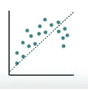

Underfitting

这可能发生在(1)如果模型的参数太少，或者(2)如果您的优化器没有配置好。

让我们试着从数学上理解什么是过拟合和欠拟合。为了做到这一点，我们将重点关注回归-这意味着您要根据您的输入预测连续变量或连续分布。

回归基本上是曲线拟合:

你有一些连续或离散的输入，你有一个连续的输出，你想预测输出。例如，你在预测狗有多大，有多重，房子有多贵，等等。

如果我们想采用概率方法，为了进行回归，我们需要一个连续值的概率分布来输出 y。有许多概率分布可以用来表示实数，但一个非常简单的选择是正态或高斯分布。

正态分布由两个参数定义:均值和方差。但是当然，我们想要解决一个预测问题——我们想要预测给定 x 的 y 上的分布，在我们的例子中，我们将有一个条件高斯分布；换句话说，该高斯分布的均值和方差本身就是 x 的函数。正态分布的对数概率可定义为:

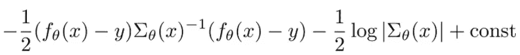

这看起来像一个很大的等式，但它实际上由三个简单的东西组成:

*   **第一项**就是 f θ(x)和 y 之差，但是在 sigma 定义的特定范数下。*它在问均值 f θ(x)与真实标签 y 有多接近*
*   **第二项**(西格玛行列式的负 1/2 对数)试图使方差更低。它的意思是:*如果你能准确地拟合真实的 y，尽量使用较低的方差。*
*   **第三项**是一个不依赖于 x 或 y 的*常数*

如果我们不去学习 sigma，并将其固定为单位矩阵，那么正态分布就会减少到 f θ(x)与 y 之差的平方，再加上某个常数:

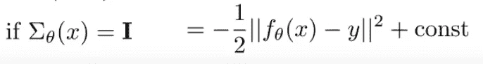

很多时候，当我们谈论回归时，我们选择的特定分布是正态分布，但我们选择σ作为恒等式，然后这个正态分布的对数正好对应于 f θ(x)和 y 之差的平方。

简化后，它与均方误差(MSE)损失相同:

MSE 损失也是协方差 sigma 设置为恒等的正态分布的对数概率。如果你有一个线性模型，那么最小化 MSE 损失就相当于传统的线性回归。因此，本文中的分析将针对 MSE，但请记住，它可以扩展到其他损失。

现在，让我们试着更正式地理解过度拟合和欠拟合。这里的问题是:**对于不同的训练集，误差是如何变化的？**

这个问题是合理的，因为直觉上我们希望以这样一种方式进行分析，即我们理解我们算法的过度拟合或欠拟合趋势，而不管它是在哪个特定数据集上训练的——因为对于给定的数据集，我们可能会幸运或不幸。我们想知道，平均而言，对于从特定数据分布中采样的数据集，我们的算法是否会产生正确的答案？

这就是为什么这个问题如此重要。假设这条黑色曲线是我们的真实函数，这些蓝点代表一个特定的训练集:

当我将模型与训练集相匹配时，我得到了橙色曲线:

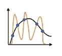

在这里，经验风险低是因为橙色曲线直接穿过蓝色圆圈。然而，真正的风险很高，因为橙色曲线与黑色曲线非常不同。这太合身了。

现在想象我有一组不同的蓝点。我有同样的真函数，学习问题没有改变，x 和 y 上的分布也没有改变。唯一的区别是，我从相同的分布中抽取了不同的数据集。

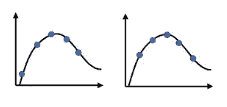

如果您查看第二个和第三个数据集，您可能会得到以下一些多项式回归:

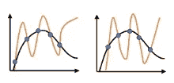

它们都是过度拟合的，它们都有较低的经验风险和较高的真实风险，但关键的是所有的橙色曲线都互不相同。这是一个非常重要的观察。**当我们过度拟合时，我们会看到不同的训练集——即使它们来自相同的分布——会导致非常不同的解决方案**。这是不可避免的，因为为了过度拟合，我们必须获得低经验风险(橙色曲线必须穿过蓝点)和高真实风险(它无法匹配黑色曲线)；所以当我们移动蓝点时，橙色曲线必须在不同的地方。总而言之:

另一方面，如果你感到不适应，你的经验风险很高，你的真实风险也很高。你的体能在不同的训练组合之间不会有太大的差异:

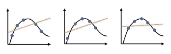

事实上，如果您将这三个数据集聚合在一起:

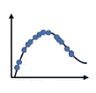

对该聚合数据集的线性拟合可能看起来与它对单个数据集的拟合非常相似:

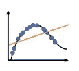

如果我们变得不适应，那意味着我们的模型不够强大；它没有足够的自由参数来精确拟合我们的函数，并且它没有利用训练集中存在的所有信息。因此，当训练集改变时，它不会改变太多，因为它不会提取所有信息

概括地说，在过度拟合中:

(1)训练数据拟合得非常好(2)真实函数拟合得很差(3)学习的函数每次看起来都不同

在欠拟合中:

(1)训练数据拟合不佳(2)真实函数拟合不佳(3)即使我们将所有数据集放在一起，学习到的函数看起来也相似

现在让我们更精确地计算一下。我们将写下误差的期望值，给定数据集的分布。所以，我们不是对 x 或 y 取一个期望值，而是对数据集 D 取一个期望值，如果我们能写出 D 的概率:

然后我们可以得到 D 的一个函数的期望值:

fθ(x)和 y 之间的误差的期望值是多少？

这里的 fθ(x)是在 D 上训练的，但 D 是一个随机变量。这不是一个衡量特定 fθ(x)的平均误差的表达式，它实际上是衡量你的训练算法的预期误差。对于 D 的每个值，你会得到不同的 fθ(x):这实际上是 D 的函数，现在，D 进入你的学习算法，产生一个θ，然后我们来看看它的误差。

换句话说，在预期中，如果我给你无限多的数据集，你分别在每个数据集上训练，你的平均误差是多少？当然，这只是一个理论上的练习:在实践中，当我们做机器学习时，我们只得到一个训练集。

上述等式也可以写成:

F(x)是真函数；fD(x)是我在 d 上训练得到的函数。

正如你可能知道的，某个函数的期望值，就是随机变量的所有值的和，这个值的概率乘以这个函数的值。在这种情况下，期望值是该数据集的概率乘以 fD(x)和 f(x)之间的平方差的所有可能数据集的总和。

然后我们可以得到这个误差的期望值，我们可以把它分成两项，把责任归于这两项。我们可以责怪其中一个人过度适应，也可以责怪另一个人不适应。

为了方便表示，我将使用 f bar (x)来表示 fD(x)的期望值。重要的是，f bar (x)是所有可能的函数的平均值，你将得到所有可能的数据集的加权概率

这并不是说 fD(x)就是你拥有无限数据时得到的结果，因为每个单独的 fD(x)仍然适合特定的有限大小的训练集，但你将它们的预测平均在一起。

现在，我们要用这个等式来计算预期误差，在正方形内，我们要减去 f 条，加上 f 条。

然后，我将在前两个术语周围加上括号，在第三和第四个术语周围加上括号。

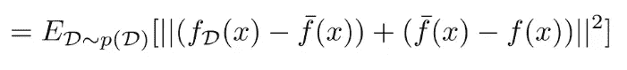

现在我要计算这个量的平方:

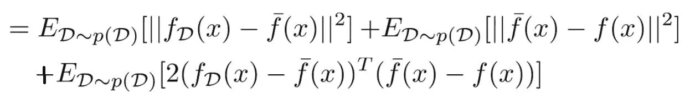

第三项最终被抵消了，因为这一项:

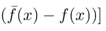

不依赖于 d，因此，通过线性期望，我们可以把它取出来。此外，这个术语:

也最终等于 0，因为 f bar (x)表示 fD(x)的期望值；因此，fD(x)减去 f bar (x)的期望值等于 0。

现在，我们只剩下前两个术语:

第一项是方差。注意这第一项实际上没有 f(x ),所以这与真正的函数无关；这是量化我们的预测随数据集变化的程度。换句话说，对于不同的训练集，fD (x)变化有多大？

在第二项中，我们可以完全删除预期，因为 f bar (x)减去 f(x)不依赖于 d。它只是你所有预测的平均值(f bar (x))和真实函数 f (f(x))之间的平方差。我们称之为偏差，技术上是偏差的平方。偏差本质上量化了你得到的平均预测与真实函数的差距。

在这种情况下，偏差相当大。无论我们有多少数据，这个误差都不会消失，因为它量化了我们参数化不足的程度。

完全误差就是方差加上偏差的平方。因此，这两个术语解释了过拟合和欠拟合。

所以，如果方差太高，那么你的数据太少或者函数类太复杂:**过拟合**。另一方面，如果偏差太高，那么你就有一个不够复杂的函数类:**欠拟合**。

一旦我们认识到我们的误差是由方差和偏差组成的，那么我们就知道要得到一个运行良好的算法需要调节偏差和方差之间的平衡。了解哪个项大，哪个项小非常重要，因为我们用于减少方差的许多故障排除技术实际上会增加偏差，反之亦然

## 正规化

让我们来谈谈如何权衡偏差和方差:神经网络的一个关键思想是，它们使用“太复杂”的模型——复杂到足以适应数据中的所有噪声。然后需要“调整”它们，使模型足够复杂，但又不太复杂。模型越复杂，它就越适合训练数据，但如果太复杂，它就不能很好地概括；它会记住训练数据，但对未来的测试数据不太准确。

1.  获取更多数据解决差异。你拥有的数据越多，你就越不会过度拟合，你遭受的方差也就越小。获得更多的数据通常不会提高偏倚:

2.你可以改变你的模型类。比如你可以把你的 12 次多项式，改成线性函数；这可能会减少方差，增加偏差。但这是一个非常离散的选择。**理想情况下，我们想要更平滑地限制模型类的东西。**我们想为复杂性构建一个连续的旋钮。这就是正规化发挥作用的地方。

非正式地，正则化是我们添加到损失函数中的东西，通常是为了减少方差，尽管并不总是这样。理解正则化最简单的方法之一是通过贝叶斯解释，它将正则化视为关于我们参数的先验信念。

贝叶斯观点的高层次直觉是，当我们有高方差时，这是因为数据没有给我们足够的信息来识别参数。如果我们只有五个数据点，并且有一个 12 次多项式，那么函数是欠定的:有许多不同的 12 次多项式非常适合这五个数据点。

因此，我们需要以某种方式为算法提供更多一点的知识；由于数据中没有足够的信息，我们可以通过损失函数提供一些。我们需要回答这个问题:**给定数据集 D，最可能的参数向量θ是什么？**

换句话说，这个问题关系到你对这个领域的了解。在这种情况下，你可能有理由相信，对于你的问题，第三个函数更可能是一个好的选择。**贝叶斯观点试图构建整个学习问题，即如何从 D 中概率地得到θ。**

d 只是一组(xi，易)元组:

如果你想知道给定 D 时θ的分布，你可以应用条件概率的定义:

Up to a constant, this is equivalent to p(θ,D).

根据概率的链式法则，我们可以将其分解为:

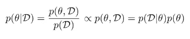

这应该让我想起来了。根据 IID 假设，给定θ，D 的概率可以分解为所有数据点的乘积:

p(θ)呢？这是我们的副院长。这表达了θ是先验的可能性，甚至在看到你的训练集之前。

例如，甚至在没有看到数据集 D 的情况下，如果您认为对于您的特定问题，更平滑的函数更有可能，您可能会说第二个函数是更好的候选:

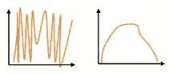

另一方面，如果您认为尖峰函数更有可能，那么第一个函数是更好的候选函数。

假设我们使用第二个函数。基于这个先验知识，我们如何建立一个先验，使得平滑函数更有可能？在回答这个问题之前，请注意我们现在有一个不同的损失函数:

第一部分正是我们习惯的负对数似然。现在，我们简单地从负对数似然中减去先验。

同样，我们必须选择先验，这是一个并非来自数据的设计选择。我们之前认为。

换句话说，由于系数小的多项式不会导致大的尖峰，什么样的分布会给小数字分配更高的概率？

有很多种分布可供我们选择，但一个非常简单的选择是使用正态分布，它将大部分概率分布在接近于零的小数字上。有多近？这是由方差决定的。我们选择的方差越小，函数出现尖峰的可能性就越小。

以下是均值为零的正态分布的对数概率表达式:

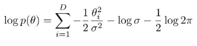

第二项和第三项不会影响θ，因此我们可以忽略它们，将它们表示为一个常数值。我们可以这样重写这个先验:

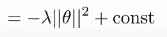

Lambda 是 sigma 平方的 1/2 倍，但我们不关心它的精确值，因为我们只是将它作为一个超参数，我们必须选择它，以便算法能够很好地工作。因此，我们新的损失函数是:

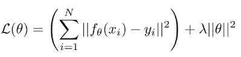

这和我们之前的目标是一样的。我们所做的就是在交叉熵损失函数 l 中加入一个二次惩罚项。

一种常见的替代选择是 L1(或“套索”)正则化，它使用的惩罚是 DLN 中所有权重的绝对值之和，从而产生以下损失函数:

这也有利于小数字，但它有恒定的斜率(不像平方函数，斜率越来越大):它鼓励向量θ中尽可能多的元素为零，换句话说，它鼓励稀疏解。

另一个用于深度神经网络的正则化子叫做 dropout。在辍学中，我们在训练过程中实际上放弃了一些神经元。在整个训练过程中，在每次迭代中，在计算下一层之前，标准丢弃会将每一层中节点的一部分(通常为 1/2)置零。随机选择不同的子集来剔除会在过程中引入噪声并减少过拟合。在训练期间，退出会降低模型的容量，因此作为一般实践，在使用退出时会使用更宽的网络。如果你使用一个随机概率为 0.5 的辍学，那么你可能要加倍该层中隐藏神经元的数量。

**为什么要多层？**

XOR 问题是在给定两个二进制输入的情况下，使用神经网络来预测 XOR 逻辑门的输出的问题。如果两个输入不相等，XOR 函数应该返回真值，如果相等，则返回假值。XOR 是一个分类问题，并且其预期输出是预先已知的。感知器是一种前馈网络，只能用一条线来分隔数据点。这是不幸的，因为 XOR 输入不是线性可分的。这个问题的解决方案是通过添加一个额外的单元层来扩展到单层体系结构之外，该单元层没有对外界的任何直接访问，称为隐藏层。这种架构是另一种被称为多层感知器(MLP)的前馈网络。一般来说，深度神经网络在学习复杂函数时往往惊人地强大，而不会牺牲泛化能力。深度学习背后的一个核心直觉是，深度网络通过学习内部表征来获得它们的力量。

深度学习完全是关于创建中间层，其中中间层中的每个节点代表输入的不同配置的存在或不存在。这样，如果输入的是一幅猫的图像，没有单独的像素必须与照片中是否有猫相关联。相反，中间层将尝试识别可能与猫相关或不相关的不同像素配置(例如耳朵、猫眼或猫毛)。许多类猫配置的存在将为最终层提供正确预测猫存在与否所需的信息(相关性)。你将训练一个神经网络，通过观察所有单独的数据点和*搜索相关性*来学习模式。

## 我们如何选择超参数？

这个想法是，我们把数据集分成训练集和验证集。通常，训练集可能是数据集的 80/90%,用于选择(1)参数θ(通过优化)和(2)那些影响优化的超参数，如学习率。

这是训练损失，它取决于 D 训练:

另一方面，验证集不用于训练；我们将使用它来做出设计您的方法所需的任何其他选择。具体来说，它用于选择(1)模型类(2)正则化子的超参数(3)要使用的特征。验证损失为:

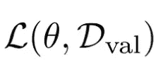

这种损失将使我们能够诊断过度拟合和不足拟合。为什么？因为训练损失是你的经验风险，而验证损失使用的数据没有用于训练，因此是真实风险的无偏估计。通过比较这两个损失，你可以确定你是否过度拟合或拟合不足。

您通常会使用的机器学习工作流是:

1 在训练集上训练你的参数θ。

如果训练损耗不够低，说明你训练不足。为了减少欠拟合，您可以(1)减少正则化(2)改进您的优化器。

如果培训损失较低:

2 看验证损失。如果验证损失高于训练集，您可能会过度适应。为了减少过度拟合，你可以(1)增加正则化的数量(2)出去获取更多的数据

一旦你这样做了，你可以重复这个过程。

实际上，我们做的事情有点交错。我们在同一轴上看培训损失和验证损失。

例如，这是典型的过度拟合:

最初，这两个损失都在下降，但后来随着培训损失的进一步下降，验证损失开始上升。你的学习函数越来越适合那些训练点，代价是实际上偏离了真正的函数。

这是典型的不合身:

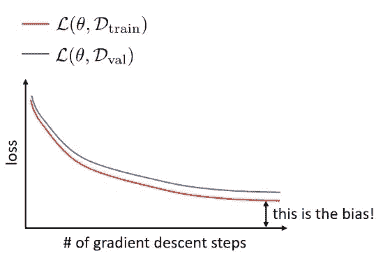

验证损失和训练损失以相似的速度减少，但是它们没有我们希望的减少得多。末端的间隙是偏差。

当查看过度拟合的情况时，一个想法出现了:在验证错误上升并停止我们的优化过程之前达到最佳点是否有意义？其实，*这叫早停*。当验证在过去的 n 次迭代中持续上升时，您只需倒回 n 步，并使用您当时拥有的任何东西。

但是这能减轻所有的过度拟合吗？不会，因为即使您可以在合适的最佳点停止优化器，验证错误也不会像使用适当的正则化时那么低。所以，提前停止是对抗过度适应的一种方法，但它不能解决你所有的问题。

现在，让我们假设你遵循了这个食谱:你没有欠适应，你没有过适应，你的损失都是好的。你如何评价你的模型的最终表现？

我们真的不能再依赖于无偏的验证损失，因为我们使用它来选择(1)模型类(2)正则化子的超参数(3)要使用的特征。我们也不能真正依赖训练损失，因为我们用它来选择(1)参数θ(通过优化)和(2)那些影响优化的超参数，如学习率。

我们可以为期末考试保留数据集的另一部分。我们称之为测试集，我们将用它来报告最终的性能。因此，我们将数据集分成三部分，而不是分成两部分。

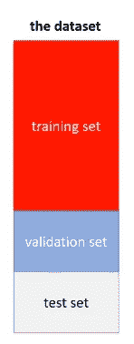

超参数调整通常困难且耗时。在搜索过程中，我们可以使用一些技巧来指导我们。

*   网格搜索:尝试所有可能的超参数组合
*   随机搜索:随机尝试超参数的不同组合
*   坐标梯度下降:从一组超参数开始，尝试一次改变一个，接受任何减少验证误差的改变
*   贝叶斯优化/自动 ML:从一组在类似问题上运行良好的超参数开始，然后从那里进行某种局部探索(例如，梯度下降)。

有很多选择，比如探索什么范围，首先优化哪个参数，等等。一些超参数并不重要(人们使用 0.5 或 0 的辍学，但没有太多其他的)。其他因素可能更重要(例如，神经网络的大小和深度)。关键是要看类似问题的解决方法。

## [深度学习中的优化](https://www.youtube.com/watch?v=RdoZWcXmXhk&list=PL_iWQOsE6TfVmKkQHucjPAoRtIJYt8a5A&index=11)

我们将讨论最优化算法。让我们先回顾一下梯度下降。

我们可以将学习θ的问题公式化为寻找使 log p(D)最大化的θ的尝试:

This is called maximum likelihood estimation (MLE), because this log probability is the likelihood and we are choosing θ to maximize the likelihood

很多时候，我们会把它写成最小化(这只是一个惯例):

This is also called the cross-entropy

我们仍然想最大化 log p(D)，这就等于说我们想最小化负 log 概率。这是我们的损失函数，它量化了θ有多差。为了找到使我们的损失函数最小的θ设置，我们必须找到方向 v，使得 L(θ)减小，然后选择新的θ为旧的θ加上某个速率α乘以 v，然后，我们重复这个过程足够多次。一般来说，我们把每一维的方向设为函数 L 相对于θ维的偏导数的负值。

我们将详细讨论梯度下降可行的情况，不可行的情况以及我们如何改进它。我们会经常看到的一种图片是等高线图。这些线对应于水平集轮廓；因此，对于沿着这些轮廓之一的所有θ值，损耗呈现相同的值:

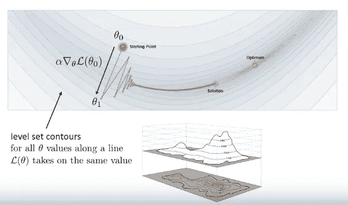

我们将使用线条可视化梯度下降的优化路径。每个橙色线段的端点代表梯度下降迭代之一的θ值；这些端点之间的线段表示步长(梯度方向乘以学习速率)。

凸函数往往优化得很好。这是一个一维函数:

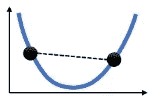

如果一个函数上任意两点之间的线段完全位于图的上方，则该函数是凸的。相比之下，这个函数不是凸的:

如果我在这两点之间画一条线，它将与图形相交。这个函数恰好也有两个最优解。一般来说，一个函数可以是非凸的，即使它只有一个最优解。例如，这个函数只有一个最佳值，但是，因为它也有一个平台，如果我在这两点之间画一条线，它将与图形相交:

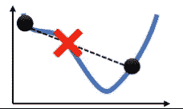

所以，一个函数是凸的意味着它只有一个最优解，但是一个函数是非凸的并不意味着它有一个以上的最优解。

有可能证明凸函数上的梯度下降将在不太大的多次迭代中找到全局最优。这并不意味着梯度下降适用于所有凸函数，因为它并不总是朝着最优方向移动。它总会走最陡的下降方向，但最陡的下降方向并不是直接朝向极小点的方向。例如，如果我们从起点开始看第一步:

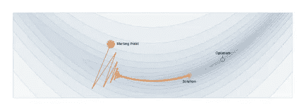

我们看到它正在偏离最优值。

想象一下这种功能。每个椭圆代表损失值相等的点。最优在中间。最陡下降的方向总是垂直于水平集的切线:

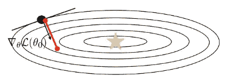

在这一点上，如果我们计算最陡下降方向，我们将走另一条路:

然后反过来说:

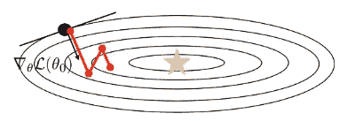

最终这将达到最佳，但这可能需要相当长的时间。

神经网络的损失面呢？

神经网络是一个更复杂的函数，具有许多参数和许多表示层:

很难想象神经网络的损失面，因为神经网络有大量的参数。一些电视网的损失相当可观:

然而，这种损失通常是这样的:

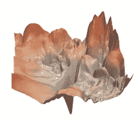

一般来说，神经网络的损失景观肯定不是凸的。

## 在损失景观中，我们应该担心哪些地理特征？

有三个重要的特性需要了解。

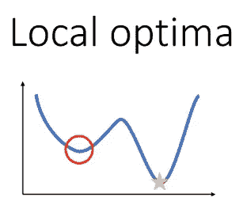

当涉及到非凸损失景观时，局部最优是最明显的问题。问题是你可能有不止一个点的导数为零。在任何一个局部最优值，导数都为零，这意味着没有改善。

原则上，局部最优是非常可怕的，因为梯度下降可能会收敛到一个比全局最优更差的解，而你无法知道。有点令人惊讶的是，具有许多参数的神经网络在其损失景观中肯定存在局部最优，但这些最优往往不会比全局最优差太多。

您可以在下图中看到这一点:

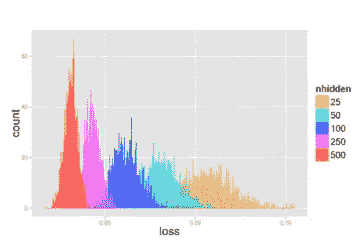

在水平轴上，我们有通过梯度下降发现的解的损失的数值。这是一个直方图，所以垂直轴代表多少轮梯度下降，每一轮从不同的随机位置开始，实现了损失。这有点像是画出了导致损失的运行频率。不同的颜色代表不同大小的网络；这里的数字越大，对应的网络越大，参数越多。

粗略地说，对于黄色显示的最小网络，不同的损失值分布很广。它仍然没有那么宽，所有的数字都在 0.08 和 0.10 之间，但有一些可变性，这意味着优化正在陷入一系列不同损失值的局部最优。但是随着网络变得越来越大，实现不同损耗的网络的频率变得紧密得多；对于红色的最大网络，您可以看到损失仍有一些可变性，但解决方案在大约 0.072 和 0.078 的范围内聚集得更密集。

这意味着更大的网络确实有局部最优，但是这些局部最优彼此都非常相似，而且都非常好。

让我们转到第二个问题:

我们可以想象一个损失场景，在那里我们没有局部最优，但是我们有一个很大的区域，在那里损失的梯度非常小。如果没有这些停滞期，我们可以只使用小的学习率，并且能够缓慢而稳定地向最优进展。但是当这些平台期真的很平坦时，一个小的学习率可能意味着你要花很长时间才能度过这个平台期。因此，你需要足够大的学习速率，以免陷入这样的停滞状态。

第三个问题:

鞍点对于一维函数来说并不存在，但是对于更高维的函数来说却很常见。直观上，你可以把一个鞍点想象成沿着某些维度的局部最小值，但是沿着其他维度的局部最大值。在鞍点处，函数对每个维度的偏导数为零，但是函数在某些维度上增加，而在其他维度上减少。

这就是我们对低维函数的直觉非常误导的地方。

**什么是临界点？**

临界点是梯度为零的任何点，这意味着损耗相对于θ的每个维度的所有偏导数都为 0:

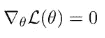

临界点有不同的类型；对于给定的临界点，它是最大值，最小值还是鞍点？你知道的方法是看二阶导数。

在 1D，如果你在临界点，二阶导数为正，这意味着图形向上倾斜。这意味着你有一个本地最小值。另一方面，如果二阶导数是负的，那么这意味着你处于局部最大值。但是在更高维度中，你可能有一些二阶导数是正的，一些是负的

一般来说，我们可以构造一个矩阵，称为海森矩阵。海森矩阵基本上是梯度的二阶导数。

梯度是一个向量，其中每一项都是相对于θ的相应维数的偏导数；hessian 是一个矩阵，其中每个元素都是θ中两个元素的二阶导数。

Hessian matrix

鞍点处的 hessian 矩阵将有对角元素，对于某些维度为 1，对于其他维度为-1。

只有当所有对角线元素的符号相同时，该点才是最大值或最小值。否则就是鞍点。想象一下在更高维度中会发生什么:所有 100 个对角线条目都有相同符号的情况会有多频繁？在更高的维度中，似乎不太可能每一个对角线条目都是正的或者每一个对角线条目都是负的。**所以，高维度中的大多数临界点都是鞍点。**

**改进方向**

有没有加速梯度下降而不需要二阶导数的方法(这意味着很长的运行时间)？

1 动量就是它听起来的样子。如果我们记得之前的这张照片:

梯度下降将来回振荡，但如果我们观察几个连续的梯度更新，我们会注意到它们倾向于指向相反的方向。因此，人们很容易想到，如果我们能把它们平均在一起，我们就能得到我们想要的方向。

直觉是，如果连续的梯度步骤指向不同的方向，我们应该取消不一致的方向，只保留一致的方向；另一方面，如果连续的梯度步骤指向相似的方向，我们应该在那个方向走得更快。

我们将要使用的动量更新规则非常类似于梯度下降。不同之处在于，我们也采用先前的方向，并将其乘以 0 到 1 之间的衰减因子:

如果先前的方向和新的方向指向相反的方向，它们会相互抵消。如果它们指向相似的方向，它们实际上会加在一起，在那个方向上走得更快。动量带来很多好处，而且几乎没有成本。

我要讲的下一个问题是梯度的大小。梯度的符号很重要，因为它告诉我们梯度是向左还是向右；但是星等告诉我们它在每个维度上走了多远，信息却少得多。

更糟糕的是，在优化过程中，梯度的整体幅度可能会发生剧烈变化，这可能会使学习率难以调整。解释是 f θ(x)与 y 相差越大，梯度就越大。因此，如果最初 f θ(x)与 y 相差很大，那么梯度会很大，当梯度很大时，几乎肯定会超过最优值，从另一边出来。但是随着你的函数 f θ(x)越来越接近 y，梯度会变得很小，在这一点上，你可能会采取非常小的步骤，你可能想要一个更好的学习率。

有一个想法可以帮助我们缓解这种情况，那就是将每个维度上的梯度大小归一化。如果你能以某种方式计算出每个维度的平均梯度有多大，然后除以这个值，那么你就可以去掉这些烦人的比例因子。

RMSProp 就是这样一种算法。这个想法是平均估计梯度的每维大小:

每一步，我们都要取 Sk 的旧值，乘以某个因子β(介于 0 和 1 之间的因子)。然后我们取 1-β，乘以梯度中每一项的平方。这大致是每个维度长度的平方。

当我们更新θ时，我们在梯度的方向上迈出一步，但我们用它除以 Sk 的平方根，也就是它的平均平方长度。因此，每一个维度都大致除以它的大小:

3 AdaGrad 是 RMSProp 的一个更具理论原则性的版本。使用 AdaGrad，我们也可以估计每个维度的大小，但是我们是累积估计的。

如你所见，它与 RMSProp 完全相同，但没有β和 1-β。这意味着 Sk 将会越来越大。

那么，AdaGrad 和 RMSProp 如何比较呢？

阿达格拉德对凸问题有一些非常吸引人的保证。然而，对于非凸问题，我们不断除以越来越大的 Sk 的事实意味着学习率随着时间的推移而降低——这可能是一个问题。只有在 Sk 变得太大以至于你的更新变得很小之前，你很快找到最优解，AdaGrad 才起作用。

另一方面，对于非凸问题，RMSProp 往往比 AdaGrad 更好一些，因为与 AdaGrad 不同，它会忘记。随着时间的推移，将 Sk-1 乘以β意味着算法会忘记很久以前看到的梯度。

亚当结合了动量和 RMSProp。我们使用动量来加速梯度下降，然后除以长度平方的移动平均值来归一化长度。

第一步，类似于动量:

与动量相似，我们在前进的过程中积累梯度。您可以将 mk(其中“m”代表平均值)视为梯度的移动平均值。

第二步:

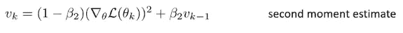

vk 是二阶矩估计:也是移动平均值，但是是梯度长度的平方。

第三步，当我们将 m0 和 v0 初始化为零时，我们希望防止我们采取的步骤在开始时很小，随着时间的推移很大:

第四步，我们的更新:

**随机优化**

到目前为止，我描述的所有梯度下降版本实际上都不适合用于深度学习。例如，负对数似然损失要求对我们训练集中的所有数据点求和:

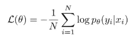

然而，在深度学习中，当数据集非常大时，事情往往会工作得最好。因此，有效地优化神经网络可能需要数百万个梯度步骤，这将是非常令人望而却步的。

我们可以认识到的一点是，这个总和实际上是基于样本的期望值估计值:

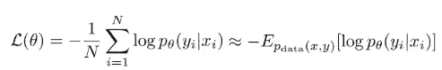

如果你考虑给定 x，y 的对数概率的数据分布下的期望值，你实际计算的损失总和只是基于样本的估计。并且期望值的基于样本的估计对于任何数量的样本都是无偏的。如果你使用更少的样本，你会得到一个更差的估计，但它仍然是一个无偏的估计。

如果我们希望梯度下降在计算上更快，我们可以做的事情之一是，我们可以简单地使用比每次更新的整个训练集更少的样本。我们可以选择 B 个样本的子集，然后对这些 B 个样本求平均值，其中 B 远小于 n:

当然，如果我们只选择这些样本一次，并在整个优化过程中使用它们，那是相当浪费的，因为我们没有使用我们的大部分数据。我们能做的是，我们可以在每一个梯度步骤中选择一个大小为 B 的不同子集，这样，我们用少量样本估计的梯度看起来就像真实的梯度，带有一些噪声，因为只是随机地，每一个梯度步骤都会得到一组略有不同的 B 样本。

**小批量随机梯度下降**

1 对整个训练集 D 的子集 B 进行采样

2 通过对批次 b 中所有点的梯度求平均值来估计一个近似的梯度方向。这大约是你的损失的梯度，但它不完全相同的原因是你使用了更少的点:

3 使用具有近似梯度的梯度下降。当然也可以用动量，亚当等。

每次迭代采样不同的小批量。这是随机分级下降的理想版本，但实际上你可以更有效地做事。

由于随机内存访问，每一步随机采样都非常慢。如果你有非常复杂的数据，它会在内存中按顺序排列；因此，如果您每次都索引到一个随机映像中，那么您会进行大量的随机内存访问，这会破坏您的缓存一致性。相反，您可以预先洗牌，就像洗牌一样，然后按顺序索引数据集。从技术上来说，这与常规梯度下降并不完全相同，因为您在开始时只洗牌一次，但您在批次中循环的顺序是随机的，因此在实践中，这与真正的随机梯度下降一样好，并且在计算上更便宜。

**学习率**

我们如何调整这些算法的学习率？

在该图中，垂直轴是训练损失；横轴是纪元，一个纪元就是你浏览整个数据集的次数。对于规则梯度下降，历元的数量等于优化步骤的数量；使用随机梯度下降，历元数等于数据集的总大小除以小批量的大小。

红色曲线显示了如果你有一个精心选择的学习率，你期望看到的训练损失。

绿色曲线下降的速度要慢得多，这意味着我们的学习速度可能低于正常水平。在深度学习中，低学习率会导致缓慢的优化和收敛到更差的最终结果。

黄色曲线开始时非常快，但之后就停滞了，这意味着我们的学习速度可能太高了。当我们走得太快时，我们一开始会走得很快，但之后你会卡在一个更差的值上。

**学习率衰减**

此时你可能会想:如果高学习率一开始很快，但后来停滞不前，我们为什么不从高学习率开始，然后切换到较低的学习率？

这是一个在 ImageNet 上训练的神经网络 AlexNet 的图表:

它正在接受学习率衰减时间表的训练，学习率每隔一段时间除以 10。你可以看到，最初，学习率为 0.01 时，准确度迅速提高，然后就停滞不前了。学习速度越来越慢，现在你的准确度进一步提高，然后就停滞不前了。学习率再次降低，然后准确度进一步提高并趋于平稳。最终，你足够接近局部最优，然后你停止改善。值得注意的是，通常你不需要 ADAM 的学习率衰减。

**调谐随机梯度下降**

要调整的超参数:

*   **批量 B** 。通常，批量越大，梯度噪声越小，越安全，但成本也越高。
*   **学习率** α 是一个有点棘手的选择。一般来说，最好使用最大的学习率。随着时间的推移，你可能会想让它腐烂。
*   对于动量μ，好的设置是 0.90 或 0.99，但是你必须调整它以适应你的问题
*   ADAM 参数β1 和β2；通常，保留默认值。

如何调整这些超参数？从技术上讲，你需要根据训练损失来调整这些参数，因为与正则化不同，它们不会试图给你对新点的更好的概括。

然而，在实践中，随机梯度下降超参数也经常在验证集上进行调整，这是一种有趣的选择。随机梯度和正则化之间有着复杂的关系；按照惯例，我们会把最优化和一般化分开。但是最近有相当多的研究在研究大随机梯度下降本身如何实际上作为一种正则化。因此，直觉告诉我们，如果你开始过度拟合，你会期望不同批次的梯度看起来非常不同，所以你不希望平均化它们——你不希望到达你损失的最底部。因此，这就是为什么有些人认为随机梯度具有理想的正则化效果的粗略直觉，因此当您调整随机梯度下降的超参数时，您实际上应该查看验证损失。

**深度学习的计算图**

所有的机器学习算法都是一个带有一些参数的程序。我们可以形象化这个程序的方法之一是画一个代表计算流程的图。

计算图看起来是这样的:

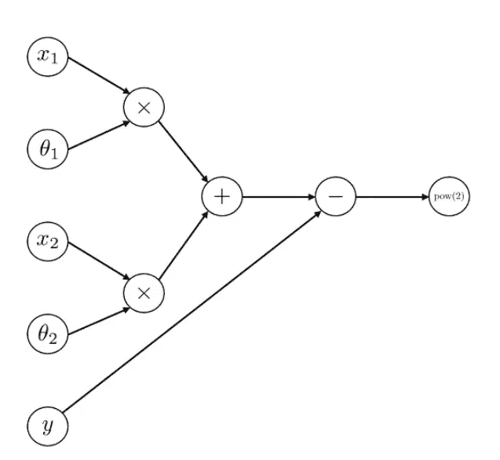

Computation graph for linear regression

这个计算图表示线性回归。我们计算 x1 乘以θ1 加上 x2 乘以θ2；然后，我们减去 y 并求差值的平方，这就得到均方误差(MSE)损失。通常，当我们为神经网络绘制计算图时，我们是结合损失函数来绘制图形的。

神经网络通常比我上面画的图要复杂得多，计算量也大得多。在我们可以为神经网络绘制计算图之前，我们需要谈论向量和矩阵；在此之后，我们可以设计计算图形的通用工具，并使用这些工具来训练许多不同类型的神经网络，只需最少的额外工程。

让我们像以前一样绘制同样的线性回归图，但使用向量的方式要简单得多:

Computation graph for linear regression

现在我们有一个节点 x，它表示两个条目 x1 和 x2 的向量；我们还有一个节点θ，代表θ1 和θ2；将这两个向量相乘后，我们从它们中减去标记 y，并求差的平方。这和我之前展示的计算图一模一样，只是用向量符号以更简洁的方式写出来。

同样，我们可以看看这张逻辑回归的精致图表:

Computation graph for logistic regression

用矩阵让这个更简单。我们可以用矩阵符号写逻辑回归:

因为一些矩阵θ乘以向量 x，因此我们的计算图变成:

我们可以更简洁地画出逻辑回归图。请注意，在这些计算中，我们有两种类型的变量。我们有像 x 和 y 这样的数据变量，它们是输入和目标输出；而我们有参数(θ)，通常影响一个具体的操作(虽然有时候有一些参数共享)。如果我们注意到这些特性，我们可以对这个组合图做更多的总结。我们知道，θ只会影响一个地方发生的事情，我们可以把它看作那个乘法的一个参数，并把它折叠到乘法节点中。我们可以画出同样的图，但更简洁地说，x 进入一个线性层(线性，因为它是一个矩阵向量乘积)，然后它进入 softmax，然后 softmax 进入损失函数:

现在我们有了这个高度简化的计算图表，我们可以将其与其他常见的可视化神经网络的方法进行比较。

绘制神经网络图的常用方法是将网络中的变量可视化为方框:

一切开始的第一个变量是输入 x；然后我们有一个线性层，默认有参数；这个线性层将 x 转换成某种中间表示，我们称之为 z(1)。z(1)是应用第一个线性图层的结果-上标 1 表示它是第一个图层。然后我们把这个 z(1)输入到 softmax 中。

一个更简单的图形是:

这里，我们切断损失，因为我们知道交叉熵损失总是遵循 softmax。我们也删除了绿色的梯形，而只是标记箭头。我们还删除了参数，因为线性层总是有参数。这是一种你会在研究论文中经常看到的图表。

[**逐步反向传播**](https://www.youtube.com/watch?v=lKRatcD9hEg&list=PL_iWQOsE6TfVmKkQHucjPAoRtIJYt8a5A&index=14)

逻辑回归的表达式非常简单，我们可以把方程写在一张纸上。然后，我们可以用微积分的规则，推导出这个表达式对每个参数的导数。我们可以用神经网络做同样的事情，计算出每一个权重矩阵的导数，并构建我们的梯度。但是考虑到神经网络包含许多功能，可能需要很长时间才能算出这些导数。此外，如果你改变你的网络，例如增加一层，你必须重新推导所有的导数，这将需要很长时间。

我们真正想要的是一种可以通过神经网络自动计算导数的算法，而不需要我们手工计算所有的微积分。然后，我们可以实现任何我们想要的神经网络，运行这个算法，得到一个梯度。这种算法被称为反向传播。

作为题外话，我们需要回顾一下微积分的链式法则(不要与概率的链式法则混淆)是如何工作的。神经网络由许多功能组成。通过函数的组合求导是微积分的链式法则帮助我们弄明白的

如果你有这样的表达:

这意味着你有一个输入 x，你把一个函数 g 应用到 x，你得到 y，你把另一个函数 f 应用到 y，最终，你得到 z。

假设你想对这个关于 x 的表达式求导，链式法则告诉你，导数是 g 的导数乘以 f 的导数的乘积:

同样的精确表达式也适用于多元函数——我们只需稍微注意一下顺序，因为标量乘法中的顺序是可交换的，而矩阵乘法则不是这样。

同样的链式法则成立:dz/dy 是向量，dy/dx 是矩阵。

让我们来看看这个神经网络:

我们可以用链式法则写出，例如，损失对 W(2)的导数。这等于 z(2)对 W(2)的导数乘以损耗对 z(2)的导数:

同样，我们可以写出对 W(1)的导数:

以下是我们如何更有效地做事的方法。中间的所有雅可比矩阵都是 nxn，但最后一个雅可比矩阵总是 nx1，因为损耗总是标量值:

因此，中间的这些乘积相当昂贵，因为它们将是 O(n)，而最后一个乘积相当便宜，因为它总是大致为 O(n)。

下面是我们如何利用这种直觉来构建一个更有效的算法。这个想法是我们从右边开始，这样我们总是保持我们的计算在 O(n)上。首先，我们计算:

这是一个矩阵乘以一个向量，计算起来很便宜。我们称之为δ。现在让我们更新我们的衍生品:

我们再一次从右边开始。我们计算:

这是一个矩阵乘以一个向量，计算起来很便宜。我们称之为伽马(γ)。最后:

同样，最后一种产品很便宜。

基于这种直觉，我们可以推导出经典的反向传播算法。假设我们有这样一个网络:

首先，我们将向前传递，我们将计算每个 a(i)和 z(i)。然后，我们将进行反向传递，这就是反向传播所指的。我们首先将δ向量初始化为损耗相对于最后一个 z 的导数。然后，我们将从网络的末端返回到前端，对于输入 xf 和参数θf 的每个函数(线性和非线性层),我们将执行以下操作:

并以这种方式更新增量:

**内部表现**

之前，我们看到深度神经网络在学习复杂函数方面通常惊人地强大，并且它们通过学习内部表示来获得它们的能力。

1.  通过梯度下降进行学习似乎与动态系统的进化非常相似。它们都由一组微分方程描述。动态系统通常有一个描述变化率的“时间常数”，类似于学习率，只是梯度下降通过历元而不是时间进化。Saxe 等人(2013)表明，为了分析和理解深度 LNN 的非线性学习动力学，我们可以使用奇异值分解(SVD)将权重矩阵分解为正交向量，其中向量的正交性将确保它们的个体性(独立性)。这意味着我们可以把一个深宽的 LNN 分成多个深窄的 LNN，这样它们的活动就彼此解开了。SVD 简介:任何实值矩阵 A 都可以分解为 3 个矩阵:

a=uσv⊤

其中 U 是正交矩阵，σ是对角矩阵，V 也是正交矩阵。σ的对角元素称为奇异值。

2.表征相似性分析(RSA)是一种方法，可以帮助我们窥视内部，看看网络如何构建其内部表征。其主要思想是，当网络呈现相似的输入时，网络中隐藏单元(神经元)的活动必须是相似的。如果我们在每次训练迭代中执行 RSA，我们可能能够看到窄网是否正在学习表示。

**实际实施**

在我们可以用反向传播和梯度下降来训练它之前，我们需要回答一些关于我们的神经网络的问题:

*   网络应该有多少层？
*   这些层有多大？
*   我们应该使用什么类型的激活函数？

关于激活函数，一个特别受欢迎的选择是所谓的整流线性单位或 ReLU。ReLU 采用之前的激活，假设 z(1)，它将 a(1)设置为零和 z(1)的相应条目之间的最大值:

它有一个完全线性的正分支，然后有一个平坦的负分支。有人可能会认为它不够非线性，但实际上它最终工作得非常好。它有许多非常吸引人的特性:

*   它的计算实现非常便宜，这意味着对于非常大的神经网络，它可以大大加快它们的速度
*   它的导数非常简单，这也使得它们的计算效率更高，更容易处理

实现神经网络的另一个细节是偏差项。这是一个经典的线性图层:

但是这一层有一个主要的限制。假设 a(i)是一个零向量。在这种情况下，线性图层永远不会产生任何不为零的输出，这意味着到处都是零。这种神经网络永远无法表示某些函数——它不是通用的函数逼近器。

对此的解决方案是添加一个偏移向量，将线性图层转换为:

这也称为仿射层。事实证明，如果你有一个神经网络，它有这些层和非线性，比如 sigmoid，只要这些层足够大，你就可以以任意精度逼近任何函数。如果你没有偏见，你就做不到。所以现在你的神经网络的参数将由权重矩阵 W1 和 W2 以及偏置向量 b1 和 b2 组成。

我们还需要什么来实现反向传播？我们需要能够计算:

Parameters θf for every function f

并且:

Input xf for every function f

**PyTorch 亲笔签名**

PyTorch、JAX 和 TensorFlow 等深度学习框架都带有一套非常高效和复杂的算法，通常称为自动微分。亲笔签名是 PyTorch 的自动区分引擎。

一切都从正向传播(传递)开始。PyTorch 跟踪所有的指令，因为我们声明了变量和操作，并且当我们调用`.backward()`传递时，它构建图形。PyTorch 在我们每次迭代或改变它的时候都会重新构建图形(或者简单地说，PyTorch 使用动态图形)。

对于梯度下降法，只需要有成本函数相对于我们希望学习的变量的梯度。在 PyTorch 中，这些变量通常被称为“可学习/可训练参数”或简称为“参数”。在神经网络中，权重和偏差通常是可学习的参数。

在 PyTorch 中，为了表示某个张量包含可学习的参数，我们可以将可选参数`requires_grad`设置为`True`。PyTorch 将在配置计算图时使用这个张量跟踪每个操作。当我们任意遍历类和函数时，PyTorch 可以跟踪我们的操作，理解这一点很重要。

神奇之处就在于此:在 PyTorch 中，`Tensor`和`Function`相互连接，构建了一个无环图，编码了一个完整的计算历史。每个变量都有一个`grad_fn`属性，该属性引用了一个创建张量的函数(除了用户创建的张量——它们的`None`为`grad_fn`)。在这一点上，我们开始向后传递，通过在我们希望开始反向传播的张量上调用`.backward()`来计算梯度。通常情况下，`.backward()`在损耗上被调用，它是图上的最后一个节点。

**重要注意事项**

*   可学习的参数(即`reguires_grad`张量)是“会传染的”。我们来看一个简单的例子:`Y = W @ X`，其中`X`是特征张量，`W`是权重张量(可学习参数，`reguires_grad`，新生成的输出张量`Y`也将是`reguires_grad`。因此，应用于`Y`的任何操作都将是计算图形的一部分。因此，如果我们需要绘制或存储一个张量为`reguires_grad`，我们必须首先通过调用该张量上的`.detach()`方法从图中`.detach()`它。
*   `.backward()`累积叶节点中的梯度(即感兴趣节点的输入节点)。我们可以在损失或优化器上调用`.zero_grad()`来将所有的`.grad`属性清零(更多信息，请参见 signatured . backward)。
*   回想一下，在 python 中，我们可以用`.method_name`访问变量和相关的方法。您可以使用命令`dir(my_object)`来观察对象的所有变量和相关方法，例如`dir(simple_graph.w)`。

请随时给我留言或:

1.  通过[LinkedIn](https://www.linkedin.com/in/samuele-bolotta-841b16160/) 和 [Twitter](https://twitter.com/SamBolotta) 联系我
2.  跟着我上[媒](/@samuelebolotta)

 [## Mlearning.ai 提交建议

### 如何成为 Mlearning.ai 上的作家

medium.com](/mlearning-ai/mlearning-ai-submission-suggestions-b51e2b130bfb)