# 回归问题的基本探索性数据分析(EDA)模板

> 原文：<https://medium.com/mlearning-ai/basic-exploratory-data-analysis-template-for-regression-problems-20ca00c58f7d?source=collection_archive---------0----------------------->

> 本文解释了用于回归问题的基本探索性数据分析(EDA)模板。该模板将按顺序解释，并可推广到任何回归问题。但是，根据问题的不同，可能需要数据清理和额外的 EDA。

Image by [Lukas Blazek](https://unsplash.com/@goumbik?utm_source=medium&utm_medium=referral) on [Unsplash](https://unsplash.com/?utm_source=medium&utm_medium=referral)

在本文中，我们将处理 Scikit-Learn 的 ***糖尿病数据集。*** 我们将导入所需的包，并为进一步的处理准备数据。

# 1.找到数据集的维度

加载数据集后，我们将首先查看数据集的维度。该数据具有 442 个样本/记录和 11 个特征/变量。

Image by author

# 2.查看数据集的前几条记录

查看数据集的几条记录会给出数据的一些第一印象，如要素、要素的数据类型等。

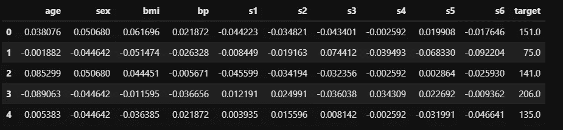

Image by author

# 3.查看功能名称

接下来，我们将看看数据集中有哪些列。在较大的数据集中(包含数百个要素)，通过查看前几条记录来了解要素可能是不可能的。因此，只看特征可能会有所帮助。在这一步中，建议参考由客户或项目的任何其他涉众共享的元数据文档。这将使您对数据集中的要素有一个很好的了解。

Image by author

# 4.查看要素的数据类型

因为，我们已经了解了数据集中的特征。查找要素的数据类型，并更正任何异常的数据类型。

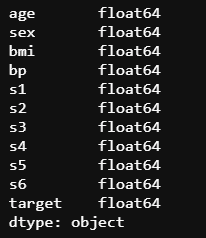

Image by author

从上面的结果中，我们可以看出‘feature’性属于‘float’数据类型。因此，我想看看它的唯一值，以了解变量中有什么。

Image by author

元数据说特征是缩放的，因此“性别”具有这些值。因为该特性有 2 个值，所以我想将其编码为 0 和 1。我将把值< 0 to 0 and value >编码为 0 到 1。

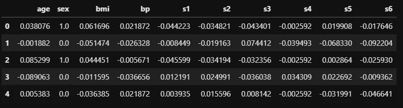

Image by author

# 5.查看特性的统计摘要

特征的统计概要有助于检查特征分布和异常(如果有的话)。

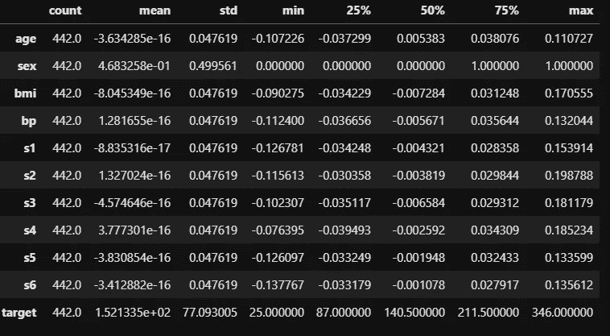

Image by author

从上面的结果中，我可以看到数据中没有丢失值。除“性别”外，几乎所有输入特征的平均值和中值都不接近，这可能是由异常值引起的。除了‘性’之外，所有的特征都具有相同的离差(std)。数字特征的方差似乎接近于零。然而，查看与中值相关的离差值可能会有所帮助。

# 6.将数字、分类和目标要素名称存储在单独的变量中

将数字、分类和目标特征名称存储在单独的变量中简化了 EDA 的过程。

我将“性别”变量从浮点数转换为整数，因为我想把它看作是一个分类变量。

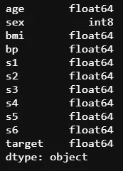

Image by author

将浮点数据类型的要素名称存储到名为“numeric_features”的变量中，并将“sex”存储到名为“categorical _ features”的变量中。目标特征将存储在名为“target”的变量中。

Image by author

# 7.在要素中查找缺失值

查看每个要素中缺失值的百分比。

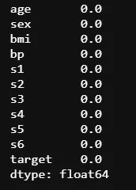

Image by author

没有要素缺少值。

# 8.查看分类特征值的相对频率

分类变量的值的相对频率帮助我们得到基数和稀有标签的概念。

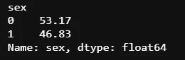

Image by author

# 9.查看数字特征的分布

首先，我们将绘制数值变量的直方图。

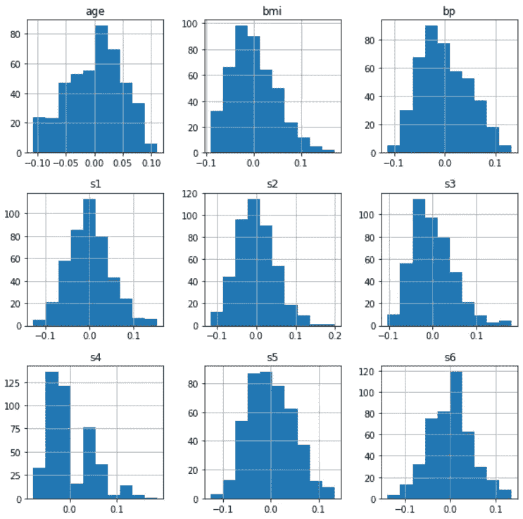

Image by author

除了“s4”和“年龄”之外，所有变量看起来都正常。然而，谨慎的做法是使用密度图进一步研究特征分布。

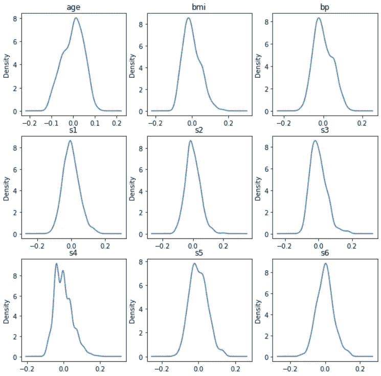

Image by author

除了“s4”之外，所有变量看起来都接近高斯分布。Q-Q 图也可用于评估特征的正态性。现在我们将使用 scipy 中的“normaltest”来测试正态性。

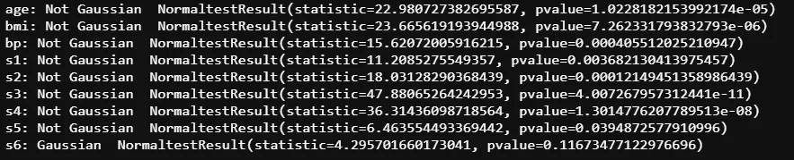

Image by author

从 scipy 的“normaltest”结果来看，除了“s6”之外，没有任何数字特征看起来是高斯型的。然而，密度图显示所有变量都接近高斯分布。因此，应用变量变换可以帮助他们看起来更高斯。

# 10.用中位数来看相对标准偏差值

查看标准差/中值可以清楚地了解方差为零或接近零的要素。

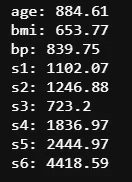

Image by author

以中值百分比表示的标准偏差值表明，没有任何数值特征的方差为零或接近于零。

# 11.查看分类特征的分布

条形图可用于查看分类变量的分布。这一步可以省略，因为我们已经有了分类变量相对频率的概念。

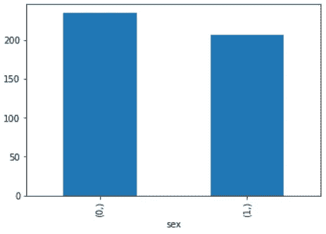

Image by author

# 12.查看目标特征的统计数据。

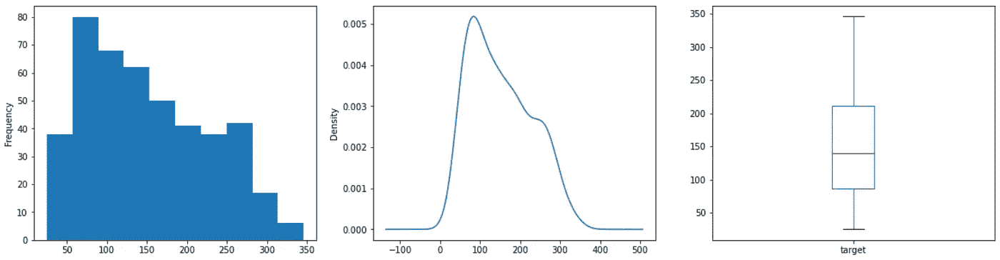

Image by author

所有三个图都显示了目标变量的适度右/正偏斜分布。

# 13.查看分类特征和目标特征之间的关系

箱线图是可视化数值和分类特征之间关系的最佳方式之一。

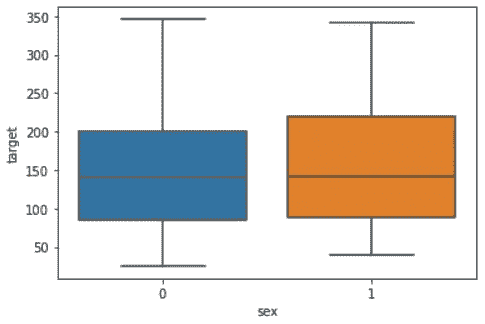

Image by author

方框图表明,‘性’和‘目标’之间没有很强的关系。“性”的值 1 在目标方面具有更大的扩散。

# 14.查看数字特征和目标特征之间的关系

散点图是可视化数字特征之间关系的最佳方式之一。

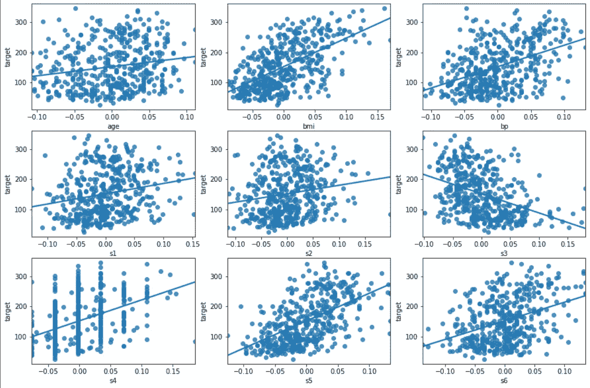

Image by author

bmi '，' bp '和' s5 '与目标显示出良好的线性关系。然而，看看相关性会给我们一个更好的想法。

Image by author

皮尔逊相关系数显示‘BMI’、‘BP’、‘S4’、‘S5’和‘S6’与目标正相关。但是关系没有那么牢固。而‘S3’与目标负相关。因为 Pearson 的相关系数测量特征之间的线性关系，所以谨慎的做法是也查看 Kendall 的相关系数以找出单调关系(如果有的话)。

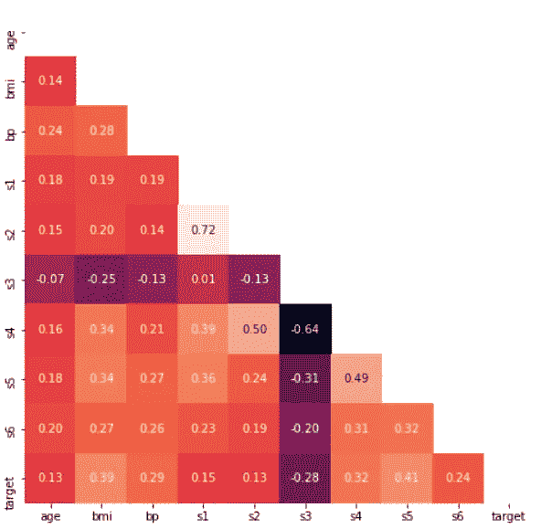

Image by author

肯德尔相关系数表明，数字特征和目标之间没有强单调关系。

# 15.寻找多重共线性

上面的散点图显示，很少有像“s1”和“s2”这样的输入特征彼此之间有很强的相关性。使用可变通货膨胀系数(VIF)来消除这些相关特征是谨慎的。

这是一个基本 EDA 模板的解释，可以应用于任何回归问题。视问题而定，可能需要额外的 EDA。本文中使用的数据集是一个整洁的数据集。然而，实际上数据并不整齐，因此，在进一步进行数据分析之前，EDA 阶段还包括数据清理过程(类似于我们对“性别”变量所做的)。