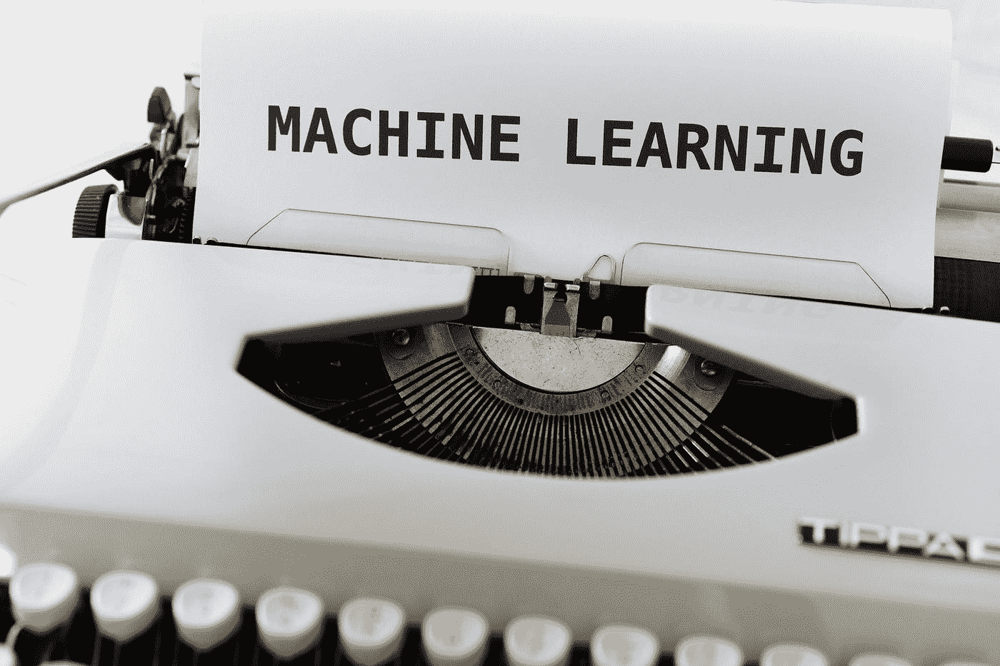
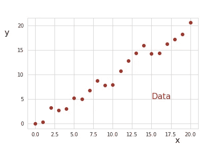
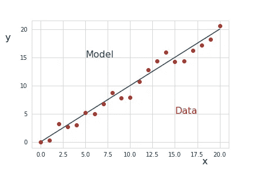
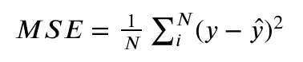
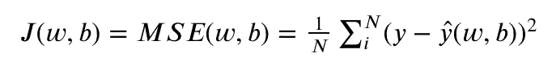
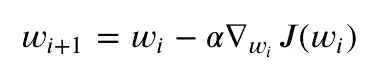
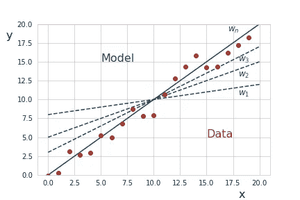

# 线性回归解释的机器学习

> 原文：<https://medium.com/mlearning-ai/basic-machine-learning-recipe-2872c1ff1a38?source=collection_archive---------7----------------------->

## 机器学习算法的基本配方

Photo by [Markus Winkler](https://unsplash.com/@markuswinkler?utm_source=medium&utm_medium=referral) on [Unsplash](https://unsplash.com?utm_source=medium&utm_medium=referral)

## 介绍

线性回归是在许多科学和经济领域中使用的流行算法。在这篇文章中，我们将把线性回归放在机器学习的背景下。我们将以线性回归为例，讨论理解机器学习概念所需的基本方法。简单的线性回归可能是机器学习算法最简单的例子，这正是它如此适合这项任务的原因。

## 机器学习背景下的线性回归

一个典型的工作流程是，当我们执行线性回归时，我们有一些数据 *x* 和 *y* ，我们假设它们有线性关系*。*

Linear Regression data example

在机器学习语言中，我们会说我们有一个带有输入数据 *x* 和目标数据*y*的*数据集(x，y)* ，下一步是对数据拟合一条线性线。

Linear Regression: Data and Model

换句话说，我们有一个*模型*，它通过关系𝑦̂ *= wx + b.* 来近似我们的数据，也就是说，为了用线性回归来近似我们的数据，我们需要找到机器学习中的参数 *w* 和 *b.* ，这些是所谓的*可训练参数。*

我们不希望找到任何模型来近似我们的数据，但我们希望找到“最佳”模型，即与我们的真实(目标)数据相比误差最小的“最佳”模型。线性回归中的误差通常用 [*均方误差*](https://en.wikipedia.org/wiki/Mean_squared_error) (MSE)来衡量。通过计算真实值( *y* )和预测值(𝑦̂)之间的平方差来定义 MSE，然后对其求和，最后除以数据集的长度( *N* )。

Mean squared error

我们可以根据(可训练)参数 *w* 和 *b* 将 MSE 视为一个函数，我们将这个函数称为[*损失函数*](https://en.wikipedia.org/wiki/Loss_function) *(J)。*有时也被称为*目标函数*、*成本函数、*或*误差函数*。

Mean squared error as loss function depending on parameters w and b

如果我们想找到误差最小的“最佳”模型，我们需要最小化关于 *w* 和 *b* 的损失函数。最小化损失函数的最终参数𝑤̂和𝑏̂然后被用于最终模型。寻找‘最佳’参数的过程就是机器学习中我们所说的*训练*。

## 通过梯度下降训练模型

现在让我们考虑寻找最佳参数𝑤̂和𝑏̂ *、*的过程，即*训练*。对于简单的线性回归，我们可以解析地解决这个最小化问题。(即计算导数并将其设置为零)。然而，在实践中——当涉及到编码时——使用迭代优化技术。最常见的一种叫做 [*渐变下降*](https://en.wikipedia.org/wiki/Gradient_descent) 。

为了理解梯度下降的概念，让我们画出损失函数( *J* ) —在我们的例子中是均方误差。为简单起见，此处仅示出一维，即 *J* 仅被认为取决于 *w，*和 *b* 保持不变。

Gradient descent illustrated for mean squared error as loss function

梯度下降的想法是从某个值开始，然后向最小值迈出一小步——“向最小值”意味着向最陡下降的方向移动，这是该位置的负梯度方向。上图说明了这一点。也就是说，我们有一个迭代算法，在每个迭代步骤中，我们通过在负梯度方向上前进一步来更新我们的参数 *w* 。步长的大小叫做 [*学习率*](https://en.wikipedia.org/wiki/Learning_rate) (𝛼)，是我们在训练过程中要优化的一个所谓的超参数。α的大小影响着算法的收敛性。如果它很小，收敛到最小值需要很长时间。另一方面，如果它太大，我们可能会错过最小值。这可以表述为

Gradient descent: calculate iteratively the next value for the weight

总而言之，我们从一个任意值 w1 开始，当我们用这个 w1 来近似我们的模型的数据时，我们可能会有一个相当大的误差。然后，我们向负梯度方向迈出𝛼大小的一步，得到一个新的 w1。使用 w1 作为参数的模型与真实数据相比应该比第一个模型具有更小的误差。我们继续这个算法，直到我们找到一个足够接近我们的数据的模型。这个过程的草图是这样的。

Sketch of the approximation to the data during training

这是梯度下降的基本算法。实际上有不同的变体:

*   批量梯度下降:整个数据集用于更新参数(如上所述)。
*   小批量梯度下降:数据集的子集(小批量)用于更新参数。
*   随机梯度下降:在每个数据点之后更新权重。

通常，使用小批量梯度下降，这是计算时间和收敛性之间的折衷。子集(小批量)的大小是我们必须优化的另一个超参数。在小批量梯度下降中，误差不一定在每次迭代后减少，因为我们不查看整个数据集。关于梯度下降、其变体及其利弊的详细解释可以参见 [I. Dabburas 文章【1】](https://towardsdatascience.com/gradient-descent-algorithm-and-its-variants-10f652806a3)和 [ML 词汇表【2】](https://ml-cheatsheet.readthedocs.io/en/latest/gradient_descent.html)中的实现示例。

## 机器学习的基本方法

总而言之，执行线性回归的主要步骤是:

1.  数据集(*输入*，*目标* ) = ( *x* ， *y* )
2.  建立一个模型(这里是:线性回归)
3.  定义一个损失函数(这里是:均方误差)
4.  通过最小化损失函数来训练模型(这里:使用梯度下降)

正是这些步骤也是大多数机器学习算法的基本配方。也就是说，知道如何执行线性回归意味着我们已经有了更高级的机器学习算法的基础，我们只需要调整模型。

## 进一步阅读

*   [1] [一、达布拉](/@ImadPhd?source=post_page-----10f652806a3--------------------------------)，梯度下降算法及其变体(2017)，towardsdatascience，[https://towards data science . com/Gradient-Descent-Algorithm-and-Its-Variants-10f 652806 a3](https://towardsdatascience.com/gradient-descent-algorithm-and-its-variants-10f652806a3)
*   [2] ML 词汇表(2017)，[https://ML-cheat sheet . readthedocs . io/en/latest/gradient _ descent . html](https://ml-cheatsheet.readthedocs.io/en/latest/gradient_descent.html)

 [## 每当弗劳克·阿尔布雷特出版时，就收到一封电子邮件。

### 每当弗劳克·阿尔布雷特出版时，就收到一封电子邮件。通过注册，您将创建一个中型帐户，如果您还没有…

medium.com](/@frauke.albrecht/subscribe)  [## 通过我的推荐链接加入媒体

### 阅读 Frauke Albrecht 的每一个故事(以及媒体上成千上万的其他作家)。您的会员费直接支持…

medium.com](/@frauke.albrecht/membership)  [## Mlearning.ai 提交建议

### 如何成为 Mlearning.ai 上的作家

medium.com](/mlearning-ai/mlearning-ai-submission-suggestions-b51e2b130bfb)