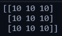
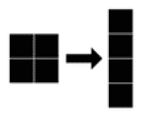
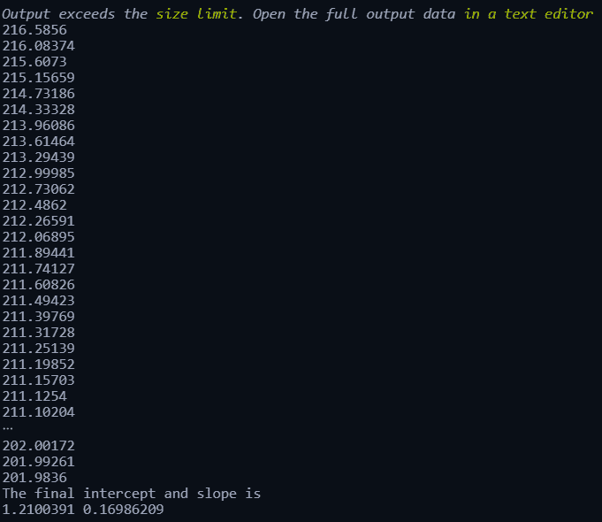

# 张量流的基本运算

> 原文：<https://medium.com/mlearning-ai/basic-operations-of-tensorflow-bf206868f491?source=collection_archive---------3----------------------->

## DNN 张量流基本原理

Photo by [Mourizal Zativa](https://unsplash.com/@mourimoto?utm_source=medium&utm_medium=referral) on [Unsplash](https://unsplash.com?utm_source=medium&utm_medium=referral)

Tensorflow 在过去几年中因深度学习模型而获得了很多关注。它为神经网络的创建提供了简单的 API，可以在不同的平台上有效地扩展和托管。张量是一个数学术语，定义如下:

> *在数学中，一个* ***张量*** *是一个代数对象，它描述了与一个向量空间相关的代数对象集合之间的多线性关系。*
> 
> *维基百科*

一般来说，张量是一个多维数组。然而，Tensorflow 是一个 python 框架，它有一套全面的工具和库来创建机器学习项目。这里，张量与张量流的关系是指大部分输入、中间和输出数据都是张量形式。在这篇博客中，我们将学习 TensorFlow 的基本操作，并构建一个简单的线性回归神经网络。

# 张量流常数和变量

Tensorflow 使用自己的常量类型，变量也有不同的方法来声明、定义和初始化它们。主要原因是在神经网络的多种运算中使用了 Python 向量化和广播，这对于标准的常量和变量是不可能的。常量和变量可以使用 TensorFlow 包中的**常量和变量函数来声明。见上面代码快照 TensorFlow 导入为 tf 并声明了常量和变量。**

# 零和一

当在神经网络的工作中执行各种操作时，我们必须将所有元素都初始化为 0 或 1 的矩阵。Tensorflow 具有 0 和 1 函数，可用于在一行代码中创建它们。参见下面的代码快照，tf.ones 用于创建一个 3 乘 2 的矩阵，所有 1 的数据类型为 int32。类似地，也可以为零点创建矩阵。假设我们希望创建一个 1 和 0 的矩阵，并且它的形状应该类似于一个已经存在的张量，我们可以使用张量包中提供的函数。在下面的代码中，A1 和 A23 是两个常量张量，B1 和 B23 是使用 A1 和 A23 的形状创建的。使用 ***zeros_like 可以执行类似的操作。***

为神经网络中的前向传播创建权重和偏差张量时，1 和 0 函数非常有用。除了 1 和 0，我们还可以使用 ***tf.fill*** 方法初始化任意形状的张量。

# 操作

使用张量流实现神经网络需要在常数和变量之间执行各种操作。在本节中，将通过代码简要讨论一些常见的操作。

# 增加

张量的添加是程序员可能需要执行的简单而重复的过程。TensorFlow 中的加法是按元素执行的，可以使用以下代码完成。

a3 将两个张量的每个元素相加，并存储在合成张量中。请参见下面打印命令的结果。对于 a3 张量的每个元素，七加三的结果是十。

# 乘法和矩阵乘法

张量的乘法有两种方法，第一种是元素乘法，就像加法一样，第二种是矩阵乘法。两者都可以使用 Tensorflow 轻松实现，参见下面的代码。

在进行乘法运算时，需要记住张量的形状。在逐元素乘法中，两个张量的形状应该完全相同。但是，对于矩阵乘法，第一个张量的列数应该与第二个张量的行数相同。

# 减少功能

在神经网络的实现中，我们可能需要将一个张量简化成一个单一的值。因此，这个单一值将反映神经网络的下一层或输出的完整张量。

在上面的代码中，我举了一个 reduce_sum 的例子，但是，有许多函数与 reduce 方法相关，如下表所示。

# 梯度

当更新神经网络中张量的权重时，我们需要找到损失或使用的其他函数的最小值、最大值或最佳值。梯度可以帮助我们识别，因为梯度等于零是最佳值，梯度变化大于零，我们可以进一步最小化该值，最后，梯度小于零，我们可以最大化该值。用简单的语言来说，梯度提供了一个变量的变化率取决于另一个变量的变化。

在上面的代码中，我们使用了上下文管理器和渐变磁带函数来观察变量的渐变。随着 ***x*** 的任何变化，它监控 ***y*** 的变化。更多详情请访问 [GradientTape](https://www.tensorflow.org/api_docs/python/tf/GradientTape) 页面。

# 使再成形

神经网络广泛用于图像处理，然而，图像以矩阵格式以范围在 0 到 255 之间的数值的形式存储。但是，神经网络只接受一维输入，因此我们需要将输入图像整形为一维张量，以便它可以被馈送到神经网络。整形功能对此很有用。在下面的代码中，我们使用随机数创建了一个简单的灰度图像，然后将这个图像转换成一个线性张量。代码下方的图像显示了 2*2 图像的图形表示。

# 随机数生成

初始化权重或偏差张量的最佳方法是使用随机过程分布。TensorFlow 提供了各种随机数生成器，可直接用于使用随机分布的值生成张量。在 reshape 函数的代码中，我们使用均匀随机分布创建了一个图像，其中最大值为 255。同样，我们可以使用`[categorical](https://www.tensorflow.org/api_docs/python/tf/random/categorical)`、`[fixed_unigram_candidate_sampler](https://www.tensorflow.org/api_docs/python/tf/random/fixed_unigram_candidate_sampler)`、`[gamma](https://www.tensorflow.org/api_docs/python/tf/random/gamma)`、`[poisson](https://www.tensorflow.org/api_docs/python/tf/random/poisson)`、`[normal](https://www.tensorflow.org/api_docs/python/tf/random/normal)`、`[stateless_binomial](https://www.tensorflow.org/api_docs/python/tf/random/stateless_binomial)`等来生成随机数。请访问[该](https://www.tensorflow.org/api_docs/python/tf/random)页面了解所有随机数发生器功能。

# 神经网络的损耗

这种损失实际上有助于理解神经网络对于任何预测任务的准确性。它还显示了训练过程训练重量的路径。所有权重更新都基于从目标输出的预测输出生成的损失值。损失基本上分为分类和回归两类问题。分类问题多使用`[BinaryCrossentropy](https://www.tensorflow.org/api_docs/python/tf/keras/losses/BinaryCrossentropy)`、`[CategoricalCrossentropy](https://www.tensorflow.org/api_docs/python/tf/keras/losses/CategoricalCrossentropy)`、`[CosineSimilarity](https://www.tensorflow.org/api_docs/python/tf/keras/losses/CosineSimilarity)`。另一方面，回归问题使用`[MeanAbsoluteError](https://www.tensorflow.org/api_docs/python/tf/keras/losses/MeanAbsoluteError)`、`[MeanSquaredError](https://www.tensorflow.org/api_docs/python/tf/keras/losses/MeanSquaredError)`和`[Huber](https://www.tensorflow.org/api_docs/python/tf/keras/losses/Huber)`。要了解更多详情，您可以访问 TensorFlow 的文档页面，了解损失[这里](https://www.tensorflow.org/api_docs/python/tf/keras/losses)。

# 优化者

顾名思义，这些方法优化了神经网络的权重和偏置张量，以最小化我们在前面的块中学习到的损失。更详细的比较和优化器的工作可以从[这篇](https://towardsdatascience.com/overview-of-various-optimizers-in-neural-networks-17c1be2df6d5)关于媒体的文章中读到。基本的优化器是梯度下降，它使用下面的等式基于损失值的梯度更新权重和偏差。

W = W—αδW

然而，最常用的优化器是 ADAM 优化器。Tensorflow 文档在[该](https://www.tensorflow.org/api_docs/python/tf/keras/optimizers)页面上提供了关于每个优化器的详细信息。

# 使用张量流的线性回归

现在让我们使用上述知识，创建一个简单的模型来训练线性回归的截距和斜率变量，见下面的代码。auto-mpg 数据集从 Kaggle 下载，从数据集中提取两列作为 NumPy 数组(行:2，3)。线性回归的截距和斜率被创建为张量流变量，初始值均为 0.2(线:6，7)。定义了一个 linear_regression 函数，它根据线性回归方程返回值(第 10，11 行)。还定义了一个损耗函数，它使用 mse 计算损耗并返回它(第 14 -18 行)。使用 Adam 优化器，它试图通过在 1000 次迭代中操纵截距和斜率的值来最小化损失。截距和斜率的损失和最终值被打印出来，见代码下面的输出图像。我们可以看到损失在逐渐减少。

# 结论

在这篇博客中，我们讨论了构建神经网络模型所需的张量流的一些基础知识。最后，我们创建了一个简单的线性回归模型来寻找截距和斜率的最佳值。这篇博客的目的是讨论在使用高级 API 开发复杂应用的神经网络之前，我们需要学习的一些基础知识。

*原载于 2022 年 2 月 9 日*[*【http://rajindersandhu.com】*](https://rajindersandhu.com/2022/02/09/basics-of-tensorflow/)*。*

 [## Mlearning.ai 提交建议

### 如何成为 Mlearning.ai 上的作家

medium.com](/mlearning-ai/mlearning-ai-submission-suggestions-b51e2b130bfb) 

[成为 ML 写手](/mlearning-ai/mlearning-ai-submission-suggestions-b51e2b130bfb)