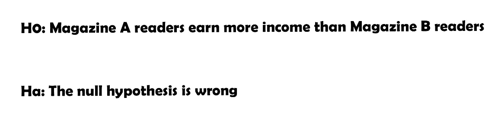
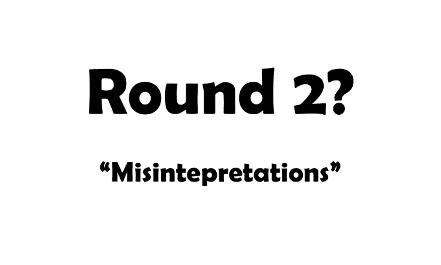

# 对抗 P 值:第 1 轮

> 原文：<https://medium.com/mlearning-ai/battle-against-p-value-round-1-4e15fa932d61?source=collection_archive---------5----------------------->

无论你是否对**统计**感兴趣，我相信你至少听过(或用过)一次 p 值。在许多领域，你需要进行统计方法来解释你的模型的结果，就此而言，你已经获得了所谓的 ***P 值*** 。然而，它的定义让学生们非常头疼，并产生了许多困惑。

Who the hell are you?

当你读完这篇文章的时候，你将学会(至少)如何解释 p 值。常见的错误将在第 2 和第 3 轮中解释。让我们一步一步来解决这个问题。

## 我的一位统计学教授说，地球上的许多研究实际上是无用的，因为对统计数字的误解，仅仅是 p 值。

在维基百科上，p 值的定义是这样描述的:

在 ***零假设显著性检验*** *中，p 值是* ***获得检验结果的概率*** ***至少与*** *实际观察到的结果一样极端，在* ***下，零假设是正确的*** *。非常小的 p 值意味着在零假设下，这种极端的观察结果* ***非常不可能*** *。*

你感觉如何？你明白意思了吗？我不这么认为。因此，让我给你一个简单的例子来强调一些在定义中被加粗的关键概念(在我看来)。

hypothesis-testing

让我们假设我们已经使用了 ***一个线性模型*** 来**预测**人口的 **(A & B)** 收入**(有 2 个以上的变量)**，我们想测试一下这个假设检验。

更重要的是，这里我们假设有**两个不同的显著性检验 p 值**。

# 1.p = 0.04

# 2.p = 0.15

***(注:显著水平【α】设为 0.05)***

你会如何解读它们？想一想，然后来检查我的答案。

**1。p 值低于 alpha (0.04 < 0.05)，因此，我们拒绝 H0。**

## 我们以 95%的可信度得出结论，在其他条件相同的情况下，杂志 A 读者的平均收入**不会高于杂志 B 读者的平均收入**。

(换句话说，这两个人群的收入差异**没有统计学意义**！我再改一下我的话。嗯，想象一下，你有多大可能遇到一个和你收入完全一样的人？**即使你的收入比一个随机杂志 B 的读者高，你也不能真的用这个结果说你的收入和他的收入在统计概念上有显著的不同。**这是第一个例子告诉我们的。)

**2。p 值大于α(0.15>0.05)，因此，我们不能拒绝 H0。**

这次我再问你一个问题:你会说 **…大于…** 因为你可能会认为**的结果是 1 的反义词吗？**

## **不，完全错了！**

正确的解释是，

## 我们以 95%的可信度得出结论，在其他条件相同的情况下，杂志 A 读者的预测平均收入“可能”高于杂志 B 的收入。

你感觉到不同了吗？

严格地说，如果你不能拒绝 H0，你就不能肯定它。换句话说，无论 p 值有多高(如果我们不能拒绝 H0)，我们都不能真的说 H0 是错的，因为 p 值解释的基础假设**“如果零假设为真！”(正如上面的定义已经解释过的)**

为什么？因为统计学是对不确定性的研究(给定你所拥有的资源，最小化错误，最大化正确预测)。即使有非常非常小的可能性，它也可能发生，因为无论如何可能性都不是 0。这就是为什么许多研究，甚至一些关于自然的研究，都暴露出研究中存在严重缺陷的原因之一。

这篇文章的寓意很简单。解释 p 值时要小心。它会让你的学术研究完全过时。

下一轮我会给大家介绍 p 值解读的常见错误。

Please look forward to it!

感谢阅读！