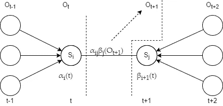
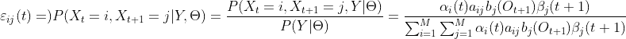
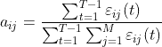
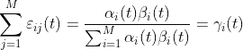
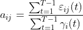
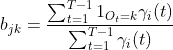
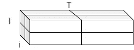

# 鲍姆-韦尔奇算法

> 原文：<https://medium.com/mlearning-ai/baum-welch-algorithm-4d4514cf9dbe?source=collection_archive---------0----------------------->

## 在隐马尔可夫模型训练下


[Source](https://pixabay.com/photos/chain-link-metal-strong-connect-690088/)

## 介绍

这篇文章旨在展示如何使用 Baum-Welch 算法训练隐马尔可夫模型(hmm)。如果你想了解更多关于隐马尔可夫模型的知识，我建议看一些帖子:

*   [机器学习—隐马尔可夫模型(HMM)](https://jonathan-hui.medium.com/machine-learning-hidden-markov-model-hmm-31660d217a61)
*   [可能性问题](/@Ayra_Lux/hidden-markov-models-part-1-the-likelihood-problem-8dd1066a784e)
*   [解码 HMM](/@Ayra_Lux/hidden-markov-models-part-2-the-decoding-problem-c628ba474e69)

这篇文章假设你熟悉像跃迁、发射概率、隐藏状态、观察、向前和向后算法这样的概念。

## **目标**

Baum-Welch 算法寻找最适合观察数据的 HMM 参数值。对于培训，我们需要:

*   O₁，O₂，…，Oₙ
*   这些观察的隐藏状态序列 S₁，S₂，…，Sₙ

算法尝试使用 O 和 s 的值来估计转移矩阵 A 和发射矩阵 B。如果我们知道 A 和 B，我们可以使用 HMM 和新的未看到的数据来找到与观察值相对应的最可能的隐藏状态序列(这称为解码问题)。

## 期望最大化

Baum-Welch 算法使用[期望最大化](https://en.wikipedia.org/wiki/Expectation%E2%80%93maximization_algorithm) (EM)方法来计算 A 和 b 的值。流程如下:

*   用一些初始值初始化 A 和 B(只做一次)
*   使用 a、b、o 和 s 估计潜在变量ξᵢⱼ(t 和γᵢ(t)(我将在后面解释这些变量的含义)。这一步的目标是估计每个转换和排放使用了多少。这是评估步骤
*   使用前面步骤中的估计值(潜在变量)最大化 A 和 B 的值。这是最大化步骤
*   继续前面的步骤，直到收敛

## 初始方程

为了估计 A 和 B 值，我们可以使用以下公式([来源](https://web.ece.ucsb.edu/Faculty/Rabiner/ece259/Reprints/tutorial%20on%20hmm%20and%20applications.pdf)):

*   A = aᵢⱼ(从隐藏状态 I 转换到隐藏状态 j 的概率)=从隐藏状态 I 转换到状态 j 的预期次数/从隐藏状态 I 转换的预期次数
*   B = bⱼₖ(在隐藏状态下观察观察 Oₖ的概率 j)=模型在隐藏状态下的期望次数 j 而我们在隐藏状态下观察 Oₖ/的期望次数 j

给定观察序列 o 和模型([源](http://www.adeveloperdiary.com/data-science/machine-learning/derivation-and-implementation-of-baum-welch-algorithm-for-hidden-markov-model/))，aᵢⱼ可以被定义为在时间 t 处于隐藏状态 I 和在时间 t+1 处于隐藏状态 j 的概率。从图形上看，它可以描述如下:



Current step probability with forward, backward and emission probability. Inspiration from [here](http://www.adeveloperdiary.com/data-science/machine-learning/derivation-and-implementation-of-baum-welch-algorithm-for-hidden-markov-model/)

在图中，我们在时间 t，我们知道我们在当前隐藏状态 Sᵢ的概率(这是前向概率αᵢ(t)，我们知道从隐藏状态 Sⱼ到序列末端的隐藏概率，使用后向概率βᵢ₊₁(t).我们想得到从 Sᵢ到 Sⱼ的概率，假设我们在 t+1 时刻观察到 Sⱼ的 Oₜ₊₁。

这里我们将利用潜变量ξᵢⱼ(t)和γᵢ(t):

*   **ξᵢⱼ(t)**-在给定的观测值下，在时间 t 从隐藏状态 I 转移到隐藏状态 j 的概率:



[source](https://jonathan-hui.medium.com/machine-learning-hidden-markov-model-hmm-31660d217a61)

注意，分母 P(O |θ)表示在给定模型θ的情况下，观察序列 O 通过任何路径的概率。ξᵢⱼ(t)仅针对时间 t 来定义。我们必须对所有时间步长求和，以获得从隐藏状态 I 到隐藏状态 j 的所有转换的总联合概率(计算 aᵢⱼ).这将是我们 aᵢⱼ.方程的分子对于分母，我们可以使用边际概率，这意味着在时间 t 处于状态 I 的概率，整个方程具有以下形式:



[source](http://www.adeveloperdiary.com/data-science/machine-learning/derivation-and-implementation-of-baum-welch-algorithm-for-hidden-markov-model/)

分母可以有不同的表达，并导致一个新的潜在变量γᵢ(t):



[source](http://www.adeveloperdiary.com/data-science/machine-learning/derivation-and-implementation-of-baum-welch-algorithm-for-hidden-markov-model/)

*   **——给定状态 I 在时间 t 给定观测值下的概率。我们可以用它来计算 aᵢⱼ(我们之前对 aᵢⱼ的公式也是有效的):**

****

**[source](http://www.adeveloperdiary.com/data-science/machine-learning/derivation-and-implementation-of-baum-welch-algorithm-for-hidden-markov-model/)**

**我们可以使用γᵢ(t)来计算 bⱼₖ(它是来自给定隐藏状态 j 的观测值 o 的观测值 Oₖ的概率):**

****

**[source](https://jonathan-hui.medium.com/machine-learning-hidden-markov-model-hmm-31660d217a61)**

**注意，1ₒₜ₌ₖ是一个指示函数，如果观测值 Oₜ属于类 k，则该函数的值为 1，如果不属于类 k，则该函数的值为 0。**

****HMM 中的期望和最大化****

**现在我们有了分别计算分量的方程，我们可以形成 EM 方法。我们有两个步骤:**

*   **计算潜在变量ξᵢⱼ(t 和γᵢ(t).的期望值首先，我们将随机初始化 A 和 B，或者使用一些以前的知识，如果我们有的话**
*   **使用 aᵢⱼ和 bⱼₖ.的等式，最大化 a 和 b 的值并且通过使用用于估计ξᵢⱼ(t 和γᵢ(t).的新的 a 和 b 值来进行下一轮**

**这就像鸡和蛋的问题。我们只有观察，我们从随机猜测开始(或者如果我们有更多的信息，我们可以使用它)。我们估计我们的潜在变量，我们将使用它来最大化 A 和 B。在每一步，我们应该得到更多更好的估计 A 和 B，直到改进很小，算法已经收敛。**

****Python 实现****

**拥有方程是很好的，但是用代码实现可以更好地理解重要的细节是什么，以及整个过程是什么样子的。这里我将首先给出和实现，然后解释是怎么回事。完整代码可在[这里](https://github.com/RRisto/learning/blob/master/markov_chain_learn/baum_welch.ipynb)获得，大部分是从[这里](http://www.adeveloperdiary.com/data-science/machine-learning/derivation-and-implementation-of-baum-welch-algorithm-for-hidden-markov-model/)借用的。**

**让我们来看看这个函数:**

*   **第一行只是初始化(注意这个函数期望 A 和 B(对应于前面部分中的 A 和 B)用一些(随机)值初始化)。`M = a.shape[0]`是隐藏状态的个数。`T = len(O)`是我们观察到的时间步数(观察次数)**
*   **接下来我们将开始迭代`n_iter`的迭代次数**
*   **在每次迭代中，我们将计算阿尔法(αᵢ(t)-forward 概率)和贝塔(βⱼ(t+1)-backward 概率)。我们将对所有时间步长做一次:**

```
alpha = forward(O, a, b, initial_distribution)
beta = backward(O, a, b)
```

*   **我们必须初始化一个变量`xi`，它将保存ξᵢⱼ(t):的值**

```
xi = np.zeros((M, M, T - 1))
```

**`xi`是三维矩阵/阵列(或者我们可以说是张量)它的维度有如下含义。一侧是状态 I，另一侧是状态 j 和时间 T 的一维(示例假设有两个唯一的隐藏状态和两个时间步长):**

****

**Dimensions of variable xi**

**对于每个时间步长 t，将有一个从状态 I 转换到 j 的概率矩阵/阵列(给定的观察值)**

*   **如果我们进入循环`for t in range(T-1)`，我们开始计算`xi`的值。使用`T-1`,因为我们在具有 T 个时间步长(观察值)的序列中有`T-1`个转换。首先，我们将计算ξᵢⱼ(t 的分母(记住，分母是指给定模型的任何路径的观测序列`O`的概率):**

```
denominator = (alpha[t,:].T @ a * b[:, O[t + 1]].T) @ beta[t + 1, :]
```

**我们取时间 t 的α(前向概率)和转移概率(矩阵`a`)之间的点积，乘以时间 t 的观测值`O`的发射概率，最后我们取β(后向概率)的点积。**

*   **下一部分涉及计算ξᵢⱼ(t 的分子)并将分子除以分母:**

```
for i in range(M):                
    numerator = alpha[t,i] * a[i,:] * b[:,O[t+1]].T * beta[t+1,:].T                
    xi[i, :, t] = numerator / denominator
```

**请注意，分子的计算与分母的计算非常相似。我们现在关心的是特定的状态`i`，而不是在时间`t`获取所有状态的α和`a`。我们在每个时间步`t`循环它们。对于每个时间步长，我们将分子除以分母，并将结果存储在变量`xi`中。**

*   **接下来，我们将通过在维度 1(在γᵢ(t 是 j)上求和来计算伽马(γᵢ(t)的真值:**

```
gamma = np.sum(xi, axis=1)
```

*   **现在我们可以做一个最大化步骤。这直接来自 aᵢⱼ的公式，其中我们对维度 2(在时间步长上)上的`xi`求和，并将其除以维度 1 上的【γᵢ(t】的求和(在时间步长上，伽马已经少了一个维度，因为之前对维度 1 上的`xi`求和):**

```
a = np.sum(xi, 2) / np.sum(gamma, axis=1).reshape((-1, 1))
```

*   **接下来，我们将添加额外的元素到伽玛。这是需要的，因为我们已经为`T-1`时间步长计算了伽马，但是我们需要 t 个发射概率(bⱼₖ)(例如，如果我们有 3 个观测值，我们将有两个状态之间的跃迁和 3 个来自隐藏状态的发射概率)。我们将再次添加倒数第二个元素作为最后一个元素:**

```
gamma=np.hstack((gamma, np.sum(xi[:,:,T-2],axis=0).reshape((-1,1))))
```

*   **计算 bⱼₖ的最后准备工作包括设置参数 k，它表示唯一观测值的数量。此外，我们还将计算分母，这涉及到在维度 1 上对 gamma 求和(跨时间步长):**

```
K = b.shape[1]
denominator = np.sum(gamma, axis=1)
```

*   **最后，我们可以通过循环唯一的观察值(唯一的 O-s)来计算 bⱼₖ。这是需要的，因为对于每个唯一的观测值，我们必须在时间步长上对伽马求和(如果观测值有这个值)。注意`O == l`是指示灯功能。最后一步是分子除以分母:**

```
for l in range(K):
            b[:, l] = np.sum(gamma[:, O == l], axis=1)
b = np.divide(b, denominator.reshape((-1, 1)))
```

**我们可以重复这个过程足够长的时间，我们可以近似 A 和 b 的精确值。**

## **使用**

**如何使用我们的 Baum-Welch 实现的完整示例是这里的。这里我将展示一些代码片段:**

```
data = pd.read_csv('data_python.csv.txt')
V = data['Visible'].values# Transition Probabilities
a = np.ones((2, 2))
a = a / np.sum(a, axis=1)
# Emission Probabilities
b = np.array(((1, 3, 5), (2, 4, 6)))
b = b / np.sum(b, axis=1).reshape((-1, 1))
# Equal Probabilities for the initial distribution
initial_distribution = np.array((0.5, 0.5))#train model
n_iter = 100
a_model, b_model = baum_welch(V.copy(), a.copy(), b.copy(), initial_distribution.copy(), n_iter=n_iter)
print(f'Custom model A is \n{a_model} \n \nCustom model B is \n{b_model}')#Custom model A is 
#[[0.53816345 0.46183655]
# [0.48664443 0.51335557]]#Custom model B is 
#[[0.16277513 0.26258073 0.57464414]
# [0.2514996  0.27780971 0.47069069]]
```

**为了验证结果，我们应该获得与`hmmlearn`包实施接近的结果:**

```
model = hmm.MultinomialHMM(n_components=2, n_iter=n_iter, init_params="")
model.startprob_ = initial_distribution
model.transmat_ = a
model.emissionprob_ = bmodel.fit([V])print(np.allclose(a_model, model.transmat_, atol=0.1))
print(np.allclose(b_model, model.emissionprob_, atol=0.1))#True
#True
```

**简单的实现给出了相当相似的结果，这给了我们的 Baum-Welch 版本工作的信心。**

## **摘要**

**这展示了使用 Baum-Welch 算法训练 hmm 背后的一些数学知识，并展示了一个 python 实现。希望这篇文章能让你了解 hmm 是如何训练的，以及如何用 python 实现它。**

## **参考**

*   **期望值最大化算法，[维基百科](https://en.wikipedia.org/wiki/Expectation%E2%80%93maximization_algorithm)**
*   **隐马尔可夫模型的 Baum Welch 算法的推导与实现，Abhisek Jana，[开发者日记](http://www.adeveloperdiary.com/data-science/machine-learning/derivation-and-implementation-of-baum-welch-algorithm-for-hidden-markov-model/)**
*   **隐马尔可夫模型 12:鲍姆-韦尔奇算法，威斯蒙特学院， [Youtube](https://www.youtube.com/watch?v=JRsdt05pMoI)**
*   **隐马尔可夫模型—第一部分:似然问题，
    玛利亚·伯兰多，[中等](/@Ayra_Lux/hidden-markov-models-part-1-the-likelihood-problem-8dd1066a784e)**
*   **隐马尔可夫模型——第二部分:解码问题，Maria Burlando， [Medium](/@Ayra_Lux/hidden-markov-models-part-2-the-decoding-problem-c628ba474e69)**
*   **机器学习—隐马尔可夫模型(HMM)，乔纳森·惠， [Medium](https://jonathan-hui.medium.com/machine-learning-hidden-markov-model-hmm-31660d217a61)**
*   **语音识别中的隐马尔可夫模型和选定应用教程，劳伦斯·拉宾纳，[电气和计算机工程系](https://www.ece.ucsb.edu/Faculty/Rabiner/ece259/Reprints/tutorial%20on%20hmm%20and%20applications.pdf)**