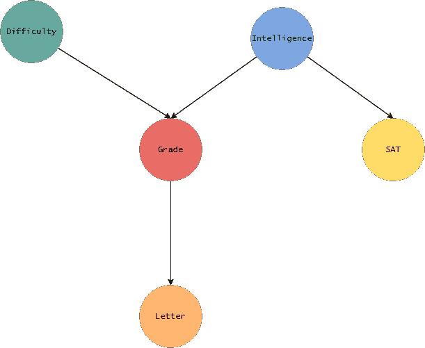

# 贝叶斯网络——独立性和 I-map

> 原文：<https://medium.com/mlearning-ai/bayesian-networks-independencies-and-i-maps-519173977798?source=collection_archive---------7----------------------->

在前两篇文章中，我们研究了如何通过使用因子分解和不同的[推理模式](/mlearning-ai/bayesian-networks-reasoning-patterns-f238bb234a5f)以紧凑的形式表示贝叶斯网络。在本文中，我们将看看贝叶斯网络中的独立性和 I-map。

## 贝叶斯网络中的独立性

我们将再次考虑前一篇文章中的示例，该示例由以下内容给出:

