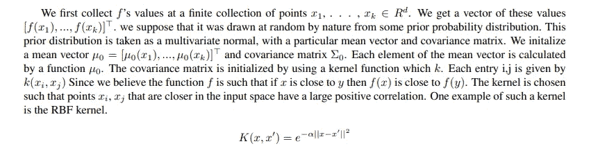
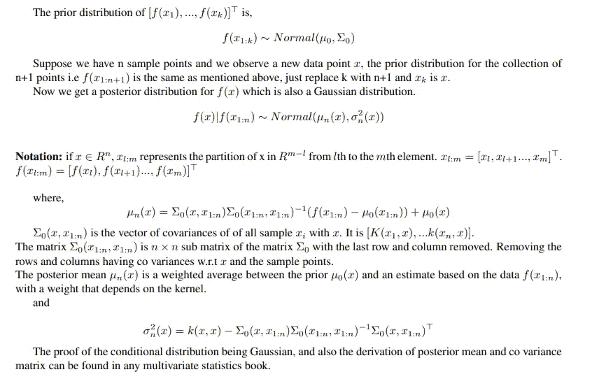
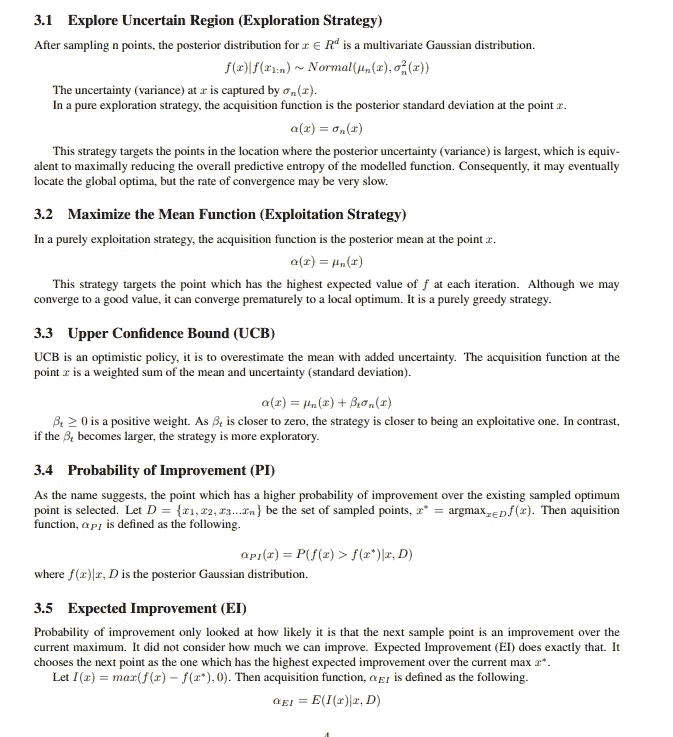

# 贝叶斯优化和超参数调整

> 原文：<https://medium.com/mlearning-ai/bayesian-optimization-and-hyper-parameter-tuning-ec993d528ee5?source=collection_archive---------5----------------------->

1.  **瞎猜**

许多现代机器学习算法都有大量的超参数。调整超参数集的标准方式是具有与训练数据集分离的验证集，通过该验证集，模型的性能被评估并在超参数的不同组合之间进行比较。不是随机尝试
不同的组合，而是考虑一个超参数网格。对于网格上的每个点，在训练数据集上调整和训练模型，然后通过使用作为模型的性能/拟合的良好代理的函数，在验证集上评估模型。这种方法的问题在于，随着模型的复杂性
增加，尝试所有可能的组合在计算上可能变得昂贵，因为网格的大小增加了 O(n^k，其中 k 是要调整的不同超参数的数量。对所有这些参数组合进行简单的网格搜索可能在计算上不切实际。此外，一些猜测是必要的
来指定每个超参数的最小值和最大值。检查网格上所有点的另一种方法是将搜索空间定义为 hyperpa-
参数值的有界域和该域中的随机样本点。这在计算上可能是可行的，但在每次迭代之后，仍然感觉像是在黑暗中冒险。人们希望有一种算法能够在选择下一个超参数来评估模型时迭代地变得更好
，而贝叶斯优化恰恰提供了这一点。它提供了一种算法，使用之前迭代中的实验结果来帮助改进下一次迭代的超参数选择
。它将模型在验证集上的性能视为一个完整的黑盒函数。在本文中，我们将探索高斯过程如何在几次迭代后帮助我们获得超参数的良好组合。

**2。高斯过程**
GP 回归是一种用于函数建模的贝叶斯统计方法。感兴趣的函数没有
数学公式(黑盒),两个输入点越接近，函数返回值越接近(输入空间的连续性)

假设我们对预测房价感兴趣。如果我的邻居和我有一套相同的房子，他的价格和我的一样，这是有道理的。另一方面，我房子的价格实际上与豪宅的售价无关。房屋的矢量可以包括诸如房间数量、面积、地点等特征。价格是我们想要预测的函数。它可以使用高斯过程建模。现在，让我们继续手头的任务。设置这样的先验知识如何帮助我们在输入向量的整个值范围内对函数建模？

模型在验证数据集上的性能是所有可能的超参数组合的函数。我们的目标是采样足够多的数据点(直到我们的预算用完),以便更好地估计函数，同时找到最大化性能函数的候选对象。对于输入空间中的每个 x，我们有一个 f(x)的后验分布。不靠近采样点的点的值具有较大的不确定性(方差较大)。我们可以从该区域中采样一个点，以改进我们的预测功能(探索)。我们可以对手头的任务变得贪婪，并在最佳预测值(开发)区域中对下一点进行采样。由于采样并不便宜，我们依靠一个兼顾两方面的采集函数来获得最佳的采样候选 x。

**3。采集功能**

采集函数是数学函数，用于指导在贝叶斯优化期间应如何探索超参数空间。有很多种选择。在本节中，我们将探索其中几个。

在形式上，我们的目标是找到与连续函数 f: R^d→ R 的全局最大值(或最小值)相对应的位置 x∞(r^d)。由于采样很昂贵，我们将使用以下算法迭代地达到我们的目标。

I .首先用任意均值的高斯过程对函数建模，并在参数空间中随机采样几个点。

ii .给定一组初始函数评估，使用贝叶斯规则获得后验概率。

iii .3.使用取决于后验的采集函数α(x)来确定下一个采样点 x_t = argmaxα(x)。

四.4.将新采样的数据添加到观测值集中，并重复步骤 2-3，直到收敛或达到预算。

我们现在将探索用于选择采集函数的一些策略。

**4 .概要**

贝叶斯优化非常适合当函数评估很昂贵时，使得网格搜索不切实际。例如，在需要几天来训练的大型神经网络的情况下。超参数可以包括每层神经元的数量、层数等。此外，在神经网络的情况下，类似精度的性能度量对于超参数空间上的模型性能没有任何分析成本函数。这是一个完全的黑盒功能。在这种情况下，任何基于梯度的算法也无法帮助我们。在这种情况下，贝叶斯优化是一种理想的算法，因为它也是非常划算的。

 [## Mlearning.ai 提交建议

### 如何成为 Mlearning.ai 上的作家

medium.com](/mlearning-ai/mlearning-ai-submission-suggestions-b51e2b130bfb)