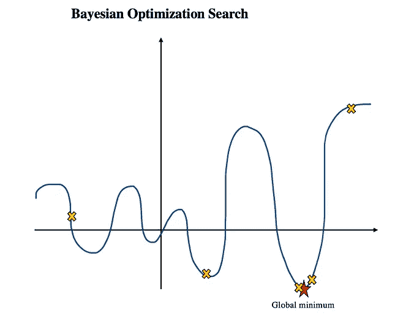
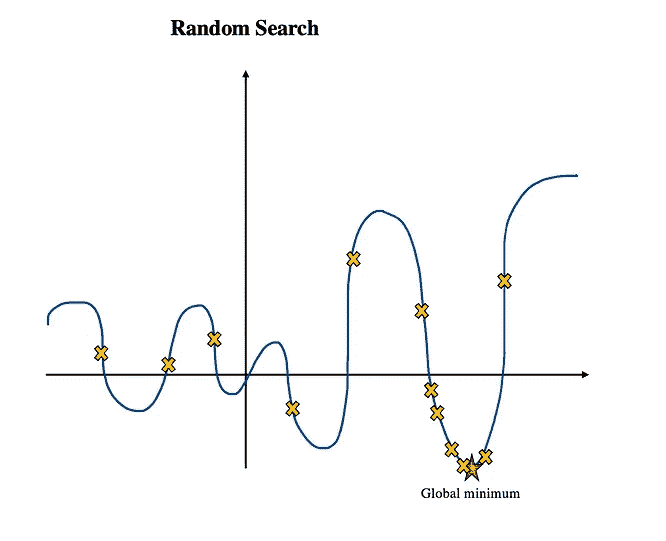
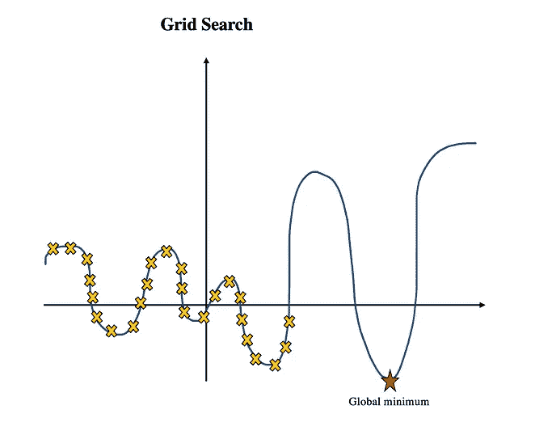
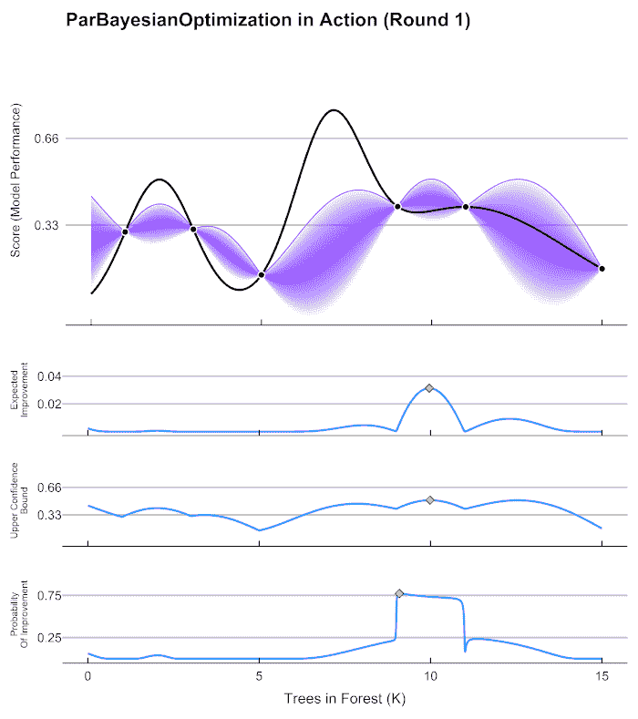

# 贝叶斯优化

> 原文：<https://medium.com/mlearning-ai/bayesian-optimization-c9dd1381cd1d?source=collection_archive---------1----------------------->

## 真的是最好的超参数调优方法吗？将其与网格搜索、随机搜索和超波段搜索进行比较

超参数调整是一项耗时且计算量大的任务。我们想要的是一种尽可能快地找到最佳超参数的调整机制。有几种方法可以实现超参数调整，如网格搜索、随机搜索和超波段。它们各有利弊。又来了 ***贝叶斯优化*** 。让其他调优技术看起来有点过时，但是这种奇特的方法胜过所有其他调优方法吗？难道是 ***黄金法则*** ？我的快速回答是:

Yello ‘X’ shape is the number of trials (Image Source: Author)

如果您的计算资源有限，并且希望在少量迭代中获得大概最佳的超参数，那么**是**。然而，它是否比其他方法更好呢？**否**。

让我们更深入地研究一下贝叶斯优化。

> 什么是**贝叶斯优化**？

之前，在**网格搜索中，**你正在尝试每一个可能的选项挖洞，即使根本没有希望。虽然不切实际，但你不会不小心错过全局最优。然而，你需要拥有潜在的无限计算能力来实现这一点。

**随机搜索**，另一方面，试图**在这里和那里随机搜索，以给出最佳超参数的良好估计**。这是进行超参数调整的更好的方法。但是你仍然需要许多次迭代来很好地了解全局最优的范围。

**超波段搜索**是随机搜索的变体。不同于其它搜索方法，其它搜索方法将继续运行具有明显不良超参数集的迭代，直到规定的迭代次数用尽。相反，hyperband search**将在很少的迭代之后终止那些不良配置，并且仅运行基于先前历史有望输出良好结果的参数集**。

与前面提到的搜索技术相比，贝叶斯优化搜索是一种完全不同的方法。贝叶斯优化是一种基于贝叶斯定理的**概率原理方法，用于寻找黑盒函数**的全局最优。

这是什么意思？如果您知道基本事实目标函数，例如 f(x) = 0，我们也知道最小值和最大值在哪里。然而，当我们使用深度学习模型时，我们永远无法知道底层的目标函数是什么。因此，我们所能做的就是做大量的试错，直到你筋疲力尽或者你的资源耗尽。然而，没有人想要这两个选项中的任何一个！我们需要一种智能的方法来探索参数空间。看下面的图，你可以看到与其他搜索方法相比，贝叶斯优化搜索如何以更少的迭代找到全局最小值。

当目标函数很复杂且评估成本很高时，这种方法很方便。由于我们不知道大多数神经网络中的目标函数，并且深度学习模型的评估成本很高，贝叶斯优化搜索似乎是隧道尽头的一盏灯。贝叶斯优化是这样工作的:

*   **贝叶斯定理**(事件的条件概率):
    P(A | B)= P(B | A)* P(A)/P(B)
    *比例量:P(A|B) = P(B|A) * P(A)*
*   **之前**:抽取样本，并用随机函数进行评估。结果将用于定义先验。先验表示函数的行为。
*   **后验**:后验是将先验考虑在内分配的条件概率(反过来称为似然)。因此，它是目标函数的近似值，并评估特定参数配置的成本。后验概率成为先验概率，因为它们在下一次迭代中被更新。在获取函数中使用后验概率来确定搜索空间中最有可能返回好结果的下一个采样点。
*   **代理函数**
    代理函数是黑盒目标函数的近似。高斯过程(高斯分布和随机过程)用作替代函数。高斯过程建立目标函数的概率模型，假设所有随机变量具有多元正态分布。简而言之，利用高斯过程指导如何在搜索空间中探索参数样本。
*   **采集函数**:从参数空间中确定下一个查询点。它使用 ***探索*** *(最佳值在哪里？我们来探索未知领域或者最不确定的领域)*和 ***剥削*** *(最优值在哪里？让我们根据前面的结果找到给出最高值的点)*策略来指导选择下一个样本。采集功能试图在勘探和开发之间取得良好的平衡。有多种方法可以做到这一点。“*期望改善(EI)* ”和“*最大改善概率*”是常用的方法。简而言之，采集功能决定下一步采样什么。

下面的 gif 图像模拟了贝叶斯优化过程。

image resource: [https://github.com/AnotherSamWilson/ParBayesianOptimization](https://github.com/AnotherSamWilson/ParBayesianOptimization)

然而，贝叶斯优化可能不是最好的调优机制。有多项研究表明，与随机搜索相比，**贝叶斯优化方法只能带来微不足道的额外改进。此外，如**所示，贝叶斯优化在高维度中表现不佳。有时，在现实生活中的许多用例中，如果只引起可以忽略的性能差异，那么使用简单明了的方法更容易实现、解释和高效。根据您的使用情况，简单是最好的！****

本文中的一个变化是，尽管许多人认为贝叶斯优化使用高斯过程作为替代函数，但优化过程是连续的。这也意味着它不能利用并行资源。但是，您可以使用诸如 *SigOpt* 之类的工具来启用并行。