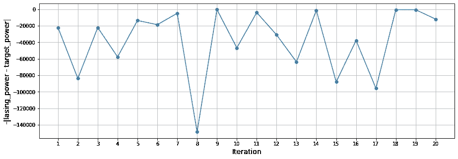

# 激光器的贝叶斯优化

> 原文：<https://medium.com/mlearning-ai/bayesian-optimization-of-a-laser-b5af3d553ad5?source=collection_archive---------4----------------------->

在我以前的帖子中，我探索了如何实现[高斯过程回归模型](/@natsunoyuki/gaussian-process-models-7ebce1feb83d)、[模拟激光](/@natsunoyuki/simulating-lasers-with-python-1e00cf0dd5d9)，以及使用 Python 执行[贝叶斯优化。在这篇文章中，我们将把所有的东西放在一起，用贝叶斯优化来优化激光器！](/@natsunoyuki/bayesian-optimization-with-python-85c66df711ec)


Aurora. Photo by [Ken Cheung](https://unsplash.com/@kencheungphoto?utm_source=unsplash&utm_medium=referral&utm_content=creditCopyText) on [Unsplash](https://unsplash.com/?utm_source=unsplash&utm_medium=referral&utm_content=creditCopyText).

# 优化激光器

激光是极其复杂和变化无常的东西——它们需要很长时间来稳定，依赖于大量的参数，并且仅仅是调整就需要大量的资源。例如，在[直线加速器相干光源](https://arxiv.org/pdf/1909.05963.pdf)，技术人员需要主动调整多个控制参数，以实现特定的光束特性。这个调优过程占用了宝贵的时间，这些时间本可以用来做实验！

大多数优化算法不适于调谐激光器，部分原因是所需的计算资源过多，部分原因是激光器的复杂程度，部分原因是许多优化算法容易陷入局部最小值。因此，为了调整激光器，我们需要优化一个昂贵的黑盒函数，这正是贝叶斯优化所做的！

在下一节中，我们将了解如何使用贝叶斯优化来针对目标输出功率优化激光器的泵浦强度。

# 激光器贝叶斯优化的 Python 代码

我们使用`[bayes_opt](https://github.com/fmfn/BayesianOptimization)`库来执行贝叶斯优化。使用 [my GitHub FDTD 库](https://github.com/natsunoyuki/FDTD/blob/main/src/fdtd/fdtd1d_laser.py)中的`fdtd1d_laser`对激光进行模拟。

```
import numpy as np
import matplotlib.pyplot as plt
from fdtd import fdtd1d_laser
from bayes_opt import BayesianOptimization, UtilityFunction
```

给定一些目标输出功率，我们将优化最佳泵浦强度`D0`来使用。因此，我们定义了一个函数来运行和测量某一泵浦强度下的激光器输出功率`D0`。

```
def run_and_measure_laser(D0, n_iter = 50000, t_measure = 10000):
    # Run 1D FDTD laser simulation for pump strength D0.
    fdtd = fdtd1d_laser(D0 = D0)
    fdtd.run(initiate_pulse = True, n_iter = n_iter) # "Measure" the output power.
    E = np.abs(fdtd.E_measure)[-t_measure:]
    t = np.arange(0, len(E) * fdtd.dt, fdtd.dt)
    P = np.trapz(E, t)
    return P
```

接下来，我们定义一个函数，它接受一个输入`target_power`以及要运行的优化迭代次数。该功能在`D0`的某个试验值下运行激光，测量激光输出功率并与`target_power`进行比较。优化器然后通过最小化输出功率和`target_power`之间的差异来迭代地对`D0`进行调整。

```
def optimize_laser(target_power, n_iter = 15):
    # Initialize the optimizer.
    pbounds = {"D0": [1, 20]} # Search bounds.
    optimizer = BayesianOptimization(f = None, pbounds = pbounds,
                                     random_state = 42)
    # Upper confidence bounds utility function.
    utility = UtilityFunction(kind = "ucb", kappa = 1.96, xi = 0.01) D0s = np.array([np.nan] * n_iter)
    lasing_powers = D0s.copy()
    targets = D0s.copy() # Iterate the optimizer for n_iter iterations.
    for i in range(n_iter):
        # Optimizer suggests a value of D0 to try based on 
        # historical results.
        next_point = optimizer.suggest(utility) # Perform the lasing measurements.
        lasing_power = run_and_measure_laser(**next_point) # Minimize the difference between lasing power and
        # target_power.
        target = -np.abs(lasing_power - target_power) # Store the results for output.
        D0s[i] = next_point["D0"]
        lasing_powers[i] = lasing_power
        targets[i] = target try:
            # Update the optimizer with the evaluation results.
            # This needs to be in try-except structure in order
            # to prevent repeat errors from occuring.
            optimizer.register(params = next_point, target = target)
        except:
            pass return optimizer, D0s, lasing_powers, targets
```

我们运行优化器 20 次迭代，目标功率为 215233。

```
target_power = 215233
n_iter = 20optimization_results = optimize_laser(target_power, n_iter)optimizer = optimization_results[0]
D0s = optimization_results[1]
lasing_powers = optimization_results[2]
targets = optimization_results[3]# Get the best results.
D0 = optimizer.max["params"]["D0"]
target = optimizer.max["target"]
lasing_power = int(lasing_powers[np.where(D0s == D0)[0]][0])# Plot the optimization iterations.
plt.figure(figsize = (15, 5))
plt.plot(range(1, 1+len(optimizer.space.target)), 
         optimizer.space.target, "-o")
plt.grid(True)
plt.xlabel("Iteration", fontsize = 14)
plt.ylabel("-|lasing_power - target_power|", fontsize = 14)
plt.xticks(range(1, 1+len(optimizer.space.target)))
plt.show()
```



Bayesian optimization iterations of a laser for a target output power. Image created by the author.

我们发现在 20 次迭代中，优化器设法确定对于泵浦强度为`D0 = 9.943`的情况，我们得到的输出功率为`lasing_power = 214871`，这非常接近于 215233 的原始目标。

```
print("Optimized pump strength value: {:.3f}.".format(D0))
print("Output power: {}.".format(lasing_power)) >>> Optimized pump strength value: 9.943\. 
>>> Output power: 214871.
```

# 结束语

在这篇文章中，我们使用贝叶斯优化来优化模拟 1D 激光器的泵浦强度，以获得一些目标输出功率。这是一个非常简单的案例研究，我们为一个目标变量优化一个输入变量。在现实中，激光器要复杂得多，对于一组多个输入变量，将同时优化多个目标变量。为此，我们需要使用[多目标优化](https://pymoo.org)，这比上面执行的单目标优化更复杂。

# 参考

J.杜里斯，d .肯尼迪，a .哈努卡，J. Shtalenkova，A. Edelen，A. Egger，T. Cope 和 D. Ratner。[自由电子激光器的贝叶斯优化](https://arxiv.org/pdf/1909.05963.pdf)，列特物理学评论。 **124** ，124801，2020。

[](/mlearning-ai/mlearning-ai-submission-suggestions-b51e2b130bfb) [## Mlearning.ai 提交建议

### 如何成为 Mlearning.ai 上的作家

medium.com](/mlearning-ai/mlearning-ai-submission-suggestions-b51e2b130bfb)