# 贝叶斯样条建模

> 原文：<https://medium.com/mlearning-ai/bayesian-spline-modelling-5669d8437ca6?source=collection_archive---------2----------------------->

## 一个电磁频率实验的案例

这篇文章将对一项实验中患者的纵向数据进行建模，该实验研究了在 N-back 任务中 2G 辐射对 ERP 的影响。实验包括两个连续的 40 分钟的脑电图记录，中间有大约 10 分钟的停顿。在实验过程中，受试者接受了电磁辐射或非电磁辐射(假的)，这是由计算机控制的随机平衡设计。无论是参与者还是实验者都不知道 EMF 或 sham 应用于哪个阶段，这为实验提供了双盲条件。脑电图用 63 电极帽记录。

在这篇文章中，我将向你展示我使用贝叶斯样条建模来模拟脑电图数据的方法。这不会是我关于贝叶斯建模的第一篇文章，也不会是最后一篇。

由于这是未来某个时候用于出版的商业数据，我不能分享这些数据，但我能做的是分享足够的细节来分析类似规模和/或设计的研究。

让我们开始吧。

```
library(data.table)
library(ggplot2)
library(dplyr)
library(readxl)
library(tidyr)
library(brms)
library(tidybayes)
library(emmeans)
library(bayesplot)
library(bayesrules)
library(rethinking)
library(forcats)
library(lme4)
library(bayestestR)
library(modelr)
library(mgcViz)
```

让我输入数据。文件 df 包含了我必须加载的所有单独的 Excel 文件，我没有在这里显示。从那里，我们可以构建多个文件。为了给出数据的指示，最好意识到每个参与者进入两组中的一组——或者 EMF 先开然后关，或者反之亦然。这意味着每个患者有两个样本，波形范围从-200 到 660 毫秒。假设 280-320 毫秒的波形包含的信息最多。

就目前而言，这应该能提供足够的背景信息，让我们对这些数据有所了解，当然这并不是我们所有的数据。此外，这里显示的最终分析当然不会是用于手稿的最终分析，但至少你会知道如何使用贝叶斯框架运行样条建模。

```
df_280_320<-df%>%
  filter(Time>=280 & Time <=300)%>%
  group_by(Subject, RF, Treatm)%>%
  summarize(Frontal = sum(Frontal), 
            TemporalR = sum(TemporalR),
            TemporalL = sum(TemporalL),
            Central = sum(Central),
            Parietal = sum(Parietal),
            Occipital = sum(Occipital))%>%
  tidyr::pivot_longer(
    cols = Frontal:Occipital,
    names_to = "Location",
    values_to = "Value",
    values_drop_na = TRUE)%>%
  ungroup()%>%
  mutate(loc = if_else(Treatm == "OFF_ON" & RF =="OFF", 1, 
                       if_else(Treatm == "ON_OFF" & RF =="ON", 1, 2)))%>%
  group_by(Subject, Treatm, Location)%>%
  arrange(Subject, Location, loc)%>%
  summarize(Value = Value - lag(Value))%>%
  ungroup()%>%
  tidyr::drop_na()
table(df_280_320$Subject, df_280_320$Treatm)

       OFF_ON ON_OFF
  1001      6      0
  1002      6      0
  1003      0      6
  1004      6      0
  1005      6      0
  1006      0      6
  1007      6      0
  1008      0      6
  1009      0      6
  1010      0      6
  1011      0      6
  1012      6      0
  1013      6      0
  1014      0      6
  1015      6      0
  1016      6      0
  1017      6      0
  1018      0      6
  1019      0      6
  1020      0      6
  1021      0      6
  1022      6      0
  1023      6      0
  1024      6      0
  1025      6      0
  1026      6      0
  1027      0      6
  1028      0      6
  1029      0      6
  1030      0      6
  1031      6      0
  1033      0      6
```

您可以看到每个患者属于其中一种治疗，并且每个治疗有两个部分:开和关。下面您可以看到每个位置和治疗的整个波形的平均值和标准偏差。标准差和平均值一样能提供信息，如果不是更多的话。

```
df_280_320%>%
+   group_by(Location, Treatm)%>%
+   summarise(mean = mean(Value), 
+             sd = sd(Value))
`summarise()` has grouped output by 'Location'. You can override using the `.groups`
argument.
# A tibble: 12 x 4
# Groups:   Location [6]
   Location  Treatm    mean    sd
   <chr>     <chr>    <dbl> <dbl>
 1 Central   OFF_ON -1.76   2.00 
 2 Central   ON_OFF -0.829  1.89 
 3 Frontal   OFF_ON  0.0175 1.99 
 4 Frontal   ON_OFF  0.415  1.34 
 5 Occipital OFF_ON  0.0394 2.19 
 6 Occipital ON_OFF -0.651  1.32 
 7 Parietal  OFF_ON -0.837  1.42 
 8 Parietal  ON_OFF -0.852  1.14 
 9 TemporalL OFF_ON  0.555  1.11 
10 TemporalL ON_OFF  0.814  0.750
11 TemporalR OFF_ON  1.08   1.45 
12 TemporalR ON_OFF  0.622  1.19 
```

下面，你可以看到整个数据集。

```
df_all<-df%>%
  select(Subject, Time, RF, Treatm,
         Frontal,TemporalR,TemporalL,
         Central,Parietal,Occipital )%>%
  group_by(Subject, Time, RF, Treatm)%>%
  tidyr::pivot_longer(
    cols = Frontal:Occipital,
    names_to = "Location",
    values_to = "Value",
    values_drop_na = TRUE)%>%
  ungroup()%>%
  mutate(loc = if_else(Treatm == "OFF_ON" & RF =="OFF", 1, 
                       if_else(Treatm == "ON_OFF" & RF =="ON", 1, 2)))%>%
  arrange(Subject, Location, loc)
table(df_all$Subject, df_all$Treatm)

       OFF_ON ON_OFF
  1001    528      0
  1002    528      0
  1003      0    528
  1004    528      0
  1005    528      0
  1006      0    528
  1007    528      0
  1008      0    528
  1009      0    528
  1010      0    528
  1011      0    528
  1012    528      0
  1013    528      0
  1014      0    528
  1015    528      0
  1016    528      0
  1017    528      0
  1018      0    528
  1019      0    528
  1020      0    528
  1021      0    528
  1022    528      0
  1023    528      0
  1024    528      0
  1025    528      0
  1026    528      0
  1027      0    528
  1028      0    528
  1029      0    528
  1030      0    528
  1031    528      0
  1033      0    528
```

然后，我将转移到最重要的部分，也就是不同之处。因为每个病人都有两个相同波形的样本，所以我可以计算每个病人之间的差异。这种患者内部的差异是比较治疗的关键，因为人们会预期不同治疗的患者内部差异不同。

```
df_all_diff<-df%>%
  select(Subject, Time, RF, Treatm,
         Frontal,TemporalR,TemporalL,
         Central,Parietal,Occipital )%>%
  group_by(Subject, Time, RF, Treatm)%>%
  tidyr::pivot_longer(
    cols = Frontal:Occipital,
    names_to = "Location",
    values_to = "Value",
    values_drop_na = TRUE)%>%
  ungroup()%>%
  mutate(loc = if_else(Treatm == "OFF_ON" & RF =="OFF", 1, 
                       if_else(Treatm == "ON_OFF" & RF =="ON", 1, 2)))%>%
  group_by(Subject, Time, Treatm, Location)%>%
  arrange(Subject, Location, loc)%>%
  summarize(Value = Value - lag(Value))%>%
  ungroup()%>%
  tidyr::drop_na()
table(df_all_diff$Subject, df_all_diff$Treatm)

       OFF_ON ON_OFF
  1001    264      0
  1002    264      0
  1003      0    264
  1004    264      0
  1005    264      0
  1006      0    264
  1007    264      0
  1008      0    264
  1009      0    264
  1010      0    264
  1011      0    264
  1012    264      0
  1013    264      0
  1014      0    264
  1015    264      0
  1016    264      0
  1017    264      0
  1018      0    264
  1019      0    264
  1020      0    264
  1021      0    264
  1022    264      0
  1023    264      0
  1024    264      0
  1025    264      0
  1026    264      0
  1027      0    264
  1028      0    264
  1029      0    264
  1030      0    264
  1031    264      0
  1033      0    264
```

让我给你看看那是什么样子，如果进展顺利的话。下面，你可以看到，对于一个病人和六个记录的大脑区域，两个波形和它们的差异。

```
ggplot()+
  geom_line(data=df_all_diff[df_all_diff$Subject==1001,], 
            aes(x=Time, 
                y=Value, 
                group=Subject),
            col="black")+
  geom_text(data=df_all_diff[df_all_diff$Subject==1001,], 
            aes(x=Time,
                y=Value, 
                label=round(Value,1), 
                group=Subject), 
            col="black")+
  geom_line(data=df_all[df_all$Subject==1001,], 
            aes(x=Time, 
                y=Value, 
                group=Subject*loc, 
                color=factor(RF)))+
  geom_text(data=df_all[df_all$Subject==1001,], 
            aes(x=Time,
                y=Value, 
                label=round(Value,1), 
                group=Subject*loc, 
                color=factor(RF)))+
  facet_wrap(~Location)+
  theme_bw()
```

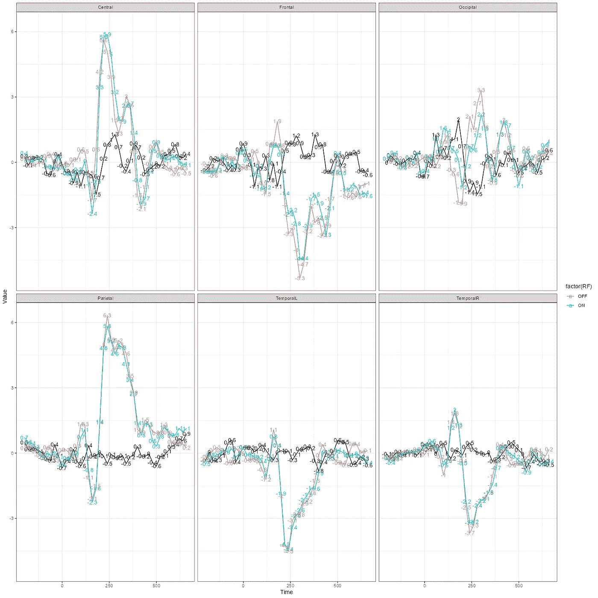

The waveforms of a single patient, per brain region and treatment, and its difference (in black). As you can see the waveforms are not the same in each brain region and is especially informative around 250–400.

现在，让我们用箱线图来看看不同患者、不同治疗和不同脑区之间的差异。查看箱线图的平均值和范围是有好处的。虽然我们在一个病人身上有很多数据，但我们没有那么多跨病人的数据——每组只有 16 个。

```
df_all_diff%>%
  ggplot(., 
         aes(x=factor(Time), 
             y=Value, 
             fill=factor(Treatm)))+
  geom_boxplot()+
  facet_wrap(~Location)+
  theme_bw()
```

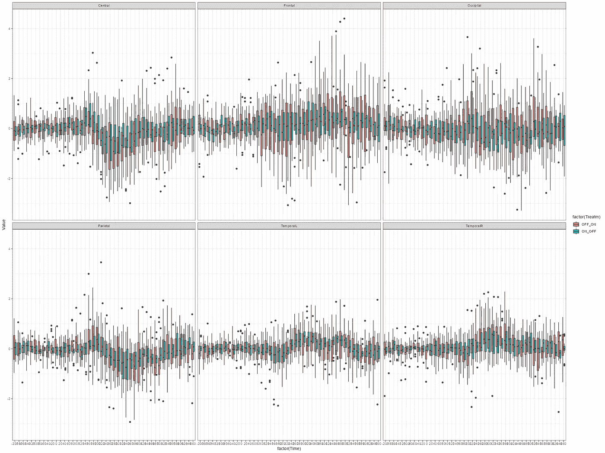

The data across patients and per treatment and brain location as a function of time (ms).

正如你所看到的，有相当多的变化，这种变化可能取决于平均水平。这就是为什么我想评估变异系数(CV ),并查看在哪些地方变异超过了平均值(变异系数计算标准偏差与平均值的比率)。下面，我将通过汇总患者、每次治疗和大脑位置来准备数据。

```
df_all_diff%>%
  group_by(Time, Treatm, Location)%>%
  summarise(mean = mean(Value), 
            std = sd(Value, na.rm=TRUE),
            cv= std/mean)

`summarise()` has grouped output by 'Time', 'Treatm'. You can
override using the `.groups` argument.
# A tibble: 528 x 6
# Groups:   Time, Treatm [88]
    Time Treatm Location      mean   std     cv
   <dbl> <chr>  <chr>        <dbl> <dbl>  <dbl>
 1  -200 OFF_ON Central   -0.0687  0.573  -8.34
 2  -200 OFF_ON Frontal    0.0756  0.721   9.53
 3  -200 OFF_ON Occipital  0.247   0.842   3.41
 4  -200 OFF_ON Parietal   0.045   0.684  15.2 
 5  -200 OFF_ON TemporalL -0.121   0.469  -3.89
 6  -200 OFF_ON TemporalR -0.0881  0.574  -6.51
 7  -200 ON_OFF Central   -0.0969  0.269  -2.78
 8  -200 ON_OFF Frontal   -0.0225  0.289 -12.9 
 9  -200 ON_OFF Occipital  0.0737  0.440   5.97
10  -200 ON_OFF Parietal   0.00250 0.276 110\.  
# ... with 518 more rows

df_all_diff%>%
  group_by(Time, Treatm, Location)%>%
  summarise(mean = mean(Value), 
            std = sd(Value, na.rm=TRUE),
            cv= std/mean)%>%
  ggplot(.)+
  geom_line(aes(x=Time, 
                y=cv,
                col=factor(Treatm)))+
  geom_point(aes(x=Time, 
                y=cv,
                col=factor(Treatm)))+
  facet_wrap(~Location)+
  geom_vline(xintercept = 280, lty=1, size=2, col="black")+
  geom_vline(xintercept = 320, lty=1, size=2,col="black")+
  geom_vline(xintercept = 200, lty=1, size=2,col="purple")+
  geom_vline(xintercept = 400, lty=1, size=2,col="purple")+
  labs(x="Time", 
       y="Coefficient of Variation", 
       col="Treatment")+
  theme_bw()+
  ylim(-100,100)
```

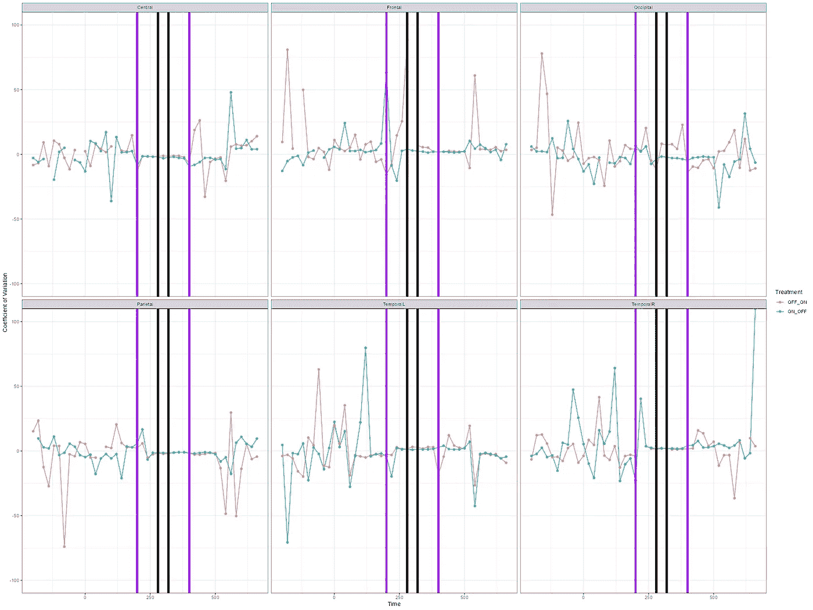

The black line represents the 280–320 region and the purple line the 200–400 region. These are important regions and as you can see much more stable then the rest of the waveforms. However, certain brain regions such as the frontal or occipital do display a higher CV ratio.

从分析的角度来看，关键是波形中的信号可以被检测到(如果存在的话),这意味着变化不应该太极端。高变异区域仍然很重要，当然也是信息的一部分，但是它们确实使精确定位差异变得更加困难。最后，贝叶斯方法的重点是收集信息，而不是发现(统计)意义，所以我们将重点放在这一点上。

让我再往后移一点，深入分析我们正在分析的波形。这些数据不容易建模。

```
df%>%filter(Subject==1001)%>%
ggplot(., 
       aes(x=Time, 
           y=Frontal, 
           col=RF))+
  geom_hline(yintercept = 0, col="black", lty=1)+
  geom_vline(xintercept = 0, col="black", lty=1)+
  geom_line()+
  geom_point()+
  theme_bw()
```

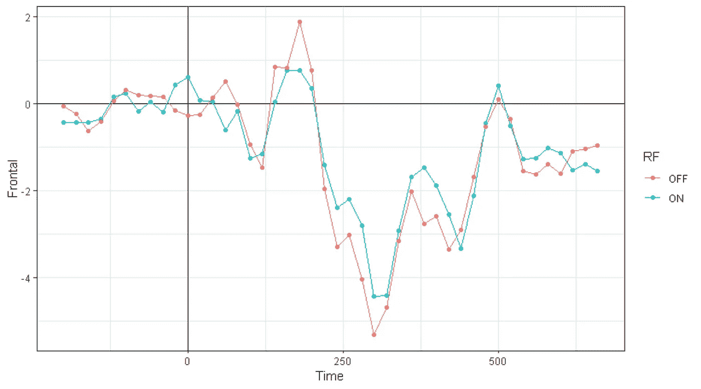

As you can see, for a single patient, there is plenty of data captured yet the form is not that easy to discern nor predict. At least, not the first time, but one could quite accurately predict the form of the “OFF” part once you know the “ON” part.

让我们看看所有的主题，然后缩小范围，以便更好地了解数据的模式，特别是波形，在特定的时间范围内。

```
df%>%
  ggplot(., 
         aes(x=Time, 
             y=Frontal, 
             col=RF))+
  geom_line()+
  facet_wrap(~Subject, scales="free")+
  theme_bw()
df%>%filter(Time>=280 & Time <=300)%>%
  ggplot(., 
         aes(x=Time, 
             y=Frontal, 
             col=RF))+
  geom_line()+
  facet_wrap(~Subject, scales="free")+
  theme_bw()
df%>%filter(Time>=250 & Time <=400)%>%
  ggplot(., 
         aes(x=Time, 
             y=Frontal, 
             col=RF))+
  geom_line()+
  facet_wrap(~Subject, scales="free")+
  theme_bw()
```

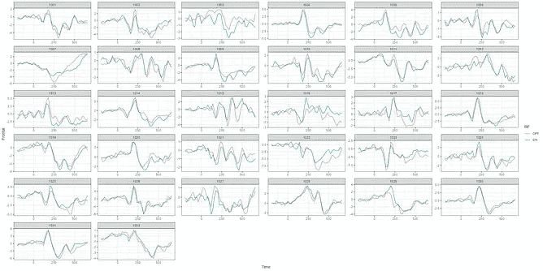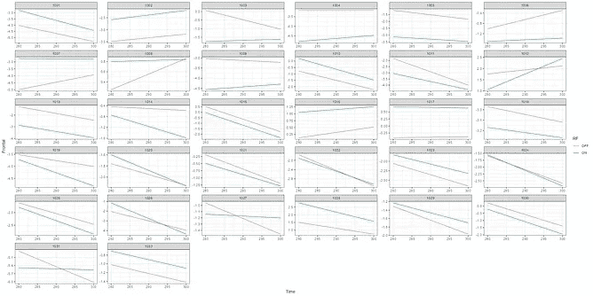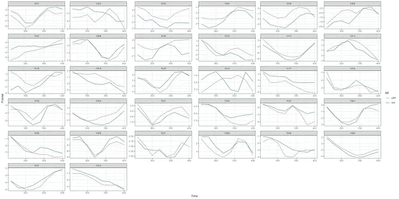

Left: overall time in ms. Middle: 280–320 ms. Right: 250–400 ms.

数据是相当分散的，为了对包含这种粒度级别的数据建模，我们可以开始研究样条。我真的很喜欢样条曲线，因为它们将数据和模型分割在一起，而不会过度拟合(因为交叉验证、指定结和限制结的数量)。 *geom_smooth* 命令将自动应用黄土函数，该函数可能会过度拟合。

```
df%>%filter(Time>=250 & Time <=400)%>%
  ggplot(., 
         aes(x=Time, 
             y=Occipital, 
             col=RF))+
  geom_smooth()+
  theme_bw()
```

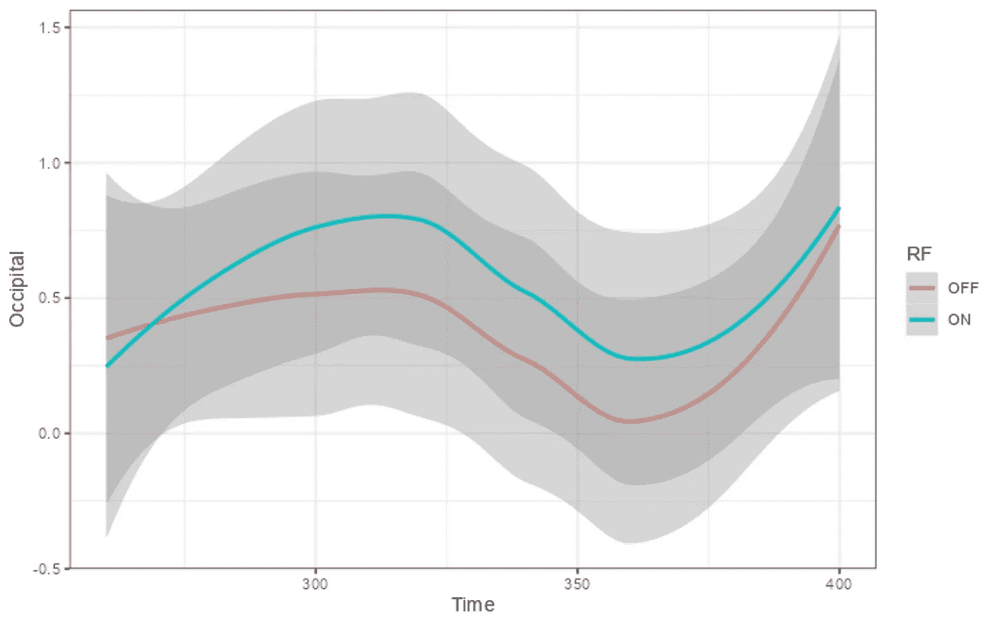

The two parts of the treatments (ON / OFF) across bot treatments and subjects, but narrowing done for the occipital region. As you can see, the data is quite noisy but can be well approximated using a loess function which is the standard of the **geom_smooth** command.

让我们仔细看看每种治疗方法，利用差异，展示每个大脑区域。我将使用标准的 geom_smooth 函数(黄土函数)，并使用由模型自动放置的五个节点指定一个 b 样条。

```
df_all_diff%>%filter(Time>=250 & Time <=400)%>%
  ggplot(., 
         aes(x=Time, 
             y=Value, 
             col=Treatm, 
             fill=Treatm))+
  geom_smooth()+
  theme_bw()+
  facet_wrap(~Location, scales="free")

df_all_diff%>%filter(Time>=250 & Time <=400)%>%
  ggplot(., 
         aes(x=Time, 
             y=Value, 
             col=Treatm, 
             fill=Treatm))+
  geom_smooth(method = lm, formula = y ~ splines::bs(x, 5), se = TRUE)+
  theme_bw()+
  facet_wrap(~Location, scales="free")
```

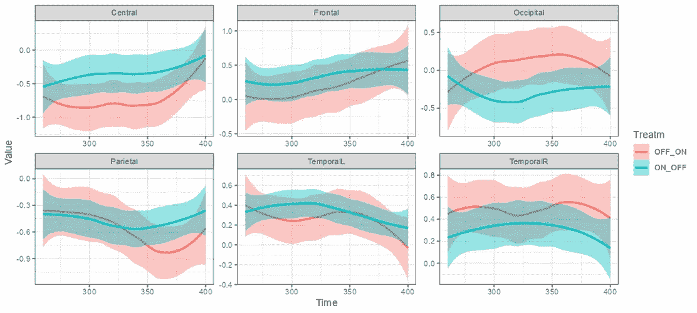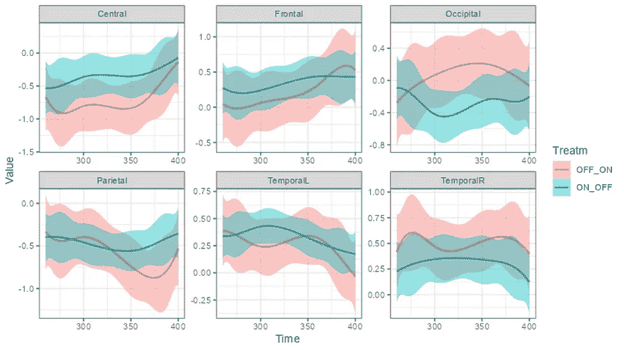

It seems that the standard **geom_smooth** function (left) is less overfitting then the **b-spline**, which means that using five knots is probably too much.

在绘制差异图时，我想知道是否最好将每个病人的两个样本联系起来，看看我是否能发现差异。有点像 A/B 测试。为了做到这一点，我必须在每个实验对象的实验的第二部分加上 660 毫秒。

```
df%>%
  mutate(Time2 = if_else(Treatm=="ON_OFF" & RF=="OFF", Time+880, if_else(
    Treatm=="OFF_ON" & RF=="ON", Time+880, Time)))%>%
  select(-c(`time/channel`, RF, Time, Session_one, Session_two))%>%
  tidyr::pivot_longer(!c(Subject, Treatm, Time2), names_to = "Brain_Region", values_to = "Value")%>%
  ggplot(., 
         aes(x=Time2, 
             y=Value,
             group=Subject,
             col=factor(Treatm)))+
  geom_line()+
  facet_grid(rows=vars(Brain_Region))+
  theme_bw()+
  geom_vline(xintercept = 660, col="black", lty=1, size=3)+
  labs(x="Time", 
       y="Scores", 
       col="Treatment", 
       title="Frontal scores as a function of treatment")
```

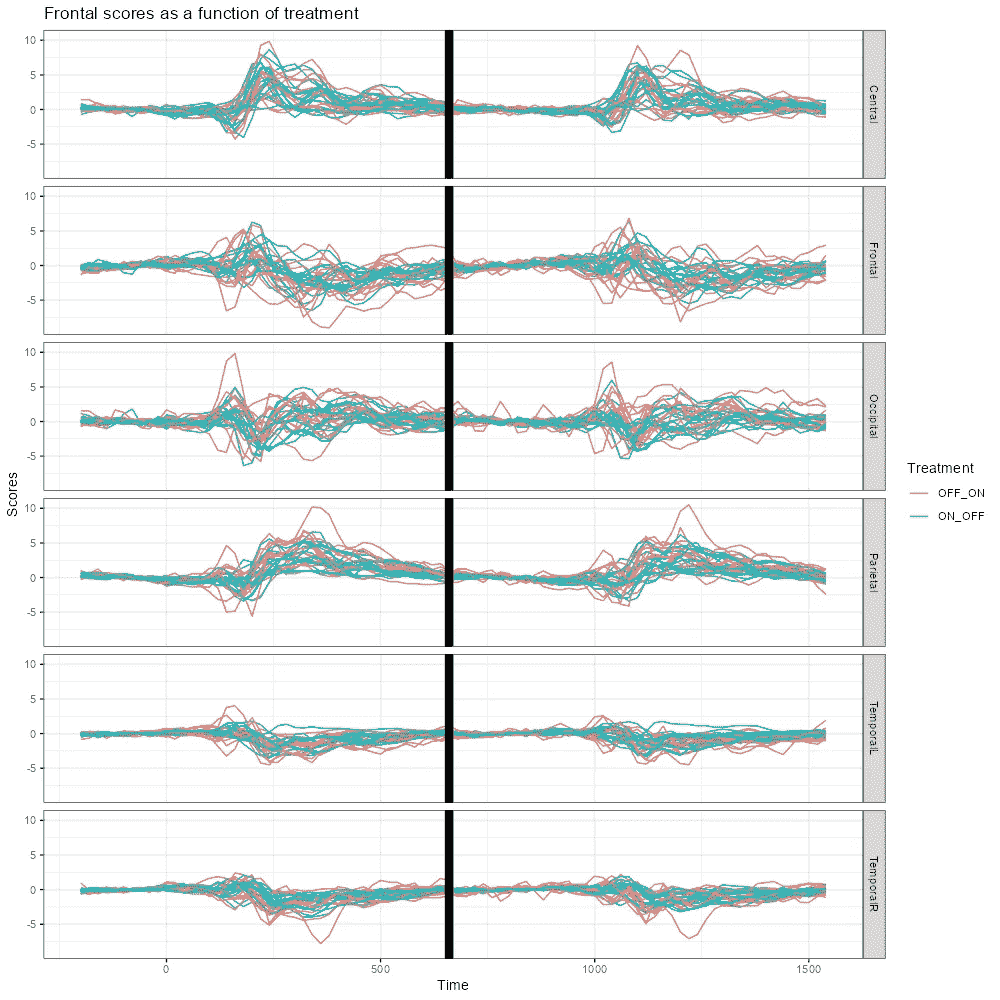

The data for each patient, connected. The black line is the separation between the first and the second part for each patient. As you can see it is not so easy to spot a change, since this is not a traditional A/B test. This is just a second part of the data collection, which is a rerun. So, in the end, not useful.

让我们再来看看之前使用的箱线图，看看我们是否能找到更好的模式，看看不同时间和每个大脑区域的平均值和变化。

```
df_all_diff%>%
  filter(Location=="Frontal")%>%
  ggplot(., 
         aes(x=factor(Time), 
             y=Value, 
             fill=factor(Treatm)))+
  geom_boxplot()+
  facet_wrap(~Location)+
  theme_bw()

df_all_diff%>%
  filter(Location=="Central")%>%
  ggplot(., 
         aes(x=factor(Time), 
             y=Value, 
             fill=factor(Treatm)))+
  geom_boxplot()+
  facet_wrap(~Location)+
  theme_bw()

df_all_diff%>%
  filter(Location=="Occipital")%>%
  ggplot(., 
         aes(x=factor(Time), 
             y=Value, 
             fill=factor(Treatm)))+
  geom_boxplot()+
  facet_wrap(~Location)+
  theme_bw()

df_all_diff%>%
  filter(Location=="Parietal")%>%
  ggplot(., 
         aes(x=factor(Time), 
             y=Value, 
             fill=factor(Treatm)))+
  geom_boxplot()+
  facet_wrap(~Location)+
  theme_bw()

df_all_diff%>%
  filter(Location=="TemporalL")%>%
  ggplot(., 
         aes(x=factor(Time), 
             y=Value, 
             fill=factor(Treatm)))+
  geom_boxplot()+
  facet_wrap(~Location)+
  theme_bw()

df_all_diff%>%
  filter(Location=="TemporalR")%>%
  ggplot(., 
         aes(x=factor(Time), 
             y=Value, 
             fill=factor(Treatm)))+
  geom_boxplot()+
  facet_wrap(~Location)+
  theme_bw()
```

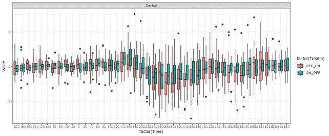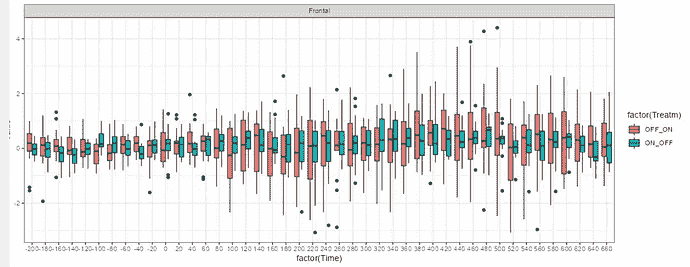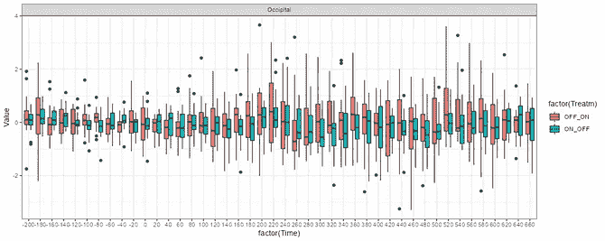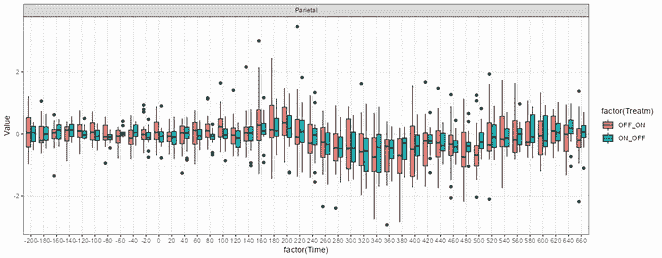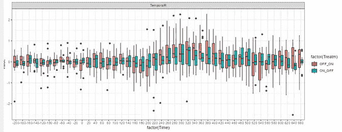

Once again, a lot of variation across the treatments.

那么，相关性呢。我们能把一些大脑区域的数据联系起来吗？请记住，大脑区域数据来自每个患者。所以事实上，我们对每个病人有 12 个时间序列(或纵向数据):6 个大脑区域* 2 个样本。

```
df%>%select(-c(`time/channel`, RF, Time, Session_one, Session_two, Subject))%>%
  filter(Treatm=="ON_OFF")%>%
  GGally::ggcorr()
df%>%select(-c(`time/channel`, RF, Time, Session_one, Session_two, Subject))%>%
  filter(Treatm=="OFF_ON")%>%
  GGally::ggcorr()
```

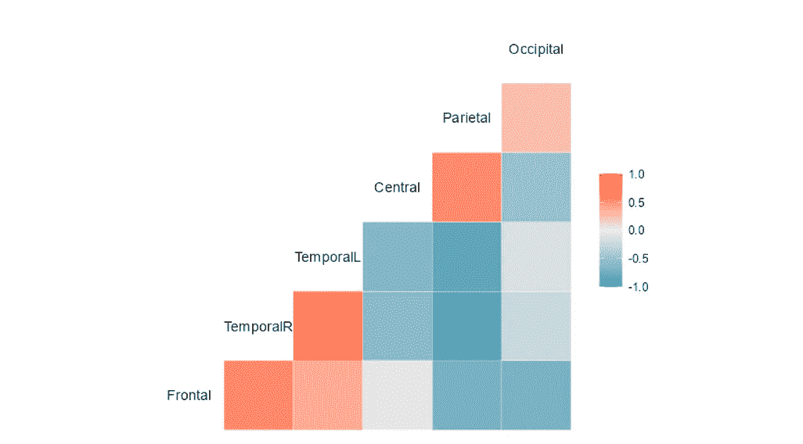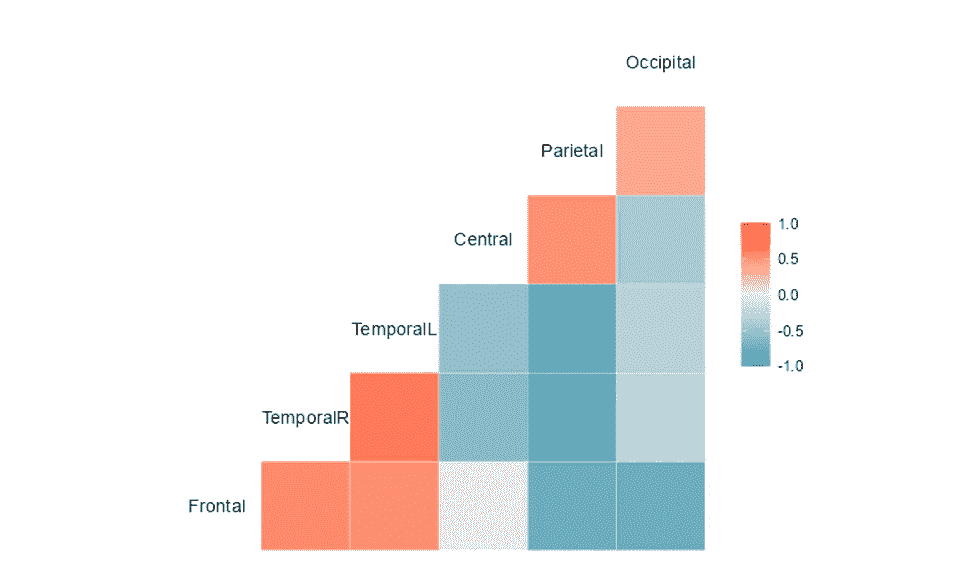

Correlations differ somewhat in strength per treatment part, but nothing too noteworthy. What is good to note is that there ARE correlations between adjacent brain regions.

波形的 280-320 毫秒部分是生物学上的重要部分，因此我将把重点放在 250-400 毫秒波形上。虽然 280–320 属于 250–400，但它确实构成了一幅不同的画面。尤其是在变化如此显著的数据中。让我们使用不同的绘图方法来更深入地研究特定的模式。如果你觉得这是大量的绘图和图形探索，那么欢迎来到数据分析的世界。在建模之前，我至少有 50%的时间在看数据。如果我不做模特了…

```
df_280_320%>%
  ggplot(aes(x=Value, fill=Treatm))+
  geom_density(alpha=0.5)+
  facet_wrap(~Location, scales="free")+
  theme_bw()
df_250_400%>%
  ggplot(aes(x=Value, fill=Treatm))+
  geom_density(alpha=0.5)+
  facet_wrap(~Location, scales="free")+
  theme_bw()
df_280_320%>%
  ggplot(aes(x=Location, y=Value, col=Treatm))+
  geom_boxplot()+
  theme_bw()
df_250_400%>%
  ggplot(aes(x=Location, y=Value, col=Treatm))+
  geom_boxplot()+
  theme_bw()
df_280_320%>%
  ggplot(aes(x=Location, y=Value, col=Treatm, group=Subject))+
  geom_point()+
  geom_line()+
  theme_bw()
df_250_400%>%
  ggplot(aes(x=Location, y=Value, col=Treatm, group=Subject))+
  geom_point()+
  geom_line()+
  theme_bw()
```

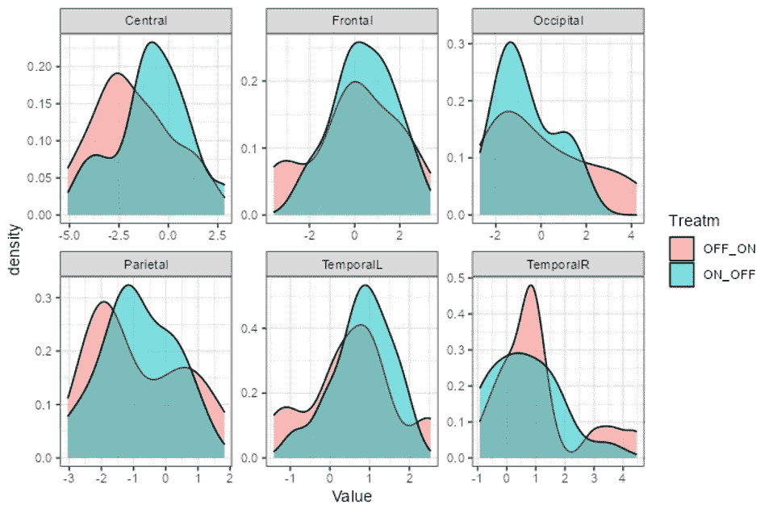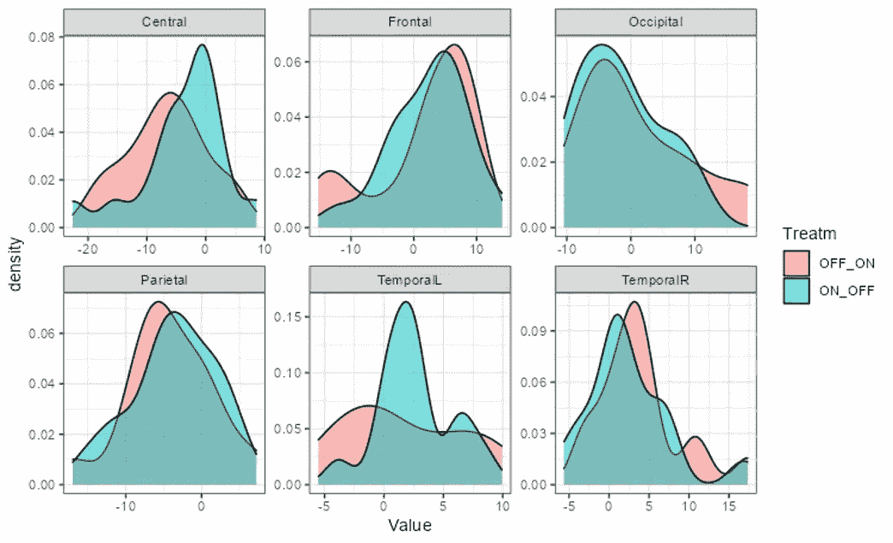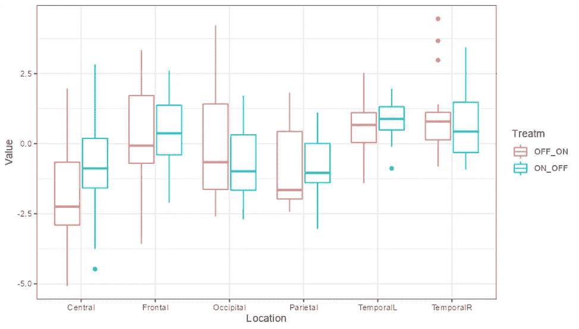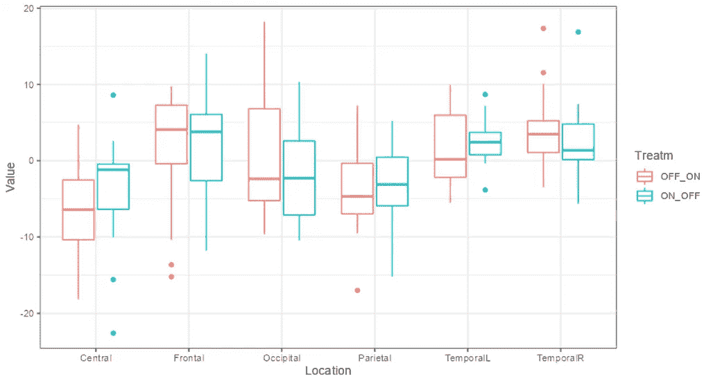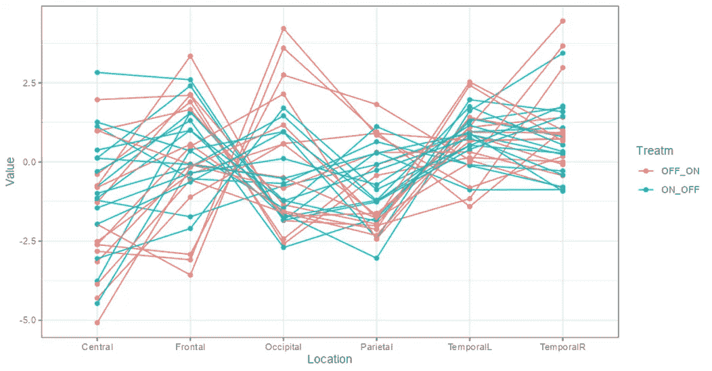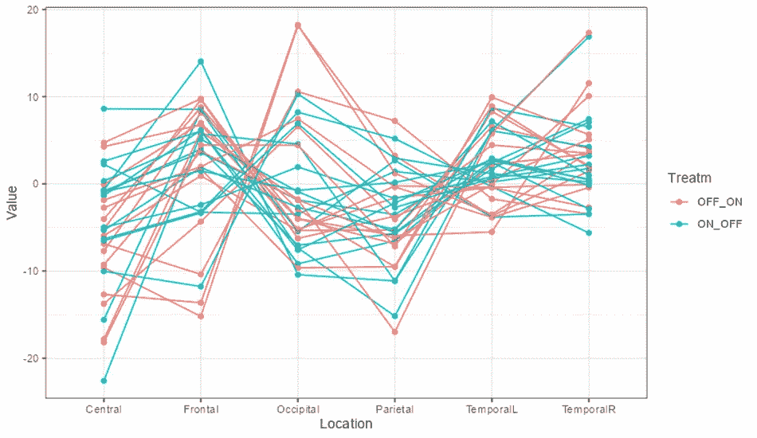

Yes, these is variation within the brain regions and treatments and yes, there is a signal, but it is difficult to pinpoint if the treatments truly produce difference waveforms and thus different differences between waveforms within a patient. I am starting to think that the assessment and modelling of the variation becomes more interesting than just looking for differences between the groups.

让我们将之前的平滑图重叠在我们已经看到的变化之上，以更好地了解它们的可用性，考虑到目前的高水平变化。

```
df_all_diff%>%
  ggplot(., 
         aes(x=Time, 
             y=Value, 
             color=factor(Treatm), 
             fill=factor(Treatm)))+
  geom_point(alpha=0.2)+
  geom_smooth(method = lm, formula = y ~ splines::bs(x, 5), se = TRUE)+
  facet_wrap(~Location)+
  theme_bw()

df_all_diff%>%
  ggplot(.)+
  geom_line(aes(x=Time, 
                 y=Value,
                 group=Subject,
                 col=factor(Treatm)), alpha=0.2)+
  stat_summary(aes(x=Time, 
                   y=Value,
                   group=factor(Treatm), 
                   col=factor(Treatm)), 
               fun=mean, geom="line", size=2)+
  facet_wrap(~Location)+
  geom_vline(xintercept = 280, lty=2, col="black")+
  geom_vline(xintercept = 320, lty=2, col="black")+
  geom_vline(xintercept = 200, lty=2, col="purple")+
  geom_vline(xintercept = 400, lty=2, col="purple")+
  labs(x="Time", 
       y="Difference", 
       col="Treatment")+
  theme_bw()
```

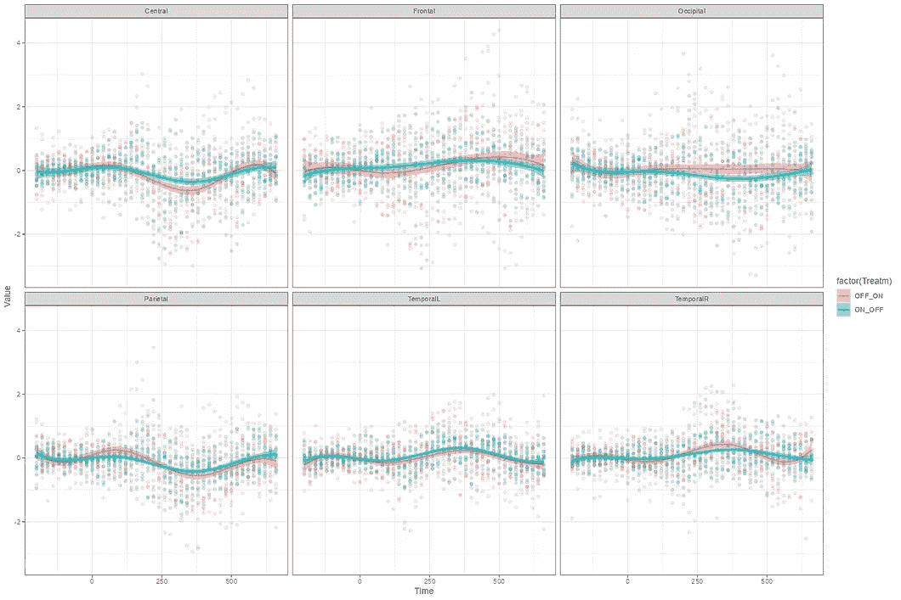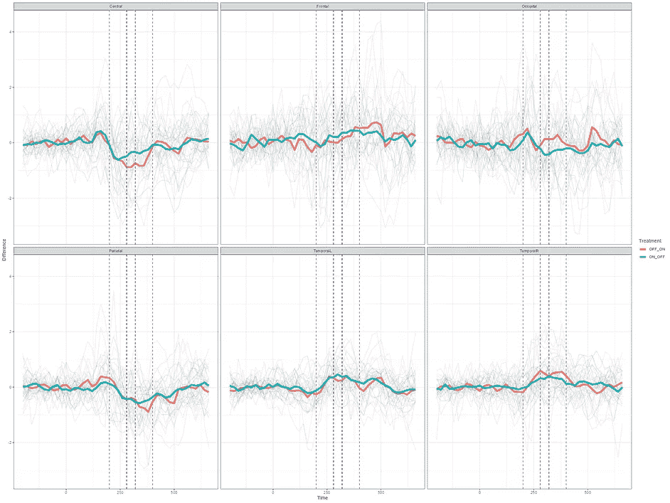

The spline to the left and the line data to the right in which I have tried to highlight the 250–400 and 280–320 regions. As you can see from the right, there does seem to be some interesting patterns in certain brain regions like the central part of the brain. But these are also tricky images — they show the mean surrounded by variation which means that the mean is actually quite useless. This is better depicted to the left using the spline plots. However, even here, the central region shows a difference that seems to persist.

好了，我相信我们已经做了足够的图形探索。是时候开始使用我们用来绘制数据的相同类型的样条来建模数据了。为此，我将使用广义加性模型(GAM 的)和广义加性混合模型(GAMM 的)来搜索使用样条的信息。为了尽可能避免过度拟合，我将应用交叉验证。对于 R 来说， *mgcv* 封装是黄金标准。

因为位置对结果有如此巨大的影响，我将告诉模型在每个位置拟合不同的样条。为了对模型(和数据)的稳定性有所了解，我还会要求 10 节。

```
df_all_diff$Location<-factor(df_all_diff$Location)
df_all_diff$Treatm<-factor(df_all_diff$Treatm)
mod_gam1 = mgcv::gam(Value ~ Location+ s(Time,by=Location, k=10) + Treatm, 
                     data = df_all_diff)
summary(mod_gam1)

Family: gaussian 
Link function: identity 

Formula:
Value ~ Location + s(Time, by = Location, k = 10) + Treatm

Parametric coefficients:
                   Estimate Std. Error t value Pr(>|t|)    
(Intercept)       -0.099885   0.019554  -5.108 3.33e-07 ***
LocationFrontal    0.251456   0.025603   9.822  < 2e-16 ***
LocationOccipital  0.068281   0.025603   2.667  0.00767 ** 
LocationParietal  -0.014560   0.025603  -0.569  0.56959    
LocationTemporalL  0.130767   0.025603   5.108 3.33e-07 ***
LocationTemporalR  0.183153   0.025603   7.154 9.16e-13 ***
TreatmON_OFF      -0.003823   0.014782  -0.259  0.79591    
---
Signif. codes:  0 ‘***’ 0.001 ‘**’ 0.01 ‘*’ 0.05 ‘.’ 0.1 ‘ ’ 1

Approximate significance of smooth terms:
                            edf Ref.df      F p-value    
s(Time):LocationCentral   8.675  8.969 21.097 < 2e-16 ***
s(Time):LocationFrontal   6.611  7.741  9.536 < 2e-16 ***
s(Time):LocationOccipital 6.869  7.964  2.948 0.00279 ** 
s(Time):LocationParietal  8.062  8.765 17.143 < 2e-16 ***
s(Time):LocationTemporalL 8.660  8.967  9.021 < 2e-16 ***
s(Time):LocationTemporalR 7.202  8.230  7.781 < 2e-16 ***
---
Signif. codes:  0 ‘***’ 0.001 ‘**’ 0.01 ‘*’ 0.05 ‘.’ 0.1 ‘ ’ 1

R-sq.(adj) =  0.0787   Deviance explained = 8.44%
GCV = 0.46438  Scale est. = 0.46147   n = 8448
```

上面显示的结果应该很简单-它使用频率统计和最大似然估计将统计显著性与 p 值联系起来。检查模型的更好方法是应用内置的 *gam.check* 函数并绘制结果。

```
> mgcv::gam.check(mod_gam1, k.rep = 1000)

Method: GCV   Optimizer: magic
Smoothing parameter selection converged after 20 iterations.
The RMS GCV score gradient at convergence was 1.068344e-07 .
The Hessian was positive definite.
Model rank =  61 / 61 

Basis dimension (k) checking results. Low p-value (k-index<1) may
indicate that k is too low, especially if edf is close to k'.

                            k'  edf k-index p-value
s(Time):LocationCentral   9.00 8.67    0.98    0.12
s(Time):LocationFrontal   9.00 6.61    0.98    0.15
s(Time):LocationOccipital 9.00 6.87    0.98    0.14
s(Time):LocationParietal  9.00 8.06    0.98    0.16
s(Time):LocationTemporalL 9.00 8.66    0.98    0.14
s(Time):LocationTemporalR 9.00 7.20    0.98    0.15
```

模型似乎还好，虽然每个位置 10 节有点多。让我们也用图形检查一下。

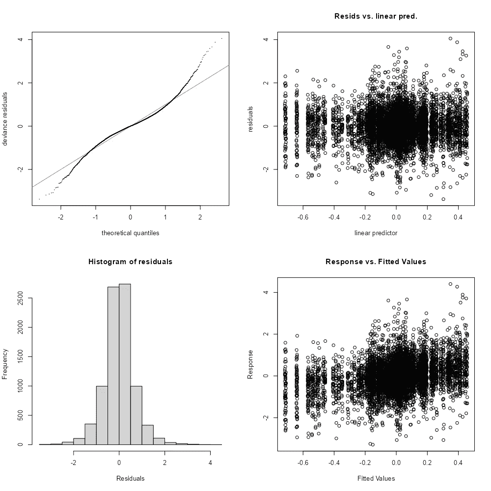

Residuals are not adhering completely to the assumptions of normality and homogeneity.

让我们看看样条函数。记住，我要求六个样条(每个大脑区域一个)，每个样条由十个结组成。枕骨区域是唯一没有达到统计学显著性的样条，至少给出了一个概念，也许结的数量对于这种特殊的模式来说太多了。换句话说——这个模式没有我想象的那么不稳定，而且可以用一种更简单的方式来建模。

```
par(mfrow = c(3, 2))
plot(mod_gam1)
```


The splines as fit from the model. The occipital region does not really need such a heavy spline. The rest shows quite a wiggled patterns that lends itself for spline modelling.

当然，我们可以通过使用基于 *ggplot* 库的不同库来扩充内置绘图。

```
gratia::draw(mod_gam1)
```

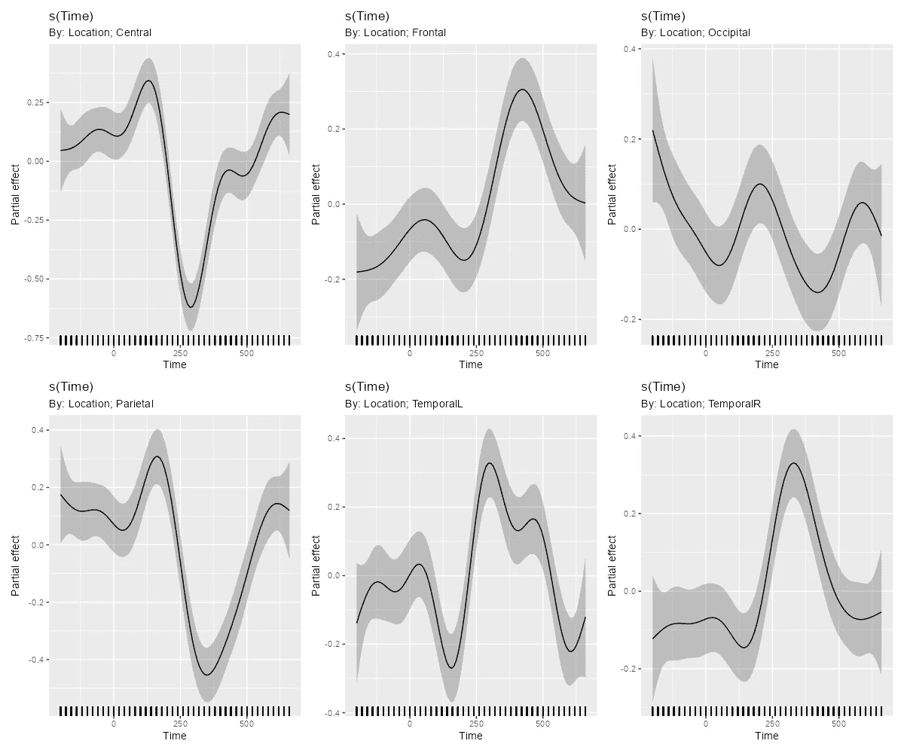

The occipital region looks quite wiggly as well here, but in a much more cyclical pattern. The rest shows shifts. However, without discerning the difference between the treatments, the graphs do not really help much in finding an answer to the question if being in one treatment or the other changes the EEG pattern of a patient.

然后就是 *mgcViz* 包。

```
b<-mgcViz::getViz(mod_gam1)
print(plot(b, allTerms = T), pages = 1)
mgcViz::qq(b, rep = 20, showReps = T, CI = "none", a.qqpoi = list("shape" = 19), a.replin = list("alpha" = 0.2))
check(b,
      a.qq = list(method = "tnorm", 
                  a.cipoly = list(fill = "light blue")), 
      a.respoi = list(size = 0.5), 
      a.hist = list(bins = 10))

Method: GCV   Optimizer: magic
Smoothing parameter selection converged after 20 iterations.
The RMS GCV score gradient at convergence was 1.068344e-07 .
The Hessian was positive definite.
Model rank =  61 / 61 

Basis dimension (k) checking results. Low p-value (k-index<1) may
indicate that k is too low, especially if edf is close to k'.

                            k'  edf k-index p-value
s(Time):LocationCentral   9.00 8.67    0.99    0.29
s(Time):LocationFrontal   9.00 6.61    0.99    0.36
s(Time):LocationOccipital 9.00 6.87    0.99    0.34
s(Time):LocationParietal  9.00 8.06    0.99    0.40
s(Time):LocationTemporalL 9.00 8.66    0.99    0.36
s(Time):LocationTemporalR 9.00 7.20    0.99    0.33
```

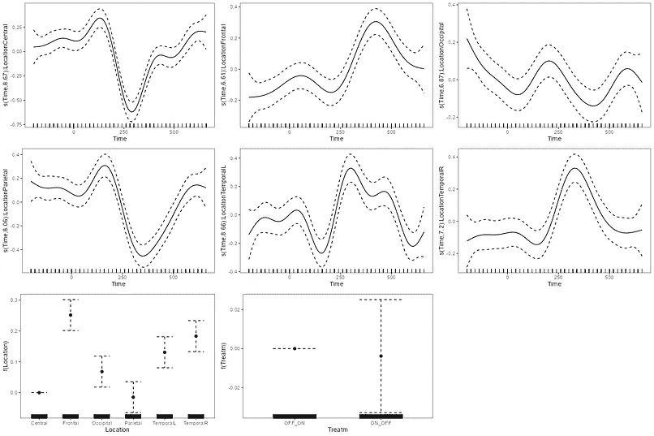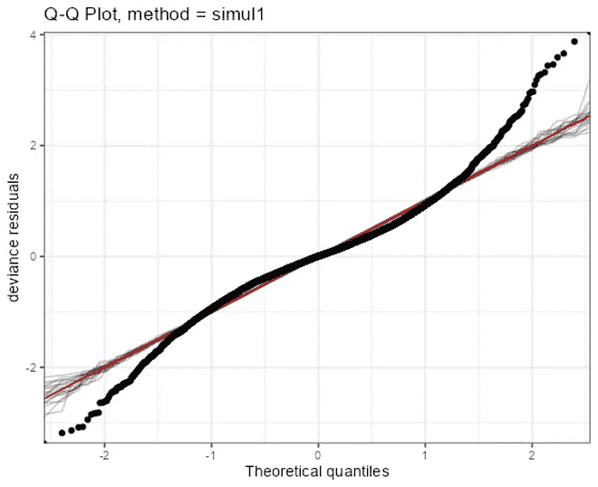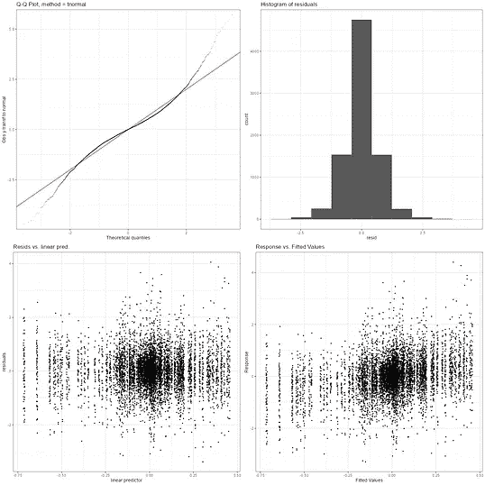

Same results as before, but with added resampling. To the left you can now also see the main effects of location and treatment. For location we have already known that it is an important effect, but for treatment the effect remains much more unclear. The graphical analysis used before does not offer much help and also here, it seems that one the treatments has NO variation (?). Such a finding could very much hint at a model that is overfitted.

下面是一个模型，在这个模型中，我将要求每个处理使用单独的样条。

```
mod_gam2 = mgcv::gam(Value ~ Location+ s(Time,by=Treatm, k=10) + Treatm, 
                     data = df_all_diff)
mgcv::gam.check(mod_gam2, k.rep = 1000)

Method: GCV   Optimizer: magic
Smoothing parameter selection converged after 10 iterations.
The RMS GCV score gradient at convergence was 1.475121e-07 .
The Hessian was positive definite.
Model rank =  25 / 25 

Basis dimension (k) checking results. Low p-value (k-index<1) may
indicate that k is too low, especially if edf is close to k'.

                       k'  edf k-index p-value
s(Time):TreatmOFF_ON 9.00 1.51    0.99    0.25
s(Time):TreatmON_OFF 9.00 1.00    0.99    0.24

gratia::draw(mod_gam2)
concurvity(mod_gam2)
             para s(Time):TreatmOFF_ON s(Time):TreatmON_OFF
worst    0.8571429         1.786408e-25         2.001350e-25
observed 0.8571429         1.850499e-29         1.218342e-32
estimate 0.8571429         4.495956e-28         4.272275e-28

b<-mgcViz::getViz(mod_gam2)
check(b,
      a.qq = list(method = "tnorm", 
                  a.cipoly = list(fill = "light blue")), 
      a.respoi = list(size = 0.5), 
      a.hist = list(bins = 10))
Method: GCV   Optimizer: magic
Smoothing parameter selection converged after 10 iterations.
The RMS GCV score gradient at convergence was 1.475121e-07 .
The Hessian was positive definite.
Model rank =  25 / 25 

Basis dimension (k) checking results. Low p-value (k-index<1) may
indicate that k is too low, especially if edf is close to k'.

                       k'  edf k-index p-value
s(Time):TreatmOFF_ON 9.00 1.51       1    0.38
s(Time):TreatmON_OFF 9.00 1.00       1    0.40
```

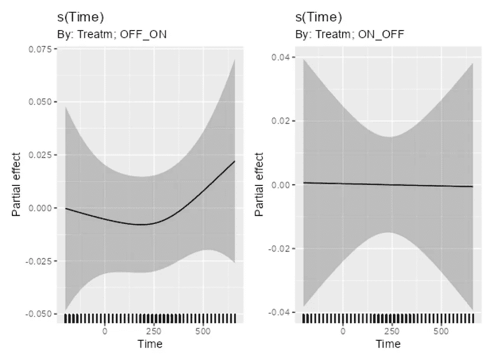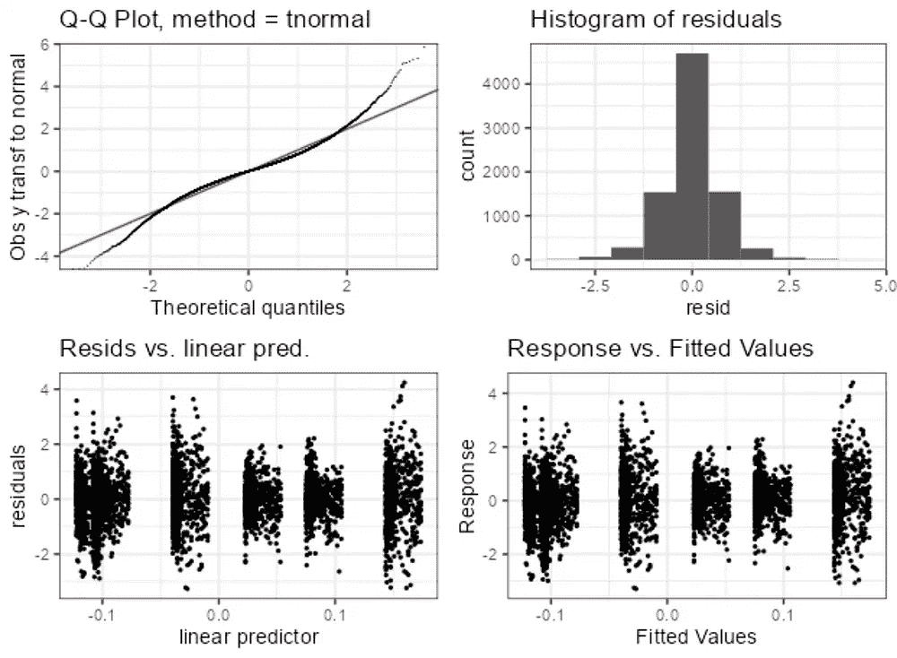

Model results clearly show that if location is not included in a more vigorous way the model leaves somewhat to be desired. In other words, the location of the brain in which the EEG was captured holds more information that then the treatment a subject was assigned to.

我们也可以通过比较模型来评估这种说法。

```
anova(mod_gam1, mod_gam2, test = "Chisq")
Analysis of Deviance Table

Model 1: Value ~ Location + s(Time, by = Location, k = 10) + Treatm
Model 2: Value ~ Location + s(Time, by = Treatm, k = 10) + Treatm
  Resid. Df Resid. Dev      Df Deviance  Pr(>Chi)    
1    8390.4     3874.0                               
2    8438.1     4152.8 -47.772  -278.85 < 2.2e-16 ***
---
Signif. codes:  0 ‘***’ 0.001 ‘**’ 0.01 ‘*’ 0.05 ‘.’ 0.1 ‘ ’ 1

AIC(mod_gam1,mod_gam2)
               df      AIC
mod_gam1 54.08007 17496.05
mod_gam2 10.51381 17996.12
```

事实上，第一个模型比第二个模型更好，这意味着每个位置的单独样条模型比每个治疗的单独样条更好地被数据支持。

由于数据来源于患者，并且我们有每个患者的多个数据点(并且数据点本身是自相关的),因此将 GAM 模型扩展到 GAMM 模型会很好。

```
mod_gam3 = gamm4::gamm4(Value ~ Location+ s(Time,by=Location) + Treatm, 
                        random=~(1|Subject), data = df_all_diff)
mod_gam3$gam
mod_gam3$mer

plot(mod_gam3$gam)
Family: gaussian 
Link function: identity 

Formula:
Value ~ Location + s(Time, by = Location) + Treatm

Estimated degrees of freedom:
8.28 6.25 5.30 7.56 7.63 6.61  total = 48.63 

lmer.REML score: 17636.23 

plot(mod_gam3$mer)
Linear mixed model fit by REML ['lmerMod']
REML criterion at convergence: 17636.23
Random effects:
 Groups   Name                      Std.Dev.
 Subject  (Intercept)               0.0000  
 Xr.4     s(Time):LocationTemporalR 1.7752  
 Xr.3     s(Time):LocationTemporalL 2.9119  
 Xr.2     s(Time):LocationParietal  2.7979  
 Xr.1     s(Time):LocationOccipital 1.0056  
 Xr.0     s(Time):LocationFrontal   1.5169  
 Xr       s(Time):LocationCentral   4.5066  
 Residual                           0.6797  
Number of obs: 8448, groups:  
Subject, 32; Xr.4, 8; Xr.3, 8; Xr.2, 8; Xr.1, 8; Xr.0, 8; Xr, 8
Fixed Effects:
                 X(Intercept)               XLocationFrontal  
                    -0.099885                       0.251456  
           XLocationOccipital              XLocationParietal  
                     0.068281                      -0.014560  
           XLocationTemporalL             XLocationTemporalR  
                     0.130767                       0.183153  
                XTreatmON_OFF    Xs(Time):LocationCentralFx1  
                    -0.003823                       0.038188  
  Xs(Time):LocationFrontalFx1  Xs(Time):LocationOccipitalFx1  
                    -0.034531                      -0.254505  
 Xs(Time):LocationParietalFx1  Xs(Time):LocationTemporalLFx1  
                    -0.171399                       0.336391  
Xs(Time):LocationTemporalRFx1  
                     0.110113 
```

根据这个模型，增加随机分量对最小化剩余分量没有任何作用。这意味着从 GAM 到 GAMM 的转换没有添加任何信息。我们可以绘制并直观地检查模型的表现。由于模型由两个模型(GAM 和 MER 模型)的集成组成，我也可以绘制两个部分。事实上，我将不得不分别绘制它们。

```
plot(mod_gam3$gam)
plot(mod_gam3$mer)
```

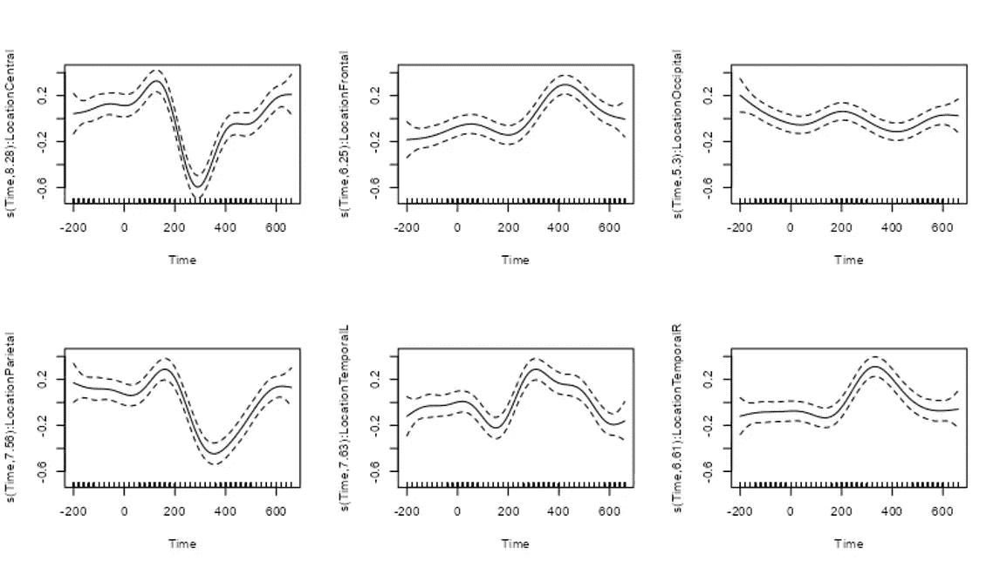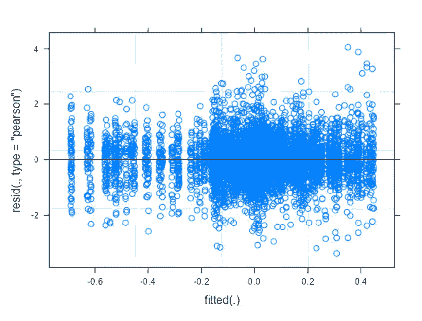

The splines coming from the GAM part shown to the left and the residuals coming from the MER part to the right. Residuals look somewhat okay.

如果我使用基本的 *lmer* 函数对数据建模，然后应用样条，会怎么样？好吧，我最后得到的是很多参数，仍然没有从随机截距中得到解释的方差。模型中必须有所改变。

```
fit<-lmer(Value ~ splines::bs(Time,5)*Location*Treatm+(1|Subject), 
          data = df_all_diff)
summary(fit)

Linear mixed model fit by REML ['lmerMod']
Formula: Value ~ splines::bs(Time, 5) * Location * Treatm + (1 | Subject)
   Data: df_all_diff

REML criterion at convergence: 17672.5

Scaled residuals: 
    Min      1Q  Median      3Q     Max 
-5.1045 -0.5112  0.0012  0.5055  5.8069 

Random effects:
 Groups   Name        Variance Std.Dev.
 Subject  (Intercept) 0.0000   0.0000  
 Residual             0.4682   0.6843  
Number of obs: 8448, groups:  Subject, 32

Fixed effects:
                                                      Estimate Std. Error t value
(Intercept)                                          -0.006205   0.124698  -0.050
splines::bs(Time, 5)1                                -0.222783   0.241892  -0.921
splines::bs(Time, 5)2                                 0.778134   0.177183   4.392
splines::bs(Time, 5)3                                -1.557075   0.228961  -6.801
splines::bs(Time, 5)4                                 0.686644   0.186682   3.678
splines::bs(Time, 5)5                                -0.088036   0.180222  -0.488
LocationFrontal                                      -0.031311   0.176350  -0.178
LocationOccipital                                     0.291694   0.176350   1.654
LocationParietal                                      0.199977   0.176350   1.134
LocationTemporalL                                    -0.218000   0.176350  -1.236
LocationTemporalR                                    -0.111474   0.176350  -0.632
TreatmON_OFF                                         -0.032629   0.176350  -0.185
splines::bs(Time, 5)1:LocationFrontal                 0.512373   0.342086   1.498
splines::bs(Time, 5)2:LocationFrontal                -1.105375   0.250575  -4.411
splines::bs(Time, 5)3:LocationFrontal                 2.029441   0.323800   6.268
splines::bs(Time, 5)4:LocationFrontal                -0.151254   0.264008  -0.573
splines::bs(Time, 5)5:LocationFrontal                 0.286643   0.254872   1.125
splines::bs(Time, 5)1:LocationOccipital              -0.320674   0.342086  -0.937
splines::bs(Time, 5)2:LocationOccipital              -0.920669   0.250575  -3.674
splines::bs(Time, 5)3:LocationOccipital               1.263202   0.323800   3.901
splines::bs(Time, 5)4:LocationOccipital              -0.880373   0.264008  -3.335
splines::bs(Time, 5)5:LocationOccipital              -0.220418   0.254872  -0.865
splines::bs(Time, 5)1:LocationParietal               -0.518464   0.342086  -1.516
splines::bs(Time, 5)2:LocationParietal                0.083274   0.250575   0.332
splines::bs(Time, 5)3:LocationParietal                0.007770   0.323800   0.024
splines::bs(Time, 5)4:LocationParietal               -0.667745   0.264008  -2.529
splines::bs(Time, 5)5:LocationParietal               -0.206607   0.254872  -0.811
splines::bs(Time, 5)1:LocationTemporalL               0.804571   0.342086   2.352
splines::bs(Time, 5)2:LocationTemporalL              -1.165478   0.250575  -4.651
splines::bs(Time, 5)3:LocationTemporalL               2.460331   0.323800   7.598
splines::bs(Time, 5)4:LocationTemporalL              -0.696576   0.264008  -2.638
splines::bs(Time, 5)5:LocationTemporalL               0.139232   0.254872   0.546
splines::bs(Time, 5)1:LocationTemporalR               0.653222   0.342086   1.910
splines::bs(Time, 5)2:LocationTemporalR              -1.327438   0.250575  -5.298
splines::bs(Time, 5)3:LocationTemporalR               2.836979   0.323800   8.762
splines::bs(Time, 5)4:LocationTemporalR              -1.170976   0.264008  -4.435
splines::bs(Time, 5)5:LocationTemporalR               0.464149   0.254872   1.821
splines::bs(Time, 5)1:TreatmON_OFF                    0.134668   0.342086   0.394
splines::bs(Time, 5)2:TreatmON_OFF                   -0.288278   0.250575  -1.150
splines::bs(Time, 5)3:TreatmON_OFF                    0.762567   0.323800   2.355
splines::bs(Time, 5)4:TreatmON_OFF                   -0.439044   0.264008  -1.663
splines::bs(Time, 5)5:TreatmON_OFF                    0.216905   0.254872   0.851
LocationFrontal:TreatmON_OFF                         -0.086358   0.249397  -0.346
LocationOccipital:TreatmON_OFF                       -0.041804   0.249397  -0.168
LocationParietal:TreatmON_OFF                        -0.014295   0.249397  -0.057
LocationTemporalL:TreatmON_OFF                        0.157587   0.249397   0.632
LocationTemporalR:TreatmON_OFF                        0.070040   0.249397   0.281
splines::bs(Time, 5)1:LocationFrontal:TreatmON_OFF   -0.156327   0.483783  -0.323
splines::bs(Time, 5)2:LocationFrontal:TreatmON_OFF    0.760626   0.354366   2.146
splines::bs(Time, 5)3:LocationFrontal:TreatmON_OFF   -0.634830   0.457922  -1.386
splines::bs(Time, 5)4:LocationFrontal:TreatmON_OFF    0.295937   0.373364   0.793
splines::bs(Time, 5)5:LocationFrontal:TreatmON_OFF   -0.267030   0.360444  -0.741
splines::bs(Time, 5)1:LocationOccipital:TreatmON_OFF  0.027671   0.483783   0.057
splines::bs(Time, 5)2:LocationOccipital:TreatmON_OFF  0.359626   0.354366   1.015
splines::bs(Time, 5)3:LocationOccipital:TreatmON_OFF -1.088830   0.457922  -2.378
splines::bs(Time, 5)4:LocationOccipital:TreatmON_OFF  0.269381   0.373364   0.721
splines::bs(Time, 5)5:LocationOccipital:TreatmON_OFF -0.087426   0.360444  -0.243
splines::bs(Time, 5)1:LocationParietal:TreatmON_OFF   0.169916   0.483783   0.351
splines::bs(Time, 5)2:LocationParietal:TreatmON_OFF  -0.252128   0.354366  -0.711
splines::bs(Time, 5)3:LocationParietal:TreatmON_OFF  -0.277775   0.457922  -0.607
splines::bs(Time, 5)4:LocationParietal:TreatmON_OFF   0.402255   0.373364   1.077
splines::bs(Time, 5)5:LocationParietal:TreatmON_OFF   0.041977   0.360444   0.116
splines::bs(Time, 5)1:LocationTemporalL:TreatmON_OFF -0.363102   0.483783  -0.751
splines::bs(Time, 5)2:LocationTemporalL:TreatmON_OFF  0.288951   0.354366   0.815
splines::bs(Time, 5)3:LocationTemporalL:TreatmON_OFF -0.785173   0.457922  -1.715
splines::bs(Time, 5)4:LocationTemporalL:TreatmON_OFF  0.319481   0.373364   0.856
splines::bs(Time, 5)5:LocationTemporalL:TreatmON_OFF -0.276941   0.360444  -0.768
splines::bs(Time, 5)1:LocationTemporalR:TreatmON_OFF -0.349997   0.483783  -0.723
splines::bs(Time, 5)2:LocationTemporalR:TreatmON_OFF  0.663091   0.354366   1.871
splines::bs(Time, 5)3:LocationTemporalR:TreatmON_OFF -1.431663   0.457922  -3.126
splines::bs(Time, 5)4:LocationTemporalR:TreatmON_OFF  0.996570   0.373364   2.669
splines::bs(Time, 5)5:LocationTemporalR:TreatmON_OFF -0.563605   0.360444  -1.564

Correlation matrix not shown by default, as p = 72 > 12.
Use print(x, correlation=TRUE)  or
    vcov(x)        if you need it

optimizer (nloptwrap) convergence code: 0 (OK)
boundary (singular) fit: see help('isSingular')

sjPlot::plot_model(fit, type="diag")
sjPlot::plot_model(fit, type="pred")
```

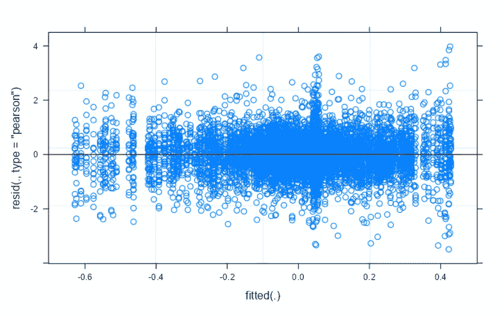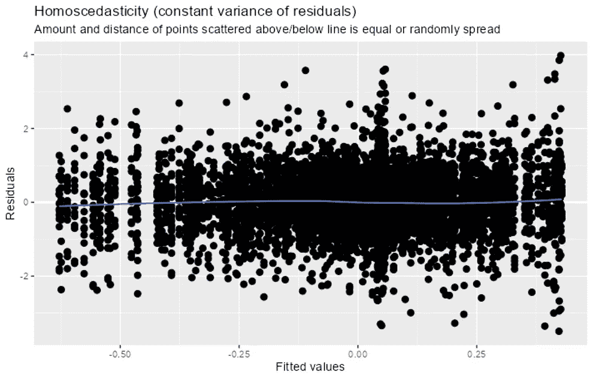

The same result, plot differently. I find the peak and valley at 0.05 (fitted values) strange. I am not sure why I am having them.

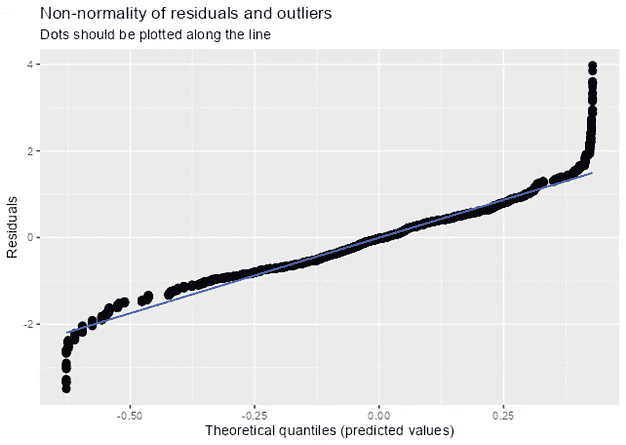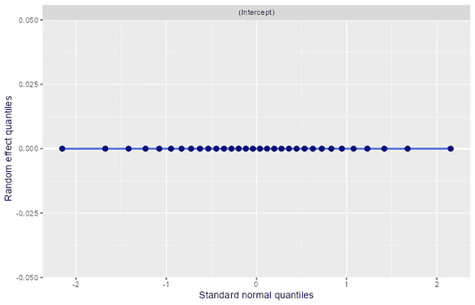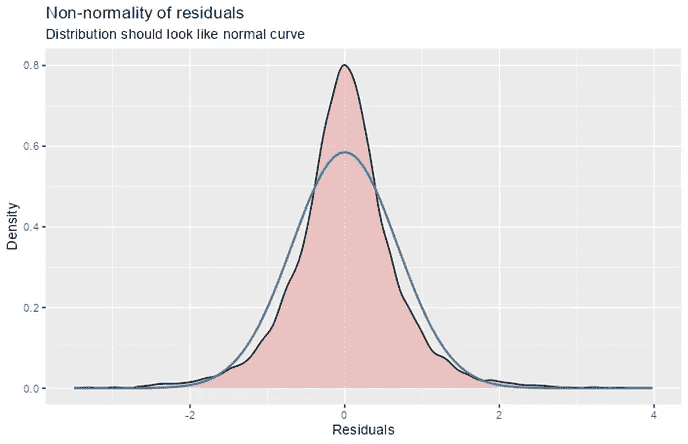

Well, the residuals have for sure some long tails and quite a peak. The random intercept is zero so the plot should not surprise us.

我之前提到过位置数据嵌套在主题中。然而，我下面的做法是完全错误的。我制作了一个模型，在这个模型中，我将主题嵌套在位置中。当然，模型将按照要求执行，但是让我们看看会发生什么。

```
fit<-lmer(Value ~ splines::bs(Time,5)*Treatm+(1 + Location|Subject), 
          data = df_all_diff)
summary(fit)

Linear mixed model fit by REML ['lmerMod']
Formula: Value ~ splines::bs(Time, 5) * Treatm + (1 + Location | Subject)
   Data: df_all_diff

REML criterion at convergence: 16620.1

Scaled residuals: 
    Min      1Q  Median      3Q     Max 
-5.1255 -0.5463  0.0039  0.5590  5.7472 

Random effects:
 Groups   Name              Variance Std.Dev. Corr                         
 Subject  (Intercept)       0.1190   0.3450                                
          LocationFrontal   0.1963   0.4431   -0.50                        
          LocationOccipital 0.4131   0.6427   -0.86  0.06                  
          LocationParietal  0.1228   0.3504   -0.71 -0.21  0.96            
          LocationTemporalL 0.1946   0.4411   -0.90  0.66  0.61  0.41      
          LocationTemporalR 0.2611   0.5110   -0.93  0.62  0.65  0.49  0.86
 Residual                   0.4017   0.6338                                
Number of obs: 8448, groups:  Subject, 32

Fixed effects:
                                   Estimate Std. Error t value
(Intercept)                         0.01734    0.04721   0.367
splines::bs(Time, 5)1              -0.03428    0.09147  -0.375
splines::bs(Time, 5)2               0.03885    0.06700   0.580
splines::bs(Time, 5)3              -0.12412    0.08658  -1.434
splines::bs(Time, 5)4               0.09216    0.07059   1.305
splines::bs(Time, 5)5              -0.01087    0.06815  -0.159
TreatmON_OFF                       -0.01932    0.06676  -0.289
splines::bs(Time, 5)1:TreatmON_OFF  0.02269    0.12936   0.175
splines::bs(Time, 5)2:TreatmON_OFF  0.01508    0.09475   0.159
splines::bs(Time, 5)3:TreatmON_OFF  0.05952    0.12244   0.486
splines::bs(Time, 5)4:TreatmON_OFF -0.05844    0.09983  -0.585
splines::bs(Time, 5)5:TreatmON_OFF  0.02473    0.09638   0.257

Correlation of Fixed Effects:
            (Intr) sp::(T,5)1 sp::(T,5)2 sp::(T,5)3 sp::(T,5)4 sp::(T,5)5 TON_OF s::(T,5)1: s::(T,5)2: s::(T,5)3: s::(T,5)4:
spl::(T,5)1 -0.833                                                                                                          
spl::(T,5)2 -0.417  0.001                                                                                                   
spl::(T,5)3 -0.691  0.765     -0.230                                                                                        
spl::(T,5)4 -0.572  0.351      0.606     -0.029                                                                             
spl::(T,5)5 -0.722  0.644      0.179      0.648      0.131                                                                  
TretmON_OFF -0.707  0.589      0.295      0.488      0.404      0.510                                                       
s::(T,5)1:T  0.589 -0.707     -0.001     -0.541     -0.248     -0.455     -0.833                                            
s::(T,5)2:T  0.295 -0.001     -0.707      0.162     -0.429     -0.127     -0.417  0.001                                     
s::(T,5)3:T  0.488 -0.541      0.162     -0.707      0.021     -0.458     -0.691  0.765     -0.230                          
s::(T,5)4:T  0.404 -0.248     -0.429      0.021     -0.707     -0.093     -0.572  0.351      0.606     -0.029               
s::(T,5)5:T  0.510 -0.455     -0.127     -0.458     -0.093     -0.707     -0.722  0.644      0.179      0.648      0.131    
optimizer (nloptwrap) convergence code: 0 (OK)
boundary (singular) fit: see help('isSingular') 
```

```
sjPlot::plot_model(fit, type="diag")
sjPlot::plot_model(fit, type="pred")
pred<-broom.mixed::augment(fit)
```

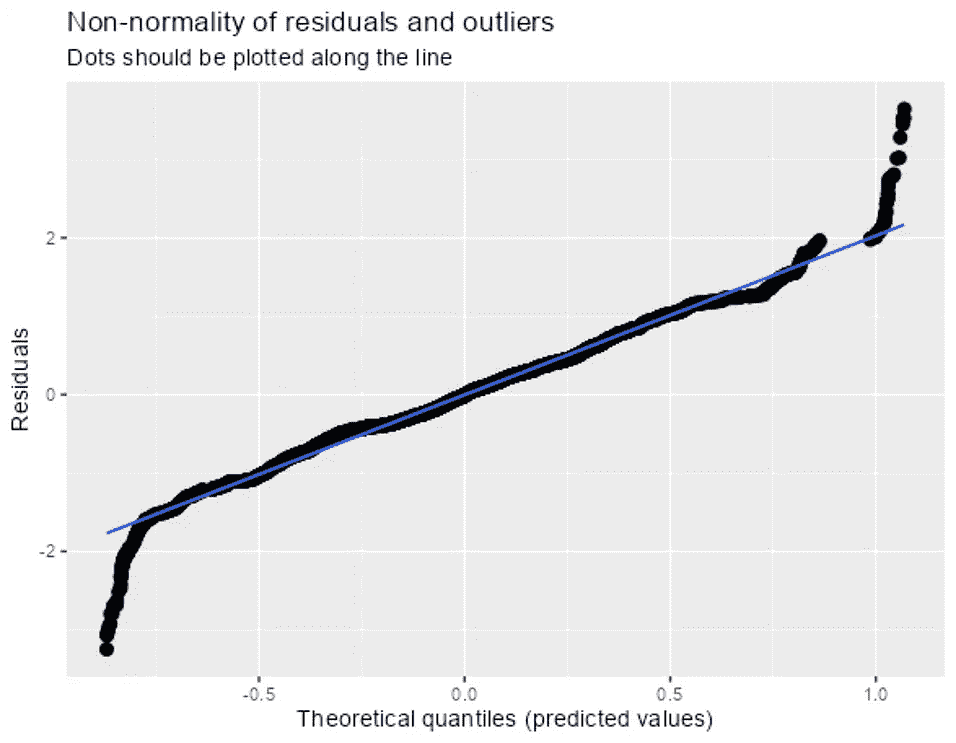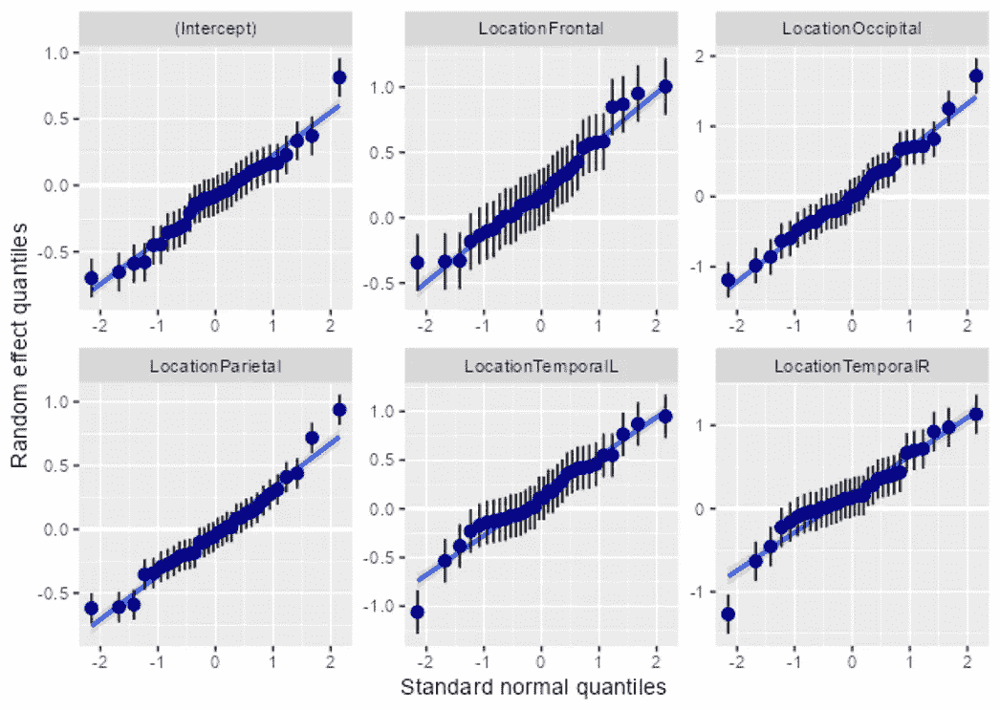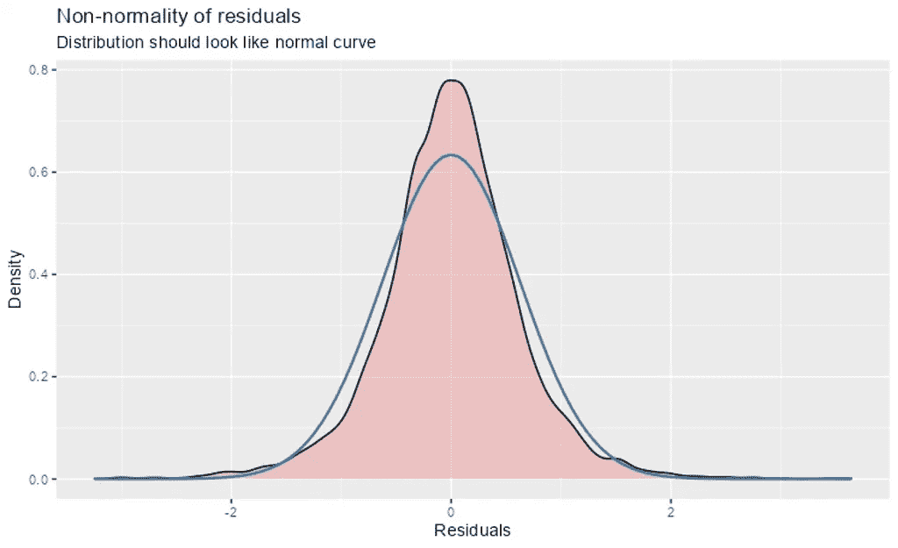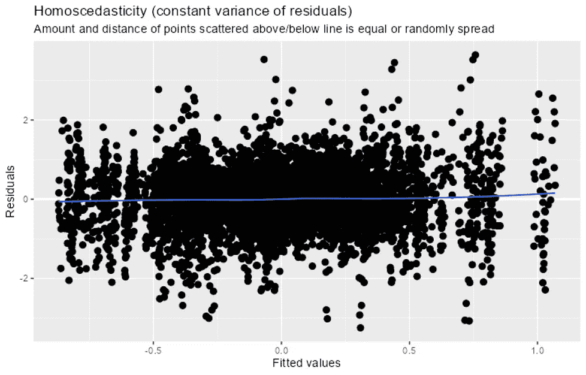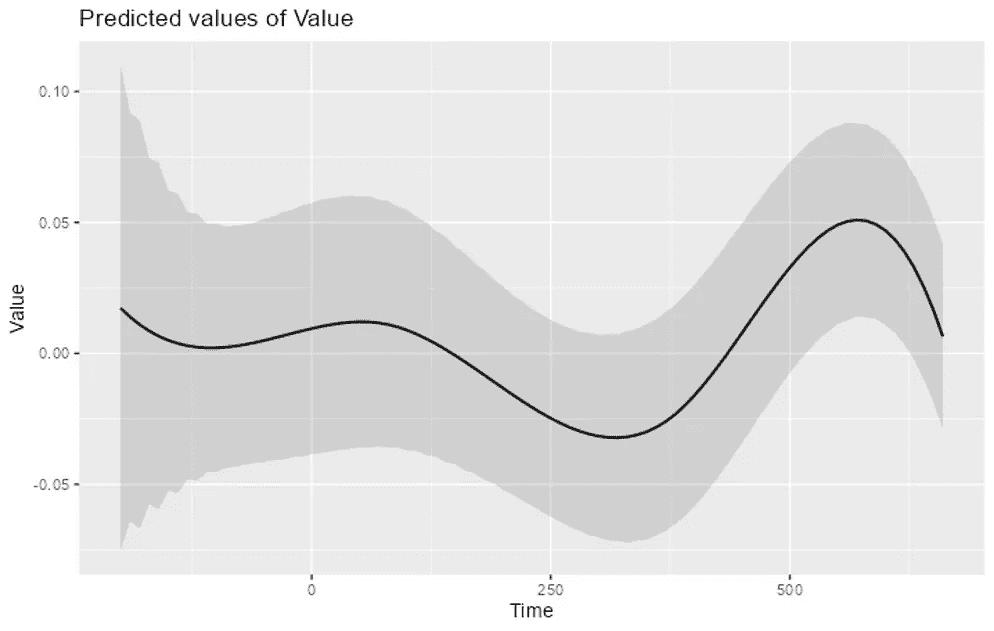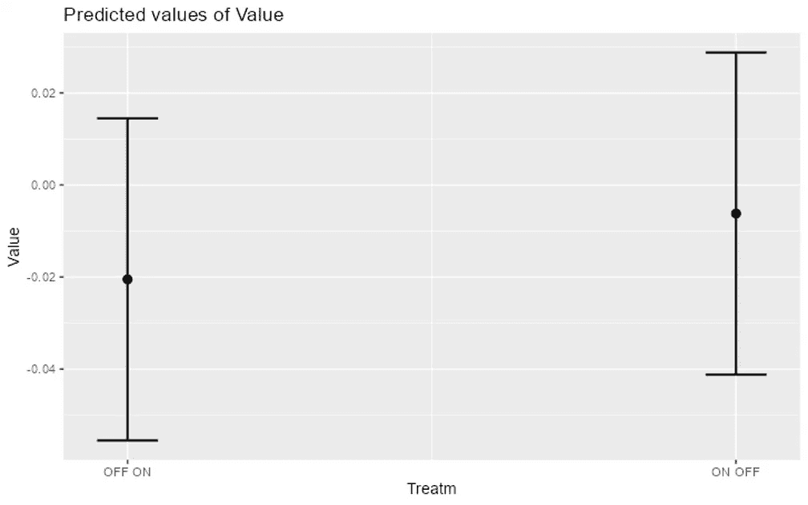

The residuals are somewhat heavy on the tails, the random intercepts perform as they should and the conditional effects are also okay. The residuals definitly have more homogeneity, so all in all the model meets the asumptions of a linear mixed model better than it did before.

另一个评估测试是将拟合值与观察值进行比较。让我们根据每个治疗和每个位置来评估通过最大似然法获得的结果的有效性。

```
ggplot(pred, 
       aes(x=Value, y=.fitted, col=Treatm))+
  geom_point()+
  facet_wrap(~Location, ncol=2)+
  theme_bw()+
  geom_abline(intercept=0, slope=1, col="black", lty=2)+
  xlim(-2,2)+
  ylim(-2,2)
```

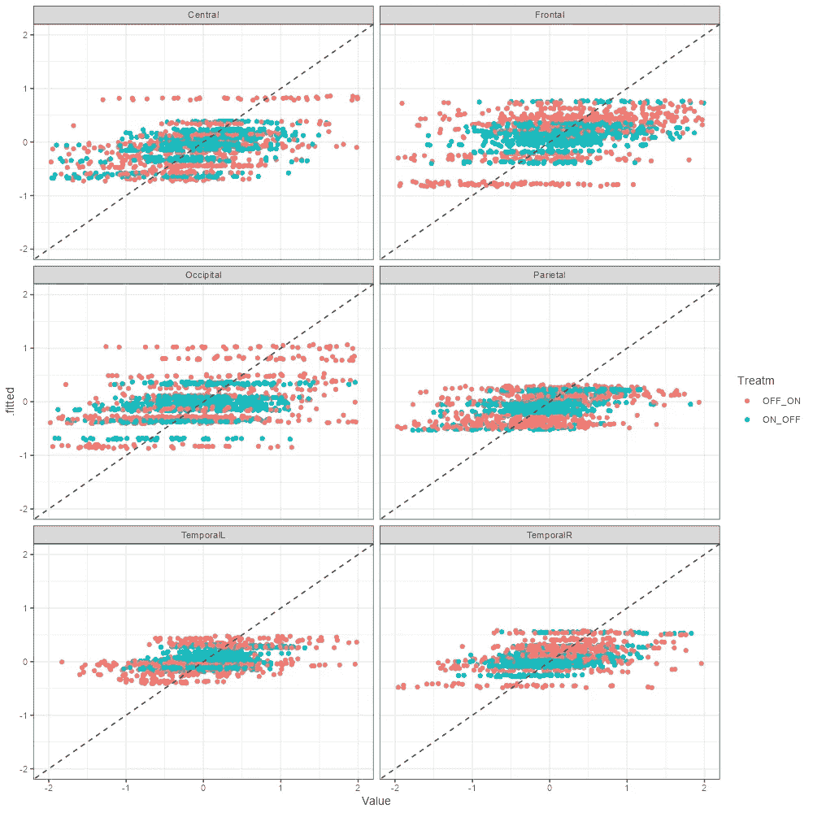

This is NOT good at all. Hence, the model is not good.

让我们尝试一个不同的模型，在这个模型中，我在寻找一种处理重尾的方法。为此，我将运行一个简单的线性模型，包括受试者特定的截距，以及时间(样条)、治疗和位置的主要影响。然后我将添加一个 Box-Cox 变换。

```
fitlm<-lm(Value ~ splines::bs(Time,5)+as.factor(Treatm)+
            as.factor(Location)+as.factor(Subject), data=df_all_diff)
par(mfrow=c(2,2));plot(fitlm)
boxcox(fitlm,lambda=seq(-2,2,by=0.1),plotit=T)
Error in boxcox.default(fitlm, lambda = seq(-2, 2, by = 0.1), plotit = T) : 
  response variable must be positive
```

那并不顺利。这是因为有些值是负值，并且对数转换不适用于负值。所以我必须加上一个常数，让它们都变成正的。

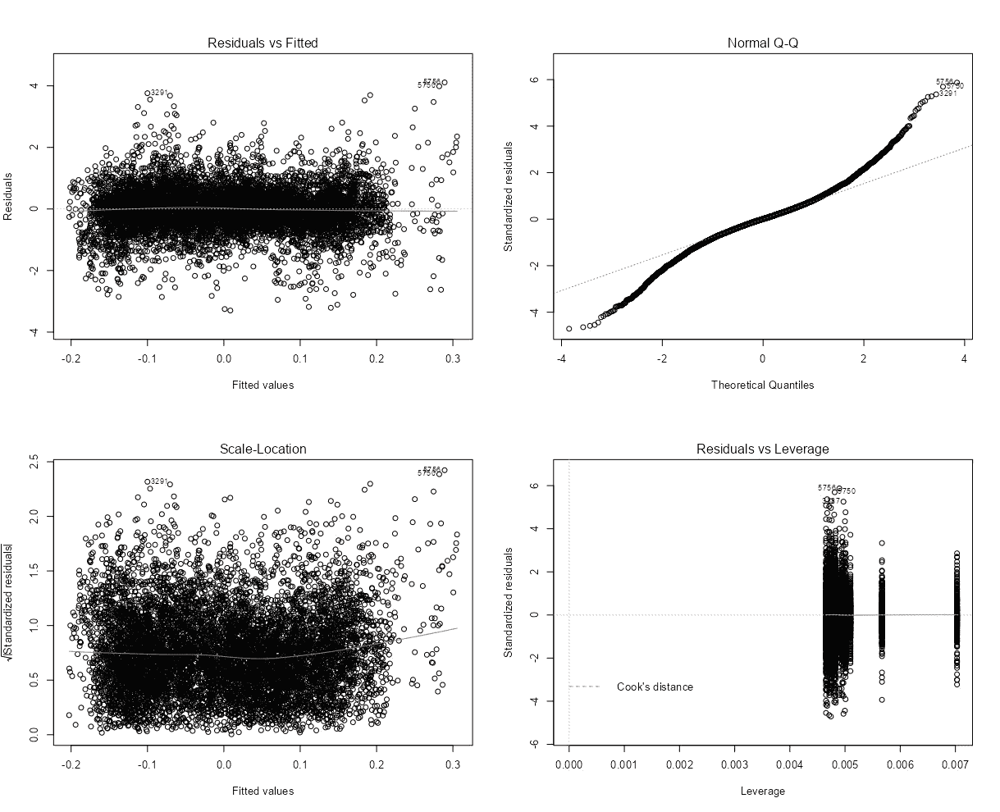

As you can see the linear model still has some heavy tail residuals.

查看结果值描述符，我可以看到最小值是-3.29。让我们给每个值加 4。因为我把数据加到所有的值上，增加了一个常数 4，我没有改变变量之间的关系。

```
summary(df_all_diff$Value)
     Min.   1st Qu.    Median      Mean   3rd Qu.      Max. 
-3.290000 -0.360000  0.010000  0.001386  0.370000  4.400000 

df_all_diff$Value2<-df_all_diff$Value + 4
fitlm<-lm(Value2 ~ splines::bs(Time,5)+as.factor(Treatm)+
            as.factor(Location)+as.factor(Subject), data=df_all_diff)
par(mfrow=c(2,2));plot(fitlm)

#   -2   -->  1/Y2
#   -1   -->  1/Y1
#   -0.5  -->  1/(Sqrt(Y))
#   0     -->  log(Y)
#   0.5   -->  Sqrt(Y)
#   1     -->  Y
#   2     -->  Y^2

boxcox(fitlm,lambda=seq(-2,2,by=0.1),plotit=T)
bc1<-boxcox(fitlm,lambda=seq(-2,2,by=0.1),plotit=T)
which.max(bc1$y)
[1] 77
LV<-bc1[1]$x[as.numeric(which.max(bc1$y))]
LV 
[1] 1.070707
```

Box-Cox 提供了 1.07 作为 lambda 值，这意味着我必须将所有值提高 1.07 的幂。这几乎不会增加什么。因此，对数据进行 Box-Cox 变换不会消除重尾残差的问题。这意味着我必须更好地指定型号。

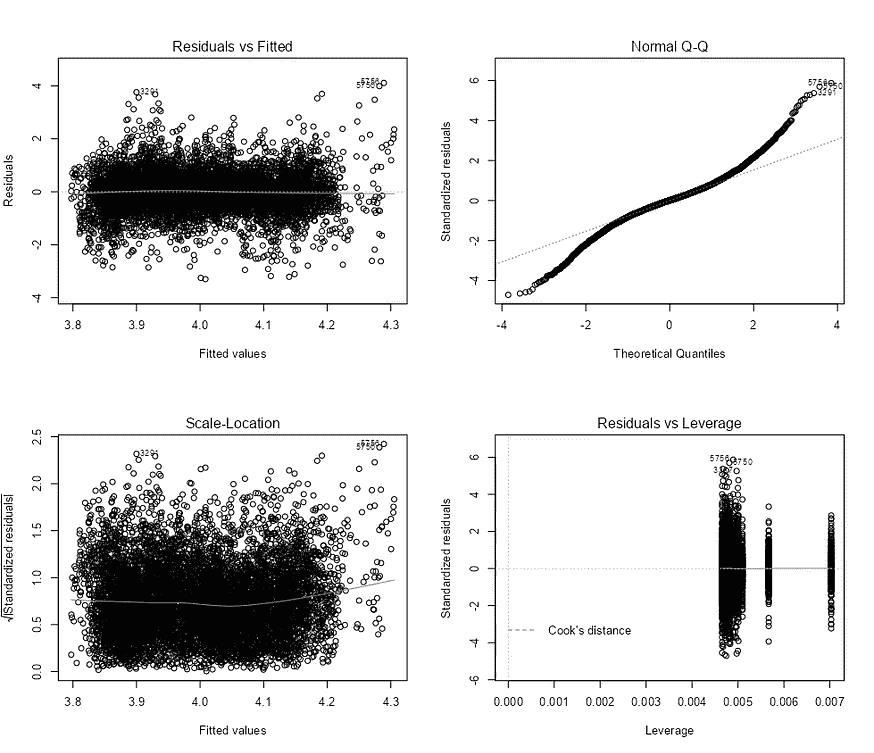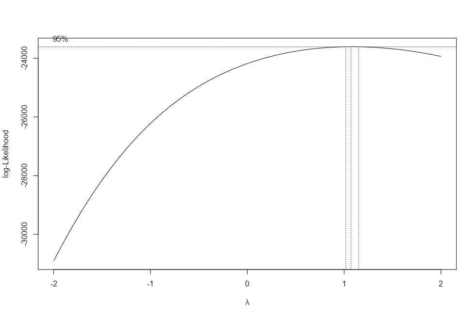

Model residuals pre-transformation (left) and Box-Cox results (right). The chosen transformation power is 1.07.

```
df_all_diff$ValueBC<-df_all_diff$Value^1.070707
fitBC<-lm(ValueBC ~ splines::bs(Time,5)+as.factor(Treatm)+
            as.factor(Location)+as.factor(Subject), data=df_all_diff)
par(mfrow=c(2,2));plot(fitBC)
```

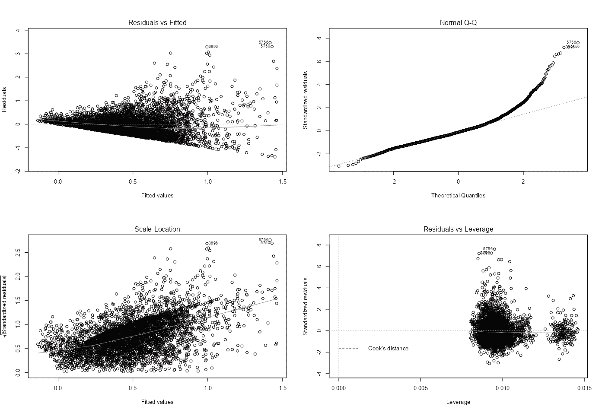

And the residuals from the Box-Cox transformed data — as you can see, this is NOT good. By adding a constant and transforming that constant, I have built a somehwat natural boundary. Perhaps adding the constant was not that wise, but it should not change the interrelationship of the variables.

如果我稍微改变一下模型呢？似乎将结的数量从 5 个增加到 10 个可以提高模型拟合度。

```
fitlm<-lm(Value ~ splines::bs(Time,5)+as.factor(Treatm)+
            as.factor(Location)+as.factor(Subject), data=df_all_diff)
fitlm2<-lm(Value ~ splines::bs(Time,10)*as.factor(Location)+as.factor(Treatm)+
             as.factor(Subject), data=df_all_diff)
par(mfrow=c(2,2));plot(fitlm2)
AIC(fitlm,fitlm2)
       df      AIC
fitlm  43 18036.44
fitlm2 98 17584.51
```

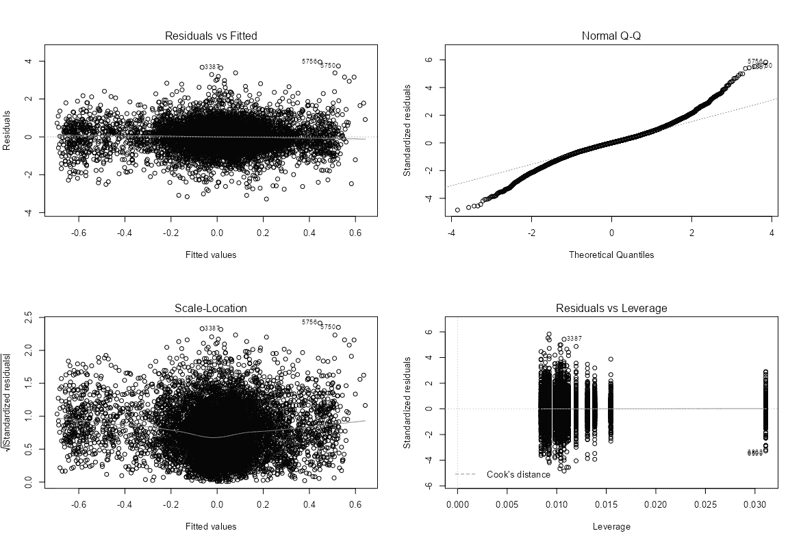

But the heavy tails remain.

也许我们有一些有影响的观察结果导致了这种干扰。请再次注意，我指定随机截距的方式是不正确的。

```
fit<-lmer(Value ~ splines::bs(Time,5)*Treatm+(1 + Location|Subject), 
          data = df_all_diff)
fit.inf<- influence.ME::influence(fit, "Subject")
dfbetas(fit.inf, parameters=c(2:6))
plot(fit.inf,
     which="dfbetas",
     parameters=c(2:6),
     xlab="DFbetaS",
     ylab="Subject")
```

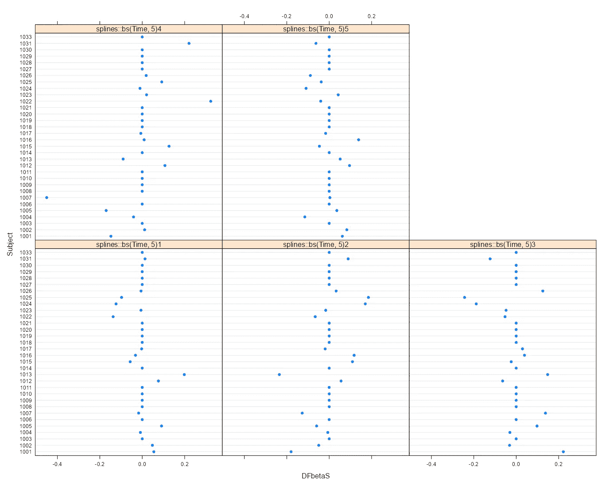

Nothing really sticks out.

```
plot(fit.inf, which="cook",
     cutoff=4/length(unique(df_all_diff$Subject)),sort=TRUE,
     xlab="Cook´s Distance",
     ylab="Subject")
```


And also not using the Cook’s distance.

尽管没有一个受试者跨过了库克距离的门槛，我们还是把最高的那个踢出去，看看会发生什么。

```
fit2 <- exclude.influence(fit, "Subject", "1022")
sjPlot::plot_model(fit2, type="diag")
```

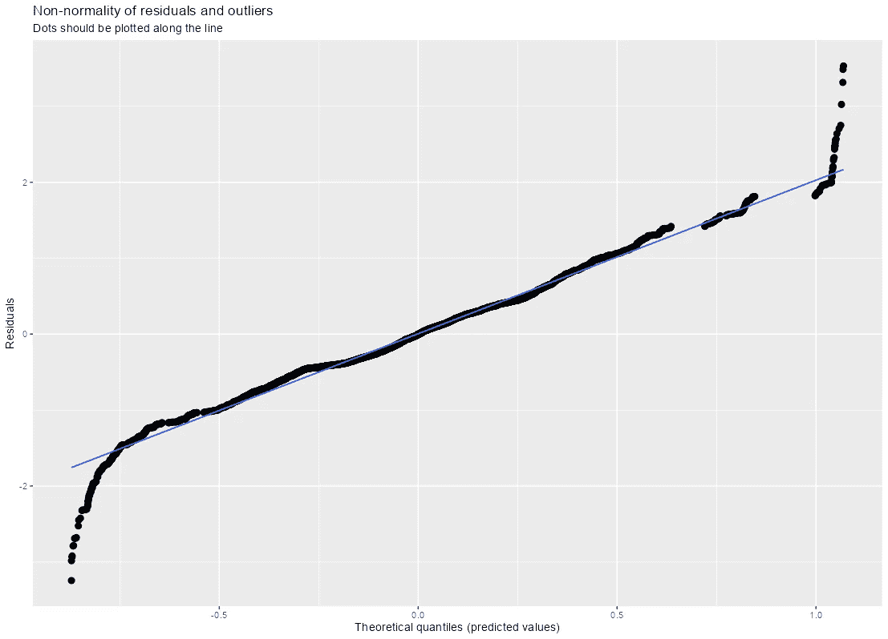

Not really an improvement.

好了，游戏时间结束了。以前的模型未正确指定，因为位置应与主题嵌套。我要做的是运行几个从大到小的模型，然后基于方差分析和 AIC 拟合优度测试对它们进行比较。

```
fit3.1<-lmer(Value ~ splines::ns(Time,5)*Treatm+
                      (1 + splines::ns(Time,3)|Subject)+
                      (1 + splines::ns(Time,3)|Subject:Location), 
                   data = df_all_diff)
fit3.2<-lmer(Value ~ splines::ns(Time,5)*Treatm+
                     (1 + splines::ns(Time,5)|Subject)+
                     (1 + splines::ns(Time,5)|Subject:Location), 
                   data = df_all_diff)
fit3.3<-lmer(Value ~ splines::ns(Time,5)*Treatm+
                     (0 + splines::ns(Time,5)|Subject)+
                     (1 + splines::ns(Time,5)|Subject:Location), 
                   data = df_all_diff)
fit3.4<-lmer(Value ~ splines::ns(Time,5)*Treatm+
               (1 + splines::ns(Time,5)|Subject:Location), 
             data = df_all_diff)
fit3.5<-lmer(Value ~ splines::ns(Time,5)*Treatm+
             (0 + splines::ns(Time,5)|Subject:Location), 
           data = df_all_diff)
anova(fit3.1, fit3.2, fit3.3, fit3.4, fit3.5)
refitting model(s) with ML (instead of REML)
Data: df_all_diff
Models:
fit3.5: Value ~ splines::ns(Time, 5) * Treatm + (0 + splines::ns(Time, 5) | Subject:Location)
fit3.1: Value ~ splines::ns(Time, 5) * Treatm + (1 + splines::ns(Time, 3) | Subject) + (1 + splines::ns(Time, 3) | Subject:Location)
fit3.4: Value ~ splines::ns(Time, 5) * Treatm + (1 + splines::ns(Time, 5) | Subject:Location)
fit3.3: Value ~ splines::ns(Time, 5) * Treatm + (0 + splines::ns(Time, 5) | Subject) + (1 + splines::ns(Time, 5) | Subject:Location)
fit3.2: Value ~ splines::ns(Time, 5) * Treatm + (1 + splines::ns(Time, 5) | Subject) + (1 + splines::ns(Time, 5) | Subject:Location)
       npar   AIC   BIC  logLik deviance  Chisq Df Pr(>Chisq)    
fit3.5   28 14000 14197 -6972.0    13944                         
fit3.1   33 14923 15155 -7428.5    14857    0.0  5          1    
fit3.4   34 13892 14132 -6912.0    13824 1032.9  1     <2e-16 ***
fit3.3   49 13922 14267 -6912.0    13824    0.0 15          1    
fit3.2   55 13934 14321 -6912.0    13824    0.0  6          1    
---
Signif. codes:  0 ‘***’ 0.001 ‘**’ 0.01 ‘*’ 0.05 ‘.’ 0.1 ‘ ’ 1
```

```
fit3.6<-lmer(Value ~ splines::ns(Time,5)+Treatm+
               (0 + splines::ns(Time,5)|Subject:Location), 
             data = df_all_diff) 

AIC(fit3.1, fit3.2, fit3.3, fit3.4, fit3.5, fit3.6)
       df      AIC
fit3.1 33 14969.25
fit3.2 55 13976.64
fit3.3 49 13964.64
fit3.4 34 13934.64
fit3.5 28 14043.17
fit3.6 23 14022.14

fit3.4<-lmer(Value ~ splines::ns(Time,5)*Treatm+
               (1 + splines::ns(Time,5)|Subject:Location), 
             data = df_all_diff)
sjPlot::plot_model(fit3.4, type="diag")
sjPlot::plot_model(fit3.4, type="pred")
```

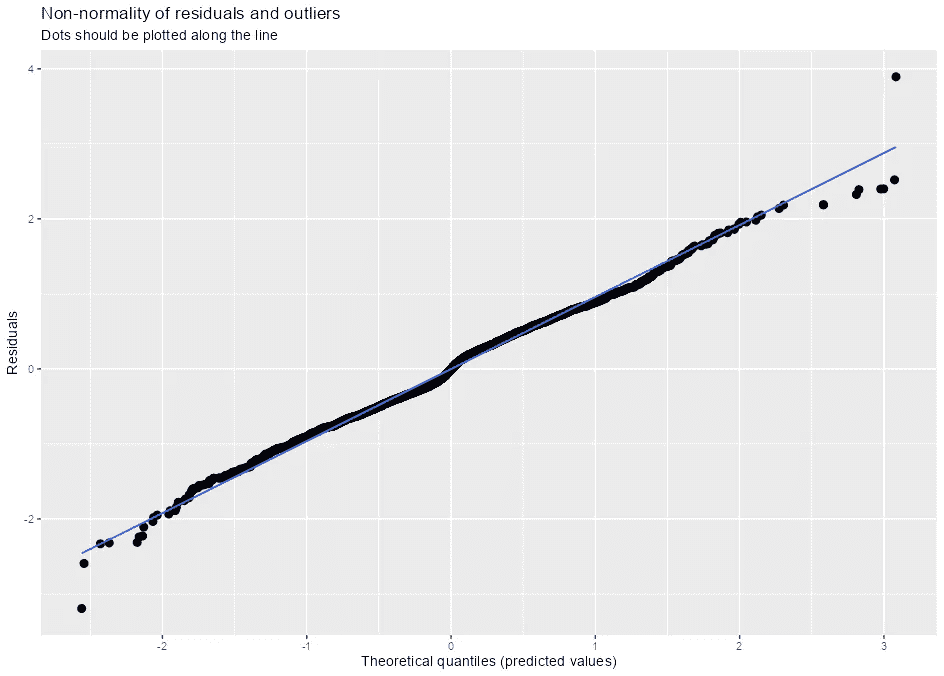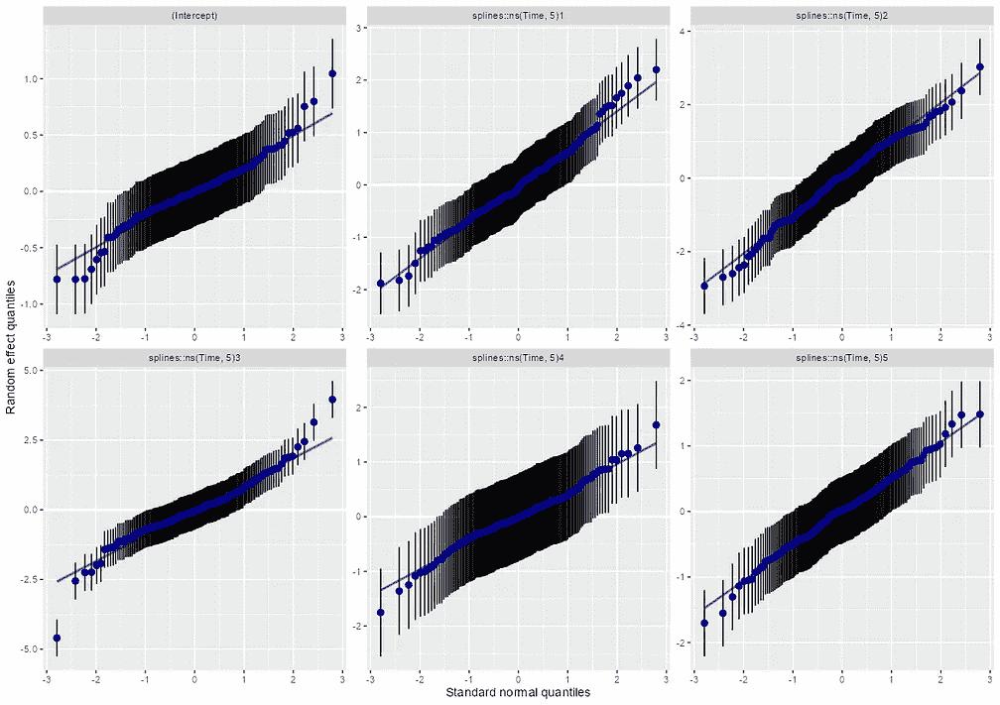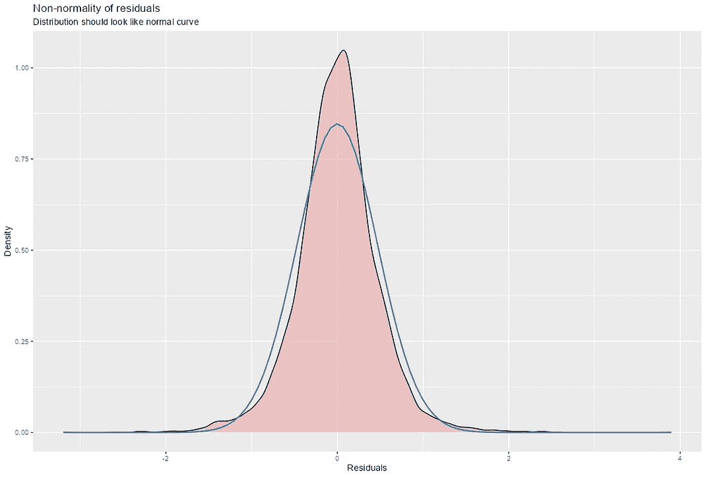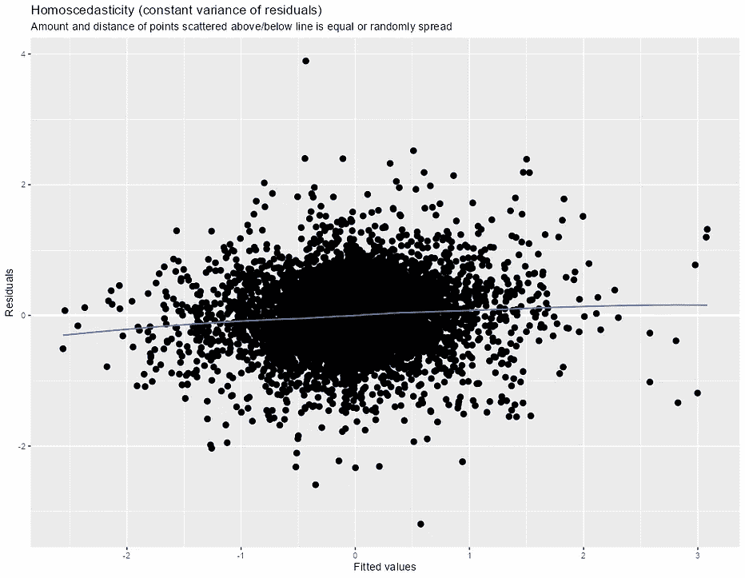

This is looking MUCH MUCH better. I think I have nailed it, at least to the degree in which the residuals look comfortably close to the underlying assumptions of the mathematical model.

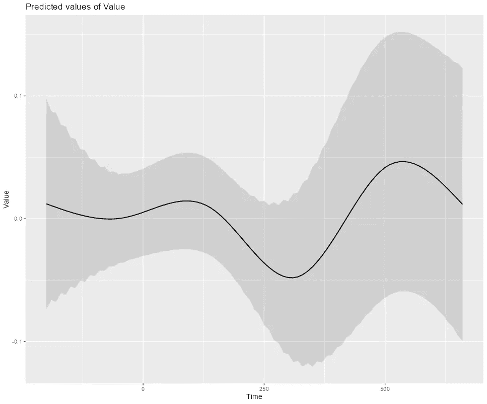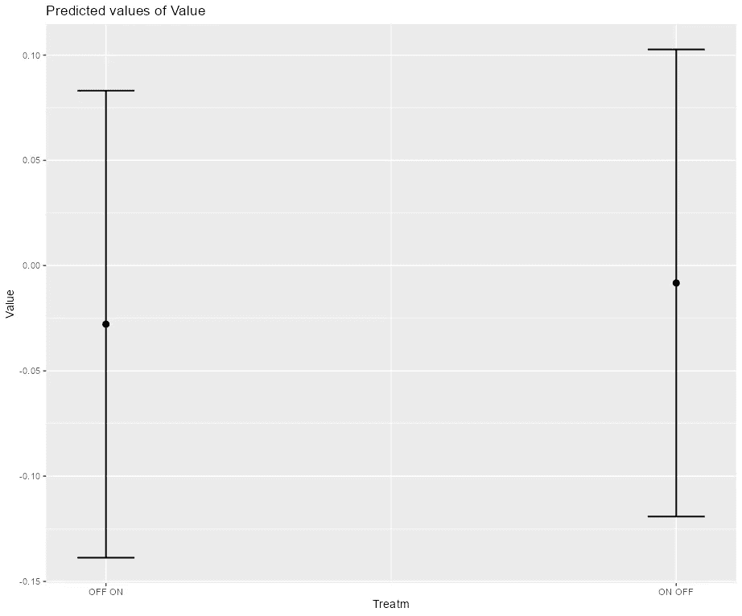

Does not make the treatment perform better, but that should not be the aim. The aim is to find the model that is best supported by the data and it seems I have found that model, for now.

我们还可以通过观察预测图和观察图来进行评估。记得上次糟透了。

```
fit3.4<-lmer(Value ~ splines::ns(Time,5)*Treatm+
               (1 + splines::ns(Time,5)|Subject:Location), 
             data = df_all_diff)
pred<-broom.mixed::augment(fit3.4)
ggplot(pred, 
       aes(x=Value, y=.fitted, col=Treatm))+
  geom_point()+
  facet_wrap(~Location, ncol=2)+
  theme_bw()+
  geom_abline(intercept=0, slope=1, col="black", lty=2)+
  xlim(-2,2)+
  ylim(-2,2)
```

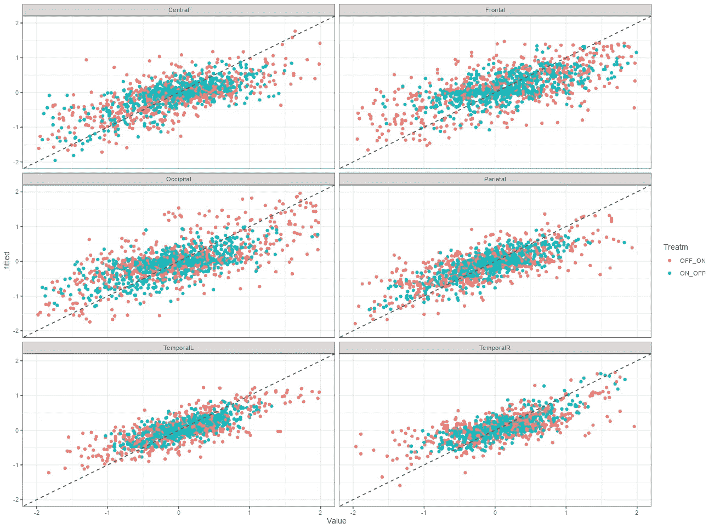

And this is looking much better. The ON_OFF group is easier to predict which should not surprise you — the OFF_ON has more volatility in its difference. That is something to keep in mind.

从这里开始，贝叶斯分析的步骤非常简单。尤其是如果你不使用先验，因为贝叶斯分析没有定义信息先验，并没有真正不同于最大似然分析。我将使用与我使用的 *lmer* 相同的模型。

```
bayes_spline1 <- brm(Value ~ s(Time,k=5, by=interaction(Treatm)) + Treatm + 
                       (1 + splines::ns(Time,5)|Subject:Location), 
                     data = df_all_diff,
                     family = gaussian(),
                     sample_prior = TRUE,
                     save_pars = save_pars(all = TRUE),
                     chains=4, 
                     cores=6,
                     iter = 4000,
                     warmup = 1000)
summary(bayes_spline1)

 Family: gaussian 
  Links: mu = identity; sigma = identity 
Formula: Value ~ s(Time, k = 5, by = interaction(Treatm)) + Treatm + (1 + splines::ns(Time, 5) | Subject:Location) 
   Data: df_all_diff (Number of observations: 8448) 
  Draws: 4 chains, each with iter = 4000; warmup = 1000; thin = 1;
         total post-warmup draws = 12000

Smooth Terms: 
                                    Estimate Est.Error l-95% CI u-95% CI Rhat Bulk_ESS Tail_ESS
sds(sTimeinteractionTreatmOFF_ON_1)     0.27      0.31     0.01     1.19 1.00     2189     1728
sds(sTimeinteractionTreatmON_OFF_1)     0.27      0.33     0.01     1.27 1.00     1996     1623

Group-Level Effects: 
~Subject:Location (Number of levels: 192) 
                                         Estimate Est.Error l-95% CI u-95% CI Rhat Bulk_ESS Tail_ESS
sd(Intercept)                                0.28      0.03     0.22     0.34 1.00     1627     4065
sd(splines::nsTime51)                        0.77      0.05     0.68     0.88 1.00     3864     6274
sd(splines::nsTime52)                        1.10      0.07     0.98     1.25 1.00     2213     3574
sd(splines::nsTime53)                        1.02      0.06     0.91     1.15 1.00     3802     4554
sd(splines::nsTime54)                        0.59      0.09     0.43     0.76 1.01      606     1429
sd(splines::nsTime55)                        0.60      0.04     0.52     0.68 1.00     5622     7370
cor(Intercept,splines::nsTime51)             0.22      0.11     0.00     0.45 1.00     1261     1670
cor(Intercept,splines::nsTime52)            -0.02      0.12    -0.25     0.20 1.01      879     1481
cor(splines::nsTime51,splines::nsTime52)    -0.59      0.06    -0.71    -0.45 1.00     1403     1350
cor(Intercept,splines::nsTime53)             0.23      0.11     0.01     0.45 1.01      650     1253
cor(splines::nsTime51,splines::nsTime53)     0.11      0.09    -0.06     0.27 1.00     2326     5123
cor(splines::nsTime52,splines::nsTime53)    -0.23      0.08    -0.38    -0.07 1.00     2215     3958
cor(Intercept,splines::nsTime54)            -0.63      0.10    -0.78    -0.41 1.00     1087     2985
cor(splines::nsTime51,splines::nsTime54)    -0.48      0.13    -0.73    -0.23 1.00      750     1272
cor(splines::nsTime52,splines::nsTime54)     0.14      0.13    -0.12     0.37 1.01     1277     2071
cor(splines::nsTime53,splines::nsTime54)     0.20      0.12    -0.04     0.43 1.01     1271     2724
cor(Intercept,splines::nsTime55)             0.56      0.10     0.36     0.74 1.00     1099     2019
cor(splines::nsTime51,splines::nsTime55)     0.13      0.09    -0.04     0.31 1.00     3294     6559
cor(splines::nsTime52,splines::nsTime55)    -0.14      0.09    -0.31     0.04 1.00     3734     7252
cor(splines::nsTime53,splines::nsTime55)    -0.14      0.09    -0.30     0.03 1.00     5507     7442
cor(splines::nsTime54,splines::nsTime55)    -0.05      0.13    -0.31     0.21 1.00     1970     3959

Population-Level Effects: 
                                Estimate Est.Error l-95% CI u-95% CI Rhat Bulk_ESS Tail_ESS
Intercept                           0.01      0.03    -0.05     0.06 1.00     3809     1676
TreatmON_OFF                       -0.00      0.04    -0.08     0.07 1.00     4260     4842
sTime:interactionTreatmOFF_ON_1     0.02      0.28    -0.58     0.62 1.00     4522     1526
sTime:interactionTreatmON_OFF_1     0.07      0.28    -0.49     0.73 1.00     3334     2189

Family Specific Parameters: 
      Estimate Est.Error l-95% CI u-95% CI Rhat Bulk_ESS Tail_ESS
sigma     0.49      0.00     0.49     0.50 1.00     8657     7427

Draws were sampled using sampling(NUTS). For each parameter, Bulk_ESS
and Tail_ESS are effective sample size measures, and Rhat is the potential
scale reduction factor on split chains (at convergence, Rhat = 1).
```

从 rhat 值中可以看出，该模型的性能已经足够好了，但是我们还是用图形来检查一下。

```
pp_check(bayes_spline1, ndraws=100)
pp_check(bayes_spline1, type = "ecdf_overlay",ndraws=100)
csms <- conditional_smooths(bayes_spline1)
plot(csms)
conditional_effects(bayes_spline1)
```

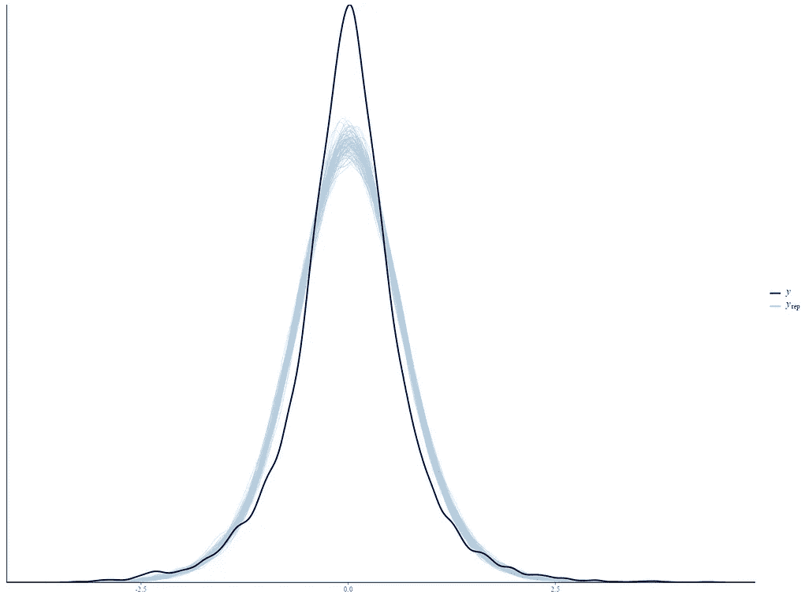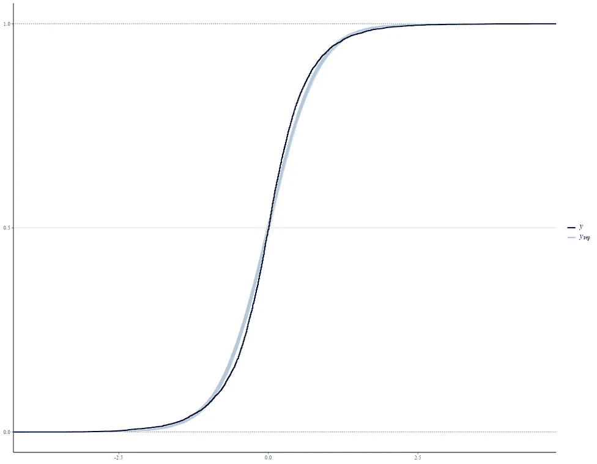

Seems sufficient, although the high peak is difficult to mimic.

从那里我们可以更好地了解条件估计。

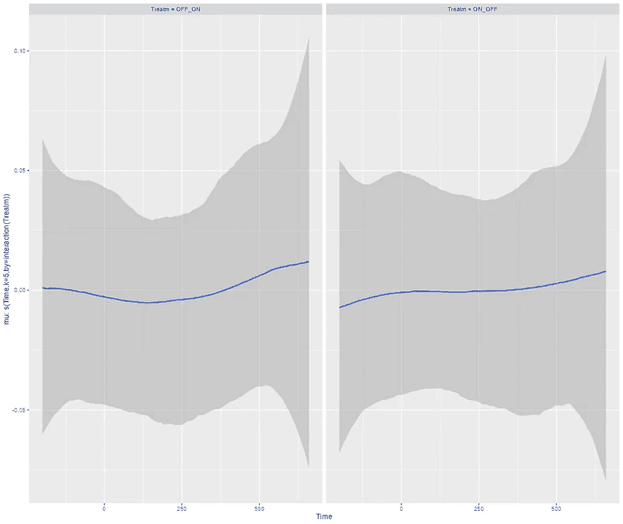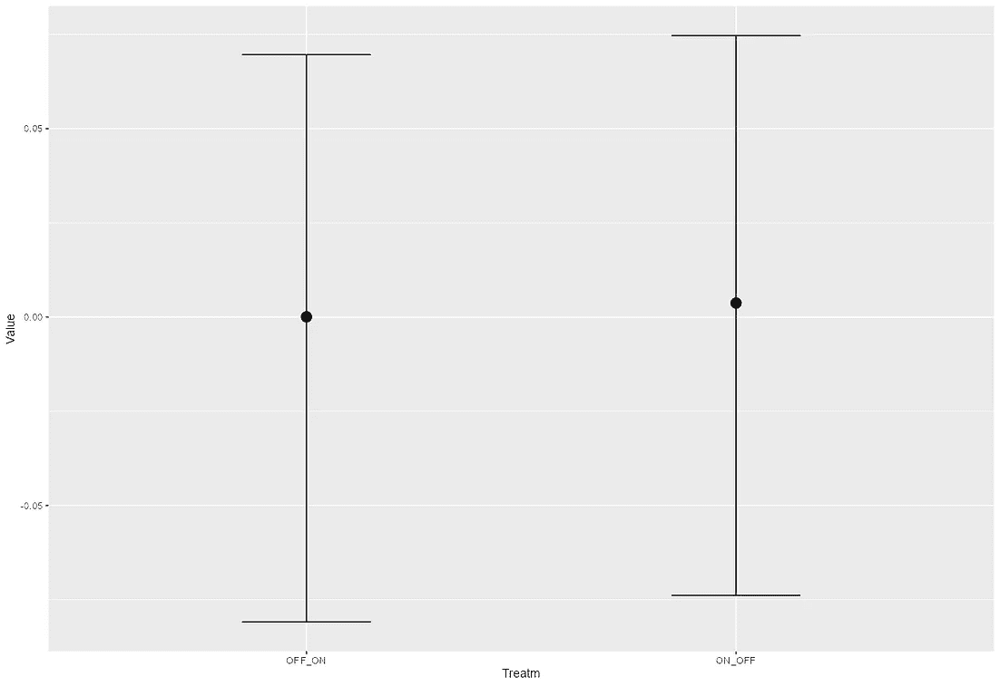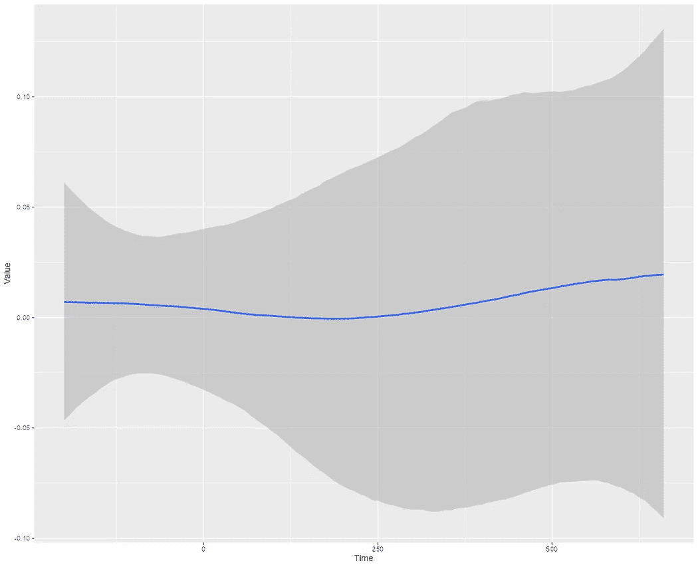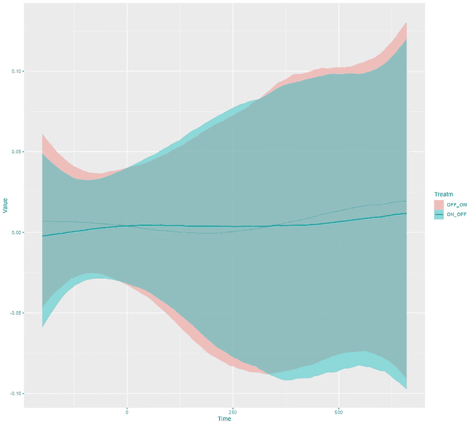

The conditional estimates do not hint at a difference between the treatments, but to get a really good idea I need to look closer per location. Already early on, from the plots, we could see that the location effect needs to be taken into account.

为了考虑位置因素，我将从模型中提取后验数据，然后将其与观测数据进行比较。

```
df_all_diff %>%
  add_epred_draws(bayes_spline1, 
                  ndraws=50) %>%
  ggplot(aes(x = Time, 
             y = Value, 
             color = as.factor(Treatm), 
             group=Subject)) +
  geom_line(aes(y = .epred, group = paste(Subject, .draw)), alpha = 0.5) +
  geom_point(data = df_all_diff, aes(color = as.factor(Treatm)), alpha=0.1)+
  facet_wrap(~Location)+
  labs(color="Treatment")+
  theme_bw()

df_all_diff %>%
  add_epred_draws(bayes_spline1, 
                  ndraws=50) %>%
  ggplot(aes(x = Time, 
             y = Value, 
             color = as.factor(Treatm), 
             group=Subject)) +
  geom_line(aes(y = .epred, group = paste(Subject, .draw)), alpha = 0.5) +
  geom_point(data = df_all_diff, color = "black", alpha=0.2)+
  facet_wrap(~Location)+
  labs(color="Treatment")+
  theme_bw()
```

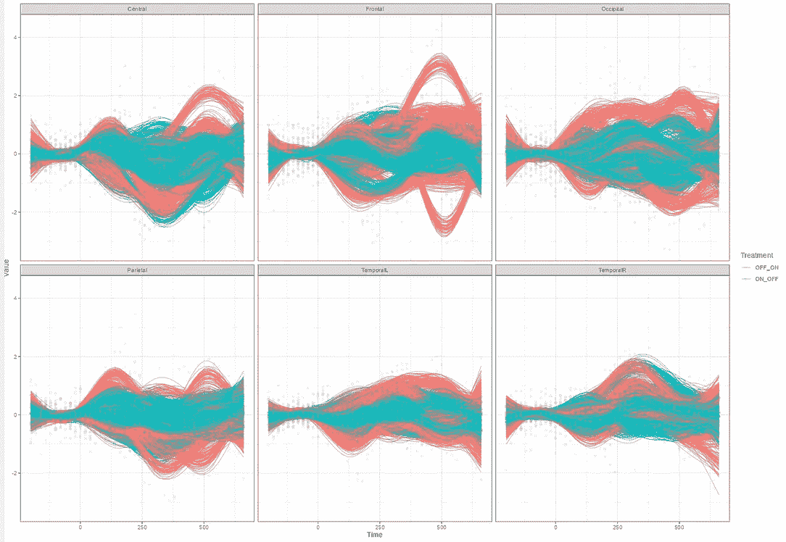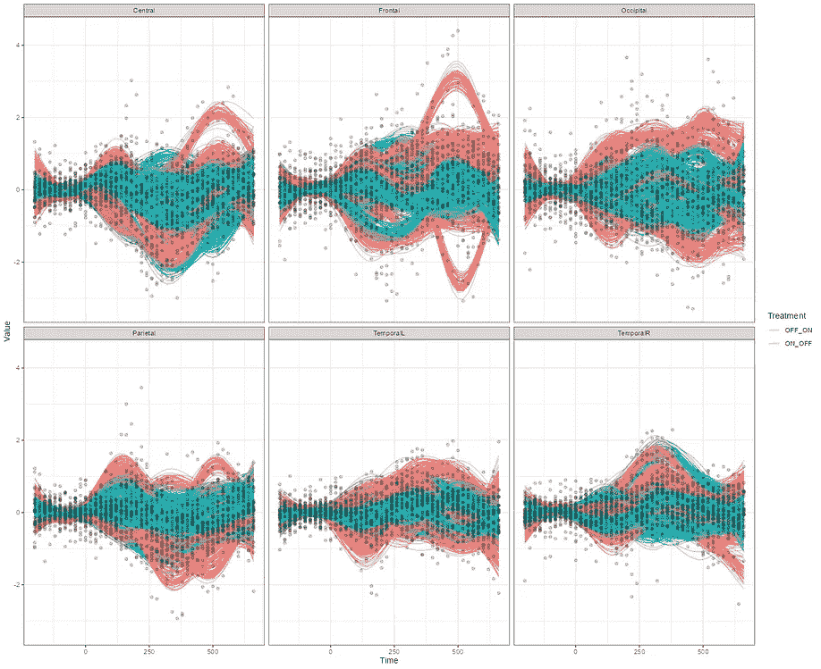

From the posterior draws it becomes very clear how volatile the data is. Nevertheless, the posterior draws do mimic the data will which gives me a stronger belief that this model is to quite some degree supported by the data.

从上面我们可以向前看，并开始在预定义的时间点上比较治疗和每个位置。

```
bayes_spline1 %>%
  recover_types(bayes_spline1) %>%
  emmeans::emmeans( ~ Treatm | Time, 
                    at = list(Time = c(260,280,300,320,340,360,380,400))) %>%
  emmeans::contrast(method = "pairwise") %>%
  gather_emmeans_draws() %>%
  ggplot(aes(x = .value, 
             y = contrast)) +
  stat_halfeye(alpha=0.5)+
  geom_vline(xintercept = 0, lty=2, col="red")+
  facet_wrap(~Time, scales="free")+
  theme_bw()
```

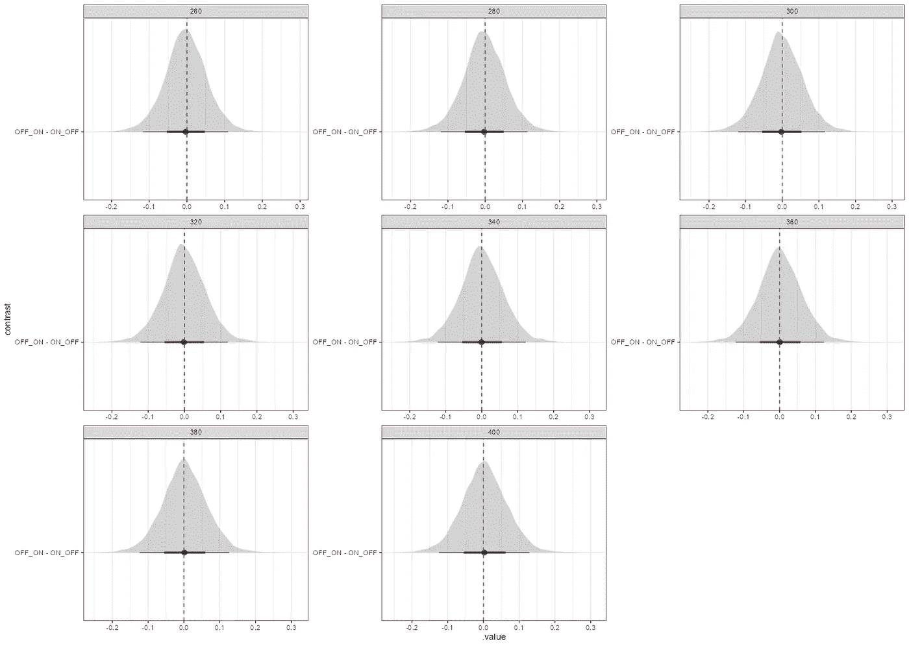

As you can see, there is little evidence to support a difference between treatments, per time-point, overall.

让我们再次添加位置参数。我将首先使用后面的绘图来绘制它。

```
df_all_diff %>%
  add_epred_draws(bayes_spline1, 
                  ndraws=50) %>%
  group_by(Subject, Location, Treatm) %>%
  summarize(ValueObs = mean(Value), 
            ValueEpred = mean (.epred))%>%
  ggplot(.)+
  geom_point(aes(x=as.factor(Treatm), 
                 y=ValueObs), 
             alpha=0.2)+
  geom_boxplot(aes(x=as.factor(Treatm),
                   y = ValueEpred), 
               alpha = 0.5) +
  facet_wrap(~Location)+
  theme_bw()

grid = df_all_diff %>%data_grid(Treatm, Time, Subject, Location)
means = grid %>%add_epred_draws(bayes_spline1)
preds = grid %>%add_predicted_draws(bayes_spline1)
df_all_diff %>%
  filter(Time>=250 & Time <=400)%>%
  ggplot(aes(x = Value, y = Treatm)) +
  stat_halfeye(aes(x = .epred), scale = 0.6, 
               position = position_nudge(y = 0.175), data = means) +
  stat_interval(aes(x = .prediction), data = preds) +
  geom_point(data = df_all_diff) +
  scale_color_brewer()+theme_bw()+
  facet_wrap(~Location, scales="free")+
  labs(x="Difference score",
       y="Session")
```

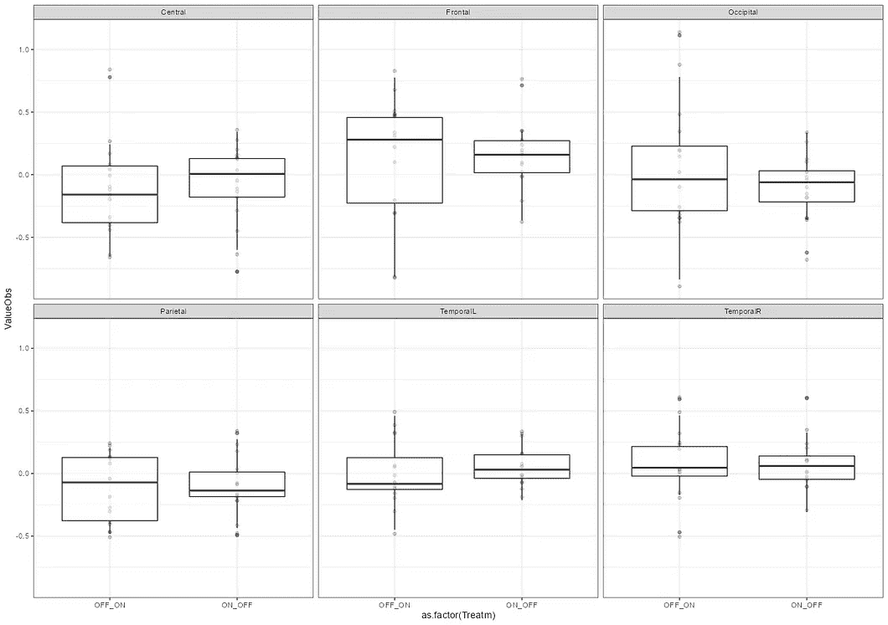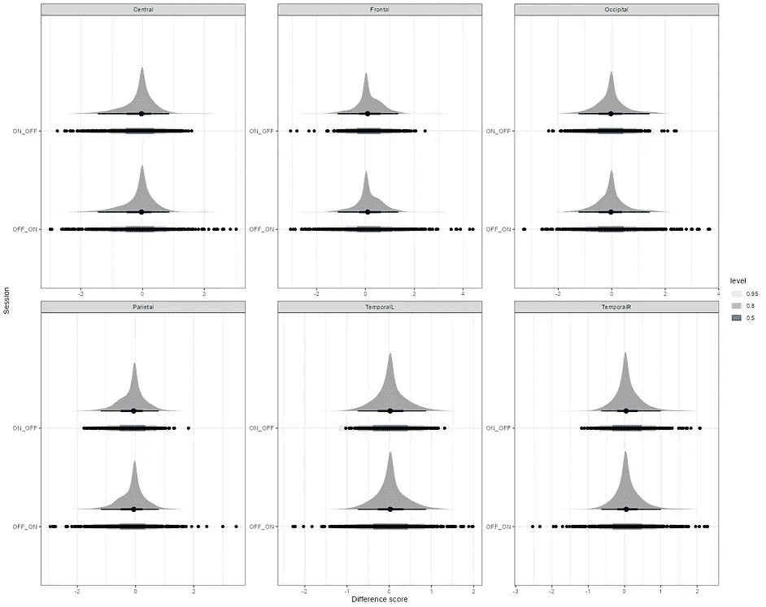

From the posterior draws the volatility difference becomes clear, once again, but the overall volatility (or variation) is so big that there is probably no difference to be detected. However, as you could see from the graphics in the beginning, the central location does shift between treatments.

让我们再深入一点。每次治疗、每个时间点和每个位置，我想将后验图与观察值进行比较。

```
df_all_diff %>%
  add_epred_draws(bayes_spline1, 
                  ndraws=200) %>%
  filter(Time>=250 & Time <=400)%>%
  group_by(Subject, Time, Location, Treatm) %>%
  summarize(ValueObs = mean(Value), 
            ValueEpred = mean (.epred))%>%
  ggplot(.)+
  geom_point(aes(x=as.factor(Time), 
                 y=ValueObs,
                 group=as.factor(Treatm),
                 col=as.factor(Treatm)), 
             alpha=0.2)+
  geom_boxplot(aes(x=as.factor(Time),
                   y = ValueEpred,
                   col=as.factor(Treatm)), 
               alpha = 0.5) +
  facet_wrap(~Location)+
  theme_bw()
```

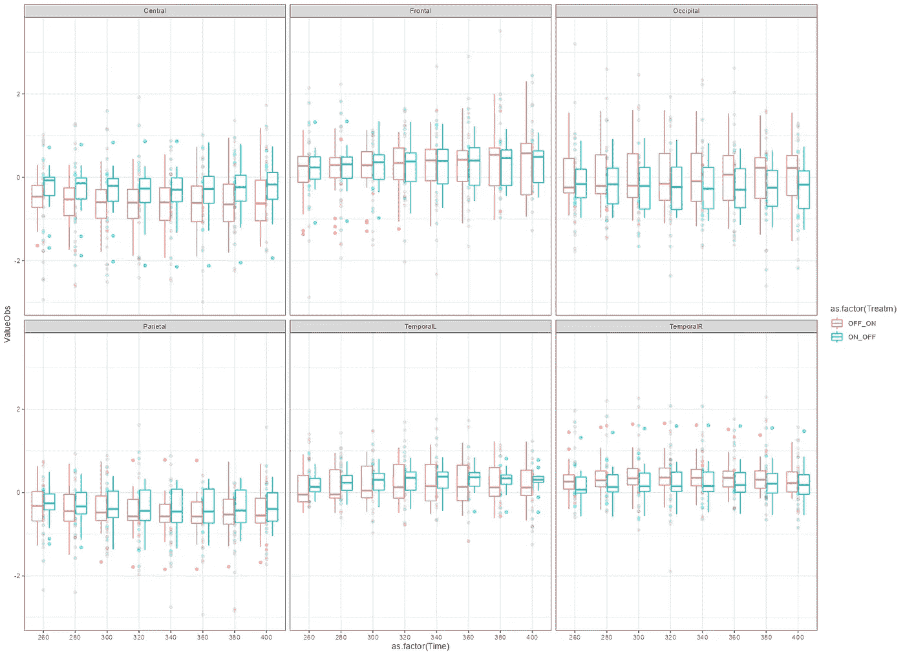

The boxplots seem to hint at linear lines for each location and each treatment. It shows how volatile the data is. However, once again, the central location does hint at a persistent difference, as does the occipital region.

我就讲到这里。当然，还有很多要补充的。例如，这个分析不是一个完整的贝叶斯分析，因为我们没有指定先验，我想添加每个时间点和大脑位置的治疗之间的后验绘制比较。所有这些都将被添加到最终的出版分析中，到时候，我会在这里添加链接。

如果你有任何问题，或者有什么不对或不对的地方，请让我知道！

[](/mlearning-ai/mlearning-ai-submission-suggestions-b51e2b130bfb) [## Mlearning.ai 提交建议

### 如何成为 Mlearning.ai 上的作家

medium.com](/mlearning-ai/mlearning-ai-submission-suggestions-b51e2b130bfb)