# 成为更高效的数据分析师，熊猫综合指南

> 原文：<https://medium.com/mlearning-ai/be-a-more-efficient-data-analyst-a-comprehensive-guide-to-pandas-63ea057bf828?source=collection_archive---------2----------------------->

熊猫简介


Photo by [Sid Balachandran](https://unsplash.com/@itookthose?utm_source=unsplash&utm_medium=referral&utm_content=creditCopyText) on [Unsplash](https://unsplash.com/s/photos/pandas?utm_source=unsplash&utm_medium=referral&utm_content=creditCopyText)

您有一个包含一些令人信服的见解的大型数据集，但您仍然很难找出如何提取这些见解或浏览数据的统计数据。在这种情况下，熊猫就派上了用场。

熊猫能快速阅读和理解数据，并给你洞察力，这样你就能更有效地发挥你的作用。要开始学习 pandas，我们需要熟悉 pandas 系列和 Data Frame 中的两种数据结构。虽然它们不是解决所有问题的通用解决方案，但是它们为大多数应用程序提供了一个坚实、易于使用的基础。

**系列** —一维阵列状物体。

**数据框架**—pandas 中一种类似 excel 的表格数据结构。

从导入包开始:

```
import pandas as pd
```

进口熊猫最流行的惯例是用 pd 别名。

# **系列**

通过传递一系列值，pandas 将创建一个默认的整数索引

```
data = pd.Series([1,2,3,4])
```

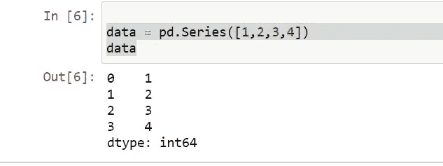

左边的是索引(0，1，2，3)，右边的是数值(1，2，3，4)。

## 检查值和索引

```
data.values
data.index
```

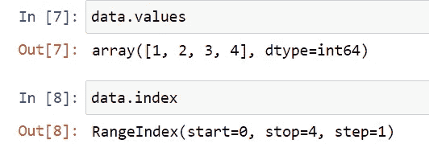

## **将默认索引值 0，1，2，3 更改为新的自定义索引值**

```
data1 = pd.Series([1,2,3,4], index = [‘a’, ‘b’, ‘c’, ‘d’]data1
```

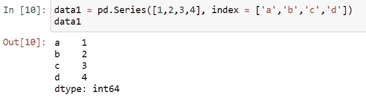

## 数据选择

单值选择将选择对应于索引值**‘a’**的值。

```
data1[‘a’]
```

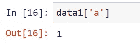

## 数据选择-多值

```
data1[[‘a’,’b’]]
```

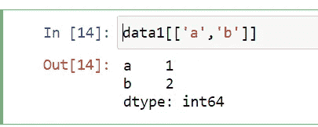

# **数据帧**

Dataframe 是一种类似表格的数据结构，就像 excel 一样。它包含一个有序的列集合，这些列可以是不同的值类型(数字、字符串、布尔值等)。).它既有行索引又有列索引。

## 创建数据帧

数据帧的索引将被指定为序列。

下面我们创建一个数据框，其中包含国家名称、年份和特定年份的人口(百万)。

```
data = {‘Country’: [‘India’, ‘UK’, ‘USA’, ‘Japan’, ‘Ireland’],‘year’: [2020, 2021, 2022, 2023, 2024],‘population’: [1.4, 1.2, 0.5, 0.4, 1.6]}df = pd.DataFrame(data)df
```


## 您可以指定列的顺序，输出将与您传递的完全相同。

```
df1 = pd.DataFrame(data, columns = [‘population’,’year’,’Country’])df1
```

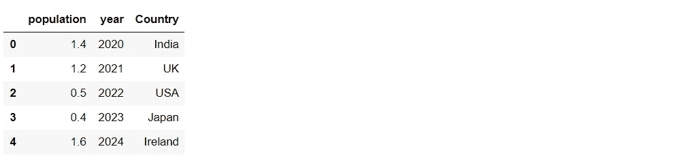

## **访问数据帧中的列**

**通过字典式符号:**

```
df1[‘Year’]
```

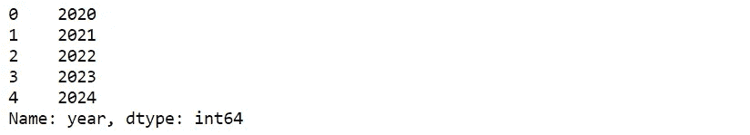

**通过点符号:**

```
df1.Country
```

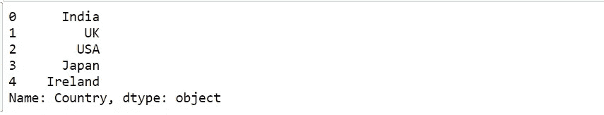

## 导入 CSV 文件

```
data = pd.read_csv(‘pokemon.csv’)
```

你可以看到数据的类型和'口袋妖怪'包含多少数据。

***len*** 只统计行数，如果你想查看行数和列数，我们可以用**来做。形状**。在我们的数据中，有 800 行和 12 列。

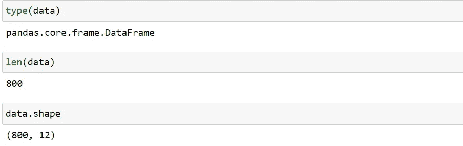

## **显示所有列及其数据类型。info()**

这提供了索引范围的总数、数据集中的列数、列类型(计数)和数据类型。

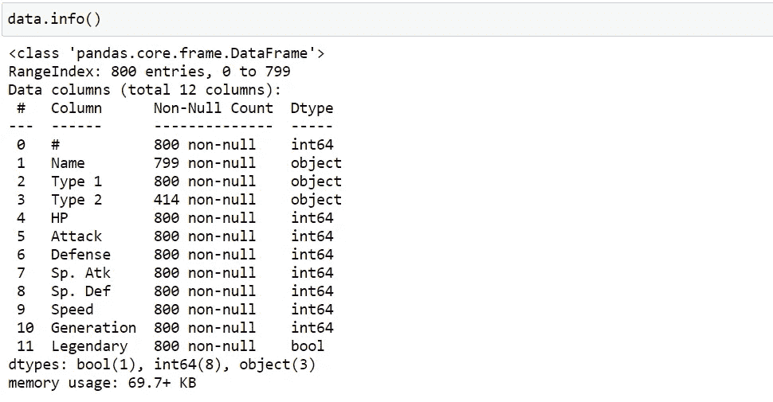

我们可以快速分析我们的数据集包含三种不同类型的数据类型(整数、对象、布尔)。对象是字符串值。

## 顶视图

```
data.head()# by defalut it shows only 5 rows.
# data.head(n=10) # will display the 10 number of rows.
```

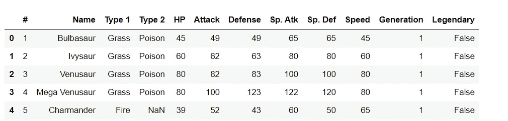

## 仰视图

```
data.tail()
```

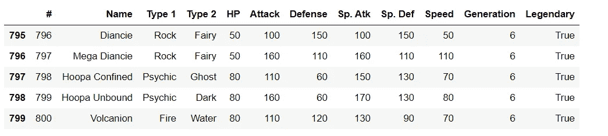

默认情况下，头尾只显示 5 行。如果您有一个包含数百列的数据框，您可以使用 ***pd.set_option*** 进行更改。您还可以指定要查看多少列。

```
pd.set_option(“display.max.columns”, None) # will show all columnspd.set_option(‘display.max_columns’, 50)# will show 50 columns# will show top 50 rowsdata.head(50)# will show last 100 rowsdata.tail(100)
```

## 为了快速统计，汇总使用 **describe()**

这将提供数据集中所有数值列的描述性统计信息。

```
data.describe()
```

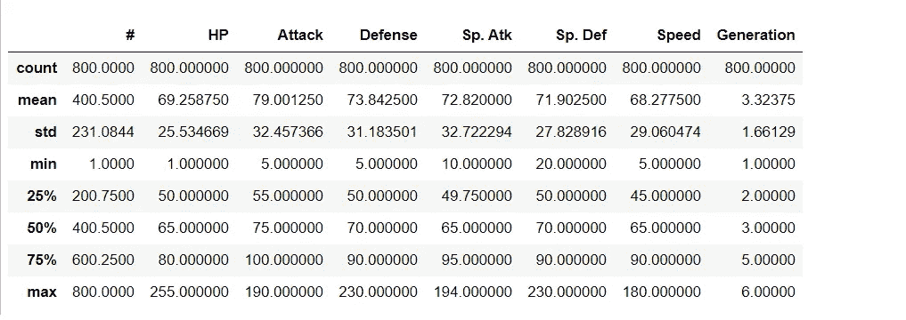

## 转置数据

```
data.T
```

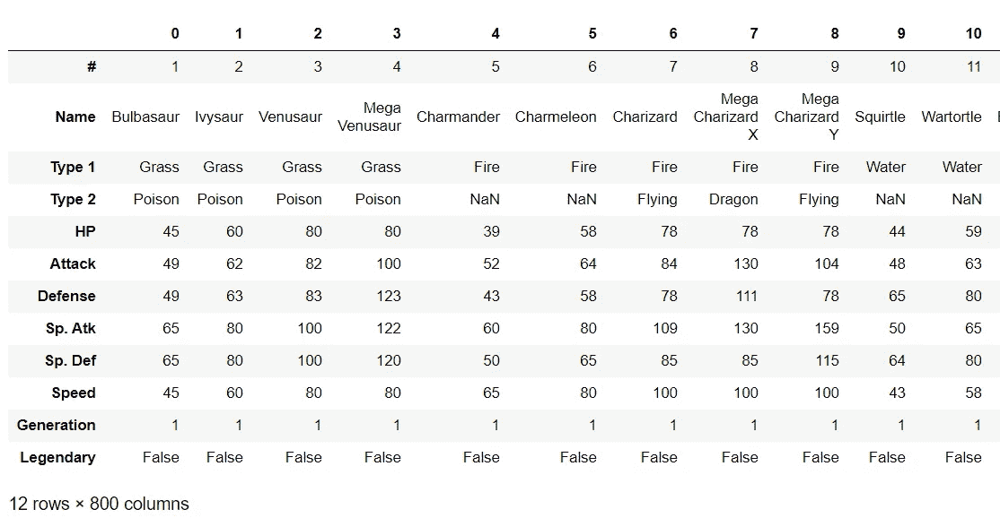

## 按轴排序

axis = 0 表示行，axis =1 表示列。

```
data.sort_index(axis=1, ascending=True)
# it sorts the columns alphabetically.
```

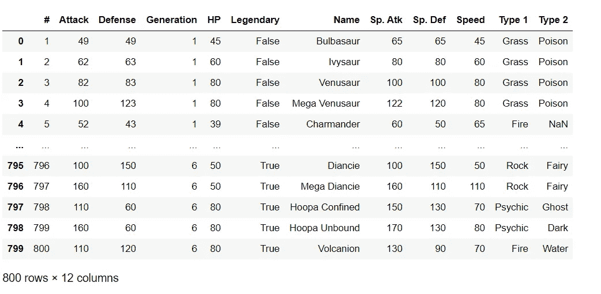

## 按值排序

```
data.sort_values(by=”Name”)
```

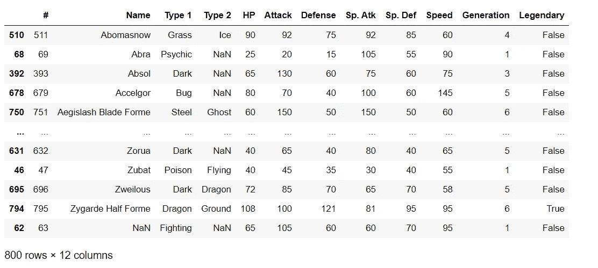

## 将列名更改为数据框

```
data.rename(columns = { ‘Name’ : ‘Pokemon name’, ‘Type 1’: ‘ first type’})
```

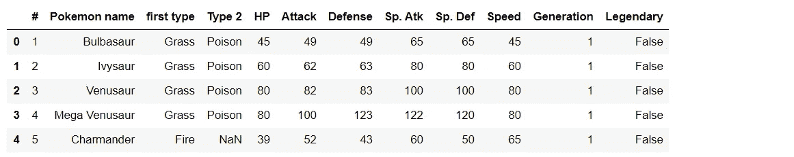

## 删除列

```
data.drop(columns=[‘Pokemon name’,’first type', ‘Type 2’])
```

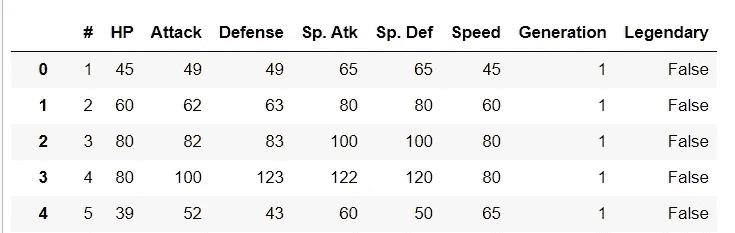

## 行子集观察

```
*data[data.Length > 10] #Extract rows that meet logical criteria.**df.sample(frac=0.5) #Randomly select fraction of rows.**df.sample(n=10) #Randomly select n rows.**df.iloc[10:20] #Select rows by position.*
```

**使用标签选择行和列(loc):**

您可以通过 pandas 数据框中的相应标签来访问行和列。

## 按标签选择单行:

这给出了第一行的所有细节。

```
data.loc[0]
```

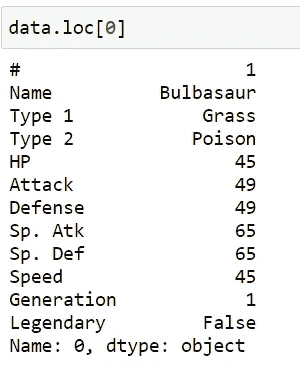

## 通过标签访问多行:

```
data.loc[[0,1]] # selecting the rows at index 0 and 1
```

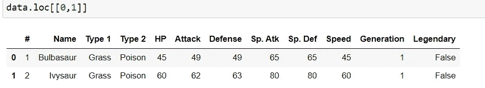

## 按行和列访问:

```
data.loc[0,”Type 2"] # selection of index 0 and colum namne Type 2
```

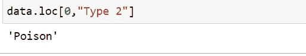

## 选择单行、多列:

```
data.loc[1,[‘Name’,’Attack’,’Defense’]]
```

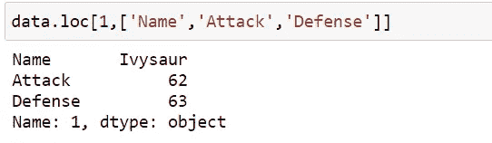

## **按步进位置选择(iloc):**

**按索引位置排列的行:**

```
data.iloc[1] # index starts from zero
```

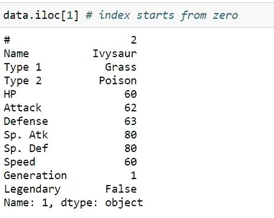

**按索引位置的列:**

```
data.iloc[:, 3] # ‘Type 2’ column in pokemon data
```

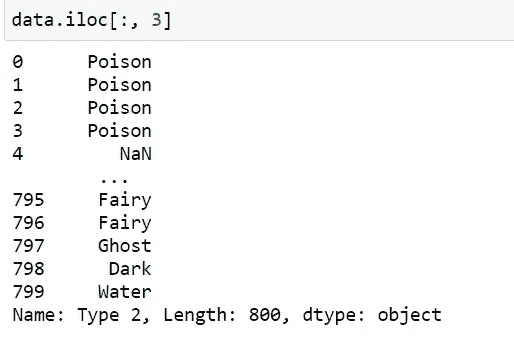

# **使用标签对行和列进行切片:**

**按标签对行进行切片**

选择位置 1–3 处的行和所有列。

```
data.loc[1:3, :] 
```

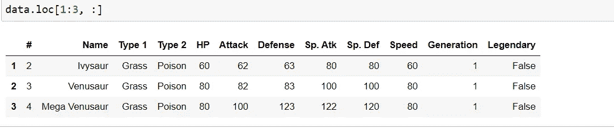

**切片标签列**

在位置 1-3 处选择，并且只有两个列值。

```
data.loc[1:3, ‘Type 1’:’Type 2']
```

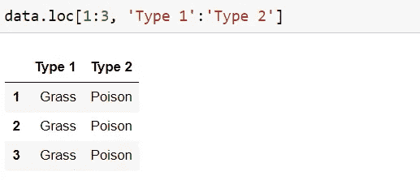

## **使用位置(iloc)对行和列进行切片:**

索引从 0 开始到(行数/列数-1)。

**根据索引位置对行进行切片**

```
data.iloc[0:3,:]
```

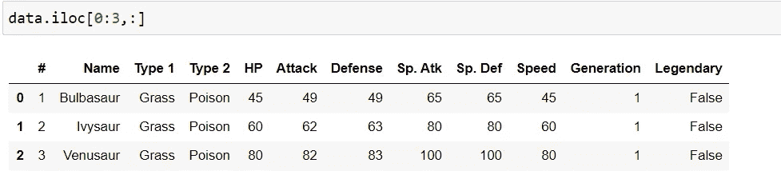

**按索引位置对列进行切片**

```
data.iloc[:,1:3]
```

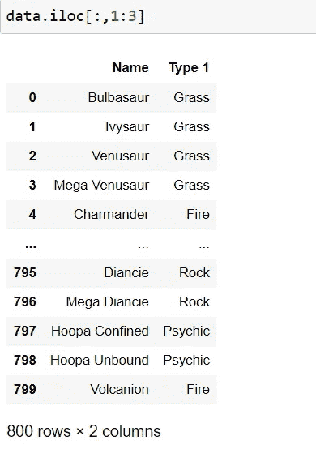

**根据索引位置对行和列进行切片**

```
data.iloc[1:2,1:3]
```

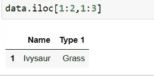

# **处理缺失值**

在 pandas **中，dropna()** 函数用于删除具有 Null/NaN 值的行和列。当数据框中有任何缺失数据时，此函数会大量使用。

dropna()函数的语法如下所示。

```
dropna(self, axis=0, how=”any”, thresh=None, subset=None, inplace=False)
```

*   **轴**:可能值为 0 或 1，默认为 0。如果为 0，则删除行，如果为 1，则删除列。
*   **如何**:可能值为(任意，全部)，默认为任意。如果**任何**删除值为空的行/列。如果**全部，**删除行/列。
*   **thresh** :一个 int 来指定 drop 的阈值。
*   **子集**:指定查找空值的行/列。
*   **原地**:一个布尔值。如果为 True，源数据帧将被更改，它将返回 none。

删除所有包含空值的行。移除 na 后，数据帧中还剩 414 行。

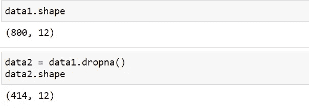

**删除缺少值的列**

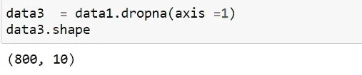

# **合并数据集**

合并或联接操作通过使用一个或多个键链接行来组合数据集。

**pd.merge** 的主要参数及其描述

***左侧- >*** 左侧要合并的数据框。

***右侧- >*** 要合并的数据框右侧。

***如何->***‘内’、‘外’、‘左’或‘右’之一。默认情况下为“内部”

**-*对*-**->列名进行加入。必须在两个 DataFrame 对象中找到。如果未指定，也未给定其他连接键，将使用左侧和右侧列名的交集作为连接键。

我们创建两个数据帧，在一个数据帧中完成所有这些合并操作。

第一数据帧

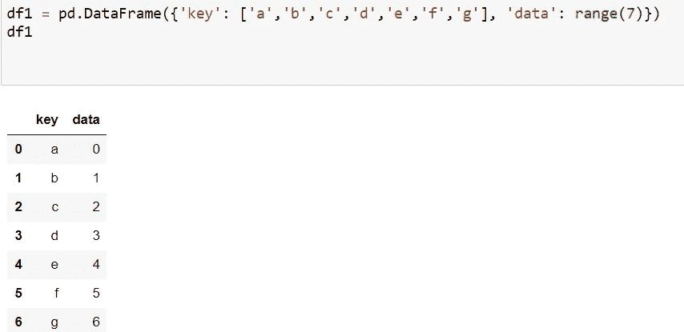

第二数据帧

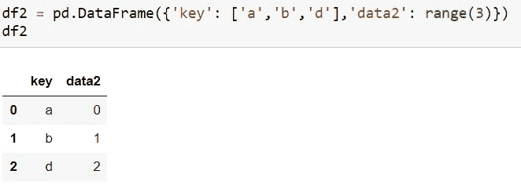

## **内部连接**

**连接 df2 到 df1 的匹配行**

*返回包含左侧数据帧所有行的数据帧。*

```
pd.merge(df1, df2,how=’left’, on=’key’)
```

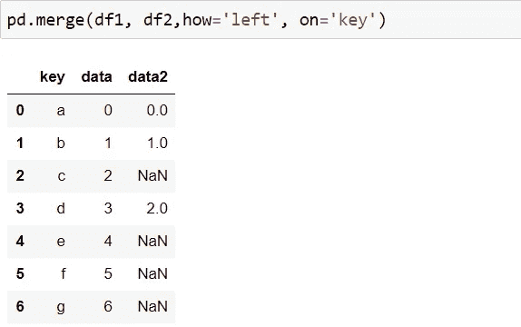

## **右连接** -

**连接 df1 到 df2 的匹配行**

*右数据帧的所有行都照原样取，只有左数据帧的那些行在两者中是公共的。*

```
pd.merge(df1, df2,how=’right’, on=’key’)
```

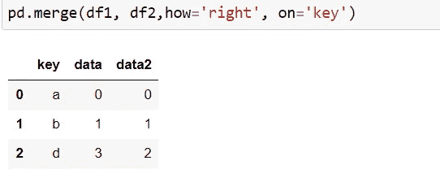

## **内部连接**

**返回一个数据帧，该数据帧只包含在两个数据帧中有共同点的那些行。**

pd.merge(df1，df2，how='inner '，on='key ')

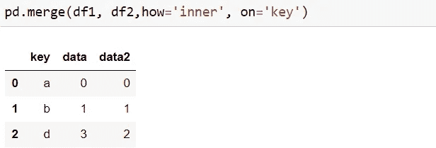

## **外部连接**

**保留所有行和所有值中可用的所有数据**

```
pd.merge(df1, df2,how=’outer’, on=’key’)
```

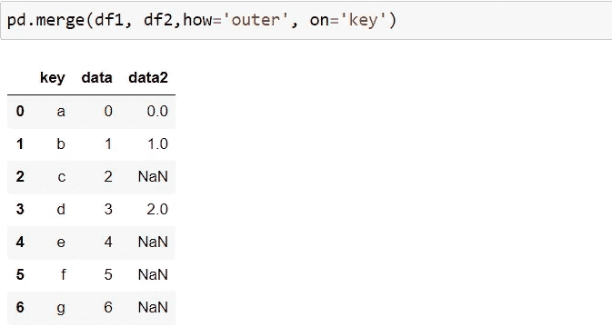

总之，这些是最常见的 pandas 函数，可以帮助您挖掘数据以进行进一步分析。