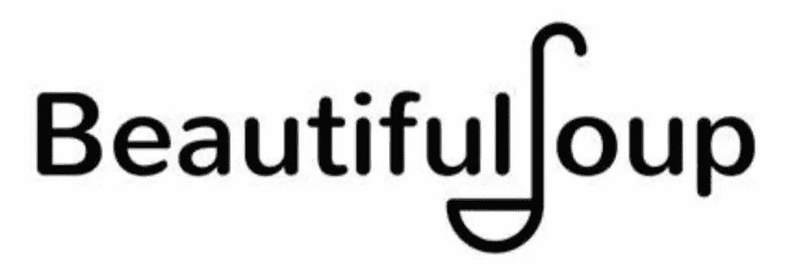
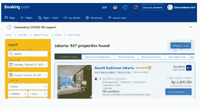
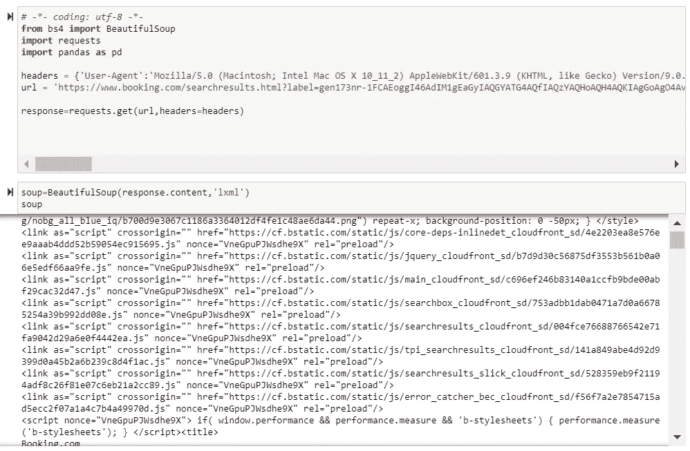
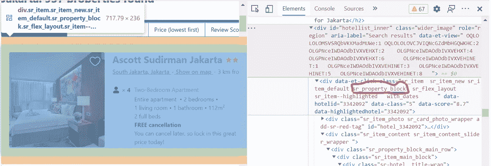
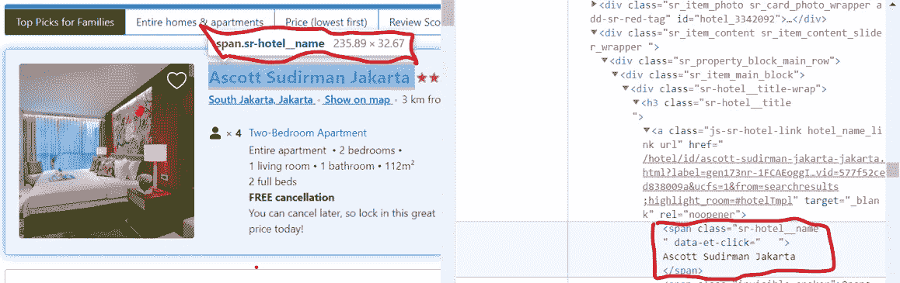
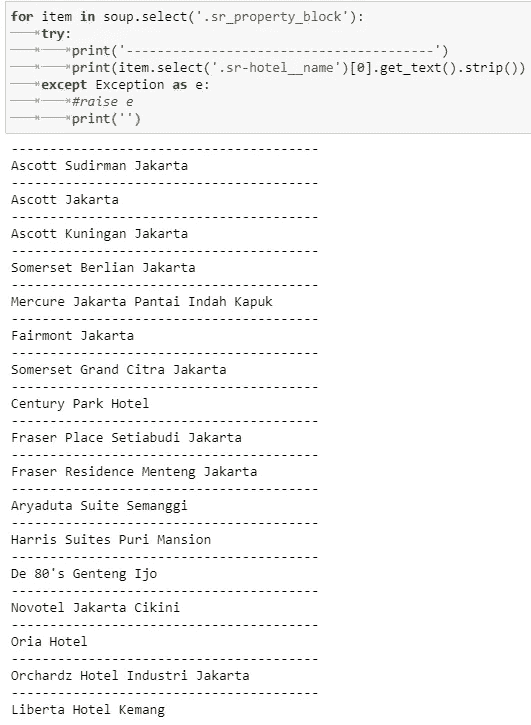
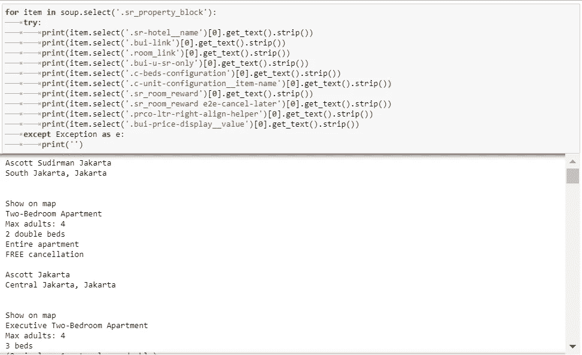
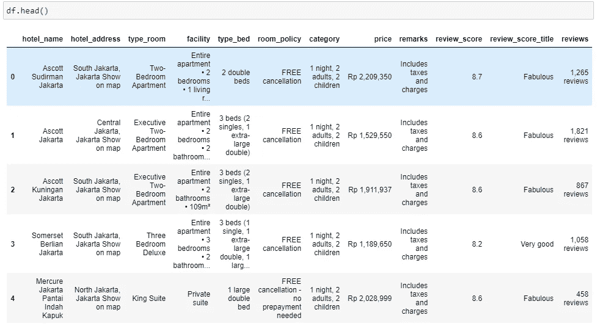

# 好喝的汤，我们来做个汤吧

> 原文：<https://medium.com/mlearning-ai/beautiful-soup-lets-make-a-soup-18b146bf3f8f?source=collection_archive---------3----------------------->

Beautiful Soup

***美汤***

Beautiful Soup 是一个 python 库，以《爱丽丝梦游仙境》中的一首刘易斯·卡罗尔的同名诗命名。Beautiful Soup 是一个 python 包，顾名思义，它解析不想要的数据，并通过修复不良的 HTML 来帮助组织和格式化杂乱的 web 数据，并以易于遍历的 XML 结构呈现给我们。简言之，Beautiful Soup 是一个 python 包，它允许我们从 HTML 和 XML 文档中提取数据。上一页打印页面

***请求***

发出网络请求的请求库。当您向服务器发出请求时，请求库会根据 HTTP 头对响应的编码进行有根据的猜测。当您访问 r.text 文件时，将使用猜测的编码。通过这个文件，您可以辨别请求库使用的是什么编码，并在需要时进行更改。

***请求网页内容***

我们将废弃网站[https://www.booking.com/](https://www.booking.com/)看看有多少酒店可用。让我们请求提取指定网站的内容。我们还传递用户代理头来模拟浏览器调用，这样我们就不会被阻塞。

Making Request

[***www.booking.com***](http://www.booking.com)

让我们分析一下我们想要的目的地的 Booking.com 搜索结果。

www.booking.com

***解析原始 HTML***

HTML 解析基本上是:获取 HTML 代码并提取相关信息，如页面标题、页面段落、页面标题、链接、粗体文本等。

HTML parsing

**视*视*视**

检查页面，我们发现每个项目的 HTML 都封装在一个带有 sr_property_block 类的标记中。

Inspect Element

***下一次检查***

在进一步的检查中，您可以看到酒店的名称总是有一个 sr-hotel__name 类

Inspect Element

***获取酒店名称***

Get Hotel Names

***产生我们需要的所有信息***

Get the others

***将所有信息放入数据框***

Put in dataframe

为了便于分析，我们可以将其保存到数据框中

**结论**

Beautiful Soup 是一个人的项目，旨在节省您的时间，从格式不良的 html 或 xml 中快速提取数据。这可以让我们更容易地从网站上提取数据。有几种方法可以从网站中提取数据，也许使用 beautiful soup 是一种相当简单的方法。

**参考文献**

[美汤—概览—教程点](https://www.tutorialspoint.com/beautiful_soup/beautiful_soup_overview.htm)

[用 Python 和 BeautifulSoup 从 Booking.com 抓取酒店列表|作者 Mohan Ganesan | The Startup | Medium](/swlh/scraping-hotel-listings-from-booking-com-with-python-and-beautifulsoup-50fb9c435d9e)

【PythonForBeginners.com 使用 Python 中的请求库

[www.booking.com](http://www.booking.com)