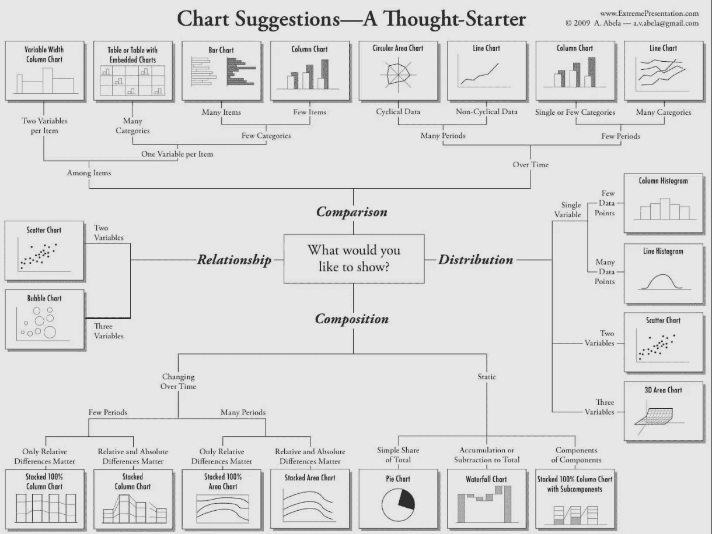
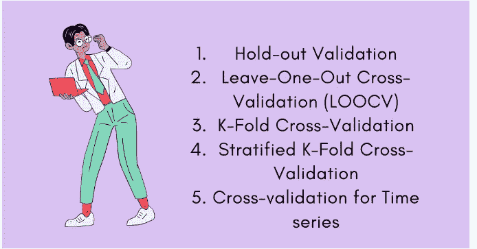

# 建模前

> 原文：<https://medium.com/mlearning-ai/before-model-building-41172d401bb7?source=collection_archive---------15----------------------->

在本文中，我们将讨论收集正确的数据、数据探索、细化指标以及让产品经理达成一致所面临的挑战。

**数据提取**:获取正确的数据是第一步，也是最关键的一步。这通常并不容易。

对于 **CRS** ，固定回复被广泛使用，但是在数据库中没有固定回复到相应电子邮件的直接链接。它应该在日志里。没人跟踪它。终于哭完了要数据之后。我们依靠弹性搜索将回答与固定回答进行匹配。

对于 **CCP** 来说，给定特征对于模型预测是极好的给定但却是无用的。例如:“客户导出所有数据”是客户流失的一个突出特征，但是当客户已经离开时，采取任何行动都为时已晚。我们收集了过去三个月的模拟训练活动。

对于 **SA** 的问题，我们雇人批注。如果注释需要医学、法律等领域的专业知识，那么成本可能会很高。

**数据探索:**一旦我们收集了原始数据，下一步就是基础数据探索。图像显示了数据探索的基本步骤。点击[此处](https://mschermann.github.io/data_viz_reader/patterns.html)了解更多详情。

一些很少讨论的问题是:

*   阶层不平衡:
    -在 **FC** 中，即使 90%的门票贡献给了两三个阶层。只有 10%的票消费剩下的 50 节课。
*   获取更多功能:
    -在 **FC** 中，对于同一个票“我们需要 VPN 接入”，填写的类是不同的。经过仔细检查，我们发现根据一个人是雇员还是承包商填写了不同的类别。因此，我们需要添加员工标志功能
*   提取正确的特征
    -对于 **CRS** ，从电子邮件 id 中提取团队特征，即人员是否来自团队(销售、营销等)，有助于模型具有更好的准确性
*   合并类
    ——对于 **CRS** ，一些固定的响应几乎是重复的。最好将重复的类合并成单个类。
    - For **FC** :有些类经常混淆。“网络”和“Wifi”类经常被交替填充。我们应该合并他们。

**度量:** 一旦数据分析结束。与产品经理(PM)讨论这一点很重要，这样他们会有更多的背景知识。经常会出现两个问题，数据科学家必须给出一些解释。

*   ML 是概率性的。它不可能像传统的软件工程师那样总是正确的。
*   模型性能总是依赖于数据。在低质量或低数量的数据中，我们不能达到很高的精确度。

下一步是与领域专家交谈并理解该场景。

一旦清楚了，从 PM 中导出度量是很重要的。他们可能会含糊不清，但在大多数情况下，这将是明确的。

对于 **CCP** : PM 说预测流失客户为非客户是大错特错，但是预测非流失客户为流失客户没什么大不了的。因此，流失客户的召回比非流失客户的精确度更重要。

对于 **FC** : PM 只希望最大限度地减少最终用户所做的修改。因此，准确性比单个类别的召回率/精确度更重要。

**数据准备:**现在我们已经决定了最终的数据，我们应该将数据以相关的格式存储在数据库中，用于建模。这个过程被称为 ETL。模型构建模型是基于存储在 ETL 中的这些数据

**交叉验证**:交叉验证有助于为模型找到正确的参数。错误的参数会导致模型过拟合或欠拟合。详细描述请参考此[链接。](https://medium.datadriveninvestor.com/types-of-cross-validation-d9d3343b650a)

交叉验证应该模拟真实世界的情况。对于像情感分析案例这样问题，K 折叠或省略可能就足够了。 **FC，CRS** ，未来数据将根据当前数据进行预测，因此最好分配基于时间的 CV。
至此，模型准备或钻孔阶段完成。在下一篇文章中，我们将讨论模型构建。请点击[这里](/@prabu_/model-building-2c0b5b5c8c1c)看下一篇文章。

请点击这里进入第一篇[文章](/@prabu_/building-b2b-ml-features-overview-dc586667e1c3)

 [## Mlearning.ai 提交建议

### 如何成为 Mlearning.ai 上的作家

medium.com](/mlearning-ai/mlearning-ai-submission-suggestions-b51e2b130bfb)