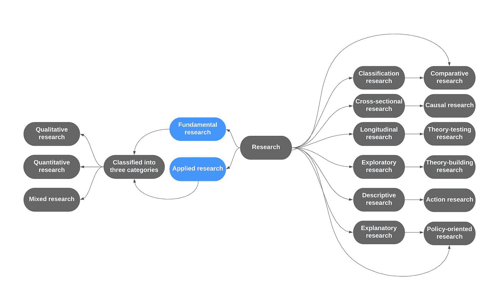

# 开始你的研究之旅第一部分

> 原文：<https://medium.com/mlearning-ai/begin-your-research-journey-part-i-d6e5c6a589cf?source=collection_archive---------2----------------------->

当你想到做研究时，许多问题可能会浮现在脑海中，例如，我如何开始，有什么先决条件，我应该什么时候开始，我如何将我的想法转化为研究，等等。在这篇文章中，我将解决你的问题。在开始研究之前了解一些基本知识会让接下来的步骤更容易。

看完这篇文章后，你会明白:

1.  研究的定义。
2.  研究的类型。
3.  研究方法和方法论。

好吧，让我们开始吧…………

> 在写作的开始，我想感谢医生莫斯塔菲尤尔拉赫曼先生。在我的大学生活中，我有幸和他一起工作，我非常感谢安拉(SWT)，因为我有一个伟大的人生老师，他激励我做一些独特的事情。

**一、研究的定义**

当我开始研究时，我陷入了一种两难的境地，无法得到对研究的明确解释。我觉得一个简单的研究定义，涉及到知识分布，现实生活中的问题解决，解决模式，以及你的解决方案有多高效。你困惑了吗？放心吧！继续读。

假设你想做一个解决交通拥堵的移动应用。首先，您可能会想到软件开发生命周期(SDLC)、应用程序特性，或者如果是机器学习工作，您可能会想到预测模型和准确性，对吗？研究并不仅仅是预测模型的建立，准确性，或者发展中的想法，它还依赖于越来越多的实验。这是学术项目和研究项目之间的差距。没有评估、系统实验、性能测量和数据分析，研究目标就无法实现。

**二世。研究类型**

> 通常，研究广泛地分为两大类，如基础研究和应用研究。此外，这些类进一步分为三类，例如，定性研究，定量研究和混合研究。虽然可以找到几种类型的研究，但基本上以上提到的研究用的比较多。仔细看看下面给出的图 1:

**Fig.1: Types of scientific research**

> 如果你仔细观察上图 1，你会发现研究基本上被分成几个部分。现在我要谈谈定性研究和定量研究，因为目前这两种研究做得更多。

**二(一)。定性研究**

看看下面的内容，仔细看看这个场景:

> 假设(X)先生是(Y)餐厅的老板，他在达卡的 Rabindra Sarobar 附近开了一家快餐店。Y 餐厅专门供应麦当劳的烤苹果派和爆米花鸡块。然而，尽管食物质量很好，但可以看出消费者不会再来了，或者女孩消费者不会再来了。由于这个原因，X 先生的餐馆生意似乎正在崩溃。此外，他决定使用定性研究技术来了解为什么没有更多的客户来？。因此，他决定对购买者行为应用定性研究方法如下:

**焦点小组访谈:**

焦点小组访谈是一个系统的过程，要求已知客户进行小组访谈。在大多数情况下，可以看到所有者直接询问一些问题，以改进或具体了解哪些类型的产品应该更换，以及如何增强客户互动，甚至他们喜欢或不喜欢什么。

**深度访谈:**

深度访谈被称为一对一(1 对 1)访谈，这是一种由经验丰富的采访者进行的定性研究技术，采访者将采访单个消费者，以探讨他们各自的特定主题，可以是他们的感受、动机或其他内容。

**观察顾客行为:**

对顾客行为的观察是另一种定性研究方法，在这种方法中，个人、顾客或组织的行为都是相同的。通常，消费者观察与动机、心理和行为有关。

消费者习惯调查包括:

1.  购物时他们如何选择产品。
2.  消费者如何看待不同的产品和已知的产品。
3.  找出购物时的行为和感受。

**二(B)。定量研究**

定量是对数据及其关系的系统和科学的调查。定量方法的目标是开发和使用数学模型，并显示数据和观察之间的关系。不要求直接观察每个参与者。举例来说，定性研究需要面对面的交流，而定量研究收集数据却不需要面对面的交流。研究可以向个人发送调查，而不需要消费者在场，同时提供他们的答案。

**三世。研究方法&方法论**

各种各样的人在研究方法和方法论上犯了错误，即使我事先也搞不清楚。通常，研究方法用于定义研究主题，对其进行更深刻的感知，并收集研究数据。

另一方面，该方法是解决研究问题的另一种方式，包括在实验过程中使用的不同方法。研究方法的主要目标是:

1.  正在使用的研究方法的准确性以及它有多好？
2.  正在使用的方法适合研究吗？
3.  所使用的方法是否与可持续发展有关？

> 总之，研究方法和方法论是两个不同的部分。研究方法对研究中使用的行为给出了合理的解释，而研究方法给了我们各种收集数据的技术。

第二天我将谈论研究步骤以及如何将想法转化为研究。谢谢你的耐心和合作

跟随我:

研究门:[https://www.researchgate.net/profile/Elias_Hossain7](https://www.researchgate.net/profile/Elias_Hossain7)

领英:【https://www.linkedin.com/in/elias-hossain-b70678160/ 

**参考文献:**

[1].[https://innspub.net/types-of-scientific-research/](https://innspub.net/types-of-scientific-research/)

[2].[https://www . marketing 91 . com/research-method-and-research-methodology/](https://www.marketing91.com/research-method-and-research-methodology/)

[3].[https://www . Research gate . net/post/Research _ Methods _ VS _ Research _ Methodology](https://www.researchgate.net/post/Research_Methods_VS_Research_Methodology)

[4].[https://pdfs . semantic scholar . org/baa 7/c 8 f 5577 b 0 b 1798 b 5 e 9 f 559 F5 cbae 32 BF 1a 36 . pdf](https://pdfs.semanticscholar.org/baa7/c8f5577b0b1798b5e9f559f5cbae32bf1a36.pdf)