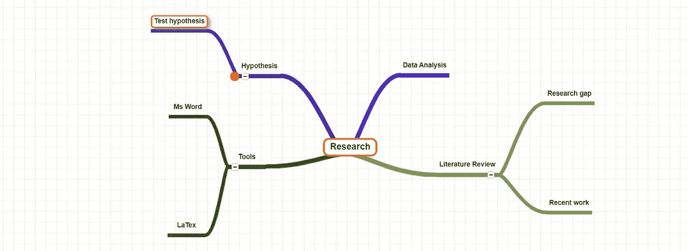

# 开始你的研究之旅第二部分

> 原文：<https://medium.com/mlearning-ai/begin-your-research-journey-part-ii-54e3cdb30c59?source=collection_archive---------5----------------------->

要成为一名研究人员，你必须在一开始就了解一些基本信息。虽然开始研究工作有点困难，但是，一旦你理解了开头，接下来就不会有困难了。在这篇文章中，我将讨论写一篇科学论文需要什么以及你必须知道什么。

请看前面的文章，以掌握研究的基本原理。

给你:[https://medium . com/@ eliashossain 9111/begin-your-research-journey-part-I-d 6 e 5c 6 a 589 cf](/@eliashossain9111/begin-your-research-journey-part-i-d6e5c6a589cf)

Image source: [https://unsplash.com/](https://unsplash.com/)

> **步骤 01:** 精于研究工具“乳胶”。虽然在开始阶段很难准确地知道，但是，一旦你正确地知道了，你就能写出一篇完美的科学论文。
> 
> **步骤 02:** (统计工具)数据分析经验丰富。r 程序设计是数据科学家青睐的基本统计程序设计语言之一。不仅是数据科学家，学者和研究人员也喜欢它。此外，MS Excel 也很强大，所以如果你想使用它，那么就决定如何创建参考书目、引文和参考文献。
> 
> **步骤 03:** 为了证明你的研究问题，做一个假设。查看之前的文章“将你的创新转化为研究”我谈到了如何提出假设。既然产生了一个假设，它必须被检验，因为如果它被证明是不准确的，一个新的假设必须被执行。所以精通假说是至关重要的。
> 
> **步骤 04:** 根据你的研究课题找出最近的工作，这样你就可以了解之前完成了哪些种类的文献。点击下面的链接，找到科学论文:
> 
> [https://scholar.google.com/](https://scholar.google.com/)
> 
> [https://www.elsevier.com/solutions/scopus](https://www.elsevier.com/solutions/scopus)
> 
> [https://www.mendeley.com/](https://www.mendeley.com/)
> 
> **步骤 05:** 主要思想需要在查阅文献后总结。另一方面，探索以前研究之间的差距可能是比较你的研究的一个重要方面。

Fig.1: Fundamental research mind map

总之，这篇文章解释了开始研究工作的主要步骤和关键经验。开始研究之旅可以有不同的步骤，然而，我会遵循 5 个步骤，因此，遵循这些步骤会使研究之旅更容易。如果你不按程序行事，会有很多麻烦。

祝你的研究任务顺利。不要气馁，不要绝望。