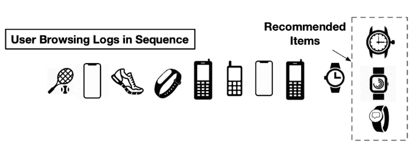
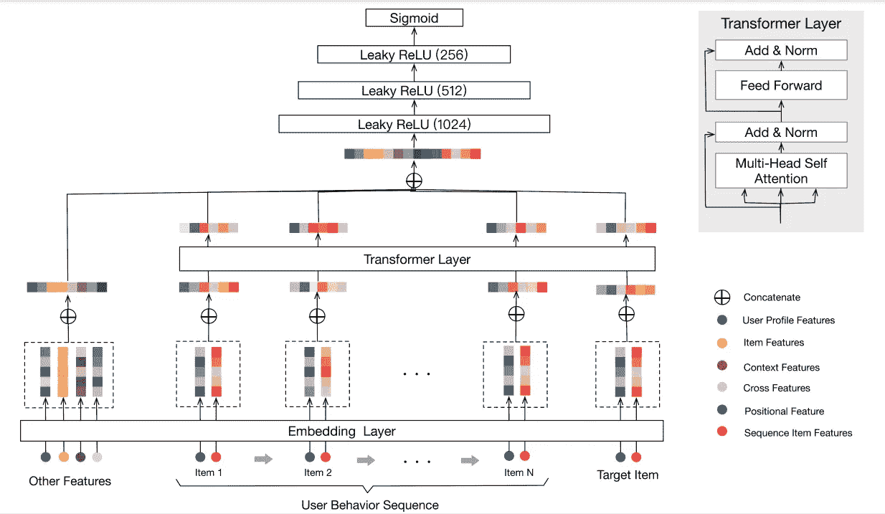
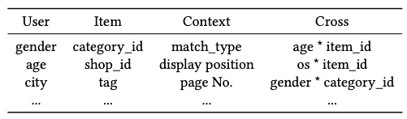
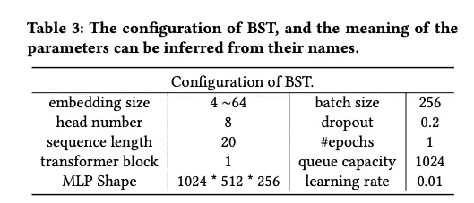

# 行为序列转换器

> 原文：<https://medium.com/mlearning-ai/behavior-sequence-transformer-c9bf7308c463?source=collection_archive---------0----------------------->

**** *论文研究阿里巴巴的 SOTA RecSys *****

在这篇博客中，我将尝试解释 BST 的一些关键概念，以及其中的哪些因素可以改变游戏规则。如果你不熟悉基于 transformer 的架构，那么我推荐你阅读这篇文章:[图解 Transformer](http://jalammar.github.io/illustrated-transformer/) 。

# 概观

顺序深度学习模型已经在推荐行业中证明了其优势，可以根据用户过去的行为顺序生成更相关和动态的推荐。BST 是阿里巴巴(由陈启伟等人)承担的电子商务推荐系统。在这里找到研究论文:[https://arxiv.org/pdf/1905.06874.pdf](https://arxiv.org/pdf/1905.06874.pdf)

在这篇论文中，他们提出使用强大的 Transformer 模型来捕捉阿里巴巴用户行为序列背后的序列信号，以进行推荐。
阿里巴巴的 RecSys 是一个**两级管道**:匹配和排名。

*   在匹配中，根据用户交互的项目选择一组相似的项目([https://arxiv.org/pdf/1803.02349.pdf](https://arxiv.org/pdf/1803.02349.pdf)
*   然后学习微调预测模型来预测用户点击给定候选项目集的概率。

# 模型架构

The overview architecture of the proposed BST

BST 的 3 个关键组成部分:

*   **嵌入层**
*   **变压器层**
*   **MLP**

他们使用了 transformer 架构的编码器，该架构利用自我关注来组合来自用户过去交互的信号。**自我关注是一种非常有效的机制，可以捕捉用户兴趣的任何近期变化，同时还能保持长期的环境。**

# 输入嵌入

这一层对来自交互、用户和项目数据的各种特征进行整形，并将它们加在一起以创建最终的输入向量，该向量将被输入到转换器的编码器层。

有两种类型的特征来表示一个项目，“T21”序列项目特征(在**红色**)和“**位置特征**”(在**深蓝色**)，其中“序列项目特征”包括 item_id 和 category_id。
有各种各样的特征，像用户简档特征、条目特征、上下文特征，以及不同特征的组合，即交叉特征。由于这项工作的重点是使用 transformer 对行为序列进行建模，因此他们将所有这些特性都标记为“**其他特性**”。

虽然特征的组合可以由神经网络自动学习，但它们仍然包含一些手工制作的交叉特征，这些特征在深度学习时代之前已经在我们的场景中被证明是有用的。

Other Features

序列项目特征在潜在空间的表征方式已经在[这里](/@dungcamlang/paper-reading-billion-scale-commodity-embedding-for-e-commerce-recommendation-in-alibaba-e97bd5d32318)详细讨论过了。

现在这里有趣的部分是**的位置特征。**作者提出了一种位置嵌入来捕捉句子中的顺序信息。同样，顺序存在于用户的行为序列中。因此，添加“位置”作为底层中每个项目的输入特征，然后将其投影为低维向量。
注意，项目 v(i)的位置值计算为 pos(VI)= t(vt)-t(vi)，其中 t(vt)表示推荐时间，t(VI)表示用户点击项目 v(i)时的时间戳。
*注意:基于正弦的相对时间编码比使用以天为单位的绝对相对时间作为特征执行得更好。*

# MLP 层和损失函数

通过连接其他功能的嵌入和应用于目标项目的 Transformer 层的输出，然后使用三个完全连接的层来进一步学习密集功能之间的交互，这是工业 RecSys 中的标准实践。**为了预测用户是否会点击目标项目 v(t)，他们将其建模为二元分类问题**，从而使用 sigmoid 函数作为输出单元。为了训练模型，他们必须使用交叉熵损失。

Configuration

实验结果证明了该模型的优越性，该模型在淘宝网上部署后，在线点击率(CTR)较两种基线有显著提高。

# 修改

***对原 BST 模型中实验的修改如下:***

1.  ***将特征纳入到对输入序列的每一项和目标项的嵌入的处理中，而不是作为变换层之外的“其他特征”来对待。***
2.  ***利用输入序列中的评级或用户反馈，以及它们在序列中的位置，在将它们馈送到自我关注层之前更新它们。***
3.  **跨所有类别概率使用 Softmax，使模型学习多类别分类。**
4.  **根据用户的点击进行个性化。计算从用户点击和被点击体验的类别中导出的两个特征:
    *类别强度:**具有该特定类别的体验上的用户点击的加权总和，
    * **类别新近度:**自从用户最后一次点击该类别中的体验以来经过的天数。
    *注意:* *用户可能已经点击了具有不同强度和新近度的许多不同类别，但是当针对需要排序的特定体验计算特征时，我们使用该体验类别的强度和新近度。*