# “面向人工智能培训的人工智能加速器性能和能效基准测试”摘要

> 原文：<https://medium.com/mlearning-ai/benchmarking-the-performance-and-energy-efficiency-of-ai-accelerators-for-ai-training-e3995c52aeb4?source=collection_archive---------7----------------------->

# 介绍

深度学习(DL)是随着使用 GPU 而兴起的。此外，各种公司已经发布了加速器，以获得更高的性能和能效。例如，谷歌张量处理单元(TPU)处理器可以被命名为。Yuxin et al. [ **1** ]为各种 DL 模型的训练描述了 CPU、GPU 和 TPU 处理器的特性。他们从架构上选择各种 DL 模型来构建代表性的基准测试套件。为此，他们在其基准套件中包括卷积神经网络(**CNN**)、递归神经网络( **RNNs** )、 **Deep Speech 2** 和 **Transformer** 。基于他们的观察，他们向社区提供了关于 DL 模型和可用处理器的见解。

# 人工智能加速器

该论文的作者使用 CPU、GPU 和云 TPU 来描述 DL 培训工作。要了解更多关于 CPU 和 GPU 的知识，请查看[这篇文章](/mlearning-ai/processors-cpu-gpu-fpga-accelerator-8bfc3a73333c)。作者提供了下表，其中总结了一些 GPU 的详细信息。然而，最近发布了更强大的 GPU，如 NVIDIA 的 [A100](https://www.nvidia.com/en-us/data-center/a100/) 和[H100](https://www.nvidia.com/en-us/data-center/h100/)GPU(论文于 2020 年发表)。

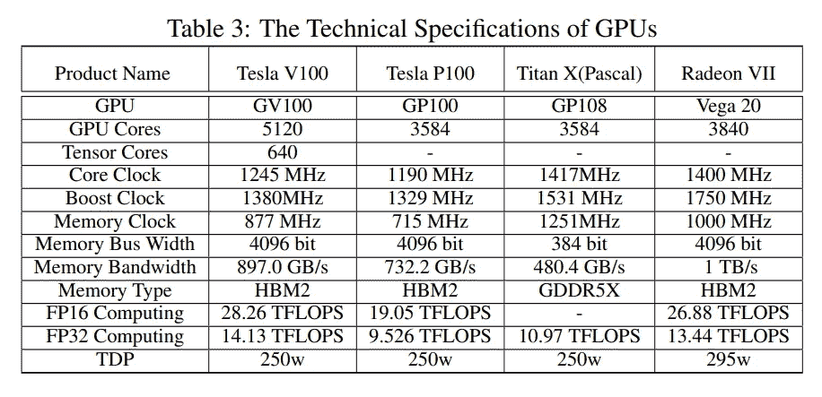

image credit [**1**]

## 谷歌 TPUs

TPU 是由 Google 设计的针对机器学习应用的特定应用硬件(ASICs)。机器学习应用中的主要操作是矩阵乘法，并且 TPU 被设计成专门在硬件级快速执行矩阵乘法。下图显示了 TPU v2 和 v3 架构。对于 TPU v4，关于其架构的信息较少。但是，谷歌声称它比 TPU v3 快两倍多。MXU 单元是专门为矩阵运算设计的。它们在每个周期中执行 16K 乘累加(MAC)操作。此外，它们支持混合精度训练。

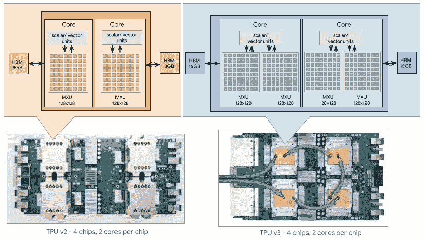

image credit [[ref](https://www.nextplatform.com/2021/05/21/google-hints-about-its-homegrown-tpuv4-ai-engines/)]

TPU 有趣的地方在于它们支持 bfloat16。bfloat 代表大脑浮点。这是一种不同于 IEEE 标准的浮点数表示法。它的目标是提供比 IEEE float16 格式更宽的范围，因为它为指数分配了更多的位。下图显示了 bfloat16 和 IEEE float16 与 IEEE float32 的区别。

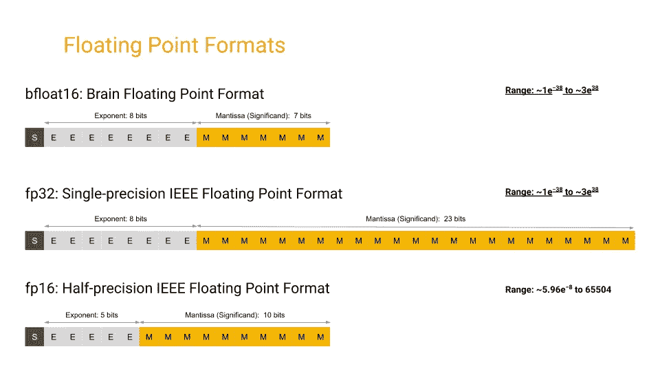

[https://cloud.google.com/tpu/docs/bfloat16](https://cloud.google.com/tpu/docs/bfloat16)

# 培训渠道

## 小批量随机梯度下降(SGD)

Mini-batch SGD 是 SGD 方法的衍生，它将数据集分成多个批次，并迭代更新模型参数。下图显示了单次迭代期间的培训流程图。

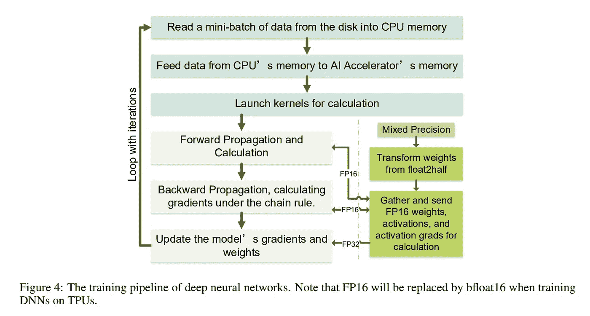

image credit [**1**]

## 混合精度(MP)训练

这种技术在训练期间使用低位浮点来进行向前和向后的计算，以减少所需的计算量。在该技术中，采用 FP32 主权重和损失缩放来避免 FP16/bfloat16 精度可能导致的不稳定性。下图演示了这种技术。

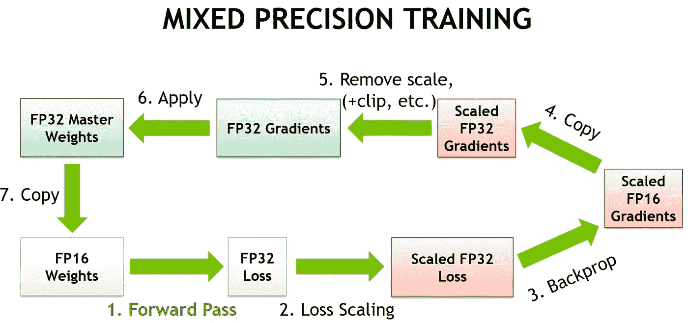

[https://developer.nvidia.com/blog/video-mixed-precision-techniques-tensor-cores-deep-learning/](https://developer.nvidia.com/blog/video-mixed-precision-techniques-tensor-cores-deep-learning/)

# 论文的评估设置

## 基准

在 **1** 论文中，选择了两种基准来评估不同的处理器:**综合张量运算**和 **DL 模型**。由于矩阵乘法(全连接(FC))和二维卷积(卷积神经网络(CNN))是两种主要的资源消耗运算，因此它们被选为具有三种不同大小(小、中、大)的合成张量运算，如下图所示，它们的大小需要浮点运算(FLOPS)。对于 conv2d 操作，在不同的批量下，输入和滤波器采用 ResNet50 [ **2** 。作者采用了 DeepBench 的 CUDA C++代码，并对其进行了一些修改。在下图中，F、K 和 S 指的是输入大小、内核大小和步长。

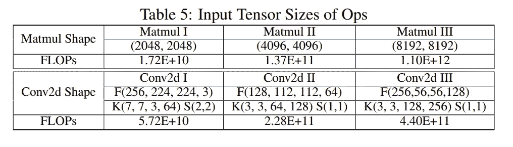

[**1**]

考虑到全面性，本文从不同的架构中选择模型，如下表所示。

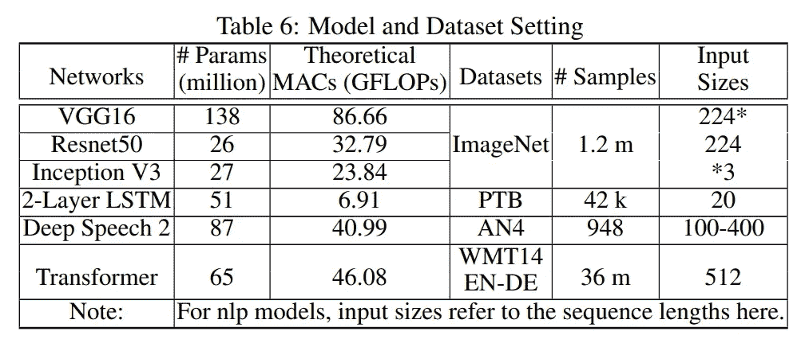

image credit [**1**]

## 韵律学

作者选择迭代花费的时间作为性能度量。对于能量度量，他们使用处理单个样本的能量成本。他们使用 TensorFlow 和 PyTorch 来监控性能，使用 ***nvidia-smi*** 监控工具以 2ms 为步长进行功耗监控。

# 结果和讨论

## 中央处理器（central processing units 的缩写）

为了利用 CPU 的众核和单指令多指令多指令(T21 指令)能力，多线程和高级向量是选项。通过增加合成基准的线程数量，可以观察到线性的改进。比较矩阵乘法和卷积核的结果表明**卷积运算有进一步改进的潜力，因为它们的低级运算不会造成内存瓶颈**。

对于端到端训练，在 Inception v3、ResNet50 和 vgg16 卷积网络以及 2 层 LSTM 上，线程数量的增加会带来更高的性能。但是，对于 Deep Speech 2，线程的最佳数量是 8，数据预处理线程可能会缺少 CPU 资源，从而导致性能下降。

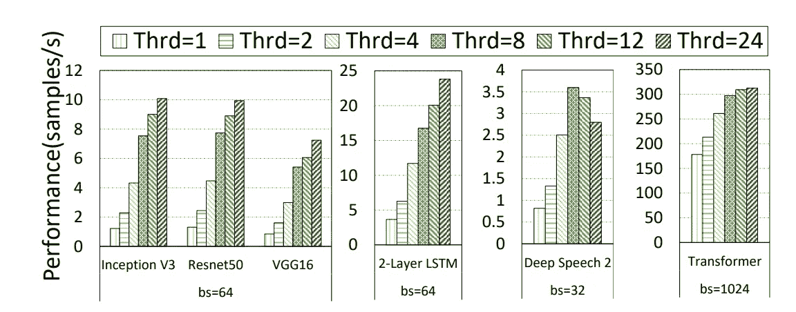

image credit [**1**]

## GPU 和 TPU

在合成数据上，TPU v2 显示了其优于 GPU 的优势，这是一个显而易见的事实，因为它们是专门为矩阵乘法而构建的。

对于端到端培训，下图描述了 FP32 上的小批量和 V100 GPU 上的混合精度的影响。它表明批处理大小的增加通常会导致更高的性能和利用率，并且在 ResNet50 模型中对混合精度更有效。

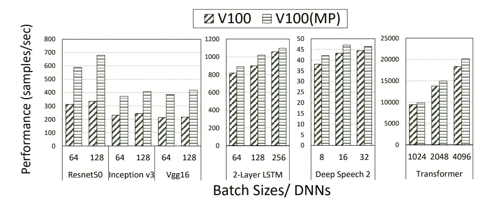

image credit [**1**]

另一个有趣的观察结果是，虽然从 FP32 切换到混合精度导致 ResNet50 的性能提高了 2 倍，但是张量核心利用率约为 9%。

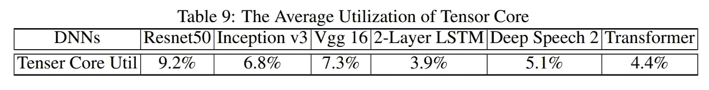

image credit [**1**]

TPU 在性能上显示了相对于 V100 GPU 的优越性。

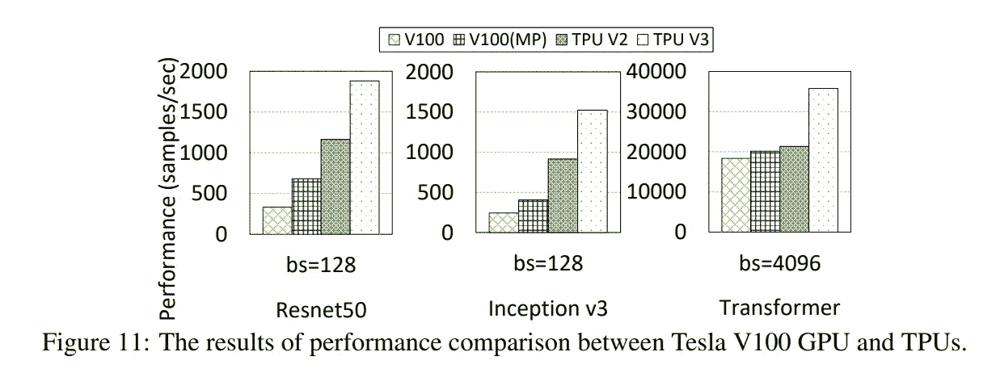

image credit [**1**]

最后，他们在下图中比较了不同 GPU 的能效。

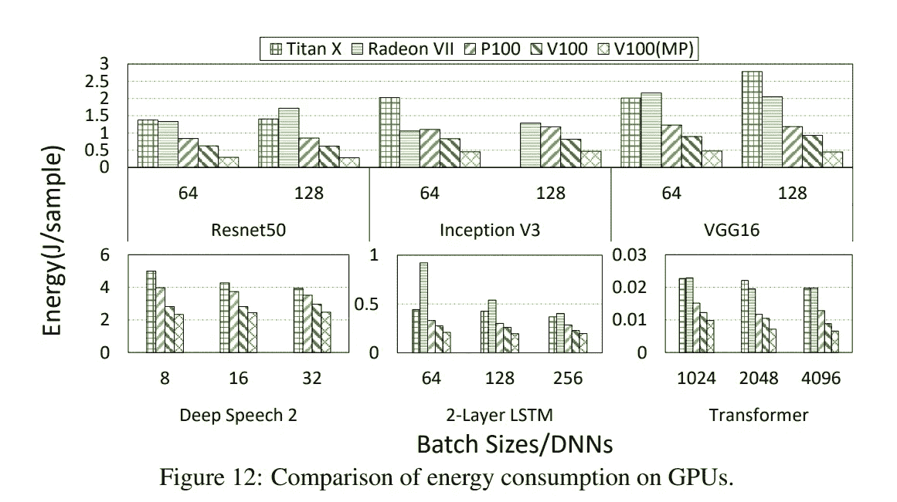

image credit [**1**]

# 参考

王，等。、“**为人工智能训练对人工智能加速器的性能和能效进行基准测试，**”，载于*第 20 届 IEEE/ACM 集群、云计算和互联网计算国际研讨会(****cc grid****)*，澳大利亚墨尔本， **2020** 第 744–751 页。

**2** 何，，等.**深度残差学习用于图像识别。***IEEE 计算机视觉与模式识别会议论文集*。 **2016** 。

 [## Mlearning.ai 提交建议

### 如何成为 Mlearning.ai 上的作家

medium.com](/mlearning-ai/mlearning-ai-submission-suggestions-b51e2b130bfb)