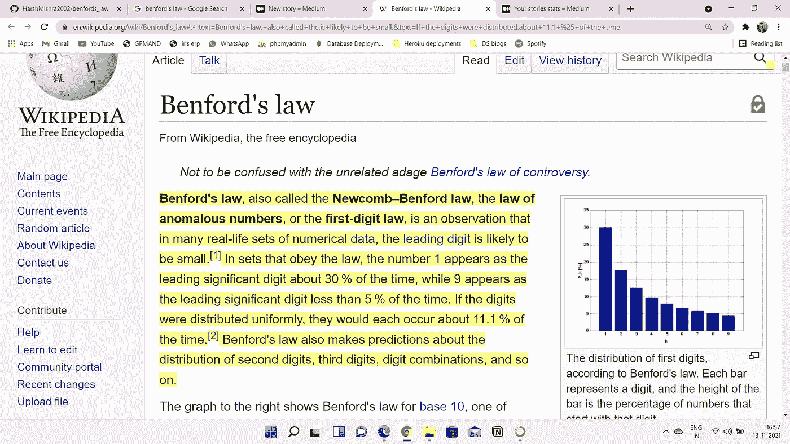
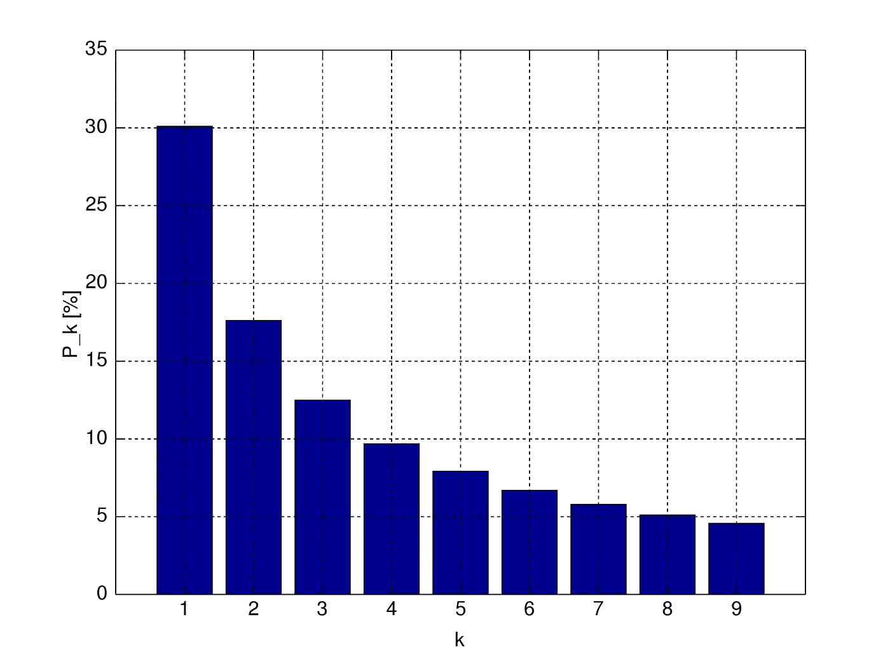
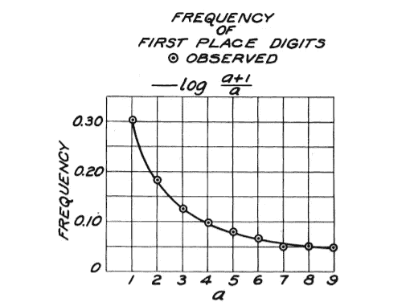
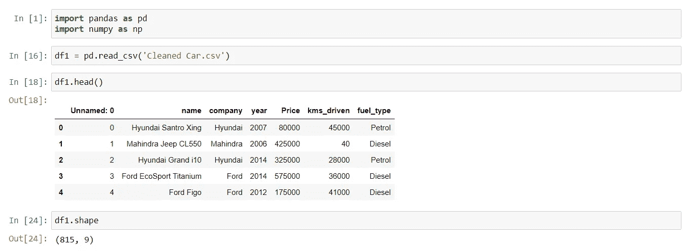
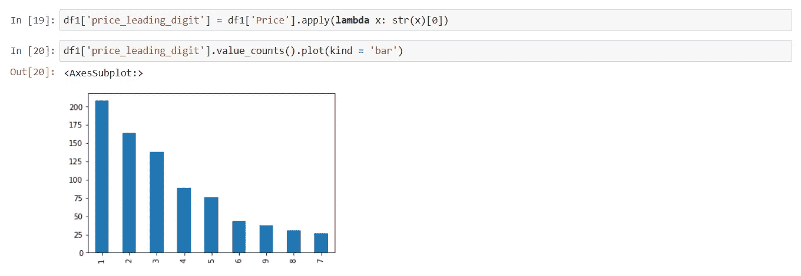
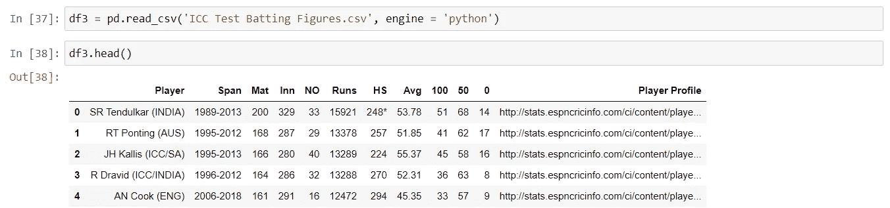
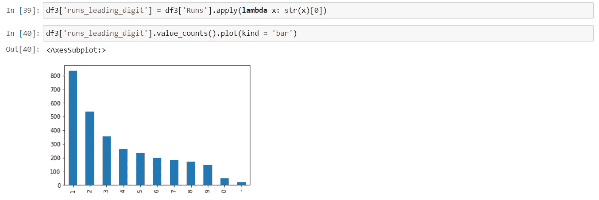

# 本福德定律可以改变游戏规则！！！

> 原文：<https://medium.com/mlearning-ai/benfords-law-can-be-a-game-changer-9893e660363a?source=collection_archive---------0----------------------->

今天在这个博客中，我想分享一些关于本福德定律的信息。随着我们的前进，我们将看到它是什么，以及它如何能够改变游戏规则。

> *这个博客写的所有代码都在我的 github-*【https://github.com/HarshMishra2002/benfords_law 
> 
> *所用数据集的链接-*
> 
> [https://www.kaggle.com/veeralakrishna/icc-test-cricket-runs](https://www.kaggle.com/veeralakrishna/icc-test-cricket-runs)
> 
> [https://www.kaggle.com/harshmishraandheri/car-dataset](https://www.kaggle.com/harshmishraandheri/car-dataset)

**什么是本福德定律？**

首先让我们看看[维基百科](https://en.wikipedia.org/wiki/Benford%27s_law#:~:text=Benford's+law%2C+also+called+the,is+likely+to+be+small.&text=If+the+digits+were+distributed,about+11.1+%25+of+the+time.)是如何定义它的

所以法律很简单。考虑任何数字数据并从左边提取它的第一个数字，1 将是出现最多的数字，几乎是 30%的时间，9 是出现最少的数字，大约是 5%。

Graphical representation of Benfords law

弗兰克·本福特在他的论文《反常数字定律》中首次提出了这个概念。

> 该论文的链接是-[https://MD porter . github . io/sys 6018/other/(Ben Ford)% 20 the % 20 law % 20 of % 20 anomaly % 20 numbers . pdf](https://mdporter.github.io/SYS6018/other/(Benford)%20The%20Law%20of%20Anomalous%20Numbers.pdf)

当我读到他论文中的这一段时，这条定律变得更有趣了:

> “对这些项目的研究显示出一种明显的趋势，即随机性质的项目比形式或数学性质的项目更符合对数律。最好的一致是在报纸连续的头版新闻中的阿拉伯数字(没有拼写出来)。日期因为不可变而被禁止，省略拼出的数字限制了数字 10 及以上。第一个 342 个街道地址在当前的美国人的科学(R 项，表四)给了极好的协议，和一期读者文摘的完整计数(除了日期和页码)也是一致的。另一方面，对数关系的最大变化出现在工程手册中数学表格的第一位数字，以及诸如分子量、比热、物理常数和原子量等紧密结合的数据的列表中。"

让我用简单的话来说，当应用该定律的数据是自然发生的，而不是当有一些数学方程来获得这些数字或有任何类型的故意人为干扰时，该定律更适用和可靠。

但为什么这条定律可以改变游戏规则，是因为它的应用。当我从事任何数据科学项目时，我只需去 kaggle 下载 csv 文件并开始工作。

我从不验证数据。

可能有两个原因，首先，我太相信数据的来源，以至于检查它是否合适或者它是否有一些欺诈数据的来源从来都不是问题。第二个原因是，实际上没有太多的工具可以使用，所以本福德定律来了。

我最喜欢这条法律的一点是它非常容易实施。

当我了解到这一点时，我想我实际上应该尝试在实际数据集上实现这一定律，看看会有什么结果。

因此，我获取了一个汽车数据集，并对代表每辆汽车价格的价格列应用了法则。

这个结果是本福特定律的精确表达。

我在另一个数据集上尝试了同样的事情。这次我有板球测试中击球手得分的数据。

我又一次得到了同样的结果。

在 2009 年的伊朗选举中，本福德的法律被作为舞弊的证据。根据梅班的分析，总统马哈茂德·艾哈迈迪-内贾德(Mahmoud Ahmadinejad)的第二位数选票往往与本福特定律的预期有很大差异，而有少量无效选票的投票箱对结果有更大的影响，这意味着广泛的选票填充。

选举舞弊也被指控以不恰当的方式使用了本福特法。当应用于 2020 年美国总统选举中芝加哥、密尔沃基和其他城市的乔·拜登的选举结果时，第一个数字的分布不符合本福特的公式。该错误是由于查看紧密绑定在范围内的数据而发生的，这违反了本福特定律关于数据范围较大的假设。

所以我觉得，如果有任何需要验证数字数据或检测数字欺诈，这条法律应该是第一个使用的工具。

> 我希望你们能学到一些新东西，并喜欢这个博客。如果你确实喜欢它，那就和你的朋友分享吧。保重。不断学习。
> 
> 你也可以通过我的 Linkedin 账户-[*【https://www.linkedin.com/in/harsh-mishra-4b79031b3/*](https://www.linkedin.com/in/harsh-mishra-4b79031b3/)联系我

* [## Mlearning.ai 提交建议

### 如何成为 Mlearning.ai 上的作家

medium.com](/mlearning-ai/mlearning-ai-submission-suggestions-b51e2b130bfb)*