# 良性还是恶性？神经网络可以有所帮助

> 原文：<https://medium.com/mlearning-ai/benign-or-malignant-neural-networks-can-help-9c3a1a2c9154?source=collection_archive---------2----------------------->

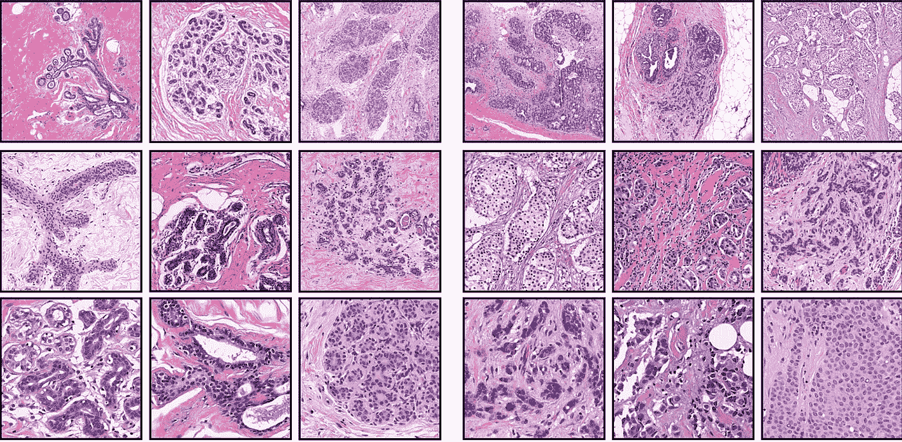

Can you tell which set of images is benign and which set is malignant?

你可能会看着上面的图片想，“我怎么知道哪个是哪个？肿瘤看起来像什么？那是病理学家或医生的工作，不是我的。”好吧，如果我告诉你病理学家也不会这么确定呢。

事实上，最近的一项研究发现**病理学家只能以 38%的准确率检测微转移——在最初的生长部位后扩散到身体其他部位的超小型恶性肿瘤。此外，这些检查中有 25%会在第二次审查时被更改。**如你所见，首先发现癌症并不容易！

毕竟，他们必须尝试并观察每一个细胞，看看它是否遵循异常的生长周期，所以唯一确定的方法是采取活检，这意味着必须采取肿瘤样本；这将告诉他们肿瘤是良性还是恶性。

1.  **良性肿瘤，除非在脑部，通常是无害的。**它们不会像恶性肿瘤一样扩散，一旦切除就不会再长出来。事实上，10 个女性中有 9 个经历良性乳腺组织变化，所以它们相当普遍。
2.  另一方面，恶性肿瘤具有极大的危害性和传染性。它们可以转移，或扩散到身体的其他部位，最终通过窃取氧气和营养物质，侵犯为健康组织和器官预留的空间，导致患者死亡。

尽早发现恶性肿瘤对患者来说至关重要，因为发现得越早，治疗就越容易。当症状出现时，一些肿瘤细胞可能已经转移，这使得治疗变得复杂和棘手 10 倍。此外，转移大大增加了癌症复发的可能性，甚至在治疗后很久，从而降低了患者的存活率。

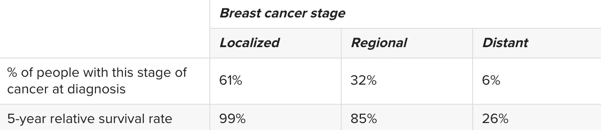

As the tumor spreads, survival rates rapidly decrease.

如果你有兴趣更深入地了解癌症，我推荐你阅读我几个月前写的这篇[文章](https://james-yi-zhang.medium.com/how-applying-ai-to-cancer-can-save-millions-464f679f2461)，但是你不需要阅读它来理解这篇文章的其余部分。

为了解决确定肿瘤是良性还是恶性的问题，**我使用机器学习开发了一个序列神经网络，可以做到这一点。为了做到这一点，我使用了 TensorFlow，这是一个由 Google 开发的用于开发人工神经网络的 Python 库，以及它的 and Keras，它只是一组让您操作神经网络的函数。我在 Google Colab 上运行我的所有代码——就我个人而言，我觉得它更简单、更容易使用，但有些人更喜欢下载 TensorFlow，因为它提高了稳定性。不过，对我来说，Colab 就足够了。现在让我们深入细节！**

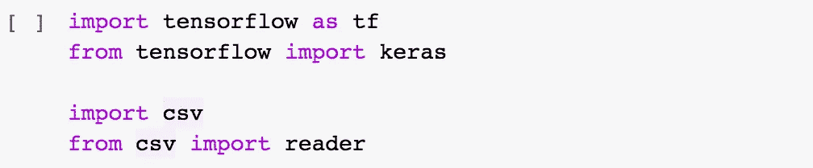

Instead of having to download everything on my computer, in Colab, TensorFlow is pre-installed, so all I have to do is import it like so.

# 数据

创建精确神经网络的第一步是找到一个好的数据集。我在这里找到了一个[，但是网站上的品种其实相当有限。(大多数时候，我通常更喜欢](https://www.apispreadsheets.com/datasets) [Kaggle](https://www.kaggle.com/) ，但我找到的数据集已经足够了)。下载完数据集后，我将其重命名为 data.csv，其中“csv”代表“逗号分隔值”，然后我打开了它。

该文件包含关于 **9 种不同属性**的信息，以确定肿瘤是良性还是恶性，总共有 **569 个肿瘤。🔑提示:数据越多，数据种类越多，神经网络就越精确。**在我们的例子中，我们将使用 9 个属性来训练我们的神经网络，并帮助确定肿瘤的严重程度，这由“类别”列表示。 **2 =良性，4 =恶性。**

Some of the properties include clump thickness, uniformity of cell size, bland chromatin, mitosis, etc.

## 翻译数据

我们的下一步是将我们的数据从这个 csv 文件转换成 Python 列表，以便 TensorFlow 能够真正理解它。我做的第一件事是创建一个名为“data”的空列表。接下来，我打开数据集文件，然后使用 csv 阅读器将数据集的每一行追加到空的 data Python 列表中。

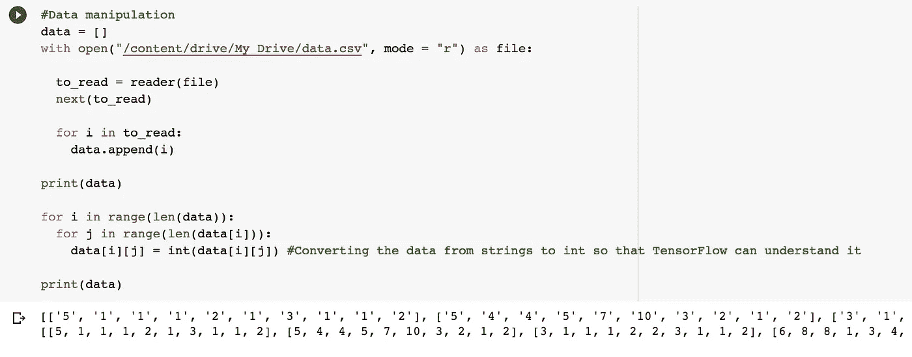

正如您在底部输出部分看到的，每组括号包含 9 个特征和每个肿瘤的类别。只有一个问题，你能解决吗？如果你说每个括号中的每个索引都是一个字符串，那么你是对的。毕竟，我们是逐行追加数据，而不是逐索引追加，所以这是有意义的。但是，它最终是相当有问题的，因为 TensorFlow 只能理解数学。它看到单引号，然后说，*哦，不好了。*

为了解决这个问题，我使用了一个嵌套的 for 循环来逐个遍历整个数据列表中的每个索引，然后一旦我有了一个索引，我就把它从 String 改为 int。

现在，如输出的第二行所示，没有单引号，因此它们都是 int。

## 拆分数据

一旦我们所有的数据从 csv 文件转移到我们的数据列表中，我们就可以继续分割数据。分割我们的数据实际上有两个独立的部分:首先，我们需要将它分割成一个输入和输出集；这对实际训练我们的网络很重要。

你可以把它看作是把考试中的问题和答案分开。分开后，剩下的是试题和一个答案，你可以用它来给学生的答案打分。同样，我们的神经网络将接受输入并产生输出。我们将生成的输出与实际输出进行比较，对网络的权重和偏差进行适当的更改，并反复运行，直到最终我们的网络相当准确。

换句话说，我们需要创建一个只包含 9 个属性的列表，然后用“class”列分隔该列表，该列只显示肿瘤是良性的(记住，用 a 2 表示)还是恶性的(用 a 4 表示)。

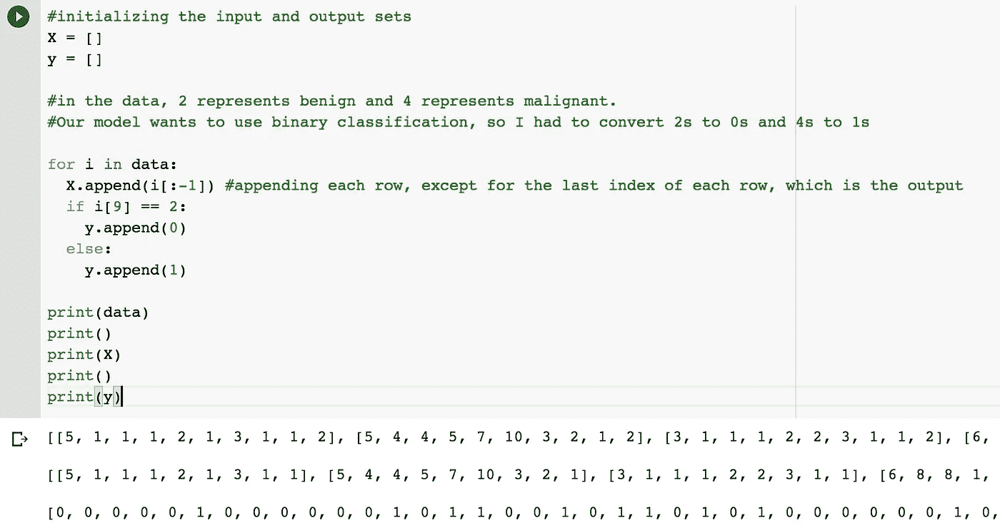

The first component of splitting the data.

完成这样一个任务的第一步是创建另外两个空列表，我将它们命名为“X”和“y”。接下来，我们希望遍历数据中的所有行，并附加除了每行的最后一个索引之外的所有内容，这是我们的输出。仍然在 for 循环中，我们查看最后一个索引，这里我们必须确定是追加 0 还是 1。

我们的网络将使用二进制分类。**你可以把二进制分类看作是确定一张图片是一只狗还是一只猫，或者今天会下雨还是不下雨，或者一个学生会通过还是不及格。非此即彼。**在我们的病例中，肿瘤要么是良性的，要么是恶性的，因此它遵循相同的模式。

你可能想知道，“*为什么是 0 和 1？2s 和 4s 怎么了？”4 是我最喜欢的数字。好吧，也许不是最后一点，但你知道我的意思。*

简短的回答是，计算机发现 0 和 1 比 2 和 4 更容易处理，在使用 Sigmoid 函数后，网络可以很容易地确定肿瘤的状态。这肯定有点抽象，但我将在本文稍后进行更多解释，但**肯定会花一两分钟时间思考为什么是 Sigmoid、0 和 1，以及这将如何提高网络的整体性能。**

第二个组件要求我们使用训练-测试-分割来分割我们最近获得的输入和输出数据。本质上，我们将数据分成两部分；在训练部分，我们的网络反复迭代改进自己，然后网络在测试部分测试它的准确性。

这有助于防止**过度拟合，过度拟合是指网络对训练网络的建模过于紧密，从而在遇到新数据时无法进行归纳而恶化。**

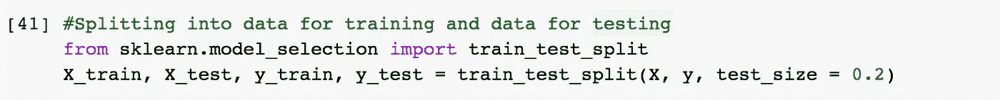

利用 sklearn.model_selection 的 train_test_split 函数就像在公园散步一样。事实上，唯一比使用 train_test_split 更简单的事情就是把这篇文章留下来，并在其他平台上与我联系👀一旦你读完。

无论如何，train_test_split 本质上是将我们的 X(输入)列表和 Y(输出)列表分成总共四个列表。我使用了 0.2 的测试规模，这只是意味着我们 20%的数据将用于测试，另外 80%将用于训练模型。

# 神经网络

在我们开始使用 TensorFlow 和 Keras 构建我们的神经网络之前，重要的是回顾一些关键概念，这些概念允许神经网络模拟生物大脑并以类似的方式学习。

## **激活功能**

在神经网络中，输入乘以权重，然后添加到偏差，然后传递到激活函数。

简单来说，激活函数是一种数学函数，它通过将数字保持在合理的阈值内来帮助神经网络识别复杂的模式。例如，在前面提到的情况下，如果学生将通过或失败，可以使用步骤激活功能。

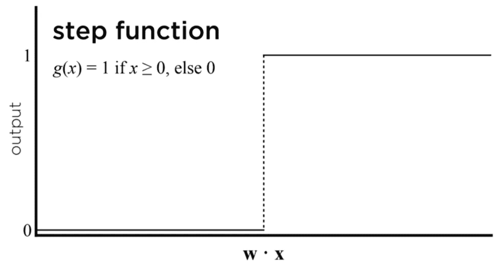

step 函数接受任何实数，如果大于某个阈值，该数被视为 1。否则，将被视为 0。

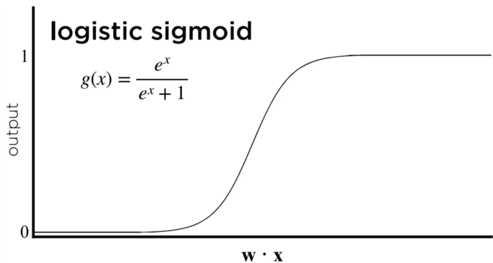

sigmoid 函数类似于阶跃函数，但更常见的情况是，sigmoid 函数优于阶跃函数，因为它为输出提供了一个置信度。

我的意思是:假设阈值是 0.5(记住，我们在网络中使用 0 和 1，所以 0.5 正好在中间)，神经网络在 sigmoid 函数之后的预测输出是 0.47。它正朝着良性方向摇摆，所以网络会做出这样的猜测，但同时，如果网络是错误的，肿瘤实际上是恶性的，我们也不一定会感到惊讶。另一方面，如果我们的网络返回 0.98，我们将几乎确定肿瘤是恶性的，因此**sigmoid 函数为返回的输出提供了一种信心，这与仅返回 0 或 1 的阶跃函数相反。**

整流线性单元(ReLU)是另一个有用的激活函数，但它通常用于神经网络的隐藏层。回想一下，在所有的节点中，我们试图计算肿瘤是恶性的概率，但是如果权重和偏差导致节点的输出是负数呢？

什么是负概率？你不可能比 0%更确定，所以 ReLU 只是取 0 和输出之间的最大值。本质上，如果数字是负数，ReLU 返回 0，如果是正数，ReLU 返回数字本身。这对计算机来说最终是有益的，因为它可以花更少的时间处理实际上不需要的数据，因此，我们的神经网络将变得更加有效。

## **梯度下降**

梯度下降是一种算法，它可以最大限度地减少损失，损失代表网络的故障级别。损耗越低，网络性能越好。那么梯度下降到底是怎么工作的呢？

你可以这样想。想象一下，你恐高，然而不知何故，你发现自己站在珠穆朗玛峰的顶端。你是怎么下来的？好吧，这对于一个人来说是很明显的(明显不等同于简单或容易的参考信息)。

你环顾四周，评估哪个方向能带我们最快下山。然而，与此同时，你不想走得太快，否则，你可能会滑倒，这对你来说不会有什么好处。所以你正按你预想的方式踮着脚尖下山，然后最终，你会自己想，“哇，这条路也可能很快。”

Hopefully, you don’t find yourself stranded at the top of Mt. Everest…

所以，你选择以那种方式慢慢下山，如果你一遍又一遍地重复这个过程，希望你能平安到达山脚。

神经网络的工作方式完全相同。网络根据数据点计算坡度，从而减少网络损耗，就像您评估下山需要采取哪些步骤一样。

然后，网络将相应地以小增量更新其权重，以防止它做不必要的工作，并且它一遍又一遍地重复这个过程，直到网络相当精确。

不幸的是，单独的梯度下降只对两层的神经网络有效，对于大多数问题，它们的复杂程度需要一些隐藏层。我们需要某种可以在整个深度神经网络中工作的概念。*“哟，反向传播！对，你，该你呈现了，走吧！”*

## **反向传播**

反向传播是用于训练具有隐藏层的神经网络的主要算法。我们可以用下面的伪代码来描述它:

*   计算输出图层的误差/损失(预测的输出是否正确？如果调整一些权重，会不会甚至*更* 正确？)
*   重复以下步骤，直到到达输入层
*   1)将错误传播回一层
*   2)使用梯度下降计算该层的权重
*   3)相应地更新权重

这有点抽象，所以我会带你看一下。假设我们有一个良性肿瘤，我们的网络恰好预测输出为 0.45。**它不一定预测错误，只是它可以更准确，因为数字可以更接近 0，因为我们对该输出的信心不是很高，如果你还记得 Sigmoid 函数。**

嘣，我们刚刚计算了误差。计算机用数字表示，但为了我们人类，我上面说的就够了。下一步是将错误传播回一层。本质上，输出层只是将错误发送回上一层，以供进一步分析。

接下来，我们使用梯度下降，并计算这一层的权重。由于我们已经知道下一层的误差，因为我们反向传播，我们可以找出哪些权重负责什么以及它们如何影响网络的性能。这有点像如果你能让时间倒流。想象一下，你在一个迷宫里，转错了弯，走进了死胡同，所以你让时间倒流，现在你知道那个弯会让你远离目的地。**同样，神经网络可以记住这一误差，从而确定哪些重量导致了误差。**

最后，网络调整自己的权重和偏差，试图将误差最小化，然后这个过程再次重复。反向传播，找出导致一切出错的原因，然后尝试修复它。

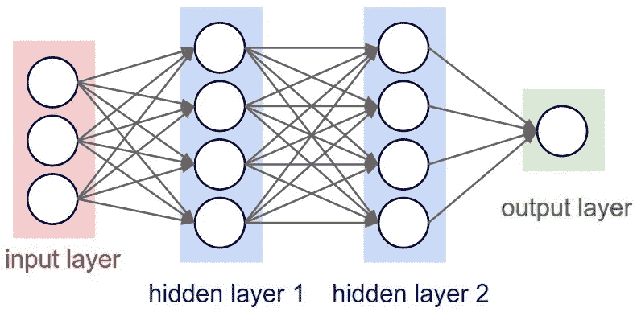

Sweeeett，现在我们已经学习了枯燥的数据处理和神经网络的基础知识，我们终于可以开始有趣的事情了。准备好战斗吧！是时候真正建立我们的网络了！

## 构建网络

我选择为我们的网络实现一个顺序模型，正如你在下面代码部分的顶部看到的。顺序只是意味着模型中的每一层都从上一层接收网络，然后将其输入下一层。这不同于其他类型的 as 网络，如卷积神经网络，或 CNN，和递归神经网络，或 RNNs，但在本文中，我们不需要了解这两种网络。

在初始化序列神经网络并命名为“模型”之后，接下来我们要考虑的是我们希望我们的网络有多少个节点和隐层。马上，我们知道输入层必须有 9 个节点，因为我们的数据集对所有肿瘤都有 9 个独特的特征，但由于 TensorFlow，没有必要在代码中包含它。

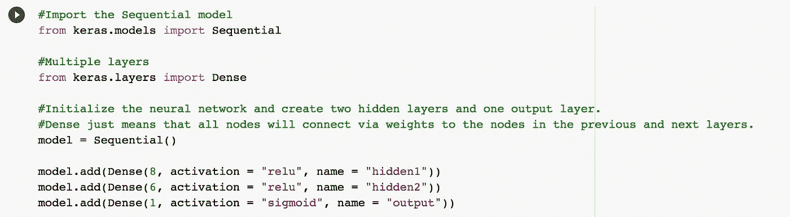

现在，我们必须破译多少隐藏层，我们的网络需要和多少节点每层是足够的。不过，这是一个进退两难的局面。隐藏层和每个隐藏层的节点越多，我们的网络就越复杂和精确。因此，网络必须做更多不必要的数学运算才能达到如此高的精度，因此速度会更慢，效率也会更低。对于我们的情况，在修补了一段时间后，我发现分别具有 8 个和 6 个节点的 2 个隐藏层足够准确。

此外，我已经选择了两个隐藏层来使用 **ReLU 激活函数，通过消除处理负概率的需要来避免我们的网络做更多不必要的数学运算。**

最后，我们知道输出层，也称为输出节点，因为我们的网络将使用二进制分类(回想一下输出是一个或另一个的想法)，将只需要 1 个节点。输出层将利用 **Sigmoid 激活函数，以便我们的网络能够基于合理的阈值进行预测。**你可以这样想。

如果没有 Sigmoid 函数，我们的网络可能会返回从 **-283 到 891 的任何预测输出，或者任何任意范围的输出。**这使得网络几乎不可能自我训练和迭代，因为这些数字实际上并不意味着什么，我们的网络无法破译这些任意数字中的任何一个是否代表良性或恶性肿瘤。

Sigmoid 函数解决了这个问题。回想一下，它将超过某个阈值的任何大数字转换为 1，将小于该阈值的任何小数字转换为 0。此外，Sigmoid 为每个预测提供了一种信心，这取决于它与阈值的距离。

这为我们的网络提供了一个合理的处理范围，因为它可以假设阈值为 0.5，任何大于 0.5 的数字都被认为是恶性的，任何小于 0.5 的数字都被认为是良性的。*“不客气，网络……现在你不用再和那个愚蠢的-283 到 891 的范围打交道了！不客气！”*

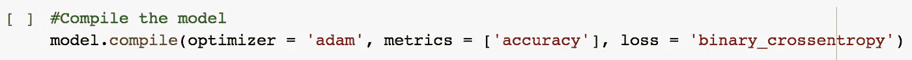

一旦我们像这样编译了模型，我们就可以开始训练我们的网络了！*“Adam”*是 TensorFlow 的内置优化器，它使用**梯度下降来基于***“binary _ cross entropy”*损失函数更新其权重**，该函数通过分析预测错误的二进制输出的时间来对我们的网络的表现进行评级。**

PS。度量参数是可选的，但我喜欢看到模型的整体准确性，因为它让我更好地了解网络的性能，而不是使用损失函数的计算机。

**🔑提醒:**神经网络的整个目标是**最小化损失**，它通过在**反向传播算法**中更新其权重和偏差来实现，该算法利用了**梯度下降。**

## 训练网络

**Model.fit()通过将其权重和偏差适当地拟合到随后的损失函数**来训练算法，而 **epochs 参数只是概述了网络将经历多少个数据周期。**例如，12 个历元只是告诉网络将所有输入数据遍历 12 次。

在这种情况下，12 个历元就足够了，因为超过 12 个历元会导致网络峰值的损失函数和精度大致相同，因此不需要超过 12 个。

我们将会看到我们新训练的网络对我们从未见过的测试数据表现如何？！请敲鼓吧！

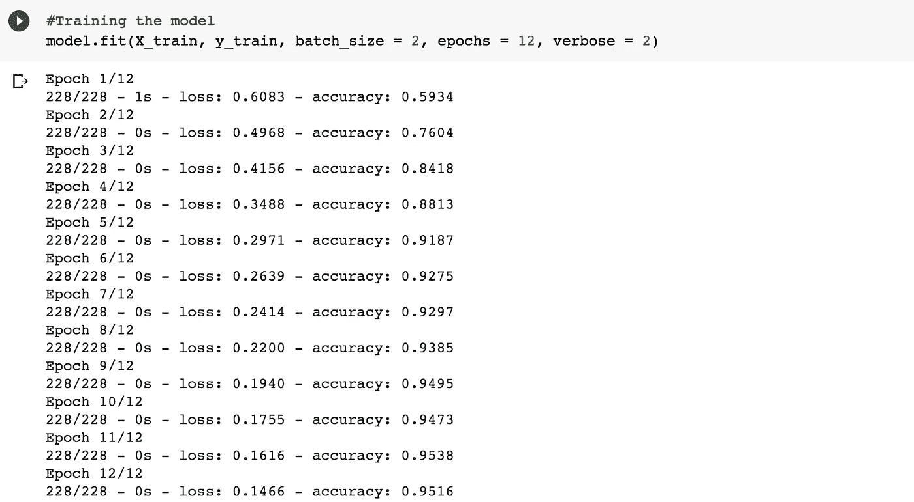

# 结果呢

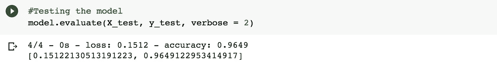

在对测试数据进行评估后，我们的网络达到了 96.49%的准确率！因此，我们知道我们的网络即使在以前从未遇到过的一般数据上也是准确的，因此**过度拟合对我们的网络来说不是问题。**

如果你对成为病理学家或医生不感兴趣，不要担心，因为人工智能的翅膀远远超出了医疗保健领域。只要神经网络有足够的数据，人工智能可以应用于任何行业，以改善人类的生活条件。物体检测，下棋，将一个人的思想转换为语音，更好的网络安全，都是 AI 可以应用的例子，可能性是无穷无尽的。2021 年，人工智能不再是未来，而是现在。

> 😦“如果有数据，那就有办法……”——张俭，2021 年😦

# 关键要点

*   人工智能正在几乎每个领域留下它的影响。
*   神经网络的整个目标是**最小化损失**，它通过在**反向传播算法**中更新其权重和偏差来实现，该算法利用**梯度下降。**
*   数据至关重要！为了创建一个神经网络，数据必须被收集、处理并分成输入/输出和训练/测试。
*   **隐藏层就像一个军规 22。**增加更多会增加复杂性和准确性，但也会降低网络速度，因为它必须执行更多的计算
*   由于 TensorFlow、Keras 和 Google Colab，训练和测试神经网络很容易。

# 感谢阅读！

如果你有兴趣玩代码，可以在这里 查看 Github 库 [*。*](http://jamesyzhang10/Classifying-Breast-Cancer-Tumors)

大声呼喊**你**直到这篇文章结束！❤️，我真的很感激。现在，如果你还记得在文章的中间，我说过使用 train_test_split 函数更容易的一件事是给这篇文章留下一些掌声并与我联系！开始吧！

[*中型*](http://james-yi-zhang.medium.com)*|*[*LinkedIn*](https://www.linkedin.com/in/james-zhang-a45406190/)*|*[*Github*](https://github.com/jamesyzhang10)