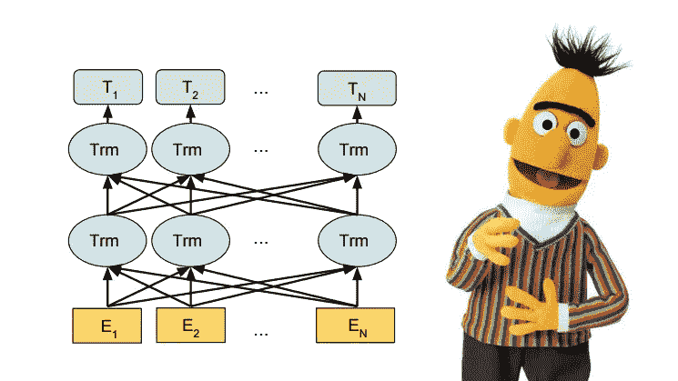
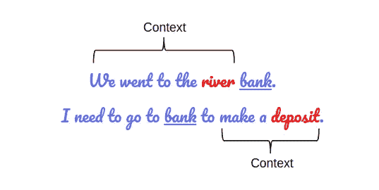

# 个人 BERT:教程+基线

> 原文：<https://medium.com/mlearning-ai/bert-for-individual-tutorial-baseline-bf5ee69066e1?source=collection_archive---------11----------------------->

# 介绍

因此，如果你像我一样，在作为初学者完成了几个月的计算机视觉模型构建后，刚刚开始在 NLP 工作，那么这个故事肯定会为你提供一些东西。

Reference: [https://guillim.github.io/machine-learning/2020/09/29/BERT-architecture.html](https://guillim.github.io/machine-learning/2020/09/29/BERT-architecture.html)

# 伯特风景

> *BERT 是一个深度学习模型，在各种各样的自然语言处理任务上给出了最先进的结果。它代表* ***双向编码器，表示为变压器*** *。它已经在维基百科和 BooksCorpus 上进行了预训练，并且需要(仅)针对特定任务进行微调。*

它通过在各种各样的 NLP 任务中呈现最先进的结果，在机器学习社区中引起了轰动，包括**问答(SQuAD v1.1)** 、**自然语言推理(MNLI)** 等等。

毫不夸张地说，BERT 极大地改变了 NLP 的面貌。想象一下，使用在大型未标记数据集上训练的单个模型，在 11 个单独的 NLP 任务上获得最先进的结果。所有这一切只需要一点点微调。那是伯特！这是我们设计 NLP 模型的一个结构性转变。

BERT 启发了许多最近的 NLP 架构、训练方法和语言模型，如 Google 的 TransformerXL、OpenAI 的 GPT-2、XLNet、ERNIE2.0、Roberta 等。

# 2.伯特是什么？

本质上是大量的 Transformer 编码器堆积在一起(不是整个 Transformer 架构，而只是编码器)。双向的想法是 BERT 和它的前身 OpenAI GPT 之间的关键区别。BERT 是双向的，因为它的自我注意层在两个方向上执行自我注意。

这一节有几件事我想解释一下。

*   首先，很容易理解 BERT 代表变压器的双向编码器表示。这里的每个单词都有它的含义，我们会一个接一个地遇到。目前，**该系列的关键要点是——BERT 基于 Transformer 架构。**
*   第二，BERT 是在包括整个维基百科的大型未标记文本语料库上进行预训练的(那是 25 亿个单词！)和图书语料库(8 亿字)。这个预训练步骤对 BERT 的成功非常重要。这是因为当我们在大型文本语料库上训练模型时，我们的模型开始对语言如何工作有更深入和更亲密的理解。这些知识是瑞士军刀，几乎对任何 NLP 任务都有用。
*   第三，BERT 是一个**深度双向**模型。双向意味着 BERT 在训练阶段从令牌上下文的左右两侧学习信息。

这种双向理解对于将 NLP 模型带到下一个层次是至关重要的。让我们看一个例子来理解它的真正含义。可能有两个句子有相同的单词，但它们的意思可能完全不同，这取决于前面或后面的内容，正如我们在下面看到的。

如果不考虑这些上下文，机器就不可能真正理解意思，它可能会一次又一次地抛出无用的响应，这并不是一件好事。

但是伯特解决了这个问题。是的，确实如此。这是伯特改变游戏规则的一个方面。

*   第四，最后，BERT 的最大优势是它带来了 **ImageNet 运动**, BERT 最令人印象深刻的方面是我们可以通过添加几个额外的输出层来微调它，从而为各种 NLP 任务创建最先进的模型。

希望这能帮助你增长见识。

更多请跟进。