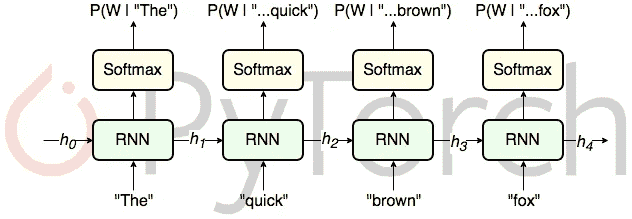
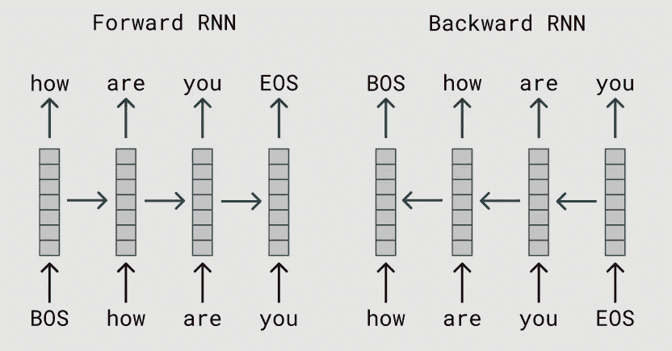

# 伯特:关键要点

> 原文：<https://medium.com/mlearning-ai/bert-key-takeaways-172d9af46402?source=collection_archive---------1----------------------->

基于 [BERT:用于语言理解的深度双向转换器的预训练](https://aclanthology.org/N19-1423.pdf)Delvin 等人，2019

# 概观

**问题:**我们如何改进当前的 NLP 模型？

**他们做了什么来回答这个问题:**作者使用预训练和微调框架开发了 BERT。该网络使用“掩蔽语言模型”(MLM)和“下一句预测”任务，从“通过联合调节所有层中的左右上下文的未标记文本”预训练深度双向表示。作者使用预先训练的参数初始化 BERT 模型，并对其进行微调，以便它可以使用每个任务的标记数据为特定的模型任务工作(微调仅使用一个附加的输出层)。

**动机/原理:**以前使用微调的模型是单向的。如果我们使用双向模型，我们将能够在任务的微调过程中使用最少的特定于任务的参数，因为令牌的上下文很重要。

**发现:** BERT 推进了 11 个 NLP 任务的技术水平。

**解释:**该模型表明，语言表示的双向预训练非常重要，预训练的表示减少了对许多高度工程化的特定任务架构的需求。

# 关键概念

## 预培训和微调

为文本开发一个通用的神经网络编码器，当给定足够的训练数据时，它可以解决任何新的语言理解任务(以便它可以定义可能的输出)。

## 语言建模

给定一定量的上下文，预测文本中的下一个单词。这本质上是文本分类，但有成千上万个类别。

From [https://medium.com/@florijan.stamenkovic_99541/rnn-language-modelling-with-pytorch-packed-batching-and-tied-weights-9d8952db35a9](/@florijan.stamenkovic_99541/rnn-language-modelling-with-pytorch-packed-batching-and-tied-weights-9d8952db35a9)

From [https://medium.com/@plusepsilon/the-bidirectional-language-model-1f3961d1fb27](/@plusepsilon/the-bidirectional-language-model-1f3961d1fb27)

## 伯特模型

*   层数(即变压器块):L
*   隐藏尺寸:H，
*   num 自我关注头数:A

BERTBASE (L=12，H=768，A=12，总参数=110M)

伯特拉奇(L=24，H=1024，A=16，总参数= 340 米)

为了便于比较，选择了与 GPT 开放航空公司相同的模型尺寸。

## 掩蔽 LM 和掩蔽预训练程序

文献中的完形填空(Taylor，1953)。

*   80%的情况下:将单词替换为[MASK]标记，例如，我的狗是多毛的→我的狗是[MASK]
*   10%的情况下:用一个随机的词替换这个词，例如，我的狗是多毛的→我的狗是苹果
*   10%的时候:保持单词不变，例如:我的狗有毛→我的狗有毛。

**为什么会有这些百分比？**作者想要使表示偏向实际观察到的单词。由于 transformer 编码器无法知道它将被要求预测哪些单词，或者哪些单词已被随机单词替换，因此它必须保留每个输入标记的分布式上下文表示。

**随机替换不会伤害模型吗？**因为它只发生在 1.5%的代币上，所以不会发生。

**但是，如果我们只对每批中的 15%的令牌进行预测，我们是否需要更多的预训练步骤来使模型收敛？**“MLM 模型的收敛速度确实比 LTR 模型稍慢。然而，就绝对准确性而言，MLM 模型几乎立即开始胜过 LTR 模型”(Delvin 等人)

## 下一句预测预训练

问题回答(QA)和自然语言推理(NLI)是基于理解两个句子之间的关系，这不是语言建模直接捕获的。

为了训练 BERT 理解句子关系，作者对二值化的下一句预测任务进行了预训练:

*   50%的时间 B 是跟在 A 后面的下一个句子(标记为 IsNext)
*   50%的情况下，它是来自语料库的随机句子(标记为 NotNext)。

## 微调

通过交换适当的输入和输出来完成。对于每项任务，作者将特定于任务的输入和输出插入到 BERT 中，并端到端地微调所有参数。

在输入端，来自预训练的句子 A 和句子 B 类似于

(1)释义中的句子对

(2)蕴涵中的假设前提对

(3)问答中的问题-段落对

## 比较伯特、埃尔莫和奥佩利 BERT

OpenAI GPT 是以前最好的模型，它在大型文本语料库上训练从左到右的转换器 LM。除了双向和两个预训练任务之外，BERT 的设计使 be 尽可能类似于 GPT，以便两者可以很容易地进行比较。

## 模型概述

**埃尔莫**:前向和后向深度 LSTM 网络，你用附加的最终任务模型层冻结它

**OpenAI 的 GPT** :与 ELMo 的想法相同，但使用变压器编码器网络而不是 LSTM，并且在预训练后不冻结步骤(整个网络针对每个任务进行微调)。此外，预训练是针对更长的文本跨度，而不仅仅是孤立的句子。GPT 只是从左到右。

伯特:与 GPT 想法相似。掩蔽语言建模。在损失函数中包含两项的两组不同的自我监督学习任务的混合上进行预训练。这两项任务都不是真正的语言建模。这两项任务都不需要预测未来，所以我们使用编码器变压器。编码器转换器不能用于标准语言建模，并且对于任何涉及文本生成的任务都是低效的。我们必须一次预测所有的单词，但是注意力部分意味着我们不再隐藏句子的某些部分(可以作弊)。

**以前的无监督的基于特征的方法:**微调从左到右表示的学习嵌入。固定特征是从预先训练好的模型中提取出来的，具有一定的优势。埃尔莫。

**以前的无监督微调方法:**仅来自未标记文本的预训练单词嵌入。通用终端

**从监督数据中转移学习:** BERT

## 输入/输出表示

*   能够在一个标记序列中明确地表示一个单句和一对句子(例如<question answer="">)。</question>
*   作者使用术语“句子”来指代任何连续文本的跨度(不一定是我们通常认为的句子。
*   作者使用具有 30，000 个标记词汇的单词块嵌入。
*   每个序列的第一个标记总是分类标记[CLS]。
*   “句子”用标记[SEP]分隔。

# 临时演员

## 下游任务概述

*   小队:问答
*   SNLI:句子蕴涵(一个句子对另一个句子是否正确)
*   SRL:同一个句子不同部分之间的关系
*   Coref:找出像(她，他的，等等)这样模棱两可的词。)参考
*   NER:识别专有名词
*   SST-5:情绪分析
*   可乐:决定一个句子是否合乎语法
*   MNLI:句子蕴涵(蕴涵，矛盾，中性)

## **数据扩充**

通过添加已有数据的略微修改的副本或从现有数据新创建的合成数据来增加数据量。

## 精彩的回顾

 [## Mlearning.ai 提交建议

### 如何成为 Mlearning.ai 上的作家

medium.com](/mlearning-ai/mlearning-ai-submission-suggestions-b51e2b130bfb)