# 伯特和诡计

> 原文：<https://medium.com/mlearning-ai/bert-tricks-5950007180e2?source=collection_archive---------4----------------------->

这个博客旨在详细描述伯特和他使用的所有非凡的技巧。我们将把博客分成两部分:

*   变压器和层标准化
*   [伯特&阿尔伯特(伯特的轻量级版本)](https://zzd2012victor.medium.com/bert-standing-on-the-shoulders-of-giants-23c8f2679447)

> **LSTM 死了。变形金刚万岁！**

这是一个非常有趣的关于变形金刚的 youtube 视频的标题。

# 动机

和 RNN 一起训练时，我们只能一个条目一个条目地计算。这样，我们就不可能用 GPU 来提高它的训练时间了。如果我们使用 CNN 来处理长序列问题，计算复杂度随着句子中两个单词之间距离的增加而增加。

此外，以前大多数注意力机制都是与 RNN 一起使用的。因此，RNN 的局限性仍然存在。注意力比以前更像一个帮助者。

在《变形金刚》中，注意力成了唯一被利用的东西。它可以直接链接序列中的任意两个节点，而不考虑输入和输出中的单词距离。

与 Transformer 之前的主流模型不同，Transformer 完全基于自我关注机制来绘制输入和输出之间的全局依赖关系，完全无需递归和卷积。

> 为什么在处理 NLP 问题时，自我关注比 RNN(递归神经网络)和 CNN(卷积神经网络)强大得多？[论文](https://arxiv.org/abs/1706.03762)的作者将自我关注层的不同方面与 RNN 和 CNN 进行了比较，以将(x_1，…，x_n)映射到(z_1，…，z_n)。他们发现有三个原因:

*   每层的总计算复杂度更低。
*   更多可以并行完成的计算量。
*   网络中长程相关性之间的路径长度更短

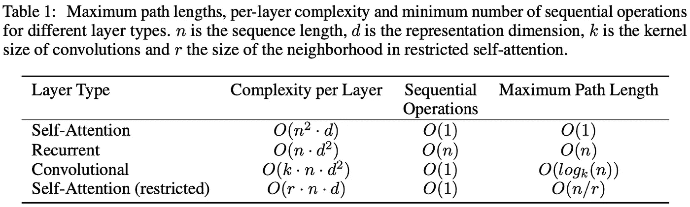

Cited from [https://arxiv.org/pdf/1706.03762.pdf](https://arxiv.org/pdf/1706.03762.pdf)

从上表可以看出，相比轮回层，自我注意有 O(1)序贯操作，但轮回层有 O(n)序贯操作。这是因为自我注意是对整个句子进行操作的，而循环层是对条目进行操作的。很明显，当序列长度“n”小于表征维度“d”时，自我注意每层的总计算复杂度较小。这是机器翻译中最先进的模型非常常用的设置。此外，正如我们所知，RNN 的顺序计算机制阻止我们在 GPU 上并行化计算，自我关注放弃了顺序计算机制。它可以很容易地在 GPU 上并行化。

与卷积层相比，自关注的主要优点是它可以像卷积层一样不考虑核的大小而进行映射。对于卷积层，大小为 k < n does not connect all pairs of input and output positions. However, a very large kernel generally means needs of more computing resource.

The model architecture of transformers is basically an encoder-decoder model.

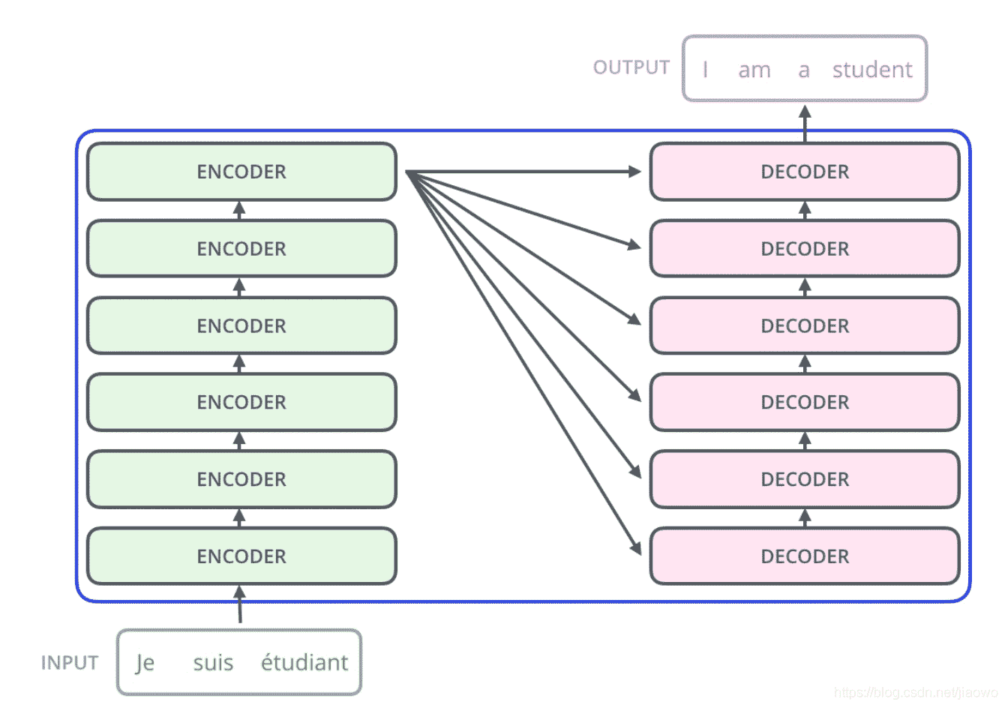

Model Architecture of Transformers

The encoder is composed of 6 identical sublayers — multihead-attention followed by an simple feed-forward layer.

The decoder is also composed of 6 identical sublayers — two multihead-attention followed by an simple feed-forward layer. Note that the second multihead attention layer takes the output from the encoder as part of its input.

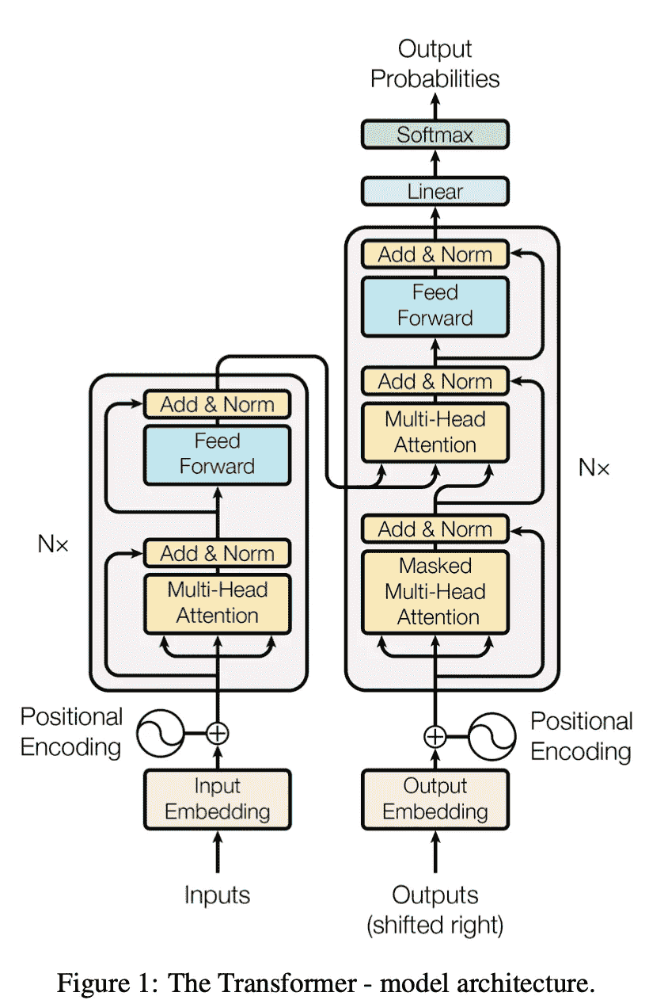

Model Architetcure shown in transformer paper

What is the basic idea of self-attention? As we can see below, the attention can figure out the relationships in between different parts of a sentence. Like here, it figures out the second *it* 的核由动物*表示。在我看来，它的表现就像人类一样。作为人类，我们使用这种技术来帮助我们理解一个句子。*

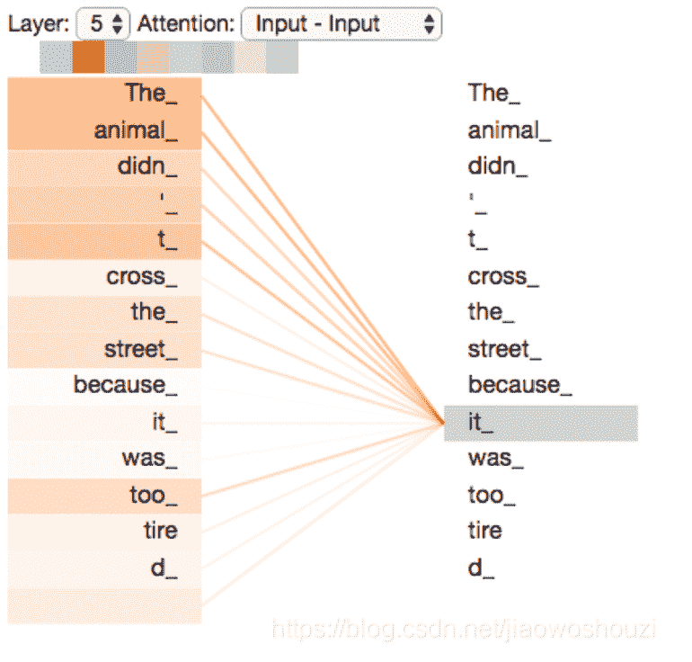

self-attention

那么，自我关注是如何实现的呢？它使用从输入中生成的三个值—键、查询和值。它只是将输入的嵌入乘以三个不同的参数矩阵——W _ K、W_Q、W_V。

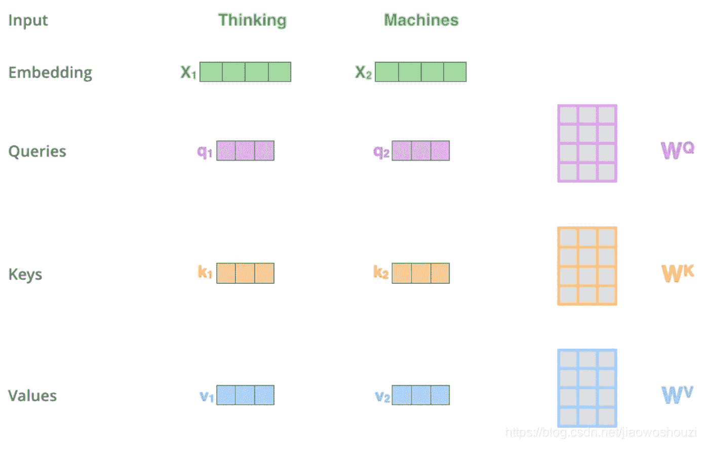

然后，它会执行以下操作:

1.  计算分数，它决定了对句子其他部分(输入)的关注程度。
2.  然后将分数除以 sqrt(模型维度)。为什么？作者怀疑，对于较大的 dk 值，点积的大小会变大，从而将 softmax 函数推到梯度极小的区域。为了抵消这种影响，他们通过 *1/sqrt(模型尺寸)来缩放产品。*
3.  在分数的 softmax 和值之间做矩阵乘法。然后把它们加在一起。这是这个自我关注块的最终输出。

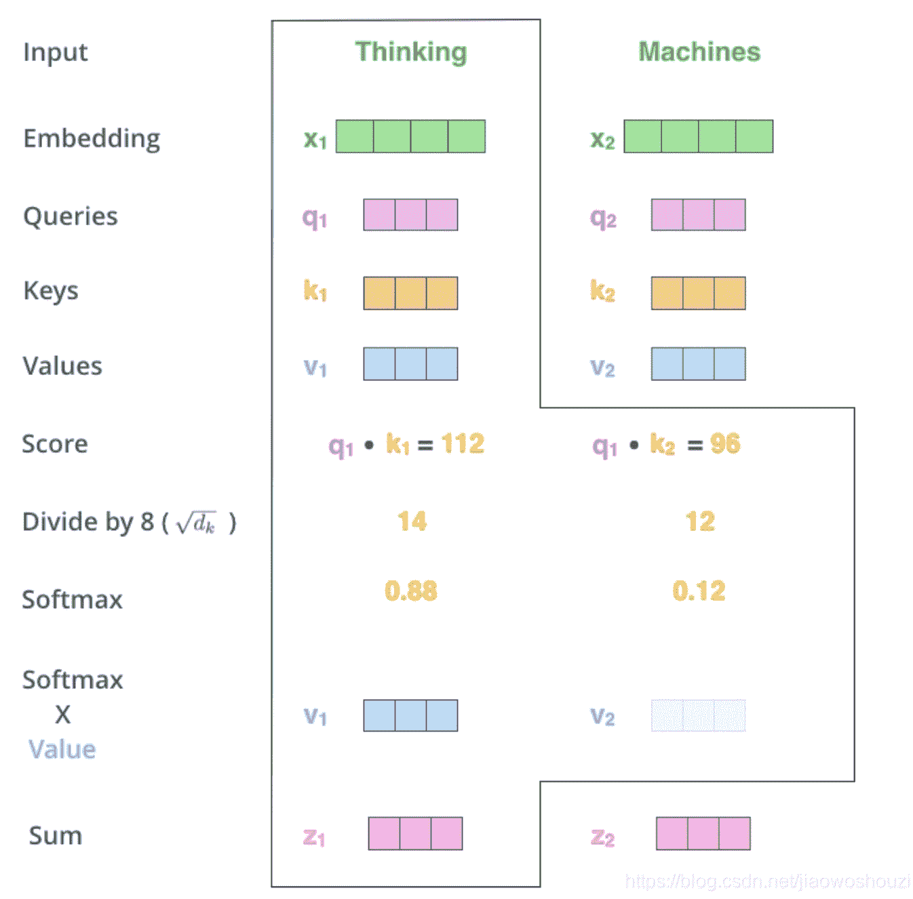

这个过程在论文中用下图描述:

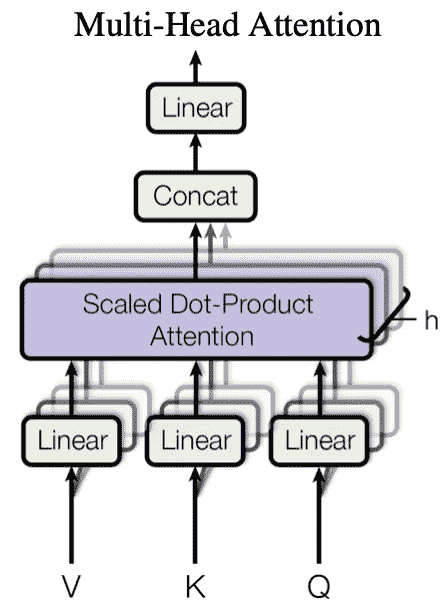

```
# Linear projections
Q = tf.layers.dense(queries, num_units, activation=tf.nn.relu) # (N, T_q, C)
K = tf.layers.dense(keys, num_units, activation=tf.nn.relu) # (N, T_k, C)
V = tf.layers.dense(keys, num_units, activation=tf.nn.relu) # (N, T_k, C)

# Split and concat
Q_ = tf.concat(tf.split(Q, num_heads, axis=2), axis=0) # (h*N, T_q, C/h) 
K_ = tf.concat(tf.split(K, num_heads, axis=2), axis=0) # (h*N, T_k, C/h) 
V_ = tf.concat(tf.split(V, num_heads, axis=2), axis=0) # (h*N, T_k, C/h)
————————————————
Link：[https://blog.csdn.net/dakenz/article/details/85150676](https://blog.csdn.net/dakenz/article/details/85150676)
```

# 请注意！

我们将在《变形金刚》一文中介绍最好的想法——多头注意力。这一点的总体思路如下所示:

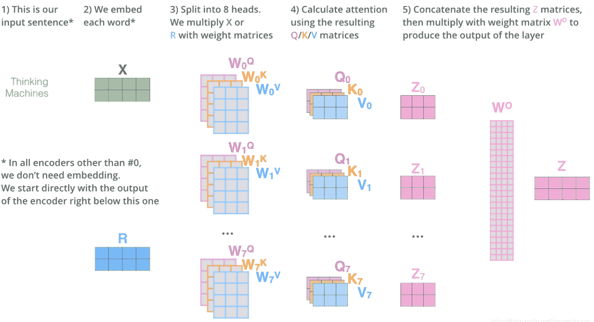

正如作者所宣称的，多头注意力允许模型在不同位置共同注意来自不同表征子空间的信息。因此，模型可以学习更多的关系，而不仅仅是一个关系。这对模型理解一句话肯定是有帮助的。

由于在这个模型中没有递归和卷积，为了利用序列的顺序，作者引入了“位置编码”,它注入了关于序列中每个记号的相对位置的一些信息。

在论文中，他们选择了不同频率的正弦和余弦函数:

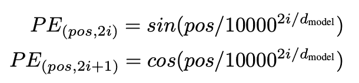

sine and cosine functions of different frequencies

正如我们从上面的模型架构图中看到的，位置编码被直接添加到输入嵌入中。

代码:

```
def positional_encoding(inputs,
                        num_units,
                        zero_pad=True,
                        scale=True,
                        scope="positional_encoding",
                        reuse=None):
    '''Sinusoidal Positional_Encoding.
    Args:
      inputs: A 2d Tensor with shape of (N, T).
      num_units: Output dimensionality
      zero_pad: Boolean. If True, all the values of the first row (id = 0) should be constant zero
      scale: Boolean. If True, the output will be multiplied by sqrt num_units(check details from paper)
      scope: Optional scope for `variable_scope`.
      reuse: Boolean, whether to reuse the weights of a previous layer
        by the same name.
    Returns:
        A 'Tensor' with one more rank than inputs's, with the dimensionality should be 'num_units'
    '''N, T = inputs.get_shape().as_list()
    with tf.variable_scope(scope, reuse=reuse):
        position_ind = tf.tile(tf.expand_dims(tf.range(T), 0), [N, 1])# First part of the PE function: sin and cos argument
        position_enc = np.array([
            [pos / np.power(10000, 2.*i/num_units) for i in range(num_units)]
            for pos in range(T)])# Second part, apply the cosine to even columns and sin to odds.
        position_enc[:, 0::2] = np.sin(position_enc[:, 0::2])  # dim 2i
        position_enc[:, 1::2] = np.cos(position_enc[:, 1::2])  # dim 2i+1# Convert to a tensor
        lookup_table = tf.convert_to_tensor(position_enc)if zero_pad:
            lookup_table = tf.concat((tf.zeros(shape=[1, num_units]),
                                      lookup_table[1:, :]), 0)
        outputs = tf.nn.embedding_lookup(lookup_table, position_ind)if scale:
            outputs = outputs * num_units**0.5return outputs
————————————————
Link：[https://blog.csdn.net/dakenz/article/details/85150676](https://blog.csdn.net/dakenz/article/details/85150676)
```

如果您想查看位置编码的效果:

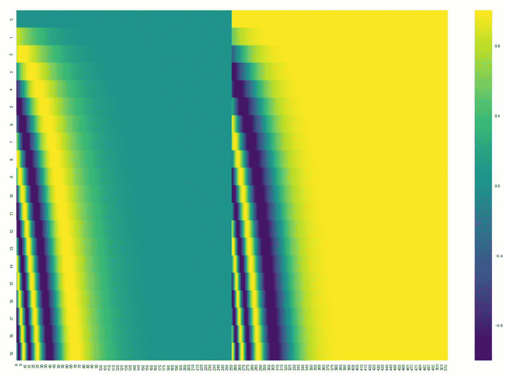

effect of positional encodings

# 图层规范化与批量规范化

BN 对每一批做归一化处理。假设我们有一批尺寸为 10 和 3 的特征。我们计算 10 个样本上每个特征的平均值和标准偏差，并进行归一化。

相反，LN 对每个样本上的特征进行归一化。比如每个人都有{体重，身高，年龄}。我们计算 1 个样本的这三个特征的平均值和标准差。我们做标准化。

这似乎是如此有线做这样的正常化。为什么要用？

第一个原因是，批处理规范化在处理非常小的批处理或序列模型(如 RNN)时表现很差。然而，LN 没有这样的限制，因为它在每一层上进行标准化。LN 不关心网络有多长，批量有多小。

第二个原因是在 NLP 问题中，BN 是在对每个位置上的每个单词做归一化处理。这是违反直觉的吧？我们显然应该对一句话进行规范化。那是 LN 做的。

*   C =序列长度(句子长度)
*   N =批量大小
*   h，W 是嵌入维数。

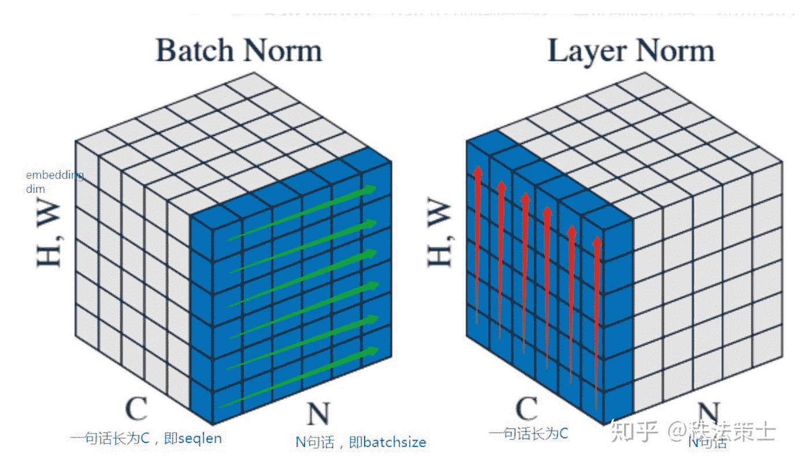

Layer Norm vs. Batch Norm

# 计算机视觉中的注意力

目前，注意机制不仅应用于自然语言处理任务，也应用于计算机视觉任务。例如，在这篇[论文](https://openaccess.thecvf.com/content_cvpr_2017/papers/Fu_Look_Closer_to_CVPR_2017_paper.pdf)中，使用了*递归注意卷积神经网络*。它可以循环分析区域信息并从这些信息中提取特征。作者还使用了*注意力提议子网络* (APN)。APN 从整体形象出发。然后，它循环生成子图像，并对这些子图像进行必要的预测。然后它用这些预测来做最后的预测。

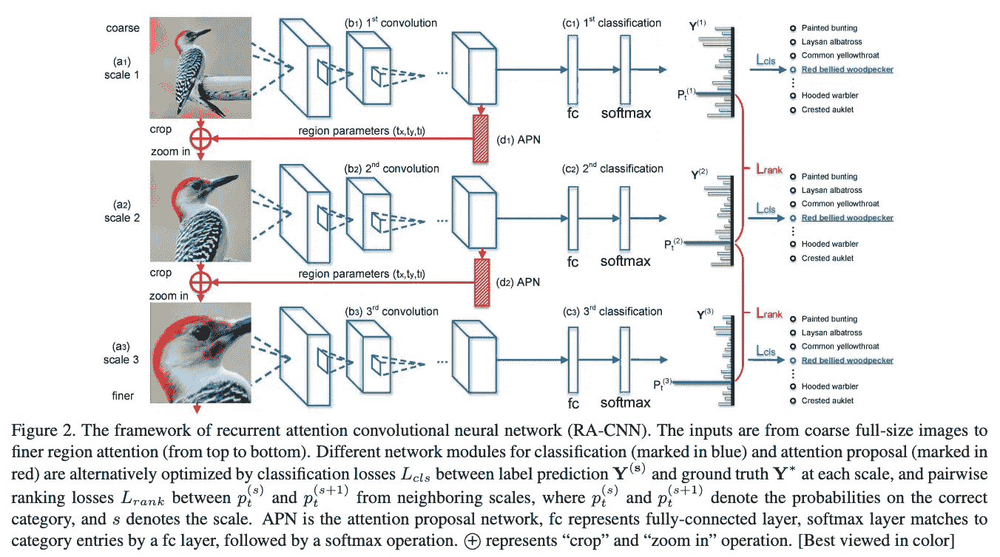

作者举了一个例子，用注意力对鸟类进行分类。

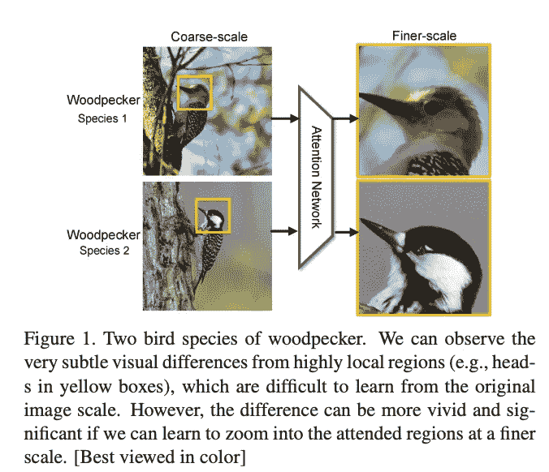

除了整个图像的信息之外，当对鸟进行分类时，还包括像鸟的颜色、鸟的头部、鸟的喙的形状等信息。比花草树木等环境重要得多。环境信息应该像助手一样对待，否则我们应该忽略它们。本文中的注意机制可以帮助模型找出重要的信息，并给予这些特征更多的权重。

现在，让我们看看关于伯特的更多细节。

参考资料:

1.  你所需要的只是关注:[https://arxiv.org/pdf/1706.03762.pdf](https://arxiv.org/pdf/1706.03762.pdf)
2.  图层归一化:[https://arxiv.org/pdf/1607.06450.pdf](https://arxiv.org/pdf/1607.06450.pdf)
3.  [https://blog.csdn.net/jiaowoshouzi/article/details/89073944](https://blog.csdn.net/jiaowoshouzi/article/details/89073944)
4.  凑近点看更好:递归注意卷积神经网络进行细粒度图像识别:[https://open access . the CVF . com/content _ cvpr _ 2017/papers/Fu _ Look _ Closer _ to _ CVPR _ 2017 _ paper . pdf](https://openaccess.thecvf.com/content_cvpr_2017/papers/Fu_Look_Closer_to_CVPR_2017_paper.pdf)