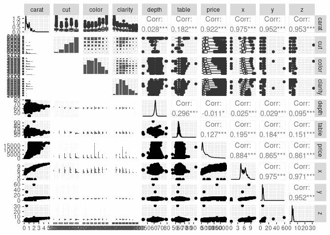
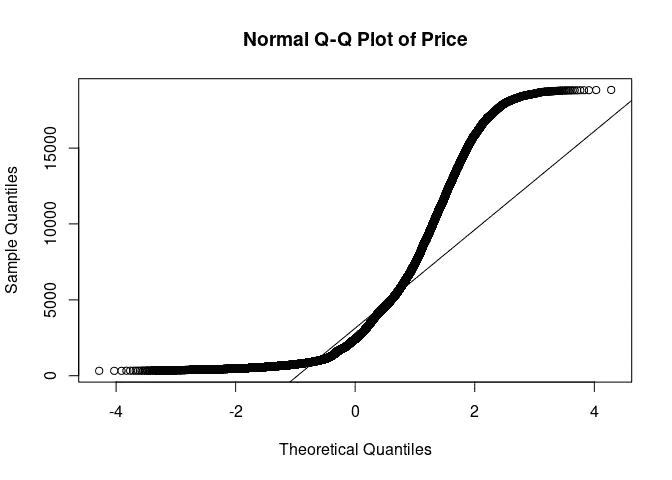
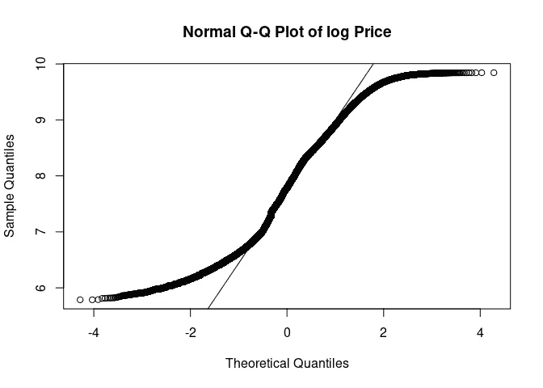
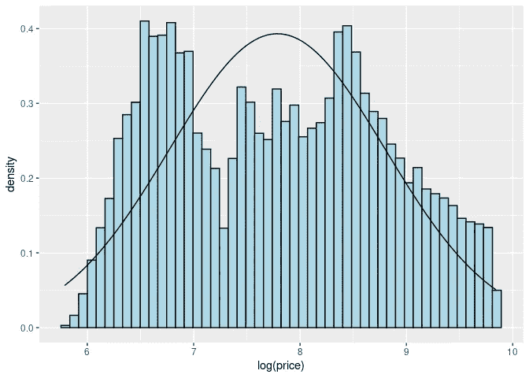
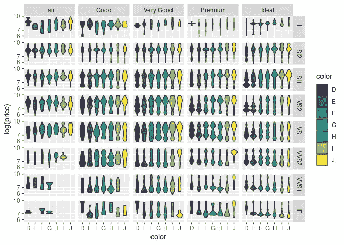
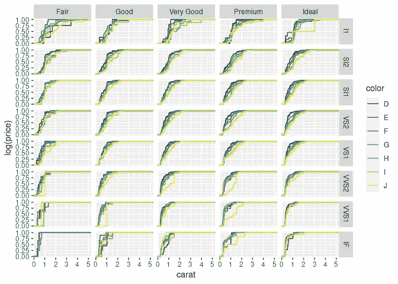
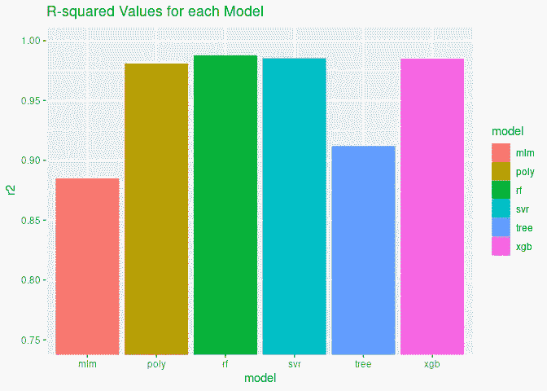
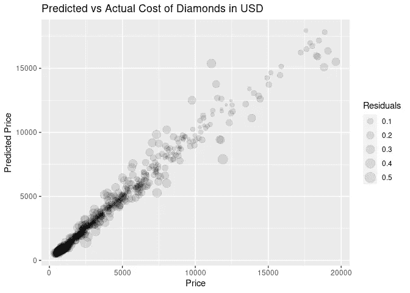
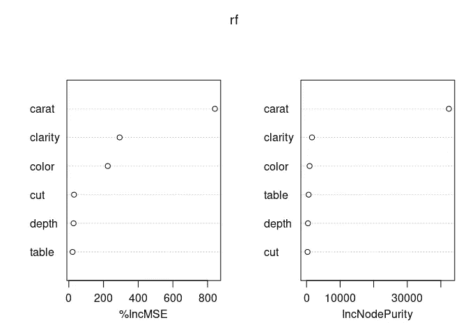

# 我生命中最美好的一天——回归分析预测钻石价格

> 原文：<https://medium.com/mlearning-ai/best-day-of-my-life-9eadaa14ef44?source=collection_archive---------1----------------------->

希瑟·祖雷尔

2022–09–08

我生命中最美好的一天是我的伴侣向我求婚的时候。他很好奇他给我买的钻石是不是多付了钱(他认为他买得很划算！)—所以我们来看看。


我将使用钻石数据集来训练一个回归模型，根据钻石的物理属性(包括大小/克拉、净度、颜色等)来预测钻石的价格。

第一步是一些**探索性的数据分析**，看看我们是否需要在训练模型之前做些什么来清理数据。

还有一些额外的分析，图表等。包含在 [github](https://github.com/Zeather709/best-day-of-my-life) 中的`diamonds.r`文件中，但没有出现在本文档中。

# 准备和探索性数据分析

```
# Setup
library('tidyverse')
library('GGally')

# Import
data(diamonds)

# Exploratory 
summary(diamonds)ggpairs(diamonds)##      carat               cut        color        clarity          depth      
##  Min.   :0.2000   Fair     : 1610   D: 6775   SI1    :13065   Min.   :43.00  
##  1st Qu.:0.4000   Good     : 4906   E: 9797   VS2    :12258   1st Qu.:61.00  
##  Median :0.7000   Very Good:12082   F: 9542   SI2    : 9194   Median :61.80  
##  Mean   :0.7979   Premium  :13791   G:11292   VS1    : 8171   Mean   :61.75  
##  3rd Qu.:1.0400   Ideal    :21551   H: 8304   VVS2   : 5066   3rd Qu.:62.50  
##  Max.   :5.0100                     I: 5422   VVS1   : 3655   Max.   :79.00  
##                                     J: 2808   (Other): 2531                  
##      table           price             x                y         
##  Min.   :43.00   Min.   :  326   Min.   : 0.000   Min.   : 0.000  
##  1st Qu.:56.00   1st Qu.:  950   1st Qu.: 4.710   1st Qu.: 4.720  
##  Median :57.00   Median : 2401   Median : 5.700   Median : 5.710  
##  Mean   :57.46   Mean   : 3933   Mean   : 5.731   Mean   : 5.735  
##  3rd Qu.:59.00   3rd Qu.: 5324   3rd Qu.: 6.540   3rd Qu.: 6.540  
##  Max.   :95.00   Max.   :18823   Max.   :10.740   Max.   :58.900  
##                                                                   
##        z         
##  Min.   : 0.000  
##  1st Qu.: 2.910  
##  Median : 3.530  
##  Mean   : 3.539  
##  3rd Qu.: 4.040  
##  Max.   :31.800  
##
```



因此，x、y 和 z 值对应于钻石的物理尺寸(以毫米为单位)——这些与克拉值密切相关，克拉值是衡量钻石重量的指标——这是有意义的——我们真的不需要将它们都包括在内。一些 ML 模型对包括多个彼此强烈相关的特征很敏感，这可能导致过度拟合，因此我们将在训练模型之前移除 x、y 和 z 变量。

## 目标变量的分布(美元价格)

Q-Q 图(或分位数-分位数图)用于快速、直观地识别单个变量的分布。

```
qq_diamonds **<-** qqnorm((diamonds**$**price),main**=**"Normal Q-Q Plot of Price");qqline((diamonds**$**price))
```



```
*# Meh*

qq_log_diamonds **<-** qqnorm(**log**(diamonds**$**price),main**=**"Normal Q-Q Plot of log Price");qqline(**log**(diamonds**$**price))
```



```
*# Ooh this is a much better fit*hist_norm **<-** ggplot(diamonds, aes(**log**(price)))  **+** 
  geom_histogram(aes(y **=** ..density..), colour **=** "black", fill **=** 
    'lightblue', bins **=** 50) **+** 
  stat_function(fun **=** dnorm, args **=** **list**(mean **=** 
    mean(**log**(diamonds**$**price)), sd **=** sd(**log**(diamonds**$**price))))
hist_norm
```



基于 Q-Q 图和直方图，价格的对数似乎遵循双峰或多峰分布。让我们试试另外两块地。

```
violin **<-** ggplot(diamonds, aes(x **=** color, y **=** **log**(price), fill **=** 
  color))
violin **+** 
  geom_violin() **+** 
  scale_y_log10() **+** 
  facet_grid(clarity **~** cut)
```



```
carat **<-** ggplot(data **=** diamonds, aes(x **=** carat, y **=** **log**(price), 
  colour **=** color)) 
carat **+** 
  stat_ecdf() **+** 
  facet_grid(clarity **~** cut)
```



是的，这肯定看起来像一个多峰分布，分布中有多个峰值，对应于钻石的克拉数从 0.99 增加到 1 克拉、1.99 增加到 2 克拉等。以及大约 1/2 克拉的较小跳跃。

## 数字变量的方差

我要检查的另一件事是数值变量的方差。如果任何变量的方差与其他变量相差> = 1 个数量级，我们将标准化这些值。如果一个变量的方差比其他变量的方差大得多，则可能会过度强调这些变量在训练模型中的重要性。

`carat`变量比`table`变量小> 1 个数量级(比`depth`小 1 OOM)，所以我们将继续标准化表和深度。但是，这应该在数据集被拆分为训练数据集和测试数据集之后发生。

```
diamonds **%>%** summarise_if(is.numeric, **list**(mean **=** mean, var **=** var)) **%>%** t()##                    [,1]
## carat_mean 7.979397e-01
## depth_mean 6.174940e+01
## table_mean 5.745718e+01
## price_mean 3.932800e+03
## x_mean     5.731157e+00
## y_mean     5.734526e+00
## z_mean     3.538734e+00
## carat_var  2.246867e-01
## depth_var  2.052404e+00
## table_var  4.992948e+00
## price_var  1.591563e+07
## x_var      1.258347e+00
## y_var      1.304472e+00
## z_var      4.980109e-01
```

`carat`变量比`table`变量小> 1 个数量级(比`depth`小 1 OOM)，所以我们将继续标准化表格和深度。然而，这应该发生在数据集被分成训练和测试数据集之后。

我想我已经为下一步准备了足够的信息…

# 数据清理

我们将删除一些彼此密切相关的变量，留下一个变量来捕捉包含在其他 3 个变量中的信息。

我们要把价格转换成价格的对数。由于这个数据集来自 2017 年，我试图预测 2021 年购买的钻石的价值，我们还将调整通货膨胀率(约 10.55%)。

在训练模型之前，另一个重要的考虑是处理分类数据。通常，这些将被转换成“虚拟变量”或一个热编码。当类别没有自然的排序或顺序时，这是可行的。在这里，切割、透明度和颜色都有一个自然的顺序。例如，切割“好”的钻石比切割“一般”的钻石更好。如果您从 r ( `data(diamonds)`)导入这些数据，那么这些变量将已经是具有正确顺序的因子。但是，如果您下载了该数据集的 csv 文件，则需要将它们从字符串转换为有序因子，因此我将在这里包含转换步骤(尽管它不应该改变我的数据集中的任何内容——尽管“color”变量的顺序似乎是相反的，因此我也将修复它)。注意:此功能中的级别从最差到最好分配。

在进一步研究了台面和深度场之后，这些值是钻石平均直径的比值。表%影响钻石的光性能(即看起来有多闪亮)。深度%影响钻石的光彩和火候(我不是 100%确定这意味着什么，但我们会看看它是否会影响价格)。

```
diamonds **<-** diamonds **%>%**
  mutate(price **=** price ***** 1.1055) **%>%**
  mutate(log_price **=** **log**(price)) **%>%**
  select(**-**price, **-**x, **-**y, **-**z) **%>%**
  mutate(cut **=** factor(cut, levels **=** **c**('Fair', 'Good', 'Very Good', 'Premium', 'Ideal'), ordered **=** **TRUE**),
         color **=** factor(color, levels **=** **c**('J', 'I', 'H', 'G', 'F',        
           'E', 'D'), ordered **=** **TRUE**),
         clarity **=** factor(clarity, levels **=** **c**('I1', 'SI2', 'SI1', 
           'VS2', 'VS1', 'VVS2', 'VVS1', 'IF'), ordered **=** **TRUE**))

*# This should show that these three variables are now ordered factors.*
str(diamonds)*# Here's a little trick to get R to output the order all possible factor levels, instead of just the first few:*
**min**(diamonds**$**cut)
**min**(diamonds**$**color)
**min**(diamonds**$**clarity)## tibble [53,940 × 7] (S3: tbl_df/tbl/data.frame)
##  $ carat    : num [1:53940] 0.23 0.21 0.23 0.29 0.31 0.24 0.24 
##  $ cut      : Ord.factor w/ 5 levels "Fair"<"Good"<..: 5 4 2 4 2 
##  $ color    : Ord.factor w/ 7 levels "J"<"I"<"H"<"G"<..: 6 6 6 2 
##  $ clarity  : Ord.factor w/ 8 levels "I1"<"SI2"<"SI1"<..: 2 3 5 4 
##  $ depth    : num [1:53940] 61.5 59.8 56.9 62.4 63.3 62.8 62.3 
##  $ table    : num [1:53940] 55 61 65 58 58 57 57 55 61 61 ...
##  $ log_price: num [1:53940] 5.89 5.89 5.89 5.91 5.91 ...## [1] Fair
## Levels: Fair < Good < Very Good < Premium < Ideal## [1] J
## Levels: J < I < H < G < F < E < D## [1] I1
## Levels: I1 < SI2 < SI1 < VS2 < VS1 < VVS2 < VVS1 < IF
```

## 看起来不错！

# 模型准备和培训

注:我们还对拆分数据集后的数据进行标准化(缩放)，以避免**数据泄露**。这意味着训练数据集的值正在影响测试数据集的值，因为它们的值用于标准化步骤。当对新数据运行模型时，这可能会影响模型的性能。

既然数据集已分为测试数据集和训练数据集，我们将训练几个不同的模型，测试它们的性能，并使用最好的一个来进行预测。

```
*# Prep*
library(caTools)
library(tictoc)

set.seed(42)

tic.clearlog()

split **<-** sample.split(diamonds**$**log_price, SplitRatio **=** 0.8)
diamonds_train **<-** subset(diamonds, split **==** **TRUE**)
diamonds_test **<-** subset(diamonds, split **==** **FALSE**)

diamonds_train **<-** diamonds_train **%>%** 
  mutate_at(**c**('table', 'depth'), **~**(scale(.) **%>%** as.vector))
diamonds_test **<-** diamonds_test **%>%** 
  mutate_at(**c**('table', 'depth'), **~**(scale(.) **%>%** as.vector))  

glimpse(diamonds_test)*# And let's check out the standardized variables:* mean(diamonds_test**$**table)
sd(diamonds_test**$**table)## Rows: 9,706
## Columns: 7
## $ carat     <dbl> 0.30, 0.23, 0.30, 0.23, 0.23, 0.32, 0.32, 0.24, 
## $ cut       <ord> Good, Very Good, Very Good, Very Good, Very 
## $ color     <ord> I, H, J, F, E, H, H, F, I, E, H, F, E, H, G, G, 
## $ clarity   <ord> SI2, VS1, VS2, VS1, VS1, SI2, SI2, SI1, SI1, 
## $ depth     <dbl> 1.0417048, -0.5231586, 0.2932918, -0.5911962, 
## $ table     <dbl> -0.6422915, -0.1949679, -0.1949679, -0.1949679, 
## $ log_price <dbl> 5.961084, 5.966766, 5.978034, 5.978034, ...## [1] 8.708704e-16## [1] 1*# The other one (depth) look similar too, you can use the code in diamonds.r to check for yourself.*
```

既然数据集已分为测试数据集和训练数据集，我们将训练几个不同的模型，测试它们的性能，并使用最好的一个来进行预测。

## 多元线性回归

```
tic('mlm')
mlm **<-** lm(log_price **~** ., diamonds_train)
toc(log **=** **TRUE**, quiet **=** **TRUE**)
summary(mlm)## 
## Call:
## lm(formula = log_price ~ ., data = diamonds_train)
## 
## Residuals:
##     Min      1Q  Median      3Q     Max 
## -5.8529 -0.2258  0.0605  0.2531  1.5885 
## 
## Coefficients:
##              Estimate Std. Error  t value Pr(>|t|)    
## (Intercept)  6.042146   0.004654 1298.384  < 2e-16 ***
## carat        2.167970   0.003860  561.587  < 2e-16 ***
## cut.L        0.065157   0.007584    8.592  < 2e-16 ***
## cut.Q       -0.009315   0.006074   -1.534   0.1251    
## cut.C        0.030696   0.005215    5.886 3.98e-09 ***
## cut^4        0.006782   0.004174    1.625   0.1042    
## color.L      0.510645   0.005811   87.878  < 2e-16 ***
## color.Q     -0.159645   0.005279  -30.240  < 2e-16 ***
## color.C      0.004640   0.004939    0.940   0.3475    
## color^4      0.039363   0.004538    8.674  < 2e-16 ***
## color^5      0.022161   0.004290    5.165 2.41e-07 ***
## color^6      0.004631   0.003903    1.187   0.2354    
## clarity.L    0.768912   0.010191   75.449  < 2e-16 ***
## clarity.Q   -0.366598   0.009537  -38.441  < 2e-16 ***
## clarity.C    0.216408   0.008156   26.534  < 2e-16 ***
## clarity^4   -0.063964   0.006507   -9.830  < 2e-16 ***
## clarity^5    0.052507   0.005299    9.910  < 2e-16 ***
## clarity^6    0.006066   0.004606    1.317   0.1879    
## clarity^7    0.007096   0.004069    1.744   0.0812 .  
## depth       -0.001029   0.001921   -0.535   0.5923    
## table        0.014223   0.002188    6.500 8.14e-11 ***
## ---
## Signif. codes:  0 '***' 0.001 '**' 0.01 '*' 0.05 '.' 0.1 ' ' 1
## 
## Residual standard error: 0.3442 on 44213 degrees of freedom
## Multiple R-squared:  0.8884, Adjusted R-squared:  0.8884 
## F-statistic: 1.76e+04 on 20 and 44213 DF,  p-value: < 2.2e-16
```

## 多项式回归

```
tic('poly')
poly **<-** lm(log_price **~** poly(carat,3) **+** color **+** cut **+** clarity **+** poly(table,3) **+** poly(depth,3), diamonds_train)
toc(log **=** **TRUE**, quiet **=** **TRUE**)
summary(poly)## 
## Call:
## lm(formula = log_price ~ poly(carat, 3) + color + cut + clarity + 
##     poly(table, 3) + poly(depth, 3), data = diamonds_train)
## 
## Residuals:
##     Min      1Q  Median      3Q     Max 
## -3.2508 -0.0859 -0.0011  0.0872  1.9011 
## 
## Coefficients:
##                   Estimate Std. Error  t value Pr(>|t|)    
## (Intercept)       7.855146   0.001432 5486.562  < 2e-16 ***
## poly(carat, 3)1 224.223650   0.153651 1459.304  < 2e-16 ***
## poly(carat, 3)2 -65.007798   0.136049 -477.825  < 2e-16 ***
## poly(carat, 3)3  20.466149   0.135187  151.391  < 2e-16 ***
## color.L           0.441946   0.002259  195.623  < 2e-16 ***
## color.Q          -0.086252   0.002053  -42.007  < 2e-16 ***
## color.C           0.009905   0.001916    5.169 2.36e-07 ***
## color^4           0.011069   0.001761    6.284 3.32e-10 ***
## color^5           0.008375   0.001664    5.033 4.86e-07 ***
## color^6          -0.001586   0.001514   -1.047 0.294889    
## cut.L             0.091883   0.003636   25.273  < 2e-16 ***
## cut.Q            -0.009912   0.002696   -3.676 0.000237 ***
## cut.C             0.012412   0.002088    5.944 2.80e-09 ***
## cut^4            -0.002513   0.001625   -1.546 0.122172    
## clarity.L         0.887564   0.003990  222.462  < 2e-16 ***
## clarity.Q        -0.244990   0.003728  -65.708  < 2e-16 ***
## clarity.C         0.141636   0.003181   44.523  < 2e-16 ***
## clarity^4        -0.062813   0.002532  -24.807  < 2e-16 ***
## clarity^5         0.029161   0.002058   14.167  < 2e-16 ***
## clarity^6        -0.003592   0.001787   -2.010 0.044466 *  
## clarity^7         0.029769   0.001579   18.854  < 2e-16 ***
## poly(table, 3)1  -0.691116   0.179675   -3.846 0.000120 ***
## poly(table, 3)2  -0.603061   0.140336   -4.297 1.73e-05 ***
## poly(table, 3)3   0.591239   0.136248    4.339 1.43e-05 ***
## poly(depth, 3)1  -1.288272   0.162940   -7.906 2.71e-15 ***
## poly(depth, 3)2  -1.105807   0.168139   -6.577 4.86e-11 ***
## poly(depth, 3)3  -0.057543   0.134870   -0.427 0.669631    
## ---
## Signif. codes:  0 '***' 0.001 '**' 0.01 '*' 0.05 '.' 0.1 ' ' 1
## 
## Residual standard error: 0.1335 on 44207 degrees of freedom
## Multiple R-squared:  0.9832, Adjusted R-squared:  0.9832 
## F-statistic: 9.96e+04 on 26 and 44207 DF,  p-value: < 2.2e-16
```

哇！多项式回归似乎更适合！

## 支持向量回归机

SVR 不依赖于基础因变量和自变量的分布。它也可用于通过`kernel = 'radial'`选项构建非线性模型。我认为是这样，因为线性模型是目前为止表现最差的。

```
tic('svr')
library(e1071)
svr **<-** svm(formula **=** log_price **~** .,
                data **=** diamonds_train,
                type **=** 'eps-regression',
                kernel **=** 'radial')
toc(log **=** **TRUE**, quiet **=** **TRUE**)
```

## 决策树回归

决策树使用一组 if-then-else 决策规则。树越深，决策规则越复杂，模型越合适。训练 DT 模型有时会导致树过于复杂，不能很好地概括数据。这叫做过度拟合。

```
tic('tree')
library(rpart)
tree **<-** rpart(formula **=** log_price **~** .,
                  data **=** diamonds_train,
                  method **=** 'anova',
                  model **=** **TRUE**)
toc(log **=** **TRUE**, quiet **=** **TRUE**)
tree## n= 44234 
## 
## node), split, n, deviance, yval
##       * denotes terminal node
## 
##  1) root 44234 46934.3000 7.922656  
##    2) carat< 0.695 20143  4323.3280 6.963920  
##      4) carat< 0.455 13848  1212.0970 6.718800 *
##      5) carat>=0.455 6295   448.8476 7.503143 *
##    3) carat>=0.695 24091  8615.3050 8.724275  
##      6) carat< 0.995 7837   612.7115 8.100690 *
##      7) carat>=0.995 16254  3485.7290 9.024943  
##       14) carat< 1.385 10379  1099.8590 8.772585  
##         28) clarity=I1,SI2,SI1 5582   243.9614 8.574533 *
##         29) clarity=VS2,VS1,VVS2,VVS1,IF 4797   382.1680 9.003046 *
##       15) carat>=1.385 5875   557.1727 9.470768 *
```

## 随机森林回归

这使决策树模型更进了一步，并且使用许多决策树来做出比在该模型中使用任何单个决策树更好的预测。

```
tic('rf')
library(randomForest)
rf **<-** randomForest(log_price **~** .,
                   data **=** diamonds_train,
                   ntree **=** 500,
                   importance **=** **TRUE**)
toc(log **=** **TRUE**, quiet **=** **TRUE**)
rf## 
## Call:
##  randomForest(formula = log_price ~ ., data = diamonds_train,      ntree = 500, importance = TRUE) 
##                Type of random forest: regression
##                      Number of trees: 500
## No. of variables tried at each split: 2
## 
##           Mean of squared residuals: 0.01159442
##                     % Var explained: 98.91
```

## XGBoost 回归

XGBoost 使用梯度增强决策树，是一个非常健壮的模型，在各种应用程序中表现非常好。它对影响其他一些模型性能的问题也不敏感，如多重共线性或数据规范化/标准化。

```
tic('xgb')
library(xgboost)
diamonds_train_xgb **<-** diamonds_train **%>%**
  mutate_if(is.factor, as.numeric)
diamonds_test_xgb **<-** diamonds_test **%>%**
  mutate_if(is.factor, as.numeric)

xgb **<-** xgboost(data **=** as.matrix(diamonds_train_xgb[-7]), label **=** diamonds_train_xgb**$**log_price, nrounds **=** 6166, verbose **=** 0)
*# the rmse stopped decreasing after 6166 rounds* 
toc(log **=** **TRUE**, quiet **=** **TRUE**)
```

# 模型性能

现在，我们将使用我们训练的每个模型来预测测试数据集中钻石价格的对数，以确定哪个模型在它尚未看到的数据上表现最佳。

```
*# Make predictions and compare model performance*
tic('predict_all')
mlm_pred **<-** predict(mlm, diamonds_test)
poly_pred **<-** predict(poly, diamonds_test)
svr_pred **<-** predict(svr, diamonds_test)
tree_pred **<-** predict(tree, diamonds_test)
rf_pred **<-** predict(rf, diamonds_test)
xgb_pred **<-** predict(xgb, as.matrix(diamonds_test_xgb[-7]))
toc(log **=** **TRUE**, quiet **=** **TRUE**)

*# Calculate residuals (i.e. how different the predictions are from the log_price of the test data set)*
xgb_resid **<-** diamonds_test_xgb**$**log_price **-** xgb_pred
library(modelr)
resid **<-** diamonds_test **%>%**  
  spread_residuals(mlm, poly, svr, tree, rf) **%>%**
  select(mlm, poly, svr, tree, rf) **%>%**
  rename_with( **~** paste0(.x, '_resid')) **%>%**
  cbind(xgb_resid)

predictions **<-** diamonds_test **%>%**
  select(log_price) **%>%**
  cbind(mlm_pred) **%>%**
  cbind(poly_pred) **%>%**
  cbind(svr_pred) **%>%**
  cbind(tree_pred) **%>%**
  cbind(rf_pred) **%>%**
  cbind(xgb_pred) **%>%**
  cbind(resid)           *# This will be useful for plotting later*

*# Calculate R-squared - this describes how much of the variability is explained by the model - the closer to 1, the better*

mean_log_price **<-** mean(diamonds_test**$**log_price)
tss **=**  **sum**((diamonds_test_xgb**$**log_price **-** mean_log_price)**^**2 )

square **<-** **function**(x) {x******2}
r2 **<-** **function**(x) {1 **-** x**/**tss}

r2_df **<-** resid **%>%**
  mutate_all(square) **%>%**
  summarize_all(sum) **%>%**
  mutate_all(r2) **%>%**
  gather(key **=** 'model', value **=** 'r2') **%>%**
  mutate(model **=** str_replace(model, '_resid', ''))
r2_df##   model        r2
## 1   mlm 0.8842696
## 2  poly 0.9803430
## 3   svr 0.9847216
## 4  tree 0.9114766
## 5    rf 0.9870050
## 6   xgb 0.9842275
```

# 可视化模型的性能

根据 R 值，随机森林模型表现最佳，这是一种衡量模型对数据集中的可变性的解释程度的方法，因此我们将主要关注这种可视化方法。它等于 1-RMSE(均方根误差，描述所有预测与`y_test`数据集中真实值的差异)。

```
library(ggplot2)
r2_plot **<-** ggplot(r2_df, aes(x **=** model, y **=** r2, colour **=** model, fill **=** model)) **+** geom_bar(stat **=** 'identity')
r2_plot **+** ggtitle('R-squared Values for each Model') **+** coord_cartesian(ylim **=** **c**(0.75, 1))
```



```
sample **<-** predictions **%>%**
  slice_sample(n **=** 1000) 
ggplot(sample, aes(x **=** **exp**(log_price), y **=** **exp**(rf_pred), 
    size **=** **abs**(rf_resid))) **+**
  geom_point(alpha **=** 0.1) **+** 
  labs(title **=** 'Predicted vs Actual Cost of Diamonds in USD', 
    x **=** 'Price', y **=** 'Predicted Price', size **=** 'Residuals')
```



在我们尝试的所有模型中，**随机森林**模型表现最好。这并不奇怪，因为这是一种**集成方法**，这意味着它利用多个模型之间的一致性做出比任何模型单独做出的预测都更好的预测。XGBoost 是集合方法的另一个例子，也表现得非常好。在第二个图中，大小与残差的绝对值成比例，这意味着预测值与真实值的差异有多大。

# 特征重要性

哪个(些)变量对预测钻石价格最重要？

```
varImpPlot(rf)
```



x 轴上的值表示如果模型中不包含该变量，预测误差会增加多少。正如所料，克拉(或大小)是最重要的变量。尽管表型和深度应该会影响钻石看起来有多闪亮，但它们实际上对价格没有那么大的影响。

# 训练模型和做预测花了多长时间？

```
*# Training & predicting times*
time_log **<-** tic.log(format **=** **TRUE**)
time_log## [[1]]
## [1] "mlm: 0.057 sec elapsed"
## 
## [[2]]
## [1] "poly: 0.154 sec elapsed"
## 
## [[3]]
## [1] "svr: 194.602 sec elapsed"
## 
## [[4]]
## [1] "tree: 0.248 sec elapsed"
## 
## [[5]]
## [1] "rf: 407.62 sec elapsed"
## 
## [[6]]
## [1] "xgb: 62.249 sec elapsed"
## 
## [[7]]
## [1] "predict_all: 8.219 sec elapsed"
```

所以表现最好的模特训练时间最长。这并不奇怪，因为他们实际上包括许多模型。请记住，这不是一个大型数据集。我为工作培训的大多数模型都需要花费大量的时间(我通常设置它们通宵运行)。这可以通过 AWS 中一个真正强大的机器甚至一个机器集群来加速。

*原载于*[*https://Zea ther 709 . github . io*](https://zeather709.github.io/best-day-of-my-life/)*。*

**订阅:**[https://zeather.medium.com/subscribe/](https://zeather.medium.com/subscribe/)

[](/mlearning-ai/mlearning-ai-submission-suggestions-b51e2b130bfb) [## Mlearning.ai 提交建议

### 如何成为 Mlearning.ai 上的作家

medium.com](/mlearning-ai/mlearning-ai-submission-suggestions-b51e2b130bfb)