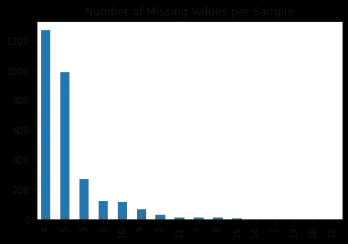

# 数据科学家处理任何表格数据集中缺失/空值的最佳技术

> 原文：<https://medium.com/mlearning-ai/best-known-techniques-for-data-scientist-to-handle-missing-null-values-in-any-tabular-dataset-3a9f71c9486?source=collection_archive---------0----------------------->

## 作为一名数据科学家，有时处理缺失值是相当令人生畏的。这个博客将帮助你建立正确的心态

Photo by [Brett Jordan](https://unsplash.com/@brett_jordan?utm_source=medium&utm_medium=referral) on [Unsplash](https://unsplash.com?utm_source=medium&utm_medium=referral)

## 数据集中缺少什么值？

顾名思义，数据集中的值，由于已知或未知的原因，通常显示或表示为 NaN，“”(空白)。

在处理真实世界的数据集时，经常会遇到缺少值的情况，作为一名数据科学家，您应该遵循正确的技术来解决这个问题，同时保持数据集的基本行为。

在我们开始使用这些技术之前，理解缺失值的潜在原因很重要，比如

—对 IOT 来说，数据是传感器随时离线。

—一些问题没有得到回答的调查数据。

—一场卡格尔竞赛，主持人想让问题变得更难😜。

—在线表单或网站允许非必填字段为空白或空值。

—值只是随机缺失。

您对上述行为的理解将决定您想要遵循哪种技术来克服缺失的值。因此上述问题中的*为什么*部分非常重要。

为了便于说明，我采用在 [Kaggle](https://www.kaggle.com/c/home-data-for-ml-course/overview) 呈现的房价竞争数据集。我访问这个数据集并读入数据框，如下所示

## *识别空值*

有许多方法可以识别空值。我发现下面两种技术是最简单的。

1.  使用`isna()`方法—`isna()`该方法在验证 NaN 值后返回一个布尔值。你可以对它运行`.sum()`，得到所有空值的总和。

2.使用`.info()`技术——它给出了列值和非空值的细节

## 缺失值 EDA

1.  *确保读取训练和测试值，并比较缺失值的百分比*

在这种情况下，训练和测试中缺失值的分布似乎是均匀的，这是非常不正常的。在现实世界中，我们不会期望这样的对称性，因为这些值可能是有意诱导的。

2.*了解每次观察缺失值的数量。*

另一种方法是了解数据集中每一行缺少的值。我首先选择我们观察到缺失值的特性。

有趣的是，有些记录的缺失值高达 14，13，16。也许这种特征的稀疏性可能有助于更好的学习😄

3.*检查分类特征缺失值的不平衡*

让我们取几个分类特征，看看在分类特征的每个值下缺失值的分布

一些常见的常见问题？

*Q1:EDA 应该在输入缺失值之前还是之后进行？哪种方法能给我们更好的结果？*

回答—最好在此之前进行，因为填料本身可能会改变分布。

*Q2:缺失值应该在数据归一化后还是归一化前进行估算？*

答案——这个问题没有正确的答案。你可以两种都试试，看看效果。每当有这样的疑问时，在你的 K 折叠交叉验证循环中测试它，看看结果。

# **插补技术**

Photo by [Volodymyr Hryshchenko](https://unsplash.com/@lunarts?utm_source=medium&utm_medium=referral) on [Unsplash](https://unsplash.com?utm_source=medium&utm_medium=referral)

# 目录

1.  [什么都不做](#325b)
2.  [只需放下 NA 列](#9016)
3.  [熊猫归属](#4552)
4.  [Sklearn 插补](#677a)
5.  [参考文献](#5aec)

## 第一步:什么都不做

像 LightGBM 和 XGBoost 这样的模型可以自己处理缺失值。这些模型不需要插补，并将缺失值视为不同的值。

在其他类型的模型和神经网络中，不能留下缺失值，需要插补。

## 第二步:删除 NA 列

如果我们最终丢弃了所有的空值，那么这个模型就不会有很好的表现。有 3 种方法可以删除空值

*   按行删除—在这种技术中，我们根据行删除所有具有空值的记录。这可以通过熊猫来实现，如下

如上所述，使用这种技术，所有的行都会被删除，因此不适合当前的情况。

*   按列删除-这将删除所有包含空值的列。

从上面的结果可以看出，在 82 列中，47 列为非空值，其余的列被删除。

*   基于条件删除子集—这种技术可用于删除基于包含空值的特定列的行

以上结果显示特征*小巷*有 91 条非空记录，其余记录被丢弃。

现在你需要选择在给定环境下最适合你的技术。

## 第三步:熊猫归属

1.  *使用这种技术，你可以使用* `fillna`用一个数值来填充缺失的值

2.*通过均值/中值/众数填充缺失值*

您也可以使用`.mean()`通过平均值来填充缺失值

中值也是如此。下图显示了缺失值及其平均值和中值。

3.*使用分组填充*

使用这种方法，您可以根据某个要素的特定分组使用平均值/中值来填充缺失值。例如，我们可以使用组的平均值`MSZoning`来填充`LotFrontage`的缺失值

现在通过替换`LotFrontage`特征的缺失值来填充这些平均值

## 步骤 4: SKLEARN 估算

与以前的技术相比，这将是最好的插补技术。它为我们提供了一个类，在这个类上，我们可以创建对象，允许我们在交叉验证循环中分别调整和转换数据。这在上述现有技术中是不可能的。

在现实世界中，你会希望`fit`和`transform` *在*交叉验证循环中，以确保没有泄漏。

*   简单估算器
*   迭代输入器
*   KNNImputer

*简单估算器*

简单估算器有一个参数`strategy`，它可以取平均值、中值、最频繁值和常量值。我们可以根据我们的用例选择填充值。下面我展示了实现的方法

*迭代输入器*

这种输入策略是以循环方式使用其他特征来填充缺失值。简而言之，它会多次迭代，直到找到最佳匹配。它将缺失值功能视为目标列，并尝试使用现有功能进行填充。迭代由我的`max_iter`参数控制。它的实现如下

*KNN 估算器*

使用 k-最近邻完成缺失值的插补。它是相似的*迭代输入器*唯一的区别是它使用 K 个最近邻。您可以使用`n_neighbors`参数选择最近的邻居。

## 参考

 [## 丢失数据的处理[Youtube 流]

### 使用 Kaggle 笔记本探索和运行机器学习代码|使用歌曲流行度预测的数据

www.kaggle.com](https://www.kaggle.com/robikscube/handling-with-missing-data-youtube-stream#Level-3:-Sklearn-Imputation) 

这个博客的灵感来自上面提到的 kaggle 笔记本。我真的希望你们能从这篇文章中学到一些东西。如果你喜欢你学到的东西，请随意鼓掌。如果有什么需要我帮忙的，请告诉我。请随意联系 LinkedIn

 [## Mlearning.ai 提交建议

### 如何成为 Mlearning.ai 上的作家

medium.com](/mlearning-ai/mlearning-ai-submission-suggestions-b51e2b130bfb)