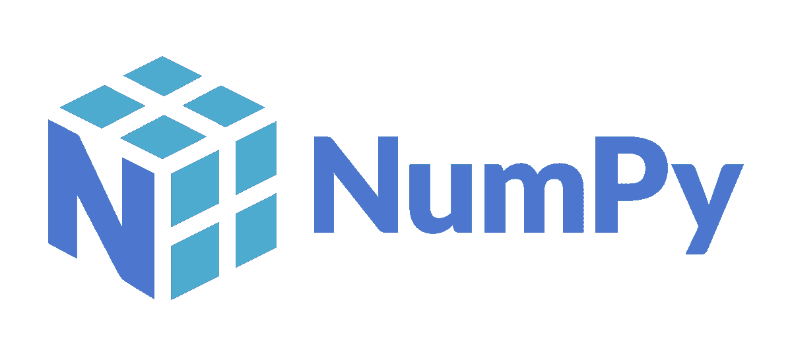
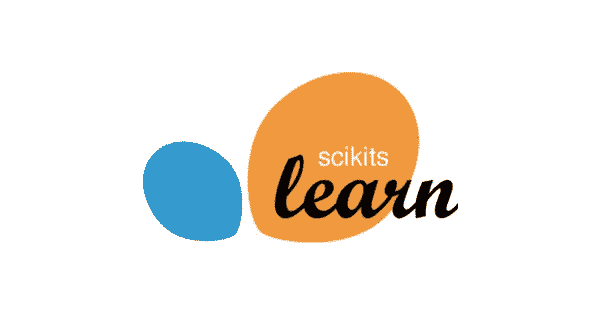

# 2022 年使用的最佳 Python 库(初级、中级和高级)

> 原文：<https://medium.com/mlearning-ai/best-python-libraries-to-use-in-2022-beginner-intermediate-and-advanced-bd3beec2abda?source=collection_archive---------3----------------------->

在数据科学领域，Python 已经成为最流行的语言之一，因为它易于使用，并且有大量可用的库。据估计，超过 40%的软件工程师在其职业生涯中至少使用过一次 Python，其中包括来自 Google、Yahoo！、迪士尼、NASA、CERN 等等。与其他流行的语言如 R 或 MATLAB 相比，它是免费的、开源的、易于学习的。

本文中涉及的所有库都是数据科学中的基本工具，因为它们使您能够执行复杂的任务，而不需要像 SAS 或 SPSS 这样昂贵的程序。无论您是初学者还是高级 Python 程序员，这些库都将帮助您开始您的数据科学项目。请记住，这个列表并不详尽——还有许多其他令人惊叹的 Python 库可以用于数据科学！

# 初级 Python 库——Pandas、NumPy 和 SciPy

## 熊猫

Pandas 是 Python 中最基础的库之一，因为它对数据清理、处理和分析数据集很有用。它允许 Python 用户创建带标签的或关系型的 Pandas 数据结构，并可用于统计分析、建模和创建数据可视化。它对于数据挖掘和 web 抓取也特别有用，因为它对于预处理和清理数据非常有帮助。

## NumPy

[NumPy](https://numpy.org/) 是一个用于高性能计算的库，为数值计算提供了易于使用且高效的熊猫工具。它的主要目标是提供强大的 N 维数组操作和处理能力。但是 Pandas 的主要功能是索引一组 Pandas 功能，使数据分析易于使用。Numpy 还提高了不适合计算机内存的大熊猫数据集的速度，因为它用 [Cython](https://cython.org/) 中的数组对象进行计算。

## SciPy

SciPy 是一个用于统计建模的开源 Python 库，它包含用于统计数据分析的模块，比如回归、统计测试、时间序列分析和分类。它的主要目标是提供强大的 N 维数组操作和处理能力，这使得开发人员可以轻松实现机器学习算法，而不必学习复杂的数学或统计。

# 中级 Python 库— Scikit-Learn & StatsModels

## sci kit-学习

另一个你可能想考虑的数据科学库是 [Scikit-Learn](https://scikit-learn.org/) ，它为熊猫数值计算提供了简单高效的工具。它建立在 [NumPy](https://numpy.org/) 、 [SciPy](https://scipy.org/) 和 [matplotlib](https://matplotlib.org/) 之上。有几种不同类型的机器学习算法可以与 Scikit-Learn 一起使用，包括聚类模型、支持向量机、逻辑回归等等。用于机器学习的更高级的 Python 库有几个其他功能，这些功能可能对希望创建自定义工具或可视化的数据科学家有用。

## 统计模型

您可能会发现 [StatsModels](https://www.statsmodels.org/) 也很有用。它是为统计数据分析而设计的，拥有大量的描述性统计工具和统计测试，可帮助您从数据中获取最相关的信息。Statsmodels 可以与 Pandas 数据结构一起使用，其他几个特性可能对需要执行统计计算或创建自定义可视化的开发人员有用。

# 高级 Python 库— Tensorflow 和 PyTorch

机器学习(ML)是让计算机在没有明确编程的情况下行动的科学。在设计和编程显式算法是不可行的情况下，机器学习被用于广泛的计算任务中。这项技能需求量很大，使用 Tensorflow 和 PyTorch 的经验广受欢迎。

## 张量流

[TensorFlow](https://www.tensorflow.org/) 是一个使用数据流图进行数值计算的机器学习开源软件库。它有一个全面、灵活的工具、库和社区资源的生态系统，让研究人员推动 ML 的最新发展，允许开发人员轻松地构建和部署 ML 支持的应用程序。

张量是向量、矩阵和其他 n 维数据数组；它们可以表示空间中的点、线性系统、图像、向量等。图中的节点表示数学运算，而图边表示它们之间通信的多维数据数组(张量)。灵活的架构允许您将计算部署到台式机、服务器或移动设备中的一个或多个 CPU 或 GPU，而无需重写代码。TensorFlow 还包括 TensorBoard，这是一个数据可视化工具包。

## PyTorch

PyTorch 是深度学习的最佳 Python 库之一，因为它是用强大而快速的 C++后端构建的。这个库是基于 [Torch](http://torch.ch/) 的高级框架，是一个快速计算的框架，具有直接用 Python 编写高度定制的神经网络组件的能力，而不必使用大量的低级函数。这是一个用于张量计算的开源库，具有强大的 GPU 加速和对自动微分的内置支持。它可以与 NumPy 无缝集成，处理大量数值数据，同时使用与 TensorFlow 相同的运行时。它还提供了与第三方库如 [cudnn](https://developer.nvidia.com/cudnn) 的接口，以更快地实现最新的深度学习。

# 结论

这个列表是用于数据分析和机器学习的基本 Python 数据科学库的汇编，我认为它们将在 2022 年最好地满足您的需求。我相信学习者——新的和持续的——在处理数据项目时会认为这些库是必要的，因为它们给了你编程的能力，而不必学习一门完全不同的语言。你怎么想呢?2022 年，数据科学家应该使用这些 Python 库中的哪一个？

*这篇文章是用人工智能写的*

 [## Mlearning.ai 提交建议

### 如何成为 Mlearning.ai 上的作家

medium.com](/mlearning-ai/mlearning-ai-submission-suggestions-b51e2b130bfb)