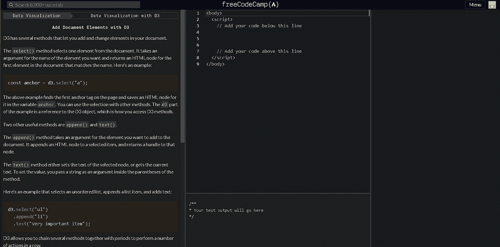
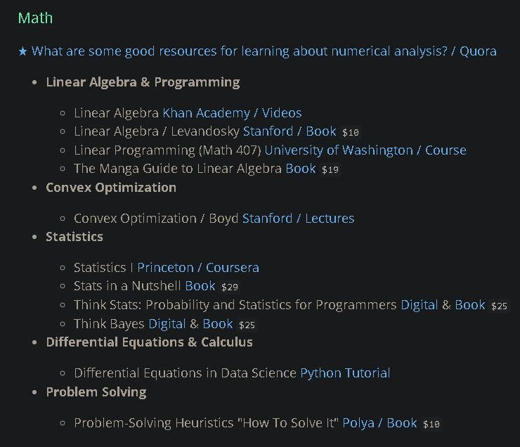

# 2022 年开始数据科学职业生涯的 6 个地方

> 原文：<https://medium.com/mlearning-ai/best-resources-for-learning-data-science-6167e09765dc?source=collection_archive---------2----------------------->

Photo by [Tezos](https://unsplash.com/@tezos?utm_source=unsplash&utm_medium=referral&utm_content=creditCopyText) on [Unsplash](https://unsplash.com/?utm_source=unsplash&utm_medium=referral&utm_content=creditCopyText)

你打算学习数据科学吗？🤩却不知道去哪里学，怎么学？😫别担心，因为我会保护你的😎。在本文中，我将与您分享学习数据科学所需的资源，以及您可以遵循的路线图。看完文章别忘了留下感想😁

在进入资源之前，我想提一下，你必须购买他们的订阅。我知道😅，但这是关于你的职业生涯，所以一点投资是好的😄。此外，通过支付，你至少会有动力，这样就不会浪费。但是为了你的利益，我将会给你一个免费的资源。现在，让我们开始了解资源。(本文没有任何人赞助，这只是我的发现。点击资源标题进入他们的网站)

# 1.[数据请求](https://www.dataquest.io/)

Dataquest 以及本文中将要提到的其他公司主要专注于数据科学。除了数据科学，他们还有一些相关的课程，如数据分析、数据工程等。，你可以自己在网站上查一下。

说到你如何学习。左边是文本，右边是编辑器。你阅读课文，并完成课文最后给你的任务。你将同时学习和练习。节省了很多时间。把它想象成一个博客，但是你实际上是通过阅读那个博客来学习数据科学的。

为了更好的理解，请看我从 FreeCodeCamp 得到的图片:

Image by author

Dataquest 看起来和这个类似。我想如果你喜欢读博客，这将是你的茶。

# 2.[数据营](https://app.datacamp.com/)

在这方面，我们有视频讲座。视频最长持续 5 分钟。视频结束后，你可以练习你所学的内容。他们还为你提供评估、项目、竞赛，如果你赢了，你会有奖品。

如果你对阅读不感兴趣，那么我会建议你这样做。我个人自己用这个，你不会失望的。他们还有一个非常好的认证系统。在那里你必须通过一系列的测试才能获得证书。

# 3.[伊努龙](https://ineuron.ai/)

INeuron 类似于 Udemy，但他们不处理任何事情，只处理数据科学和相关的事情。对我来说，ineuron 的一个问题是，他们提供视频讲座，但我们必须自己在自己的设备上练习(不像 Datacamp 和 Dataquest)。除此之外，其他都很好。他们还让你做项目，最酷的是，他们还为你提供实习机会，你可以按照自己的节奏完成。一旦你完成实习，你也将获得证书。

# 4.[365 数据科学](https://365datascience.com/)

这个平台和 iNeuron 一样，为你提供视频讲座。我最近才发现这一点，所以我对此没有太多的想法，但我确实听到了关于这一点的好消息，所以我决定在这里提到它。如果你正在使用它，请在评论区告诉我它是否值得？这对其他人也有帮助。

我只提到了这些，尽管还有很多其他的，因为这 4 个只关注数据科学和相关的东西。

正如我所承诺的，我将与你们分享学习数据科学的路线图。这也是一个提供免费资源链接的网站。让我解释一下。

# [5。DataScienceMaster.org](http://datasciencemasters.org/)

这个网站是一个宝石。他们为你提供了一个可以遵循的计划。从数学到机器学习。最酷的是，他们还为你提供了免费学习的链接，对于 Coursera 的课程，你可以审核它们。

Image by author

假设你想学数学，这一点在 ML 的时候很重要。你想学线性代数，可以点击旁边的链接开始学。

一切都是一样的。你点击链接开始学习，就这么简单。

# [6。ProjectPro](https://www.projectpro.io/)

您可以确定这是您进行项目的地方，以及部署项目的选项。你可以学到很多东西，你的武库中有 250 多个项目。他们也为你提供了提高表现的技巧。

他们还有 2000 多个免费代码配方和 120 多个可重用的项目解决方案。还有什么更好的方法来学习和发展你的技能。我建议你看一看，试试这个！！

我希望这篇文章对你有所帮助。另外，如果你能在 LinkedIn 上关注我，那将会非常有帮助。我也在[媒体](https://karthikbhandary2.medium.com/)上写作，我也有一个 [YouTube](https://www.youtube.com/channel/UCKplT0-YqAQdCq6Xajcq5Tw) 频道，欢迎访问，我发布与编程、自我发展和进步相关的帖子。

 [## Mlearning.ai 提交建议

### 如何成为 Mlearning.ai 上的作家

medium.com](/mlearning-ai/mlearning-ai-submission-suggestions-b51e2b130bfb)