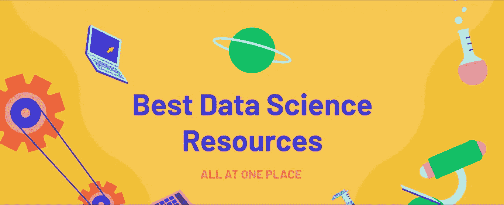

# 启动您的数据科学之旅的最佳资源

> 原文：<https://medium.com/mlearning-ai/best-resources-to-kickstart-your-data-science-journey-d247f2de774c?source=collection_archive---------5----------------------->

> 这个博客包含一些资源和链接，可以帮助你开始数据科学之旅。

[Best Data Science Resources In One Place | DataScienceBee](https://www.datasciencebee.com/)

> **一般资源**

[Python 可视化](https://pythontutor.com/visualize.html#mode=edit):这个网站会把你的 Python 代码可视化，得到非常直观的理解，对初学者有帮助。

[Kaggle](https://www.kaggle.com/) :这是一个数据科学家和 ML 研究人员解决 ML 问题的平台，是一个非常好的在 ML 中成长的社区。

拉胡尔·阿加瓦尔的博客肯定会帮助我们获得他博客中各种主题的知识。他是脸书大学的一名机械工程师，后来成为数据科学家。

> **数学与统计**

3Blue1brown :这个 YouTube 频道将以可视化的方式提供数学，甚至是数学中最难的题目。他的视频让这看起来很容易。我个人最喜欢的是神经网络和线性代数与微积分的本质。

Josh Starmer 的 stat quest:这个 YouTube 频道既有趣又有很多信息。他会用有趣的叙述把主要的方法论分解成容易理解的部分。

[看理论](https://seeing-theory.brown.edu/)来自布朗大学这是一个统计学网站，它将直观地教你，为你提供一个非常直观和交互式的统计体验。

[Immersivemath](http://immersivemath.com/ila/index.html) 是世界上第一本完全交互式图形的线性代数书。它将使用游戏和可视化来解释线性代数。

[两分钟论文](https://www.youtube.com/c/K%C3%A1rolyZsolnai):这个 YouTube 频道将提供人工智能和人工智能研究的最新突破，并将提供最佳人工智能研究论文的视频。

> **深度学习和神经网络**

[Tensorflow playground](https://playground.tensorflow.org/) :这个网站将为我们提供玩神经网络的机会，看看如果我们调整不同的参数，它们会产生什么影响。它来自谷歌大脑的顶级 ML 研究人员。

Christopher Olah 的博客包含了关于神经网络、深度学习、自然语言处理和

Sebastian Ruder 的博客也包含自然语言处理和机器学习的主题。两人都来自谷歌团队，两个博客都有很高的技术性和价值。

> **博客网站和支持网站**

[Analytics Vidya](https://www.analyticsvidhya.com/) 和[致力于数据科学](https://towardsdatascience.com/)、 [KDnuggets](https://www.kdnuggets.com/) 是一些帮助初学者学习博客的网站，让他们有一个良好的开端，并明确数据科学的主要概念。

[Google collab](https://colab.research.google.com/) 、 [Kaggle](https://www.kaggle.com/) 和 [Cocalc](https://cocalc.com/) 它帮助我们在浏览器本身运行 Jupyter 笔记本，并且易于使用。

[数据科学栈交换](https://datascience.stackexchange.com/)是数据科学的栈溢出，在这里我们可以就代码和概念提出问题并得到答案。

> 帮助我更好地理解机器学习概念和算法的一些非常著名的 YouTube 频道值得一提的是 [Campus X](https://www.youtube.com/c/CampusX-official) 、[克里斯·纳伊克](https://www.youtube.com/user/krishnaik06)、 [Codebasics](https://www.youtube.com/c/codebasics) 、[Weights and bias](https://www.youtube.com/c/WeightsBiases)、[send ex](https://www.youtube.com/c/sentdex)、 [Abhishek Thakur](https://www.youtube.com/c/AbhishekThakurAbhi) 、 [Bhavesh bhatt](https://www.youtube.com/c/BhaveshBhatt8791) 、 [Ken jee](https://www.youtube.com/c/KenJee1) 。

感谢阅读。

请关注更多关于数据科学的内容！！

 [## Mlearning.ai 提交建议

### 如何成为 Mlearning.ai 上的作家

medium.com](/mlearning-ai/mlearning-ai-submission-suggestions-b51e2b130bfb)