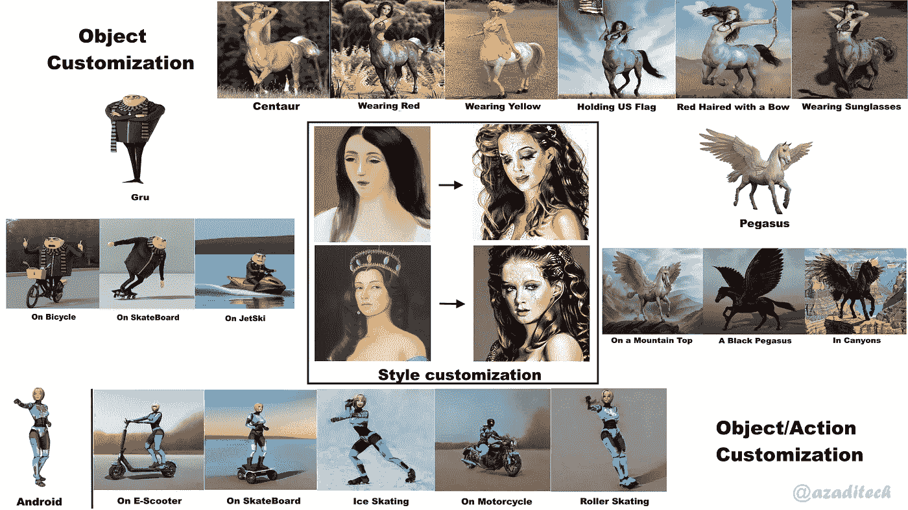

# 超越扩散:什么是个性化图像生成，如何定制图像合成？

> 原文：<https://medium.com/mlearning-ai/beyond-diffusion-what-is-personalized-image-generation-and-how-can-you-customize-image-synthesis-26a89d5b335?source=collection_archive---------1----------------------->

## **通过微调稳定扩散模型生成个性化图像**

Figure 1: Personalized Diffusion In Action (Source: Author)

在本文中，您将了解基于扩散模型的图像生成的定制和个性化。更具体地说，您将了解到*文本倒置*和…