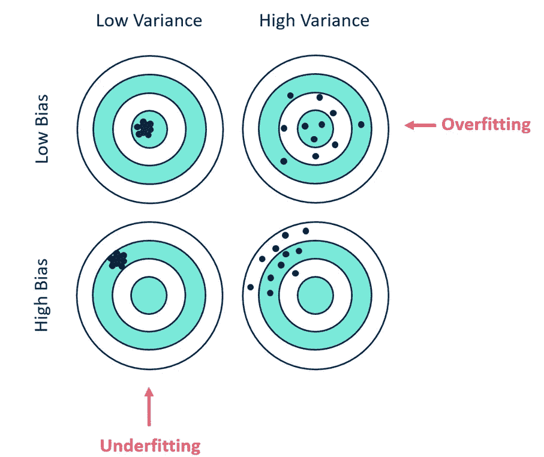

# 偏差与方差—权衡

> 原文：<https://medium.com/mlearning-ai/bias-vs-variance-trade-off-d46a410412e0?source=collection_archive---------7----------------------->

偏差-方差权衡是一个常见的机器学习问题。什么是偏差和方差？是什么原因造成的？我们如何处理这种权衡呢？

每当我们谈论机器学习预测时，理解两种不同类型的预测误差(偏差和方差)很重要。在模型最小化偏差和方差的能力之间有一个权衡。

**什么是偏见？**

> **偏差是模型做出的简化假设，使目标函数更容易逼近。**

*   **低偏差**:暗示对目标函数的形式假设较少。
*   **高偏差**:暗示关于目标函数形式的更多假设。

**什么是方差？**

> **方差是给定不同训练数据**时，目标函数的估计值将改变的量。

*   **低方差**:建议随着训练数据集的改变，对目标函数的估计值进行小的改变。
*   **高方差**:表示目标函数的估计值随着训练数据集的变化而发生较大变化。

**什么是偏差方差权衡？**

任何模型的目标都是低方差和低偏差。从上图可以看出，高偏差导致模型欠拟合，高方差导致模型过拟合。在理想情况下，两者都应该很低，但实现其中一个是以增加另一个为代价的。这就是众所周知的偏差-方差权衡。

不幸的是，没有一种定量的方法来找到这两者都最小的平衡误差点。相反，您将需要衡量准确性并调整模型的复杂性，直到您找到最小化总体误差的迭代。

最重要的是，记住您有许多模型类型可供选择，在知道您的数据看起来像什么之前，没有理由选择一种而不是另一种。选择一个模型，使假设符合您的数据是关键！快乐造型！

 [## Mlearning.ai 提交建议

### 如何成为 Mlearning.ai 上的作家

medium.com](/mlearning-ai/mlearning-ai-submission-suggestions-b51e2b130bfb)