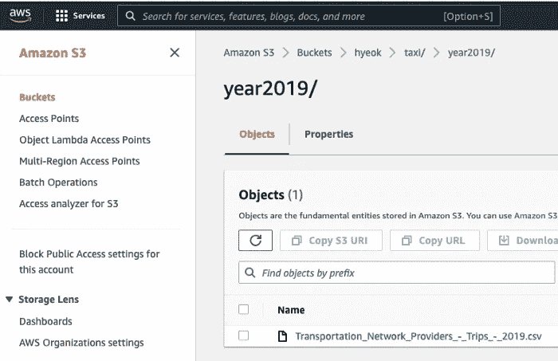
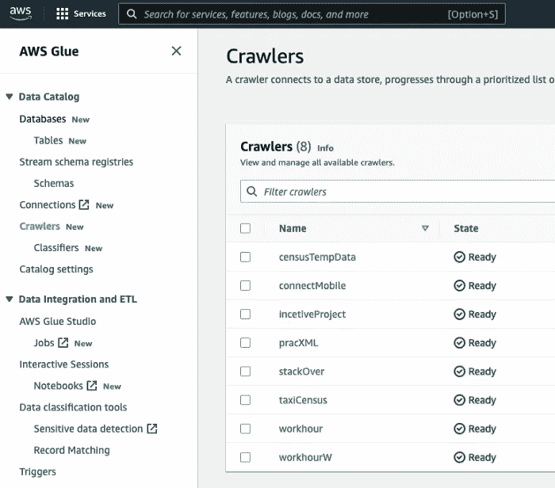
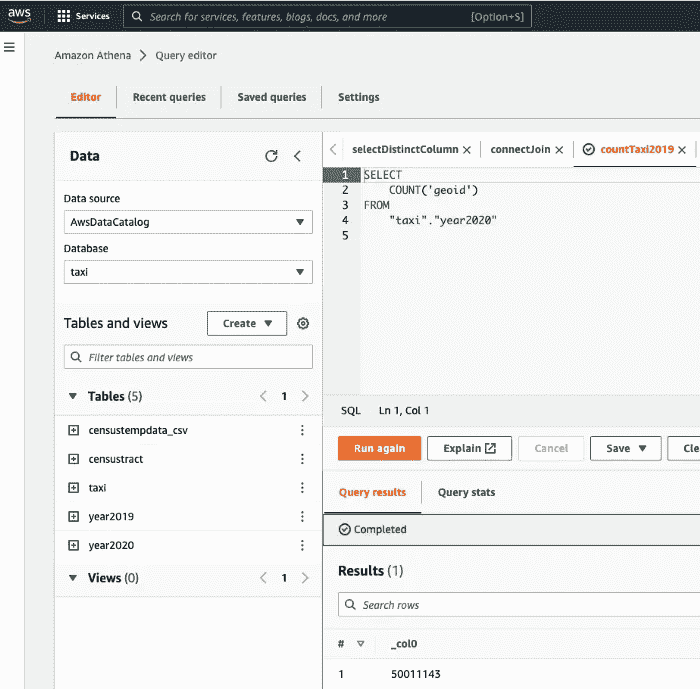
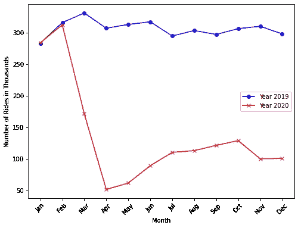

# 家庭大数据分析:AWS S3 到 Python

> 原文：<https://medium.com/mlearning-ai/big-data-analysis-at-home-aws-bucket-to-python-69d7ecfb5872?source=collection_archive---------3----------------------->

作为一个兼职项目，我使用存储在 AWS S3 的千兆字节数据练习 SQL。我在 AWS 中构建了一个数据湖，并提取可以在 Python 中使用的聚合数据。

**你需要什么**:

*   AWS S3
*   AWS 胶水
*   AWS 雅典娜
*   开源代码库
*   计算机编程语言

(注:要了解关于 AWS 使用 S3 -> Glue -> Athena 的数据湖的整体想法，请查看[托默·约斯科维奇的文章](/swlh/tutorial-build-your-data-lake-using-aws-s3-athena-150c1aaa44cf)。根据我自己的经验，安装 AWS S3、Glue 和 Athena 相当困难，但是在谷歌和 YouTube 上有许多教程，所以你可以搜索它们。)

在本教程中，我使用芝加哥 Ride-Hail Trips 数据集(查看 2019 年[和 2020 年](https://data.cityofchicago.org/Transportation/Transportation-Network-Providers-Trips-2019/iu3g-qa69)[的数据)。当我决定使用这个数据集时，我有以下问题。COVID 后拼车减少了吗？为了回答这个问题，我存储数据集，提取它们，并首先将它们聚合到 daily 中，然后使用 Python 将 daily 数据再次聚合到 monthly 中，并显示 rideshare 模式在 COVID 前后是如何变化的。计划是比较 COVID 前后的月平均乘车份额。](https://data.cityofchicago.org/Transportation/Transportation-Network-Providers-Trips-2020/rmc8-eqv4)

# 自动警报系统

首先，我在 S3 存储了 27.6 和 12.1GB 的 Chicago Ride-Hail Trips 数据集。我不会在这里详细介绍如何设置 AWS S3，但是在设置好之后，您可以简单地将 CSV 文件上传到 bucket 中。我建议你练习这些步骤(AWS S3 -> Glue -> Athena)，例如使用小于 100 MB 的少量 CSV 数据。



image by Author

其次，我使用 AWS Glue 抓取数据集。根据我对阅读 [Tomer Yoskovich 的文章](/swlh/tutorial-build-your-data-lake-using-aws-s3-athena-150c1aaa44cf)的理解，Glue 将 CSV 文件转换成列类型，就像你在 Athena 中看到的那样。



image by Author

在 AWS Athena 中，我可以对这些数据集运行 SQL。据我所知，爬虫让我将 AWS S3 CSV 转移到 AWS Athena 表中。爬行之后，您将在下面的 AWS Athena 中找到这些表。



image by Author

现在，我可以用 AWS Athena 运行 SQL 了。我对数据集中的观察值数量很好奇。我运行下面的 SQL 查询来计算 2020 年芝加哥的乘车总数。我发现 2020 年有 5000 万次观测。

```
SELECT 
    COUNT('geoid') 
FROM
    "taxi"."year2020"
```

为了检查 COVID 后乘坐次数是否减少，我计算了每天的出行次数。

```
-- taxi2019dailyCount
SELECT COUNT('trip miles'), SUBSTRING("trip start timestamp", 1, 2) AS month,
    SUBSTRING("trip start timestamp", 4, 2) AS day
FROM "taxi"."year2019" 
GROUP BY SUBSTRING("trip start timestamp", 1, 2), SUBSTRING("trip start timestamp", 4, 2)
ORDER BY SUBSTRING("trip start timestamp", 1, 2), SUBSTRING("trip start timestamp", 4, 2)
```

在上面的 SQL 代码中，我使用 SUBSTRING 命令来创建旅行的日期和月份，并按月-日对进行分组，以计算 2019 年的每日旅行次数(我试图使用 [SQL 时间戳相关代码](https://www.sqltutorial.org/sql-date-functions/how-to-extract-month-from-date-in-sql/)来获取月份和日期，但它对我没有用，所以我改用 SUBSTRING 命令)。我使用类似的命令来计算 2020 年的每日出行次数。我花了大约两到三秒钟运行代码。

在存储到 AWS S3、抓取 AWS Glue 并使用 AWS Athena 运行 SQL 之后，我现在有了 2019 年和 2020 年芝加哥每日拼车次数的数据集。

# 计算机编程语言

我从 AWS 导入我创建的数据来开始分析。

## 输入数据

首先，我导入 2019 年和 2020 年的每日数据。

## 平均的

我生成每年的月平均乘车次数。我使用月平均乘车次数而不是日计数，因为它看起来不那么吵，所以容易看到。

## 测绘

对于图表中的标签，我将乘坐次数的单位设置为 1000 次。然后，我画出每年的月平均乘车次数。

正如你在下图中看到的，我发现从三月份开始乘车次数明显减少。目测一下，可以看到 2019 年和 2020 年的乘坐次数差不多，但是从 2 月到 4 月从 30 万下降到 5 万，大概是月乘坐次数下降了 83.3%！乘坐人数在 4 月份最低，但从 5 月份开始反弹，但此后没有恢复。与 2019 年相比，只有三分之一的乘坐发生在 2020 年 6 月至 12 月。



image by Author

正如你在图表中看到的，我发现从三月份开始乘车次数明显减少。

# 带走:

*   您可以使用 AWS S3、Glue 和 Athena 来存储大数据(超过 10 GB)并提取聚合数据以开始 Python 中的分析。

Jupyter 笔记本的原始代码在以下链接中:

[](https://github.com/WeonhyeokChung/blog-medium/blob/main/notebook4post/taxi.ipynb) [## blog-medium/taxi . ipynb at main weonhyoekchung/blog-medium

### 在 GitHub 上创建一个帐户，为 weonhyoekchung/blog-medium 开发做出贡献。

github.com](https://github.com/WeonhyeokChung/blog-medium/blob/main/notebook4post/taxi.ipynb) 

**相关文章**

[1]“教程:使用 AWS S3 &雅典娜构建你的数据湖”(作者托默·约斯科维奇)[https://medium . com/swlh/Tutorial-Build-your-Data-Lake-using-AWS-S3-Athena-150 C1 AAA 44 cf](/swlh/tutorial-build-your-data-lake-using-aws-s3-athena-150c1aaa44cf)

[github.com](https://github.com/WeonhyeokChung/blog-medium/blob/main/notebook4post/taxi.ipynb)

[](/mlearning-ai/mlearning-ai-submission-suggestions-b51e2b130bfb) [## Mlearning.ai 提交建议

### 如何成为 Mlearning.ai 上的作家

medium.com](/mlearning-ai/mlearning-ai-submission-suggestions-b51e2b130bfb)